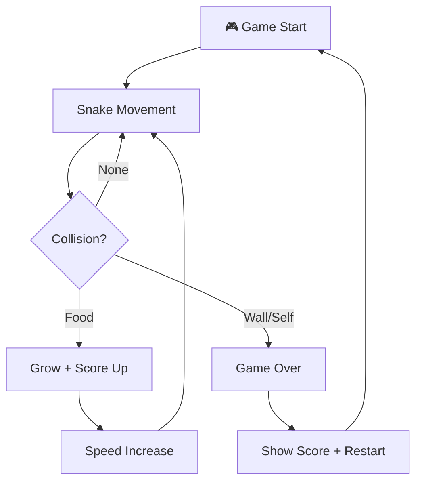

# Idea Summary

> Idea ID: IDEA-027
> Folder: wf-001-greedy-snake
> Version: v1
> Created: 2026-02-21
> Status: Refined

## Overview

A browser-based classic Snake game (贪吃蛇) built with vanilla JavaScript and HTML5 Canvas. Players control a snake that grows by eating food, with increasing speed as the score rises. Supports both desktop keyboard and mobile touch controls.

## Problem Statement

Most browser-based Snake games are cluttered with ads, require sign-ups, or have poor mobile support. This project provides a clean, lightweight, zero-install Snake game that runs directly in the browser — accessible on any device with no dependencies, no ads, and no sign-up required.

## Target Users

- Casual gamers looking for quick, ad-free browser games
- Anyone wanting a nostalgic classic game experience on desktop or mobile

## Proposed Solution

A single-page web application using HTML5 Canvas for rendering and vanilla JavaScript for game logic. The game runs entirely client-side with no backend requirements. Features a modern visual style with subtle retro influences, responsive layout for desktop and mobile, and progressive difficulty through speed increases.

## Key Features



### Feature List

| # | Feature | Description | Priority |
|---|---------|-------------|----------|
| 1 | **Canvas Rendering** | HTML5 Canvas 2D game board with 20×20 grid-based rendering | P0 (MVP) |
| 2 | **Snake Movement** | Arrow key / WASD controls, smooth grid-based movement | P0 (MVP) |
| 3 | **Food System** | Random single food spawning on empty grid cells (one type only) | P0 (MVP) |
| 4 | **Collision Detection** | Wall boundaries and self-collision detection | P0 (MVP) |
| 5 | **Game States** | Start screen → Playing → Paused → Game Over | P0 (MVP) |
| 6 | **Score Tracking** | Current score display, high score persistence (localStorage, per-device only) | P1 |
| 7 | **Speed Progression** | Snake accelerates: 150ms → 50ms floor, −5ms per food eaten | P1 |
| 8 | **Responsive Layout** | Canvas scales to fit 320px–1920px viewports without scrollbars | P1 |
| 9 | **Touch Controls** | Swipe gestures for mobile play, on-screen pause button | P2 |
| 10 | **Visual Theme** | Modern/sleek design with subtle retro grid-line aesthetic | P2 |

## Technical Architecture

```architecture-dsl
@startuml module-view
title "Snake Web App — Module View"
theme "theme-default"
direction top-to-bottom
grid 12 x 4

layer "Presentation" {
  color "#E3F2FD"
  border-color "#1565C0"
  rows 1

  module "UI" {
    cols 6
    rows 1
    grid 2 x 1
    align center center
    gap 8px
    component "Game Canvas" { cols 1, rows 1 }
    component "Score Panel" { cols 1, rows 1 }
  }

  module "Controls" {
    cols 6
    rows 1
    grid 2 x 1
    align center center
    gap 8px
    component "Keyboard Input" { cols 1, rows 1 }
    component "Touch Input" { cols 1, rows 1 }
  }
}

layer "Game Engine" {
  color "#E8F5E9"
  border-color "#2E7D32"
  rows 1

  module "Core Loop" {
    cols 6
    rows 1
    grid 2 x 1
    align center center
    gap 8px
    component "Game Loop" { cols 1, rows 1 }
    component "State Manager" { cols 1, rows 1 }
  }

  module "Mechanics" {
    cols 6
    rows 1
    grid 2 x 1
    align center center
    gap 8px
    component "Snake Controller" { cols 1, rows 1 }
    component "Collision Detector" { cols 1, rows 1 }
  }
}

layer "Game Objects" {
  color "#FFF3E0"
  border-color "#E65100"
  rows 1

  module "Entities" {
    cols 12
    rows 1
    grid 3 x 1
    align center center
    gap 8px
    component "Snake" { cols 1, rows 1 }
    component "Food" { cols 1, rows 1 }
    component "Grid Board" { cols 1, rows 1 }
  }
}

layer "Persistence" {
  color "#F3E5F5"
  border-color "#6A1B9A"
  rows 1

  module "Storage" {
    cols 12
    rows 1
    grid 1 x 1
    align center center
    gap 8px
    component "LocalStorage (High Score)" { cols 1, rows 1 }
  }
}

@enduml
```

## Success Criteria

- [ ] Snake moves at consistent intervals with no visible frame drops at 60 FPS on a 20×20 grid
- [ ] Keyboard (arrow/WASD) and touch (swipe) controls register within one game tick
- [ ] Food spawns randomly on empty cells; snake grows by one segment per food eaten
- [ ] Collision with walls or self immediately triggers game-over state
- [ ] Current score displays during gameplay; high score persists in localStorage across sessions (per-device)
- [ ] Game interval decreases from 150ms to 50ms floor, reducing ~5ms per food eaten
- [ ] Game states (start → play → pause → game over) transition correctly with no invalid states
- [ ] Canvas scales to fit viewports from 320px to 1920px wide without scrollbars
- [ ] Desktop: spacebar pauses; Mobile: on-screen pause button provided

## Constraints & Considerations

- **No backend** — Pure client-side; deploy as a minimal set of files (index.html + JS + CSS)
- **No frameworks** — Vanilla JS + HTML5 Canvas for zero-dependency simplicity
- **Performance** — `requestAnimationFrame` with accumulated delta timing; render at 60 FPS, game tick at variable speed
- **Grid size** — Default 20×20 cells
- **Food scope** — Single food type only; no bonus/special food items
- **High score** — Per-device only via localStorage; no leaderboard
- **Browser support** — Modern browsers (Chrome, Firefox, Safari, Edge)
- **Accessibility** — Keyboard-only fully playable; WCAG AA color contrast for UI text; clear visual game-over state

## Brainstorming Notes

- Chose vanilla JS + Canvas over frameworks for zero-dependency simplicity
- Grid-based movement (not pixel-based) on a 20×20 grid keeps the classic snake feel
- `requestAnimationFrame` with delta accumulation chosen over `setInterval` to avoid timer drift and ensure smooth rendering
- localStorage for high score persistence — per-device, no server needed
- Touch controls via swipe detection + on-screen pause button for mobile
- Speed progression: start at 150ms interval, decrease by 5ms per food eaten, floor at 50ms
- Single food type only — bonus food explicitly out of scope
- Modern color palette with grid lines for the retro-modern hybrid aesthetic

## Source Files

- new idea.md

## Next Steps

- [ ] Proceed to Idea Mockup or Requirement Gathering

## References & Common Principles

### Applied Principles

- **Game Loop Pattern:** Fixed-interval `setInterval` or `requestAnimationFrame` with delta timing for consistent game speed
- **Grid-Based Movement:** Snake occupies discrete grid cells, simplifying collision detection to coordinate comparison
- **State Machine:** Game states (menu, playing, paused, game over) managed via a finite state machine pattern
- **Responsive Canvas:** Canvas dimensions calculated from container size, with CSS for fluid layout

### Further Reading

- HTML5 Canvas API — MDN Web Docs
- Game Programming Patterns — Robert Nystrom (gameprogrammingpatterns.com)
- requestAnimationFrame best practices — MDN Web Docs
