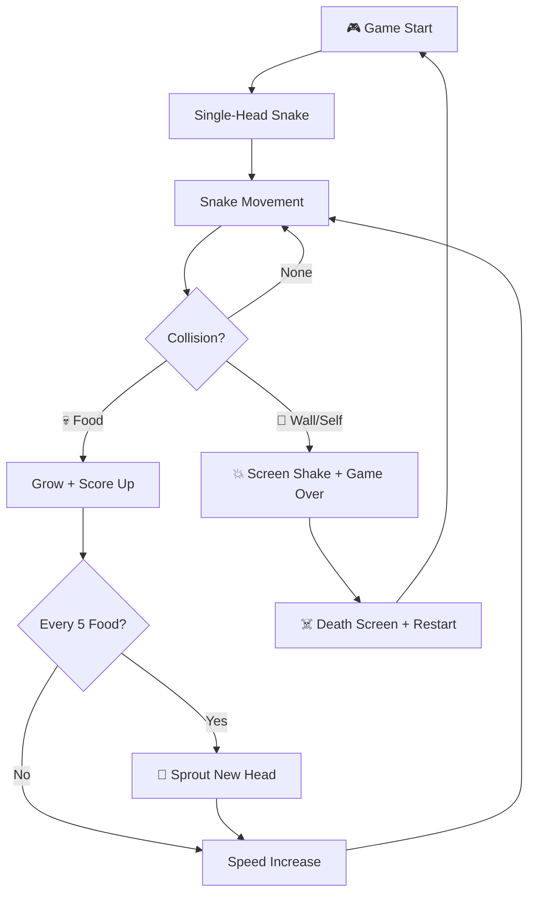
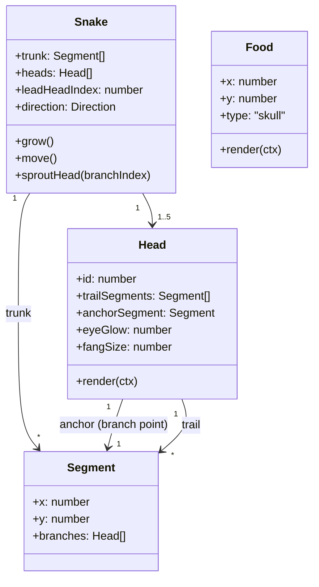
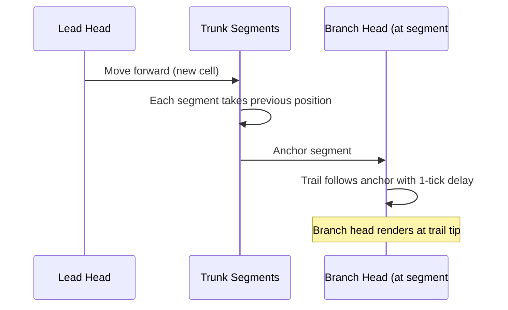

# Idea Summary

> Idea ID: IDEA-027
> Folder: wf-001-greedy-snake
> Version: v2
> Created: 2026-02-21
> Status: Refined

## Overview

A browser-based **multi-headed horror snake game** (多头恐怖贪吃蛇) built with vanilla JavaScript and HTML5 Canvas. The snake starts as a single-headed creature and grows additional heads as it feeds — evolving into a terrifying hydra. Dark/horror visual theme with glowing neon accents, pulsing eyes, and screen-shake effects. Supports desktop keyboard and mobile touch controls.

## Problem Statement

Most browser-based Snake games use the same tired classic look. This project reimagines the Snake game with a **horror twist** — a multi-headed snake that becomes progressively more terrifying as it grows. The result is a visually striking, memorable game that stands out from generic clones while remaining lightweight, zero-install, and ad-free.

## Target Users

- Casual gamers who enjoy horror-themed or visually unique browser games
- Players looking for a fresh twist on the classic Snake experience
- Anyone wanting a quick, ad-free, no-install browser game with personality

## Proposed Solution

A single-page web application using HTML5 Canvas with multi-layer rendering for glow effects. The snake's body uses a branching segment model — new heads sprout from body segments every 5 food eaten (max 5 heads). Only the lead head steers; additional heads are visual endpoints that trail at branch points. Dark horror theme with neon green/purple palette, glowing red eyes, skull-shaped food, and screen-shake on death.

## Key Features



### Feature List

| # | Feature | Description | Priority |
|---|---------|-------------|----------|
| 1 | **Canvas Rendering** | HTML5 Canvas 2D game board with 20×20 grid, multi-layer rendering for glow effects | P0 (MVP) |
| 2 | **Snake Movement** | Arrow key / WASD controls, grid-based movement, only lead head steers | P0 (MVP) |
| 3 | **Multi-Head Growth** | Snake sprouts a new head every 5 food eaten, branching from a random body segment (max 5 heads) | P0 (MVP) |
| 4 | **Food System** | Skull-shaped food spawning on empty grid cells (single type) | P0 (MVP) |
| 5 | **Collision Detection** | Wall boundaries and self-collision — any head or body segment triggers game over (see Collision Pairs table) | P0 (MVP) |
| 6 | **Game States** | Start screen → Playing → Paused (spacebar/touch) → Game Over (with death animation) | P0 (MVP) |
| 7 | **Horror Visual Theme** | Dark background (#0a0a0a), neon green (#39ff14) body, purple (#b026ff) accents, glowing red (#ff0040) eyes | P1 |
| 8 | **Head Rendering** | Triangular heads with glowing red eyes and small fangs, canvas shadowBlur for glow | P1 |
| 9 | **Score Tracking** | Current score + head count display, high score persistence (localStorage) | P1 |
| 10 | **Speed Progression** | Snake accelerates: 150ms → 50ms floor, −5ms per food eaten | P1 |
| 11 | **Death Effects** | Screen shake (CSS transform), red flash overlay, brief freeze before game-over screen | P1 |
| 12 | **Responsive Layout** | Canvas scales to fit 320px–1920px viewports | P1 |
| 13 | **Touch Controls** | Swipe gestures for mobile, on-screen pause button | P2 |
| 14 | **Ambient Glow** | Pulsing glow animation on all heads using oscillating shadowBlur | P2 |

## Technical Architecture

```architecture-dsl
@startuml module-view
title "Multi-Head Horror Snake — Module View"
theme "theme-default"
direction top-to-bottom
grid 12 x 5

layer "Presentation" {
  color "#1a0a2e"
  border-color "#b026ff"
  rows 1

  module "Rendering" {
    cols 6
    rows 1
    grid 3 x 1
    align center center
    gap 8px
    component "Game Canvas\n(Multi-Layer)" { cols 1, rows 1 }
    component "Glow Engine\n(shadowBlur)" { cols 1, rows 1 }
    component "Score / HUD" { cols 1, rows 1 }
  }

  module "Controls" {
    cols 6
    rows 1
    grid 2 x 1
    align center center
    gap 8px
    component "Keyboard Input" { cols 1, rows 1 }
    component "Touch Input" { cols 1, rows 1 }
  }
}

layer "Game Engine" {
  color "#0a1a0a"
  border-color "#39ff14"
  rows 1

  module "Core Loop" {
    cols 6
    rows 1
    grid 2 x 1
    align center center
    gap 8px
    component "Game Loop\n(rAF + delta)" { cols 1, rows 1 }
    component "State Machine" { cols 1, rows 1 }
  }

  module "Mechanics" {
    cols 6
    rows 1
    grid 2 x 1
    align center center
    gap 8px
    component "Collision\nDetector" { cols 1, rows 1 }
    component "Speed\nController" { cols 1, rows 1 }
  }
}

layer "Game Objects" {
  color "#1a0a0a"
  border-color "#ff0040"
  rows 1

  module "Entities" {
    cols 8
    rows 1
    grid 3 x 1
    align center center
    gap 8px
    component "Snake Body\n(Branching Segments)" { cols 1, rows 1 }
    component "Head Manager\n(Multi-Head)" { cols 1, rows 1 }
    component "Food\n(Skull)" { cols 1, rows 1 }
  }

  module "Visual FX" {
    cols 4
    rows 1
    grid 2 x 1
    align center center
    gap 8px
    component "Screen Shake" { cols 1, rows 1 }
    component "Death Flash" { cols 1, rows 1 }
  }
}

layer "Data" {
  color "#0a0a1a"
  border-color "#6a1b9a"
  rows 1

  module "Persistence" {
    cols 6
    rows 1
    grid 1 x 1
    align center center
    gap 8px
    component "LocalStorage\n(High Score)" { cols 1, rows 1 }
  }

  module "Config" {
    cols 6
    rows 1
    grid 1 x 1
    align center center
    gap 8px
    component "Game Settings\n(Grid, Speed, Heads)" { cols 1, rows 1 }
  }
}

layer "Grid Board" {
  color "#0f0f0f"
  border-color "#333333"
  rows 1

  module "Board" {
    cols 12
    rows 1
    grid 1 x 1
    align center center
    gap 8px
    component "20×20 Grid\n(Cell State Map)" { cols 1, rows 1 }
  }
}

@enduml
```

## Multi-Head Snake — Data Model



### Branching Movement Model

When the lead head moves, the trunk follows (classic snake). Each branch head has its own short trail of segments anchored to a trunk segment. Branch heads **follow their anchor point** — as the trunk segment they're attached to moves forward, the branch trail follows with a 1-tick delay. When the lead head turns, branches don't turn independently; they passively trail their anchor.



### Collision Pairs

| Entity A | Entity B | Result |
|----------|----------|--------|
| Lead head | Wall | Game Over |
| Lead head | Trunk segment | Game Over |
| Lead head | Branch trail segment | Game Over |
| Branch head | Wall | Game Over |
| Branch head | Trunk segment | Game Over |
| Branch head | Another branch head | No collision (heads can overlap briefly during turns) |
| Branch head | Food | **Eats food** (any head can eat) |

### Glow Rendering Approach

Single `<canvas>` element with **two draw passes** per frame:
1. **Base pass:** Draw body segments, heads, food with normal fill
2. **Glow pass:** Re-draw heads and food with `ctx.shadowBlur = N` and `ctx.shadowColor` set to glow color. Oscillate `N` between 5–15 using `Math.sin(timestamp)` for pulsing effect

## Success Criteria

- [ ] Snake starts with 1 head; a new head branches from a random body segment every 5 food eaten (max 5 heads)
- [ ] Only the lead head controls movement direction; additional heads trail at branch points
- [ ] All heads render as triangular shapes with glowing red eyes (using canvas shadowBlur)
- [ ] Dark horror theme: background #0a0a0a, body neon green #39ff14, eyes red #ff0040
- [ ] Food renders as skull-shaped items on empty grid cells
- [ ] Collision with walls or any snake segment (including branch heads) triggers game over
- [ ] Screen shake (CSS transform oscillation, ~300ms) and red flash on death
- [ ] Score displays during gameplay with head count indicator; high score persists in localStorage
- [ ] Game interval decreases from 150ms to 50ms floor, reducing ~5ms per food eaten
- [ ] Game states (start → play → pause → game over) transition correctly
- [ ] Canvas scales to fit viewports from 320px to 1920px wide
- [ ] 60 FPS sustained on mid-range devices with 5 heads active
- [ ] Total bundle size < 50KB (HTML + JS + CSS)
- [ ] Desktop: spacebar pauses; Mobile: on-screen pause button
- [ ] Any head (lead or branch) can eat food, not just the lead head

## Constraints & Considerations

- **No backend** — Pure client-side; deploy as index.html + JS + CSS
- **No frameworks** — Vanilla JS + HTML5 Canvas for zero-dependency simplicity
- **Performance** — `requestAnimationFrame` with delta timing; glow via single canvas two-pass rendering (base + shadowBlur glow pass). Target 60 FPS on mid-range devices
- **Grid size** — Default 20×20 cells (20px per cell = 400px minimum board, fits 320px viewport with scaling)
- **Head limit** — Max 5 heads to keep rendering performant and visually readable
- **Branching model** — Trunk is a linear segment array (classic snake). Each branch head has its own short trail anchored to a trunk segment. Branch heads follow their anchor passively (see Branching Movement Model)
- **Food scope** — Single skull food type (rendered as circle + eye holes at cell size; fallback to crossbones if too small). No bonus/special food
- **Edge cases** — If all grid cells occupied: game won (display victory screen). Food never spawns on any head or segment. If board is nearly full, food spawns on first available empty cell via scan
- **High score** — Per-device localStorage only; no leaderboard
- **Browser support** — Modern browsers (Chrome, Firefox, Safari, Edge)
- **Accessibility** — Keyboard-only fully playable; WCAG AA contrast for UI text; death effects respect `prefers-reduced-motion`
- **No audio** — Keeping it lightweight; purely visual horror

## Brainstorming Notes

- The multi-head concept transforms a simple Snake game into something visually memorable — a horror hydra that gets scarier as you play better
- Branching model: body is a linked list of segments; branch points marked with a flag; heads are endpoints of branches. Rendering walks the segment tree from lead head outward
- Canvas multi-layer glow: single canvas, two draw passes per frame — base fill then shadowBlur glow overlay. Oscillate shadowBlur value (5–15) via `Math.sin(timestamp)` for pulsing effect. No stacked canvas elements needed
- Screen shake implemented via CSS transform on the canvas container — cheap and effective
- Skull food: circle + two small circles for eye holes + jaw line at grid cell size. If cell is < 16px, fallback to crossbones (X shape) for clarity
- The horror theme uses 4 key colors: background dark (#0a0a0a), body neon green (#39ff14), accents purple (#b026ff), eyes/danger red (#ff0040)
- Head rendering: triangle shape pointing in movement direction, two red dots for eyes with shadowBlur glow, small triangular fangs below
- respects `prefers-reduced-motion`: disables screen shake, reduces glow pulsing

## Source Files

- `new idea.md` — Original idea (创建一个贪吃蛇web app)
- `refined-idea/idea-summary-v1.md` — v1: Classic single-head snake
- `refined-idea/idea-summary-v2.md` — v2: Multi-head horror snake (this file)

## Next Steps

- [ ] Proceed to Idea Mockup or Requirement Gathering

## References & Common Principles

### Applied Principles

- **Game Loop Pattern:** `requestAnimationFrame` with delta accumulation for consistent game speed across frame rates
- **Grid-Based Movement:** Snake occupies discrete grid cells, simplifying collision to coordinate comparison
- **State Machine:** Game states (menu, playing, paused, game over) via finite state machine
- **Branching Linked List:** Body stored as segments with branch-point flags; heads are terminal nodes of branches
- **Responsive Canvas:** Canvas dimensions from container size, CSS fluid layout
- **Horror Game Aesthetics:** High-contrast dark palette + neon accents, glow effects (shadowBlur), screen disruption effects (shake/flash)

### Further Reading

- HTML5 Canvas API — MDN Web Docs
- Game Programming Patterns — Robert Nystrom (gameprogrammingpatterns.com)
- requestAnimationFrame best practices — MDN Web Docs
- Canvas shadowBlur performance — Web.dev rendering optimization guides
