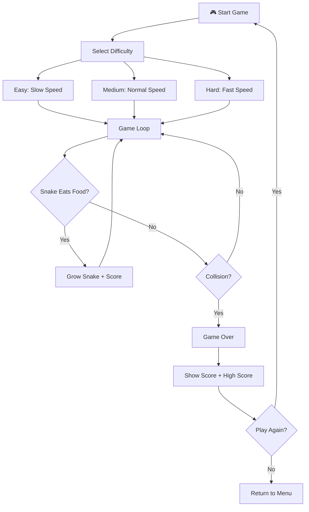
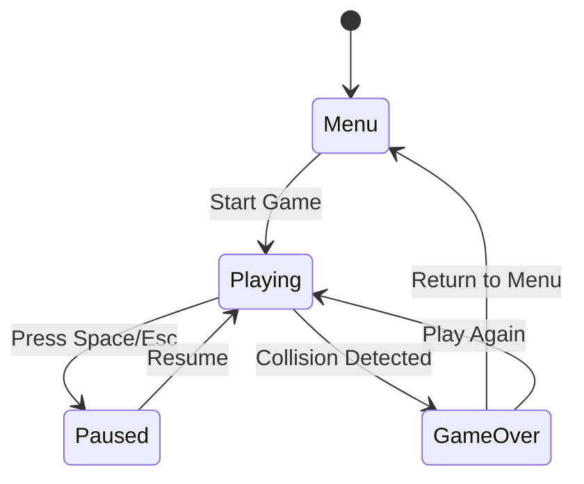

# Idea Summary

> Idea ID: IDEA-026
> Folder: wf-001-test-the-workflow
> Version: v1
> Created: 2026-02-21
> Status: Refined

## Overview

A browser-based Snake game (贪吃蛇) built with HTML5 Canvas and vanilla JavaScript. The game features classic snake mechanics with a modern minimalist visual style, responsive layout, score tracking, and three difficulty levels.

## Problem Statement

Users want instant, no-install entertainment during short breaks, but most browser games require downloads, heavy frameworks, or account creation. A lightweight Snake game solves this by delivering a familiar, engaging gameplay experience that loads instantly in any browser tab — zero friction, zero dependencies.

## Target Users

- **Primary:** Office workers and students looking for a quick 5-minute break game
- **Secondary:** Developers learning HTML5 Canvas game development fundamentals

## Proposed Solution

A single-page HTML5 Canvas application implementing the classic Snake game with modern polish:

- **Game Engine:** requestAnimationFrame-based game loop with grid-snapped movement
- **Rendering:** HTML5 Canvas 2D context with smooth color transitions
- **Input:** Keyboard arrow keys + WASD, with touch swipe support for mobile
- **State Management:** Simple state machine (menu → playing → paused → game-over)

## Key Features



### Feature List

- **Classic Snake Mechanics** — Grid-based movement, snake grows when eating food, game ends on self-collision or wall collision (walls are always fatal — no wrap-around)
- **Score System** — +10 points per food eaten, multiplied by difficulty (1× Easy / 2× Medium / 3× Hard), persistent high score via localStorage
- **3 Difficulty Levels** — Easy (slow), Medium (normal), Hard (fast) — controls game tick speed
- **Responsive Design** — Canvas scales to viewport, touch controls for mobile devices
- **Pause/Resume** — Press Space or Escape to pause mid-game
- **Visual Feedback** — Food spawn animation, score pop-up, smooth snake trail, game-over overlay
- **Smart Food Placement** — Food never spawns on the snake body; re-rolls position until an empty cell is found

## Architecture

```architecture-dsl
@startuml module-view
title "Snake Game — Module View"
theme "theme-default"
direction top-to-bottom
grid 12 x 6

layer "Presentation Layer" {
  color "#E3F2FD"
  border-color "#1565C0"
  rows 2

  module "UI Components" {
    cols 6
    rows 2
    grid 2 x 2
    align center center
    gap 8px
    component "Menu Screen" { cols 1, rows 1 }
    component "Game Canvas" { cols 1, rows 1 }
    component "Score Display" { cols 1, rows 1 }
    component "Game Over\nOverlay" { cols 1, rows 1 }
  }

  module "Input Handling" {
    cols 6
    rows 2
    grid 2 x 1
    align center center
    gap 8px
    component "Keyboard\nController" { cols 1, rows 1 }
    component "Touch\nController" { cols 1, rows 1 }
  }
}

layer "Game Logic Layer" {
  color "#E8F5E9"
  border-color "#2E7D32"
  rows 2

  module "Core Engine" {
    cols 6
    rows 2
    grid 2 x 2
    align center center
    gap 8px
    component "Game Loop" { cols 1, rows 1 }
    component "Snake\nController" { cols 1, rows 1 }
    component "Collision\nDetector" { cols 1, rows 1 }
    component "Food\nSpawner" { cols 1, rows 1 }
  }

  module "Game State" {
    cols 6
    rows 2
    grid 2 x 1
    align center center
    gap 8px
    component "State Machine" { cols 1, rows 1 }
    component "Score Manager" { cols 1, rows 1 }
  }
}

layer "Data Layer" {
  color "#FFF3E0"
  border-color "#E65100"
  rows 2

  module "Persistence" {
    cols 12
    rows 2
    grid 2 x 1
    align center center
    gap 8px
    component "LocalStorage\nAdapter" { cols 1, rows 1 }
    component "Config\nManager" { cols 1, rows 1 }
  }
}

@enduml
```

## Game Flow



## Success Criteria

- [ ] Snake moves smoothly on a grid with arrow key / WASD input
- [ ] Snake grows when eating food and score increments correctly (10 × difficulty multiplier)
- [ ] Game ends on wall or self-collision with game-over screen
- [ ] Three difficulty levels with distinct speed differences
- [ ] High score persists across sessions via localStorage
- [ ] Responsive canvas that works on desktop and mobile
- [ ] Touch swipe controls work on mobile devices
- [ ] Maintains 60fps on mid-range devices
- [ ] Single HTML file under 50KB
- [ ] Fully playable with keyboard only (accessibility)

## Constraints & Considerations

- **Zero dependencies** — vanilla HTML/CSS/JS only, no frameworks
- **Single file delivery** — single HTML file for easy sharing (build-time concatenation acceptable if source exceeds ~500 lines)
- **Browser compatibility** — modern browsers (Chrome, Firefox, Safari, Edge)
- **Performance** — 60fps game loop with no jank on mid-range devices
- **Accessibility** — keyboard-only playability via arrow keys/WASD; sufficient color contrast for food vs. background

## Brainstorming Notes

- The original idea "做一个贪吃蛇" (Make a Snake game) is intentionally simple — this is a workflow demo
- Chose web browser platform for zero-friction delivery
- Modern minimalist style keeps implementation simple while looking polished
- Three difficulty levels add replayability without complexity
- localStorage for high scores avoids any backend requirement

## Source Files

- idea.md — Original idea: "做一个贪吃蛇"

## Next Steps

- [ ] Proceed to Idea Mockup (visual prototype of the game UI)
- [ ] Or proceed to Requirement Gathering (if skipping visual prototyping)

## References & Common Principles

### Applied Principles

- **Game Loop Pattern:** Fixed-timestep update with variable rendering — standard for browser games
- **Entity-Component Pattern (simplified):** Snake segments as an array of grid coordinates
- **State Machine Pattern:** Menu → Playing → Paused → GameOver states with defined transitions

### Further Reading

- MDN Web Docs: Canvas API — Comprehensive guide for HTML5 Canvas 2D rendering
- Game Programming Patterns (Robert Nystrom) — Classic reference for game loop and state patterns
