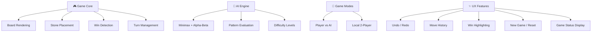
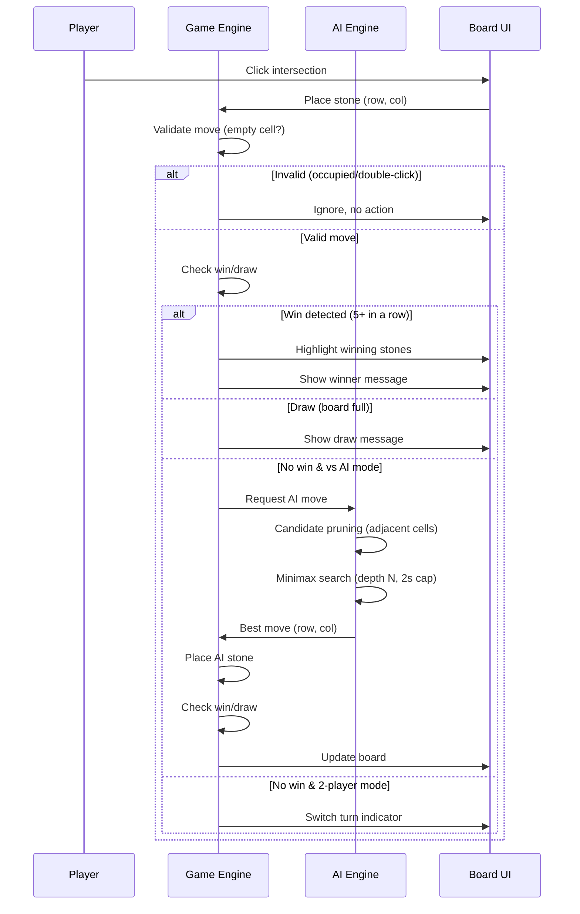

# Idea Summary

> Idea ID: IDEA-032
> Folder: wf-001-五子棋
> Version: v1
> Created: 2026-03-02
> Status: Refined

## Overview

A browser-based 五子棋 (Gomoku / Five in a Row) web game with single-player AI and local two-player modes. The game features a classic 15×15 board with clean, modern aesthetics, intelligent AI opponent using minimax with alpha-beta pruning, and essential game features like undo, move history, and win highlighting.

## Problem Statement

Players who want to enjoy 五子棋 need a convenient, no-install-required way to play — either against a computer opponent for practice/entertainment or against a friend on the same device. Existing web implementations often lack polished UI, decent AI, or essential quality-of-life features.

## Target Users

- Casual gamers who enjoy classic board games
- 五子棋 enthusiasts looking for quick browser-based games
- Players wanting to practice against AI at various difficulty levels
- Friends wanting to play locally on one device

## Proposed Solution

A single-page web application built with HTML5 Canvas, CSS, and vanilla JavaScript. The game renders a 15×15 grid board where two players (or player vs AI) alternate placing black and white stones. The AI uses minimax with alpha-beta pruning and a pattern-based evaluation function to provide a challenging opponent.

## Key Features



### Feature Details (MVP vs Phase 2)

| Priority | Feature | Description |
|----------|---------|-------------|
| **P0 (MVP)** | **15×15 Board** | Standard Gomoku board rendered on HTML5 Canvas with grid lines and star points |
| **P0 (MVP)** | **Stone Placement** | Click/tap-to-place with hover preview; validates empty intersections; ignores occupied cells and double-clicks |
| **P0 (MVP)** | **Win Detection** | Scans 4 directions (horizontal, vertical, 2 diagonals) for 5+-in-a-row (overline counts as win) |
| **P0 (MVP)** | **Draw Detection** | Detects board-full condition with no winner |
| **P0 (MVP)** | **AI Opponent (Medium)** | Minimax with alpha-beta pruning + candidate move pruning (only adjacent cells); pattern-based evaluation |
| **P0 (MVP)** | **Game Modes** | Toggle between Player vs AI and local 2-Player |
| **P0 (MVP)** | **New Game / Reset** | Reset board and start fresh; player always plays black (first move) in PvAI |
| **P1 (Phase 2)** | **Difficulty Levels** | Easy (depth 2), Medium (depth 4), Hard (depth 6 with iterative deepening + 2s time cap) |
| **P1 (Phase 2)** | **Undo/Redo** | In PvAI: undoes 2 moves (player + AI response); in 2P: undoes 1 move |
| **P1 (Phase 2)** | **Move History** | Numbered moves displayed on stones; scrollable move list panel |
| **P1 (Phase 2)** | **Win Highlighting** | Winning 5 stones highlighted with animation |
| **P2 (Nice-to-have)** | **Responsive + Mobile** | Touch-friendly tap-to-place for mobile; adapts to desktop (1024px+), tablet (768px+), and mobile (375px+) |
| **P2 (Nice-to-have)** | **AI Thinking Indicator** | Spinner or "thinking..." status while AI computes |
| **P2 (Nice-to-have)** | **Stone Placement Sound** | Optional subtle click sound on stone placement |

## Architecture Overview

```architecture-dsl
@startuml module-view

title 五子棋 (Gomoku) Web Game Architecture

theme default
direction top-down
canvas width=900

layer "Presentation Layer" color=#E3F2FD border-color=#1565C0
  module "UI Components" cols=12 grid=3x1
    component "Board Canvas" cols=4
    component "Control Panel" cols=4
    component "Status Display" cols=4

layer "Game Logic Layer" color=#E8F5E9 border-color=#2E7D32
  module "Core Engine" cols=7 grid=2x1
    component "Game State Manager" cols=6
    component "Win Detector" cols=6
  module "AI Engine" cols=5 grid=2x1
    component "Minimax + α-β Pruning" cols=6
    component "Pattern Evaluator" cols=6

layer "Data Layer" color=#FFF3E0 border-color=#E65100
  module "State Management" cols=12 grid=3x1
    component "Board State (2D Array)" cols=4
    component "Move History Stack" cols=4
    component "Game Config" cols=4

@enduml
```

## Game Flow



## Success Criteria

- [ ] Board renders correctly on 15×15 grid with star points
- [ ] Stones can be placed by clicking/tapping valid intersections
- [ ] Occupied cells and double-clicks are properly ignored
- [ ] Win detection works for all 4 directions (5+ in a row counts as win)
- [ ] Draw detection works when board is full with no winner
- [ ] AI makes reasonable moves (blocks threats, creates winning patterns)
- [ ] AI responds within 2 seconds on medium difficulty (with iterative deepening fallback)
- [ ] Undo in PvAI mode undoes both player and AI move (2 moves)
- [ ] Game correctly handles first-move: player is always black in PvAI
- [ ] Responsive layout works on desktop (1024px+), tablet (768px+), and mobile (375px+)

## Constraints & Considerations

- **No backend required** — pure client-side implementation
- **No dependencies** — vanilla HTML/CSS/JS for simplicity
- **Performance** — AI uses candidate move pruning (cells adjacent to existing stones only) + time-bounded iterative deepening to prevent UI freezes
- **Overline rule** — 6+ in a row counts as a win (standard Gomoku, not Renju)
- **First move** — Player always plays black (first) in PvAI mode; color selection is out of scope
- **Persistence** — Game save/resume via localStorage is out of scope for initial version
- **Mobile** — Touch-friendly tap-to-place (P2 priority); phone users are a significant target
- **Browser support** — Modern browsers with Canvas support

## Edge Cases

| Scenario | Behavior |
|----------|----------|
| Click occupied intersection | Ignored — no action, no error |
| Double-click | Only first click registers |
| AI takes > 2 seconds | Iterative deepening returns best move found so far |
| Board full, no winner | Draw declared, game ends |
| Undo with no moves | Undo button disabled |
| Undo in PvAI | Removes last 2 moves (player + AI) |
| Window resize mid-game | Canvas redraws, game state preserved |

## Brainstorming Notes

- Standard 15×15 board chosen as the classic Gomoku size
- No Renju opening restrictions to keep rules simple and approachable; overline (6+) counts as win
- Player always plays black (first move advantage) in PvAI mode — simplifies UI, no color picker needed
- Minimax with alpha-beta pruning provides good AI without requiring complex neural networks
- **Candidate move pruning** is essential: only consider cells within 2 squares of existing stones to make search tractable on 15×15 board
- **Iterative deepening** with time cap ensures AI never freezes the UI — returns best move found when time expires
- Pattern-based evaluation using directional window scanning: count live-four, half-open-four, live-three, half-open-three, live-two patterns for scoring
- Canvas rendering preferred over DOM-based grid for smoother interaction and easier coordinate mapping
- Move numbers shown on stones help players follow the game flow
- Board state: simple 15×15 2D array (0=empty, 1=black, 2=white) with move history stack for undo support

## Source Files

- new idea.md

## Next Steps

- [ ] Proceed to Idea Mockup (create interactive HTML prototype)
- [ ] Proceed to Requirement Gathering (if ready for full implementation)

## References & Common Principles

### Applied Principles

- **Minimax Algorithm:** Standard game tree search for two-player zero-sum games — explores all possible moves to a given depth and picks the optimal one
- **Alpha-Beta Pruning:** Optimization that eliminates branches that cannot influence the final decision, reducing search space significantly
- **Pattern-Based Evaluation:** Heuristic scoring based on known Gomoku patterns (live-four > half-open-four > live-three, etc.)

### Further Reading

- [Gomoku (Wikipedia)](https://en.wikipedia.org/wiki/Gomoku) — Rules and variants
- [Alpha-beta pruning](https://en.wikipedia.org/wiki/Alpha%E2%80%93beta_pruning) — Algorithm details
