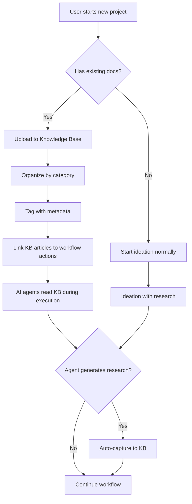
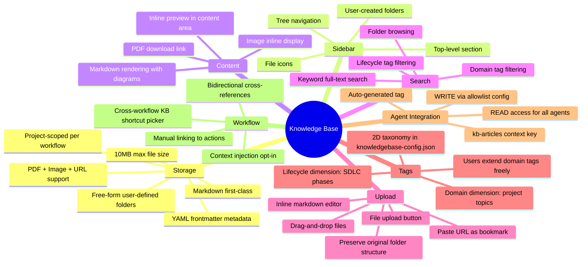
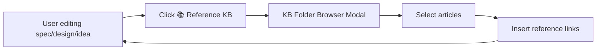
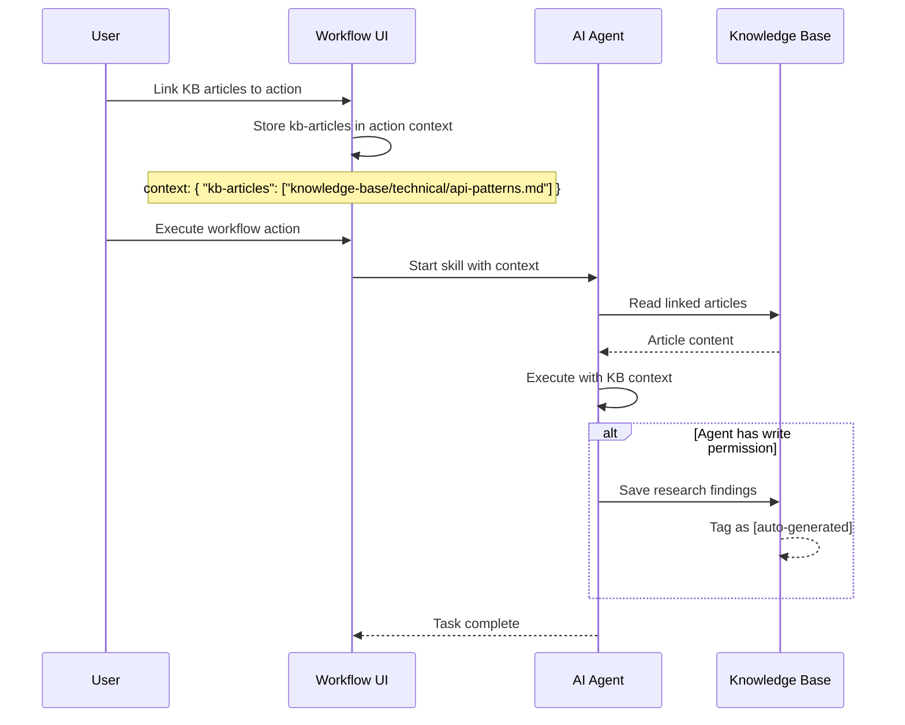

# Idea Summary — Knowledge Base for X-IPE

> Idea ID: IDEA-036
> Folder: wf-007-knowledge-base-implementation
> Version: v1
> Created: 2026-03-10
> Status: Refined

## Overview

A project-scoped Knowledge Base (KB) integrated into X-IPE that serves as persistent organizational memory — storing requirement documents, user manuals, design references, market research, and technical patterns. Both humans and AI agents can read from and write to the KB across all workflow phases, enabling X-IPE to support legacy application maintenance and knowledge-intensive development alongside its existing greenfield workflow.

## Problem Statement

X-IPE currently excels at delivering new applications from scratch through its ideation → requirement → design → implementation pipeline. However, two critical gaps exist:

1. **Legacy Application Support** — Many real-world projects involve maintaining or building new features on top of existing codebases. These projects come with existing requirement documents, user manuals, architecture diagrams, and operational runbooks that agents need to reference during any workflow phase. Currently, there's no centralized location to store and retrieve this project context.

2. **Knowledge Capture & Reuse** — During ideation and design, teams conduct market research, evaluate competitor features, study technical patterns, and consult design references. This knowledge is currently ephemeral — it lives in the agent's context window during a single task and is lost afterward. There's no mechanism to persist and reuse these findings.

## Target Users

- **Project Managers / Product Owners** — Upload existing project docs, reference materials, and domain knowledge
- **AI Agents** — Read KB articles for contextual understanding during task execution; write research findings for future reuse
- **Developers** — Reference technical patterns, architecture decisions, and coding standards during implementation
- **Designers** — Store and retrieve design references, brand guidelines, and UI/UX patterns

## Proposed Solution

Add a **Knowledge Base** as a first-class feature in X-IPE with:

- A **new sidebar section** ("Knowledge Base") between Ideas and Workflows
- **Project-scoped storage** under `x-ipe-docs/knowledge-base/` with free-form user-defined folder structure (like OneDrive/Google Drive)
- **Multiple content types**: Markdown (first-class, editable in-app), PDFs, images, and URL bookmarks
- **YAML frontmatter** for metadata (lifecycle + domain tags from predefined 2D taxonomy, author, auto-generated flag)
- **2D tag taxonomy** — lifecycle tags (SDLC phases) × domain tags (project-specific topics) defined in `knowledgebase-config.json`
- **Workflow integration** via `kb-articles` key in action context
- **Agent READ + WRITE** access with configurable allowlist
- **Keyword search + 2D tag filter** for discovery

### High-Level Architecture

```architecture-dsl
@startuml module-view
title "Knowledge Base — Module Architecture"
theme "theme-default"
direction top-to-bottom
grid 12 x 6

layer "Presentation Layer" cols 12 rows 1 color "#e8f5e9"
  module "Frontend Components" cols 12 grid 4 x 1
    component "KB Sidebar Section" cols 3
    component "KB Content Viewer" cols 3
    component "KB Article Editor" cols 3
    component "KB Search & Filter" cols 3

layer "API Layer" cols 12 rows 1 color "#e3f2fd"
  module "Routes" cols 12 grid 3 x 1
    component "kb_routes.py" cols 4
    component "Workflow Integration" cols 4
    component "Agent Context API" cols 4

layer "Service Layer" cols 12 rows 1 color "#fff3e0"
  module "Core Services" cols 12 grid 3 x 1
    component "KBService" cols 4
    component "KBSearchService" cols 4
    component "KBConfigService" cols 4

layer "Storage Layer" cols 12 rows 1 color "#fce4ec"
  module "File System" cols 12 grid 3 x 1
    component "x-ipe-docs/knowledge-base/" cols 4
    component "knowledgebase-config.json" cols 4
    component "Git Version Control" cols 4
@enduml
```

### User Workflow



## Key Features

### MVP (V1)



### V2 (Future)

- **Semantic search** — AI-powered content similarity matching
- **Auto-tagging** — Agents automatically categorize new articles
- **Recommendations** — Suggest relevant KB articles when starting new workflows
- **Staleness indicators** — `last_reviewed` field + visual warnings for old articles
- **Global KB** — Cross-project shared knowledge layer
- **PDF text extraction** — Full-text search over PDF content

## Success Criteria

- [ ] KB sidebar section renders with tree navigation showing categories and articles
- [ ] Users can create, edit, and delete KB articles via inline editor
- [ ] Users can upload files (markdown, PDF, images), paste URLs, and upload archives (.zip/.7z) with auto-extraction
- [ ] Keyword search returns relevant results across all article content
- [ ] Tag-based filtering narrows results by metadata
- [ ] Untagged files are visually flagged with "Needs Tags" badge and filterable via "Untagged" quick-filter
- [ ] Browse view supports dual-mode: Grid (editorial cards) and List (sortable table) with auto-switch at scale
- [ ] Sorting options: Last Modified (default), Name A→Z, Date Created, Untagged First
- [ ] AI agents can read KB articles when linked to workflow actions via `kb-articles` context key
- [ ] Permitted agents auto-capture research findings with `[auto-generated]` tag
- [ ] Cross-workflow "📚 Reference KB" shortcut available in editors/modals to browse and insert KB references
- [ ] KB articles are viewable in the existing content area (consistent with Ideas/Workflows)
- [ ] Cross-references via file paths render as clickable links

## Constraints & Considerations

- **File-based storage only** — No database; KB lives in `x-ipe-docs/knowledge-base/` under git version control
- **Free-form folder structure** — No predefined categories; users create their own folder hierarchy
- **Predefined 2D tags only** — Lifecycle (SDLC phase) and domain (topic) tags must be from `knowledgebase-config.json`; prevents sprawl and enables consistent filtering
- **10MB max file size** — Prevents git repo bloat from large binaries
- **No separate ID system** — File paths ARE canonical identifiers (e.g., `knowledge-base/api-guidelines/rest-conventions.md`)
- **Agent write allowlist** — Only skills listed in `knowledgebase-config.json` can auto-write to KB (prevents noise)
- **No global KB in V1** — Each project has its own KB; cross-project sharing is V2
- **No version history UI** — Git provides history; explicit version UI deferred to V2
- **No auto-tagging in V1** — Users manually assign categories and tags

## KB Storage Structure

The folder structure is **entirely user-defined** — like OneDrive or Google Drive. Users can create any folder hierarchy that makes sense for their project. There are no predefined categories or enforced directory names. When uploading existing documentation, the original folder structure is preserved.

```
x-ipe-docs/
└── knowledge-base/
    ├── knowledgebase-config.json                    # Configuration (tags, allowlist, settings)
    ├── legacy-platform/                  # User-created: imported from existing project
    │   ├── user-manual-v2.md
    │   ├── api-spec.pdf
    │   └── architecture/
    │       └── system-overview.md
    ├── research/                         # User-created: research findings
    │   ├── competitors/
    │   │   └── dashboard-analysis.md
    │   └── ai-agent-market-2026.md
    ├── api-guidelines/                   # User-created: team standards
    │   ├── rest-conventions.md
    │   └── auth-patterns.md
    └── brand-assets/                     # User-created: design references
        └── color-palette.md
```

### Article Frontmatter Schema

```yaml
---
title: "REST Conventions"
lifecycle: [design, implementation]       # SDLC phases (from tags.lifecycle in knowledgebase-config.json)
domain: [api, architecture]               # Subject areas (from tags.domain in knowledgebase-config.json)
author: "user | agent-name"
auto_generated: false                    # true if created by AI agent
created: 2026-03-10
last_reviewed: 2026-03-10               # For V2 staleness tracking
linked_workflows: []                     # Workflows referencing this article
---
```

### knowledgebase-config.json Schema

```json
{
  "max_file_size_mb": 10,
  "tags": {
    "lifecycle": {
      "description": "SDLC phase — when in the delivery process this content is relevant",
      "values": [
        "ideation",
        "requirement",
        "design",
        "implementation",
        "testing",
        "deployment",
        "maintenance"
      ]
    },
    "domain": {
      "description": "Subject area — what project-specific topic this content covers",
      "values": [
        "api",
        "auth",
        "ui-ux",
        "data",
        "infrastructure",
        "business-logic",
        "brand",
        "market-research",
        "onboarding",
        "architecture"
      ]
    }
  },
  "agent_write_allowlist": [
    "x-ipe-task-based-ideation",
    "x-ipe-task-based-technical-design",
    "x-ipe-task-based-idea-mockup",
    "x-ipe-tool-kb-librarian"
  ],
  "intake_folder": ".intake",
  "ai_librarian": {
    "enabled": true,
    "skill": "x-ipe-tool-kb-librarian",
    "auto_tag": true,
    "auto_extract_archives": true,
    "comment": "📥 Intake staging folder for AI-assisted organization. Files uploaded in AI Librarian mode land here. Running the librarian analyzes content, suggests folder placement, and auto-tags lifecycle & domain dimensions."
  },
  "supported_extensions": [".md", ".pdf", ".png", ".jpg", ".jpeg", ".gif", ".svg", ".zip", ".7z"],
  "archive_behavior": {
    "auto_extract": true,
    "preserve_folder_structure": true,
    "skip_nested_archives": true,
    "comment": "Archives (.zip/.7z) are auto-extracted on upload. Folder structure inside archives is preserved. Nested archives within uploaded folders or sub-folders are skipped (not recursively extracted)."
  },
  "url_bookmark_format": ".url.md"
}
```

> **2D Tag Taxonomy:** Every KB article is tagged along two dimensions:
> - **Lifecycle** (horizontal) — Which SDLC phase does this serve? Maps to X-IPE workflow stages (ideation → requirement → design → implementation → testing → deployment → maintenance).
> - **Domain** (vertical) — What project-specific topic does this cover? User-extensible list for project-specific concerns.
>
> This creates a cross-cutting classification matrix. For example, an article tagged `lifecycle:design` + `domain:api` sits at the intersection of "design phase" and "API topic" — making it discoverable both when filtering by delivery phase and by subject area.
>
> Users can add new domain tags to config at any time. Lifecycle tags are fixed to SDLC phases.

## Cross-Workflow KB Reference Shortcut

When working in **any X-IPE function** (ideation, refinement, design, implementation), users can invoke a KB shortcut to browse knowledge base folders/files and insert a reference. This makes KB a first-class resource accessible across all workflows — not just within the KB section itself.

**UX Pattern:** A "📚 Reference KB" button or keyboard shortcut available in:
- Idea composition / refinement views
- Requirement gathering / feature specification editors
- Technical design editors
- Action execution modals (alongside existing context pickers)

**Behavior:**
1. User clicks "📚 Reference KB" or uses shortcut
2. A folder-browser modal opens showing the KB tree (folders → articles)
3. User can select **files or entire folders** as references
4. User can search by keyword and filter by **lifecycle** or **domain** tags
5. User chooses action:
   - **Insert References** — auto-inserts markdown links into the current editor
   - **Copy to Clipboard** — copies selected article paths/links to clipboard for manual pasting anywhere



## Workflow Context Integration



## UIUX Reference (Auto-Detected from X-IPE)

The KB feature will reuse these established X-IPE patterns:

| Pattern | Source | KB Usage |
|---------|--------|----------|
| Sidebar section | `sidebar.js` `.nav-section` | New "Knowledge Base" collapsible section |
| Tree navigation | `sidebar.js` `.tree-item` | Category folders → article files |
| Content renderer | `workplace.js` `_renderMarkdownPreview()` | Article viewing in content area |
| Search/filter | `tree-search.js` 150ms debounce | KB keyword search + tag filter |
| Modal pattern | `compose-idea-modal.js` 90vw×90vh | Create/edit article modal |
| File upload | `ideas_routes.py` drag-drop | KB file upload with type validation |
| CSS variables | `base.css` `--sidebar-bg`, `--cr006-color-accent` | Consistent theming |
| Tab component | `uiux-reference-tab.js` state-driven | KB view/edit tab switcher |

## Brainstorming Notes

### Key Decisions Made

1. **Project-scoped only (V1)** — No global KB. Each workflow's KB lives in its own `x-ipe-docs/knowledge-base/`. Keeps scope clean and avoids multi-project conflicts.
2. **Free-form folder structure** — No predefined categories or enforced directory names. Users create any folder hierarchy they want, just like OneDrive or Google Drive. Original folder structure preserved on upload.
3. **2D tag taxonomy in knowledgebase-config.json** — Lifecycle tags (SDLC phases: ideation → maintenance) × Domain tags (project topics: api, auth, ui-ux, etc.). Every article sits at the intersection of "what phase" and "what topic." Lifecycle tags are fixed; domain tags are user-extensible.
4. **File paths as IDs** — `knowledge-base/api-guidelines/rest-conventions.md` is both the storage path and the canonical reference ID. No separate ID registry needed.
5. **Agent write allowlist in knowledgebase-config.json** — Centralized config controls which skills can auto-write, preventing noise from utility skills.
6. **Context injection via `kb-articles` key** — Extends existing `update_workflow_action` context dict. No new mechanism required.
7. **Migration = file move** — Existing docs can be moved to `knowledge-base/` maintaining their original folder structure, with optional frontmatter addition.
8. **Cross-workflow KB shortcut** — A "📚 Reference KB" picker available in all editors/modals to browse and insert KB references, making KB a first-class resource across all workflow phases.

### What Was Deferred to V2

- Semantic search (requires embedding/vector capability)
- Auto-tagging by AI agents
- Article recommendations
- Staleness indicators with visual warnings
- Global cross-project KB
- PDF text extraction for search
- Version history UI

## Source Files

- [new idea.md](x-ipe-docs/ideas/wf-007-knowledge-base-implementation/new idea.md)

## Mockups and Prototypes

| Mockup | File | Description |
|--------|------|-------------|
| KB Interface (3 scenes) | [kb-interface-v1.html](../mockups/kb-interface-v1.html) | Full KB UI mockup with 3 interactive scenes |

### Scene Breakdown

1. **Browse Articles** — Main KB dashboard with dual-mode view: **Grid** (editorial card layout with hero + standard cards for small collections ≤30) and **List** (sortable table with columns: icon, name, folder, lifecycle tags, domain tags, date modified — practical for 50+ files, auto-switches as default). Features: search bar, 2D tag filter chips (lifecycle × domain), "⚠ Untagged" quick-filter for post-upload triage, sort dropdown (Last Modified / Name A→Z / Date Created / Untagged First), stats bar (articles, folders, tags, untagged count). **Dual-mode upload section** at the bottom: **Normal Upload** (drag-and-drop directly to selected folder, supports .zip/.7z auto-extraction) and **📚 AI Librarian** mode (files land in 📥 Intake staging area for AI-assisted organization). Untagged files highlighted with amber "Needs Tags" badge.
2. **Article Detail** — Article reading view with rich markdown rendering, breadcrumb navigation, metadata sidebar (tags, author, linked workflows, file path), and edit/download actions.
3. **📚 Reference Picker Modal** — Cross-workflow KB reference shortcut. Shows folder-tree category browser (left), selectable article list with checkboxes (right), selected count, "Copy to Clipboard" button, and "Insert References" button. Demonstrates the UX for referencing KB articles from any X-IPE editor.

### Design Decisions

- **Dual-mode upload** — **Normal Upload** sends files directly to the selected folder (fast, user-controlled). **📚 AI Librarian** mode routes files to a temporary **📥 Intake** staging area, where clicking "✨ Run AI Librarian" opens a Copilot CLI session that analyzes content, suggests folder placement, and auto-tags lifecycle & domain dimensions. Purple accent (`#8b5cf6`) visually differentiates AI Librarian from the standard emerald KB accent.
- **Intake concept** — The 📥 Intake is a temporary staging folder (shown in sidebar with purple accent and pending count badge). Files sit as "Pending" until the AI Librarian processes them. After processing, files move to proper folders with tags applied, and status shows "Filed ✓". This separates the upload action from the organization action.
- **x-ipe-tool-kb-librarian** — Future tool-type skill (not task-based) that the AI Librarian button invokes via CLI session. Responsibilities: content analysis, folder suggestion, tag inference (lifecycle + domain), archive extraction, and batch file organization.
- **Dual-mode browse** — Grid view for editorial aesthetic (≤30 files), List view for practical scale (50+ files). Grid is default for small KBs; list auto-becomes default when article count grows. Toggle always available.
- **Sorting logic** — Default: Last Modified (newest first). Options: Name A→Z, Date Created, Untagged First (triage sort). List view columns are clickable for sort.
- **Untagged triage** — "Needs Tags" amber badge on untagged files + "⚠ Untagged (N)" quick-filter in toolbar. Answers "what needs attention after bulk upload?"
- **Archive upload** — .zip/.7z auto-extracted preserving internal folder structure. Nested archives inside uploaded folders/sub-folders are skipped (no recursive extraction).
- **Category color coding** — Each category gets a unique color strip on cards and sidebar dots (Requirements=blue, Design=amber, Technical=emerald, Market=purple, Brand=pink, General=slate)
- **Hero card pattern** — First article spans 2 columns for visual hierarchy and editorial feel
- **Auto-generated badge** — Robot icon + "Auto" label clearly marks AI-generated articles
- **Staggered card reveal** — Cards animate in with cascading delays for polished page load
- **Sidebar KB section** — Highlighted with emerald accent border and expanded by default, positioned between Ideas and Workflows

## Next Steps

- [ ] Proceed to **Requirement Gathering** — break down MVP features into implementable requirements
- [ ] Or **Idea to Architecture** — create detailed system architecture diagram

## References & Common Principles

### Applied Principles

- **Single Source of Truth** — File paths as IDs, directories as categories, no duplication — [Atlassian Knowledge Management](https://www.atlassian.com/itsm/knowledge-management/what-is-a-knowledge-base)
- **Progressive Disclosure** — MVP with manual linking; auto-features in V2 — Minimizes complexity while validating core value
- **Consistency over Novelty** — Reuse existing sidebar, tree, content renderer patterns — Reduces learning curve for users
- **Agent-Assisted Knowledge Building** — AI writes with `[auto-generated]` tag for transparency — Builds institutional memory while maintaining human oversight

### Further Reading

- [Atlassian: What is a Knowledge Base](https://www.atlassian.com/itsm/knowledge-management/what-is-a-knowledge-base) — Industry-standard KB definition and benefits
- [X-IPE Architecture](x-ipe-docs/ideas/wf-007-knowledge-base-implementation/new idea.md) — Original idea capturing user needs
