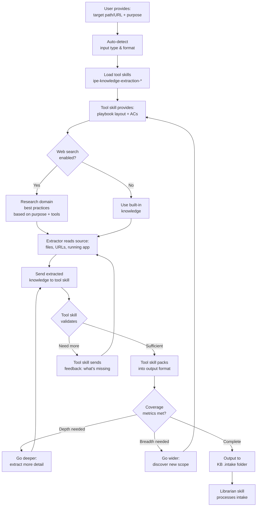
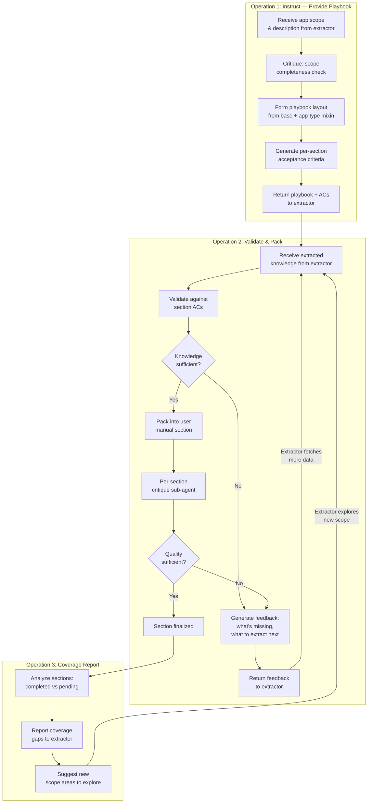

# Idea Summary

> Idea ID: IDEA-008
> Folder: wf-008-knowledge-extraction
> Version: v1
> Created: 2026-03-17
> Status: Refined

## Overview

A two-tier AI skill system for structured knowledge extraction from applications. An **extractor skill** does the hands-on work — accepting any input source (local paths, URLs, running apps), auto-detecting format, reading/browsing/inspecting sources, and progressively extracting knowledge. A **user manual instructor skill** acts as the source-agnostic guide — providing playbook templates, validating extracted knowledge against acceptance criteria, packing approved content into structured manuals, and requesting more information when needed. The extractor feeds results into the X-IPE knowledge base.

## Problem Statement

When onboarding to a new application, understanding its full scope requires manually reading source code, running the app, browsing documentation, and synthesizing scattered information into structured knowledge. This is time-consuming, inconsistent, and often incomplete. There is no systematic, AI-driven way to extract, classify, and structure application knowledge into a reusable knowledge base — particularly for generating comprehensive user manuals that follow industry best practices.

## Target Users

- **Developers** onboarding to unfamiliar codebases or applications
- **Technical writers** generating structured documentation from raw application artifacts
- **Product teams** needing comprehensive user manuals for web apps, CLI tools, or mobile apps
- **AI agents** within X-IPE that need structured application knowledge for downstream tasks (requirement gathering, feature planning, architecture design)

## Proposed Solution

### Tier 1: Extractor Skill (`x-ipe-task-based-application-knowledge-extractor`)

The extractor is the **hands-on worker** — it directly accesses data sources, extracts knowledge, and collaborates with tool skills that act as instructors and validators:



**Key Capabilities:**
- **Input auto-detection:** Identifies input type (source code repo, documentation folder, running web app, public URL) and format (markdown, code, HTML, etc.)
- **Hands-on extraction:** The extractor itself reads files, browses web pages, inspects running applications — it does the actual data gathering work
- **Tool skills loaded first:** Loads `ipe-knowledge-extraction-*` tool skills immediately after input detection; tool skills provide extraction guidance (playbooks, acceptance criteria) and validation
- **Purpose-driven web search:** After tool skills are loaded, web search (if enabled) researches domain best practices informed by both the extraction purpose and the loaded tool skills' requirements
- **Iterative extract→validate loop:** Extractor sends extracted knowledge to tool skill → tool skill validates against ACs → accepts (packs) or rejects (requests more info) → extractor refines
- **Dynamic classification:** Uses a fixed taxonomy of extraction categories (user-manual, API-reference, architecture, runbook, configuration) but the AI selects which categories apply based on input analysis
- **Coverage-based depth/breadth control:** Automatically switches between depth (analyze a section thoroughly) and breadth (discover new scope) based on measurable coverage metrics (section completeness % + acceptance criteria pass rate)
- **Progressive output with checkpoints:** Results are saved incrementally to `.intake` folder; extraction can be paused/resumed via a versioned checkpoint file
- **Web search integration:** Available during strategy phase only to learn domain-specific conventions (constrained to prevent scope creep)
- **KB pipeline integration:** Outputs feed directly into existing X-IPE KB `.intake` folder for librarian skill processing

**MVP Input Types (v1):**
1. Local directory path (source code, documentation)
2. Public URL (documentation sites, GitHub repos)
3. Running web application (via Chrome DevTools MCP)

### Tier 2: User Manual Instructor Skill (`x-ipe-tool-knowledge-extraction-user-manual`)

The user manual skill is a **source-agnostic instructor, validator, and packer**. It does NOT access data sources or know where knowledge comes from. It receives extracted knowledge from the extractor, validates it, and packs it into structured user manual format:



**Role Separation (Source-Agnostic):**
- ❌ Does NOT access file systems, URLs, or running applications
- ❌ Does NOT know where extracted knowledge comes from
- ✅ Provides extraction guidance (playbook layout, acceptance criteria)
- ✅ Validates received knowledge against ACs
- ✅ Packs validated knowledge into structured user manual format
- ✅ Provides feedback to extractor about what's missing
- ✅ Reports coverage gaps and suggests new exploration areas

**Playbook Template System:**
- **Base template** (shared across all app types): Overview, Installation/Setup, Getting Started, Core Features & Walkthroughs, Troubleshooting, FAQ, Appendices
- **Web app mixin:** UI Overview, Authentication & Authorization, Common User Flows, Browser Compatibility, Error Handling
- **CLI tool mixin:** Command Reference (subcommands, flags, examples), Configuration (options, env vars), Scripting/Automation Use Cases, Shell Completion
- **Mobile app mixin:** App Store Installation, Notifications & Permissions, Offline Use & Sync, Gestures & Navigation, Known Issues

**Quality System:**
- Per-section acceptance criteria (e.g., "Installation section must have numbered steps with copy-pasteable commands")
- Overall quality score (coverage %, clarity score, completeness score)
- Golden reference examples in `references/` folder for critique sub-agent calibration
- Rich media support: user-provided images first, Chrome DevTools auto-capture as fallback (gracefully skipped for non-UI inputs)

### Extractor ↔ Tool Skill Interface Contract

The extractor (hands-on worker) and tool skill (instructor/validator/packer) communicate through a structured interface. The tool skill is **source-agnostic** — it never accesses data sources directly. Knowledge is exchanged via **file links** (not inline text) to handle large extractions efficiently.

```yaml
# Extractor → Tool Skill: Request playbook + collection template (Operation 1)
instruct_request:
  app_type_hint: "web-app | cli-tool | mobile-app | library | auto-detect"
  app_scope_description: "50-150 word description of the application"
  purpose: "user-manual"

# Tool Skill → Extractor: Playbook + knowledge collection template
instruct_response:
  playbook_layout:
    sections: ["overview", "installation", "core-features", "troubleshooting", "faq"]
    per_section_acs:
      overview: ["Must describe purpose in ≤3 sentences", "Must list target users"]
      installation: ["Must have numbered steps with commands", "Must cover all platforms"]
  app_type_mixin_applied: "web-app"
  knowledge_collection_template:
    # Structured template the extractor uses when collecting knowledge
    # Makes extraction more efficient and targeted
    format: "markdown"
    template_path: ".checkpoint/collection-template.md"
    sections:
      - section_id: "overview"
        prompts:
          - "What is the application's name and primary purpose?"
          - "Who are the target users?"
          - "What are the main capabilities (list 3-7)?"
      - section_id: "installation"
        prompts:
          - "What are the system prerequisites?"
          - "What are the step-by-step installation commands?"
          - "Are there platform-specific instructions?"

# Extractor → Tool Skill: Submit extracted knowledge via file link (Operation 2)
validate_request:
  section: "installation"
  knowledge_file: ".checkpoint/extracted/installation-raw.md"  # file link, NOT inline text
  media_attachments: ["screenshots/install-step-1.png"]

# Tool Skill → Extractor: Validation response
validate_response:
  status: "accepted | needs-more-info"
  packed_content_file: ".checkpoint/packed/installation.md"  # file link for packed output
  feedback: "What's missing and what to extract next (if needs-more-info)"
  feedback_file: ".checkpoint/feedback/installation-feedback.md"  # detailed feedback in file
  quality_score:
    ac_pass_rate: 0.8
    clarity_score: 4.2

# Tool Skill → Extractor: Coverage report (Operation 3)
coverage_report:
  sections_completed: ["overview", "installation"]
  sections_pending: ["core-features", "troubleshooting", "faq"]
  coverage_pct: 40
  suggested_exploration: ["Look for CLI help output", "Check config file examples"]
```

**Key Design Decisions:**
- **File-based handoff:** Extracted knowledge is saved to temp files (`.checkpoint/extracted/`) and passed as file links — handles large knowledge efficiently without bloating the interface
- **Knowledge collection template:** Tool skill provides a structured template with section-specific prompts so the extractor knows exactly what to look for — reduces extraction iterations
- **Bidirectional file exchange:** Both extracted knowledge (extractor→tool) and packed output (tool→extractor) use file links

### Checkpoint Schema (Versioned)

```yaml
schema_version: "1.0"
extraction_id: "ext-{timestamp}"
orchestrator_state:
  purpose: "user-manual"
  input_type: "local-directory"
  input_paths: ["/path/to/app"]
  current_phase: "analyze"
  categories_discovered: ["user-manual"]
  tool_skills_loaded: ["x-ipe-tool-knowledge-extraction-user-manual"]
tool_skill_states:
  user-manual:
    playbook_layout_path: ".checkpoint/playbook-layout.md"
    sections_completed: ["overview", "installation"]
    sections_in_progress: ["core-features"]
    sections_pending: ["troubleshooting", "faq"]
    iteration_count: 3
last_updated: "2026-03-17T04:50:00Z"
resumable: true
```

## Key Features

```architecture-dsl
@startuml module-view
title "Knowledge Extraction Skill System"
theme "theme-default"
direction top-to-bottom
grid 12 x 8

layer "Extractor Skill — Hands-On Worker" {
  color "#E8F5E9"
  border-color "#4CAF50"
  rows 3

  module "Input Processing" {
    cols 4
    rows 2
    grid 2 x 2
    align center center
    gap 8px
    component "Auto-Detect\nInput Type" { cols 1, rows 1 }
    component "Format\nParser" { cols 1, rows 1 }
    component "URL\nFetcher" { cols 1, rows 1 }
    component "Chrome DevTools\nConnector" { cols 1, rows 1 }
  }

  module "Extraction Engine" {
    cols 4
    rows 2
    grid 2 x 2
    align center center
    gap 8px
    component "File\nReader" { cols 1, rows 1 }
    component "Web\nBrowser" { cols 1, rows 1 }
    component "Coverage\nTracker" { cols 1, rows 1 }
    component "Depth/Breadth\nController" { cols 1, rows 1 }
  }

  module "Lifecycle Manager" {
    cols 4
    rows 2
    grid 2 x 2
    align center center
    gap 8px
    component "Tool Skill\nLoader" { cols 1, rows 1 }
    component "Checkpoint\nManager" { cols 1, rows 1 }
    component "Progress\nTracker" { cols 1, rows 1 }
    component "KB Intake\nWriter" { cols 1, rows 1 }
  }
}

layer "Tool Skills — Instructors & Validators (Source-Agnostic)" {
  color "#E3F2FD"
  border-color "#2196F3"
  rows 2

  module "User Manual Instructor" {
    cols 6
    rows 2
    grid 3 x 2
    align center center
    gap 8px
    component "Playbook\nTemplate Engine" { cols 1, rows 1 }
    component "AC\nGenerator" { cols 1, rows 1 }
    component "Knowledge\nValidator" { cols 1, rows 1 }
    component "Content\nPacker" { cols 1, rows 1 }
    component "Critique\nSub-Agent" { cols 1, rows 1 }
    component "Coverage\nReporter" { cols 1, rows 1 }
  }

  module "Future Instructors" {
    cols 6
    rows 2
    grid 3 x 1
    align center center
    gap 8px
    component "API Reference\n(planned)" { cols 1, rows 1 }
    component "Architecture\n(planned)" { cols 1, rows 1 }
    component "Runbook\n(planned)" { cols 1, rows 1 }
  }
}

layer "Integration Layer" {
  color "#FFF3E0"
  border-color "#FF9800"
  rows 2

  module "External Services" {
    cols 6
    rows 1
    grid 3 x 1
    align center center
    gap 8px
    component "Web Search\n(strategy phase)" { cols 1, rows 1 }
    component "Chrome DevTools\nMCP" { cols 1, rows 1 }
    component "File System\nAccess" { cols 1, rows 1 }
  }

  module "X-IPE Integration" {
    cols 6
    rows 1
    grid 3 x 1
    align center center
    gap 8px
    component "KB Intake\nPipeline" { cols 1, rows 1 }
    component "Librarian\nSkill" { cols 1, rows 1 }
    component "Checkpoint\nStorage" { cols 1, rows 1 }
  }
}

@enduml
```

## Success Criteria

- [ ] Orchestrator can accept a local directory, URL, or running web app and auto-detect its type
- [ ] User manual extraction produces a complete, structured markdown manual for a sample web app
- [ ] Playbook base template + web/CLI/mobile mixins cover all essential sections
- [ ] Per-section acceptance criteria validation catches incomplete sections
- [ ] Coverage metrics drive automatic depth/breadth switching without user intervention
- [ ] Checkpoint file enables pause/resume across sessions
- [ ] Output integrates with existing KB `.intake` folder + librarian pipeline
- [ ] Critique sub-agent produces actionable feedback that measurably improves manual quality

## Constraints & Considerations

- **v1 Scope:** Only user manual extraction tool skill; other extractors are planned but deferred
- **Web search constraint:** Only available during strategy phase to prevent scope creep
- **Non-UI inputs:** Chrome DevTools screenshot capture gracefully skipped for CLI/library inputs
- **Naming convention:** All tool skills must follow `x-ipe-tool-knowledge-extraction-*` pattern
- **Checkpoint versioning:** `schema_version` field from day 1 to prevent migration issues
- **Privacy:** Secret scanning before outputting extracted knowledge to KB intake

## Brainstorming Notes

### Key Decisions Made:
1. **Input flexibility:** User provides file path or URL; skill auto-detects type and format
2. **Dynamic classification with fixed taxonomy:** Categories are predefined (user-manual, API-reference, etc.) but AI selects which apply per extraction
3. **KB pipeline reuse:** Outputs feed into existing `.intake` → librarian flow
4. **Start small:** User manual tool skill only in v1; extensible interface for future tools
5. **Pause/resume:** Versioned checkpoint file for large extractions
6. **Auto depth/breadth:** Orchestrator controls based on section completeness % + AC pass rate
7. **Tool-skill-owned critique:** Each tool skill calls its own critique sub-agent per section
8. **Quality dual-metric:** Per-section ACs + holistic quality score
9. **Template strategy:** Base template + app-type-specific mixins (web/CLI/mobile)
10. **Rich media:** User images first, Chrome DevTools auto-capture as fallback

### Critique Feedback Incorporated:
- Fixed tool skill naming to follow `x-ipe-tool-*` convention
- Constrained dynamic classification to fixed taxonomy with AI selection
- Scoped web search to strategy phase only
- Defined explicit orchestrator↔tool interface contract
- Added MVP input types for v1 scope
- Added checkpoint schema versioning
- Added golden reference examples requirement for critique calibration

## Ideation Artifacts (If Tools Used)

- Architecture DSL module view: embedded above (Knowledge Extraction Skill System)
- Mermaid flowcharts: embedded above (orchestrator flow, user manual operations)

## Source Files

- x-ipe-docs/ideas/wf-008-knowledge-extraction/new idea.md

## Next Steps

- [ ] Proceed to Requirement Gathering (recommended — idea is well-defined with clear scope)
- [ ] Optionally: Idea to Architecture (if deeper system design needed before requirements)

## References & Common Principles

### Applied Principles

- **MECE (Mutually Exclusive, Collectively Exhaustive):** Drives the depth/breadth operations and ensures documentation completeness — [McKinsey MECE Framework](https://en.wikipedia.org/wiki/MECE_principle)
- **Repomix AI-Friendly Formats:** Pack knowledge into structured, chunked markdown optimized for AI consumption — [Repomix](https://repomix.com/)
- **Dynamic Documentation Generation:** Continuous, automated doc updates triggered by content changes — [ResearchGate](https://www.researchgate.net/profile/Kolade-Ajeigbe-2/publication/390265865)
- **IBM Markdown Best Practices:** Scope definition, standardized flavor, readability-first formatting — [IBM Community](https://community.ibm.com/community/user/blogs/hiren-dave/2025/05/27/markdown-documentation-best-practices-for-document)

### Further Reading

- [Repomix GitHub](https://github.com/yamadashy/repomix) — AI-friendly codebase packing tool
- [6 Best AI Tools for Coding Documentation](https://www.index.dev/blog/best-ai-tools-for-coding-documentation) — Tool landscape overview
- [Advanced AI Knowledge Extraction Techniques](https://www.doway.io/blog/ai-knowledge-extraction-techniques) — Enterprise knowledge extraction patterns
- [Markdown Documentation Guide](https://developers-toolkit.com/blog/markdown-documentation-guide) — Developer-focused markdown best practices
