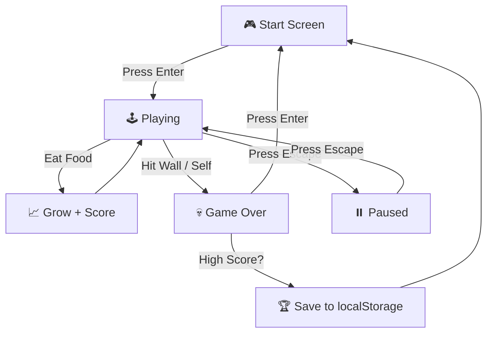

# Idea Summary

> Idea ID: IDEA-037
> Folder: wf-009-test-greedy-snake
> Version: v1
> Created: 2026-03-31
> Status: Refined

## Overview

A classic **Greedy Snake** browser game built with pure JavaScript and HTML5 Canvas. The player controls a snake on a grid, eating food to grow longer while avoiding walls and self-collision. Features score tracking, increasing difficulty, game state management, and local high-score persistence.

## Problem Statement

Build a fully playable Greedy Snake game as a self-contained web application. The game should demonstrate classic Snake mechanics with a clean, modern presentation — no external dependencies or backend required.

## Target Users

- Casual gamers looking for a quick browser game
- Developers learning HTML5 Canvas game patterns
- Anyone testing X-IPE workflow capabilities (this is a workflow test project)

## Proposed Solution

A single-page HTML5 application using the Canvas API for rendering and pure JavaScript for game logic. The game runs entirely client-side with localStorage for high-score persistence.

### Technical Approach

- **Rendering:** HTML5 Canvas 2D context
- **Game Loop:** `requestAnimationFrame` with fixed-timestep updates
- **Input:** Keyboard arrow keys
- **State:** In-memory game state with localStorage for scores
- **Packaging:** Single HTML file or minimal file set (HTML + JS + CSS)

## Key Features



### Core Mechanics

| Feature | Description |
|---------|-------------|
| **Grid Movement** | Snake moves on a 20×20 discrete grid, one cell per tick |
| **Food Eating** | Food spawns randomly (avoiding snake body); eating grows the snake by 1 segment |
| **Collision Detection** | Game over on wall collision or self-collision |
| **Score Tracking** | +10 points per food item; displayed during gameplay |
| **Difficulty Ramp** | Speed increases by 10% every 5 food items eaten |
| **Game States** | Start Screen → Playing → Paused → Game Over → Restart |
| **High Score** | Top scores persisted via `localStorage` |

### Visual Design

| Property | Value |
|----------|-------|
| Grid Size | 20 × 20 cells |
| Cell Size | 25px × 25px |
| Canvas | 500px × 500px |
| Snake Body | Green (#4CAF50) |
| Snake Head | Dark Green (#2E7D32) with distinct styling |
| Food | Red (#F44336) circle |
| Background | Dark (#1a1a2e) |
| Grid Lines | Subtle (#16213e) |

## System Architecture

```architecture-dsl
@startuml module-view
title "Greedy Snake — Module Architecture"
theme "theme-default"
direction top-to-bottom
grid 12 x 6

layer "Presentation Layer" {
  color "#E3F2FD"
  border-color "#1565C0"
  rows 2

  module "Rendering" {
    cols 6
    rows 2
    grid 2 x 2
    align center center
    gap 8px
    component "Canvas\nRenderer" { cols 1, rows 1 }
    component "UI\nOverlay" { cols 1, rows 1 }
    component "Score\nDisplay" { cols 1, rows 1 }
    component "Start/Game Over\nScreen" { cols 1, rows 1 }
  }

  module "Input" {
    cols 6
    rows 2
    grid 2 x 1
    align center center
    gap 8px
    component "Keyboard\nHandler" { cols 1, rows 1 }
    component "Direction\nQueue" { cols 1, rows 1 }
  }
}

layer "Game Logic Layer" {
  color "#E8F5E9"
  border-color "#2E7D32"
  rows 2

  module "Core Engine" {
    cols 8
    rows 2
    grid 3 x 2
    align center center
    gap 8px
    component "Game Loop" { cols 1, rows 1 }
    component "Snake\nController" { cols 1, rows 1 }
    component "Collision\nDetector" { cols 1, rows 1 }
    component "Food\nSpawner" { cols 1, rows 1 }
    component "Score\nManager" { cols 1, rows 1 }
    component "Difficulty\nManager" { cols 1, rows 1 }
  }

  module "State" {
    cols 4
    rows 2
    grid 2 x 1
    align center center
    gap 8px
    component "Game State\nMachine" { cols 1, rows 1 }
    component "Config" { cols 1, rows 1 }
  }
}

layer "Data Layer" {
  color "#FFF3E0"
  border-color "#E65100"
  rows 2

  module "Persistence" {
    cols 6
    rows 2
    grid 2 x 1
    align center center
    gap 8px
    component "localStorage\nAdapter" { cols 1, rows 1 }
    component "High Score\nStore" { cols 1, rows 1 }
  }

  module "Models" {
    cols 6
    rows 2
    grid 2 x 1
    align center center
    gap 8px
    component "Snake\nModel" { cols 1, rows 1 }
    component "Grid\nModel" { cols 1, rows 1 }
  }
}

@enduml
```

## Success Criteria

- [ ] Snake moves smoothly on a 20×20 grid with arrow key controls
- [ ] Food spawns randomly, avoiding snake body positions
- [ ] Snake grows by 1 segment per food eaten, score increments by 10
- [ ] Game ends on wall collision or self-collision
- [ ] Speed increases by 10% every 5 food items
- [ ] Game states work: Start → Play → Pause → Game Over → Restart
- [ ] High scores persist across browser sessions via localStorage
- [ ] Game runs in any modern browser with no external dependencies

## Constraints & Considerations

- **No external dependencies** — Pure JS + HTML5 Canvas only
- **Single-page delivery** — Ideally a single HTML file or minimal file set
- **Browser compatibility** — Modern browsers (Chrome, Firefox, Safari, Edge)
- **No backend** — Fully client-side application
- **Performance** — Smooth 60fps rendering on the 500×500 canvas

## Brainstorming Notes

- The idea started as a minimal one-liner: "create a greedy snake"
- Expanded through research on classic Snake game mechanics (origin: Blockade 1976, popularized by Nokia 1998)
- Key design decisions: wall-death mode (classic), grid-based movement, localStorage for persistence
- Deferred features: mobile/touch controls, sound effects, power-ups, obstacles
- This is a **workflow test project** — intended to validate the X-IPE engineering workflow end-to-end

## Ideation Artifacts (If Tools Used)

- Game state flow: Mermaid flowchart (embedded above)
- System architecture: Architecture DSL module view (embedded above)

## Source Files

- [new idea.md](x-ipe-docs/ideas/wf-009-test-greedy-snake/new idea.md) — Original idea input

## Next Steps

- [ ] Proceed to Requirement Gathering (recommended — idea is clear and implementation-ready)
- [ ] Optionally create a visual mockup of the game UI
- [ ] Optionally create a detailed architecture diagram

## References & Common Principles

### Applied Principles

- **Game Loop Pattern:** Standard requestAnimationFrame loop with fixed-timestep updates — [MDN Game Development](https://developer.mozilla.org/en-US/docs/Games/Tutorials/2D_Breakout_game_pure_JavaScript)
- **Grid-Based Movement:** Snake moves on a discrete grid for predictable gameplay — [Wikipedia: Snake (video game genre)](https://en.wikipedia.org/wiki/Snake_(video_game_genre))
- **Progressive Difficulty:** Speed ramp maintains engagement without overwhelming the player
- **State Machine Pattern:** Explicit game states prevent invalid transitions and simplify UI logic

### Further Reading

- [Wikipedia: Snake (video game genre)](https://en.wikipedia.org/wiki/Snake_(video_game_genre)) — History and mechanics overview
- [MDN: 2D Game Development](https://developer.mozilla.org/en-US/docs/Games/Tutorials/2D_Breakout_game_pure_JavaScript) — Canvas game development fundamentals
