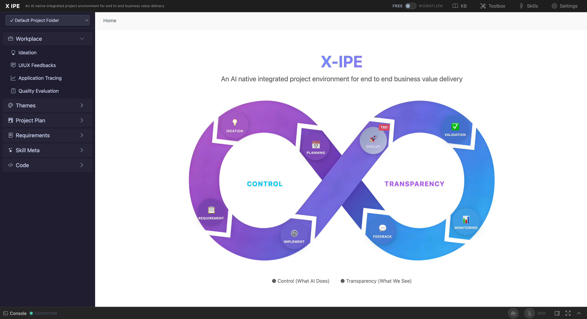

# 2. Installation & Setup

## Instructions

This section covers everything needed to install and run X-IPE so you can access the Ideation feature. Since Ideation is an integrated module of the X-IPE web application, installation covers the entire platform.

## Content

### Prerequisites

| Requirement | Version | Notes |
|-------------|---------|-------|
| Python | 3.11+ | Required for the Flask backend |
| Node.js | 18+ | Required for frontend test tooling (optional for running) |
| uv | Latest | Python package manager (recommended) |
| Git | 2.30+ | For cloning the repository |
| Modern Browser | Chrome, Firefox, Safari, Edge | For accessing the web UI |

### Installation

1. **Clone the repository:**

```bash
git clone https://github.com/user/X-IPE.git
cd X-IPE
```

2. **Install Python dependencies using uv:**

```bash
uv sync
```

Alternatively, using pip:

```bash
pip install -e .
```

3. **Install Node.js dependencies (optional, for frontend tests):**

```bash
npm install
```

### Running the Application

Start the X-IPE server:

```bash
python main.py
```

Or using uv:

```bash
uv run python main.py
```

The application starts on **http://127.0.0.1:5858/** by default.

### Initial Configuration

X-IPE works out of the box with sensible defaults. The Ideation feature requires no special configuration beyond starting the server. Key configuration options:

- **Project Folder:** The default project folder is the repository root. You can configure additional project folders via Settings (gear icon in the top-right header)
- **Ideas Storage:** Ideas are stored in `x-ipe-docs/ideas/` within the active project folder. This directory is created automatically on first use
- **Ideation Toolbox:** Tools available during ideation (Mermaid diagrams, infographics, architecture DSL, mockups) are configured in `x-ipe-docs/ideas/.ideation-tools.json`

### Verification

1. Open your browser and navigate to **http://127.0.0.1:5858/**
2. You should see the X-IPE homepage with the infinity-loop development lifecycle diagram
3. In the left sidebar, click **"Ideation"** under the **Workplace** section
4. The Ideation workspace should display with a sidebar showing idea folders and a welcome message: *"Hover sidebar to browse ideas, or click pin to keep it open"*

If the sidebar shows idea folders (even if empty), the Ideation feature is working correctly.

### Browser Requirements

- **Supported Browsers:** Chrome 90+, Firefox 88+, Safari 15+, Edge 90+
- **Required Features:** JavaScript enabled, cookies enabled (for session management)
- **Recommended Resolution:** 1280×720 or higher
- **Responsive:** The application is designed for desktop browsers; mobile support is limited

## Screenshots


