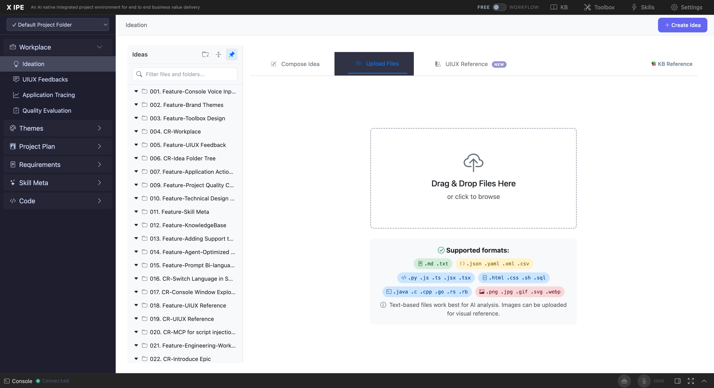

# 3. Getting Started

## Instructions

This section guides you through your first interaction with X-IPE Ideation — from navigating to the workspace to creating and viewing your first idea.

## Content

### Quick Start (Under 5 Minutes)

1. Open your browser to **http://127.0.0.1:5858/**
2. In the left sidebar, click **"Ideation"** under the Workplace section
3. Click the **"✨ Create Idea"** button at the top of the workspace
4. In the **Compose Idea** tab, type your idea using Markdown formatting
5. Click **"Submit Idea"** — your idea is saved as a new folder with a draft name

That's it! Your first idea is captured and visible in the sidebar.

### Basic Workflow

The Ideation workspace has three main areas:

| Area | Location | Purpose |
|------|----------|---------|
| **Ideas Sidebar** | Left panel | Browse, search, and manage idea folders and files |
| **Content Area** | Center/right | View idea content (preview or edit mode) |
| **Console** | Bottom panel | Interact with AI agents for idea refinement |

**Navigation flow:**
1. **Sidebar** — Click an idea folder to expand it and see its files
2. **File click** — Click a file (e.g., `idea-summary-v1.md`) to view it in the content area
3. **Edit** — Click the ✏️ Edit button to switch to edit mode with the Markdown toolbar
4. **Console** — Toggle the console at the bottom to interact with AI agents

### Your First Idea: Step-by-Step Tutorial

#### Step 1: Navigate to Ideation

Click **"Ideation"** in the left sidebar. The Ideation workspace opens, showing:
- A **"✨ Create Idea"** button at the top
- An **Ideas** sidebar panel with existing idea folders (or empty if this is a fresh install)
- A **search box** at the top of the sidebar
- Folder management buttons: 📁 Create folder, 📂 Collapse all, 📌 Pin/unpin sidebar

#### Step 2: Create a New Idea

Click **"✨ Create Idea"**. A creation panel opens with three tabs:

- **📝 Compose Idea** — Write your idea directly in a Markdown editor
- **📁 Upload Files** — Drag-and-drop or browse to upload files
- **🎨 UIUX Reference** — Capture design references from a live web page

Select the **Compose Idea** tab (default). You'll see:
- A full Markdown toolbar (Bold, Italic, Heading, Quote, Lists, Link, Code, Preview, Side-by-side)
- A text area with placeholder: *"Write your idea here..."*
- A word/line counter at the bottom
- A **"Submit Idea"** button

#### Step 3: Write Your Idea

Type your idea using Markdown. For example:

```markdown
# Smart Shopping List App

## Problem
People forget what they need to buy and end up with duplicate items.

## Solution
A mobile-friendly web app that:
- Tracks shopping items by category
- Suggests items based on purchase history
- Shares lists with family members

## Target Users
- Busy families
- Roommates sharing household supplies
```

**Tip:** Use Markdown formatting for structure. The AI agent will use these sections to create a comprehensive idea summary.

#### Step 4: Submit

Click **"Submit Idea"**. X-IPE will:
1. Create a new idea folder named `Draft Idea - {timestamp}` (e.g., "Draft Idea - 03172026 155640")
2. Save your Markdown content as `new idea.md` inside the folder
3. The new folder appears in the sidebar

#### Step 5: View Your Idea

Click on your new folder in the sidebar to expand it. Click on `new idea.md` to view the rendered Markdown in the content area. You'll see:
- The file path at the top (e.g., `x-ipe-docs/ideas/Draft Idea - 03172026 155640/new idea.md`)
- Action buttons: 📋 Copy URL, ✏️ Edit, 🤖 Copilot
- Your idea rendered with proper Markdown formatting

#### Step 6: Refine with AI (Optional)

To have an AI agent refine your idea into a structured summary:
1. Open the **Console** (click "Console" at the bottom of the screen or the terminal toggle button)
2. Type a command like: `ideate` or `brainstorm` or describe what you want
3. The AI agent will analyze your raw idea, ask clarifying questions, and generate a structured **Idea Summary** (saved as `idea-summary-v1.md`)

The generated summary includes: Overview, Problem Statement, Target Users, Proposed Solution, Key Features, User Workflow (with Mermaid flowchart), Architecture, Success Criteria, and Implementation Roadmap.

### What's Next?

After creating your first idea, you can:
- **Upload additional files** — Reference documents, images, sketches
- **Capture UIUX references** — Pull design inspiration from live websites
- **Refine the idea** — Use AI to generate structured summaries
- **Create mockups** — Generate UI/UX mockups from refined ideas
- **Start a workflow** — Switch to Workflow mode to progress through the full engineering pipeline

## Screenshots




