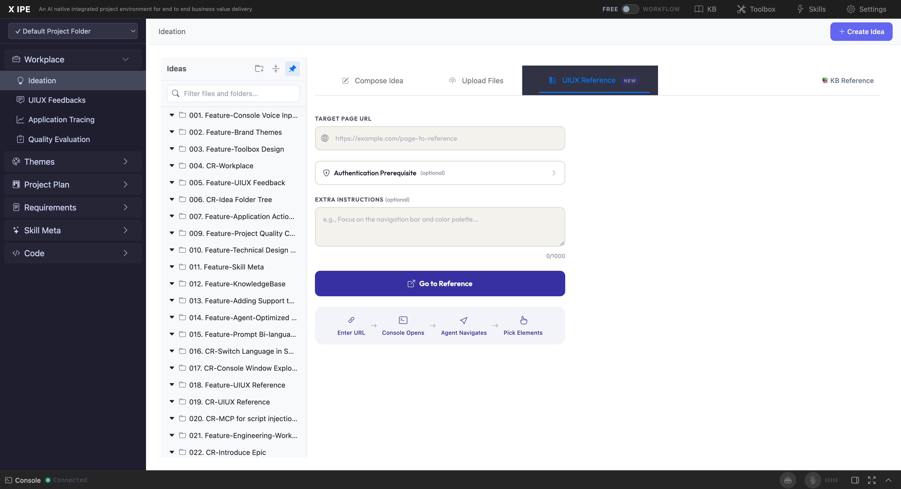
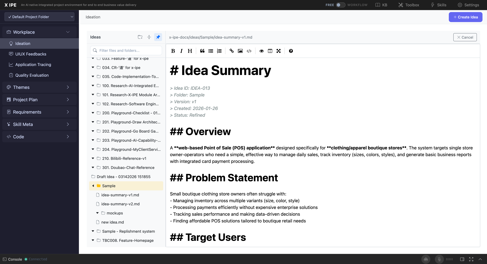

# 4. Core Features

## Instructions

This section provides an in-depth reference for each feature of the X-IPE Ideation module. It is the most critical section of the manual and covers every user-facing capability.

## Content

### 4.1 Ideas Sidebar

The Ideas Sidebar is your primary navigation panel for managing idea folders and files.

**Location:** Left side of the Ideation workspace

**Features:**

| Feature | Description | How to Use |
|---------|-------------|------------|
| **Folder Tree** | Hierarchical display of all idea folders and their files | Click a folder name to expand/collapse |
| **Search** | Filter ideas by name | Type in the search box at the top of the sidebar |
| **Create Folder** | Create a new empty folder | Click the 📁 icon at the top of the sidebar |
| **Collapse All** | Collapse all expanded folders | Click the 📂 collapse icon |
| **Pin/Unpin** | Keep the sidebar permanently visible | Click the 📌 pin icon |
| **Hover Reveal** | Sidebar appears when hovering on the left edge | Move mouse to the left edge (when unpinned) |

**Folder Context Actions** (right-click or action buttons on a folder):
- **Add to** — Upload or move files into this folder
- **Rename** — Change the folder name
- **Enter View** — Navigate into the folder to view its contents
- **Duplicate** — Create a copy of the folder with all contents
- **Move** — Move the folder to a different location (via drag-and-drop)
- **Delete** — Remove the folder and all its contents (with confirmation)

**File Context Actions** (right-click or action buttons on a file):
- **Download** — Download the file to your local computer
- **Rename** — Change the file name
- **Delete** — Remove the file (with confirmation)

**Sidebar Behavior:**
- Folders are sorted alphabetically
- The sidebar scrolls independently of the content area
- Active (currently viewed) items are highlighted
- File sizes and types are displayed alongside file names

---

### 4.2 Compose Idea

The **Compose Idea** feature lets you write ideas directly in a rich Markdown editor.

**Access:** Click **"✨ Create Idea"** → Select the **"📝 Compose Idea"** tab

**Editor Features:**

The compose editor is based on SimpleMDE and provides a full formatting toolbar:

| Button | Function | Keyboard Shortcut |
|--------|----------|-------------------|
| **B** | Bold | Ctrl+B |
| *I* | Italic | Ctrl+I |
| **H** | Heading (toggles H1/H2/H3) | — |
| **"** | Block Quote | — |
| **UL** | Unordered List (bullets) | — |
| **OL** | Ordered List (numbers) | — |
| **🔗** | Insert Link | — |
| **🖼** | Insert Image | — |
| **<>** | Code Block | — |
| **👁** | Preview (renders Markdown) | — |
| **⟺** | Side-by-Side (edit + preview) | — |
| **⛶** | Fullscreen editor | — |

**Compose Workflow:**
1. Type your idea in the editor — use Markdown for structure (headings, lists, code blocks)
2. Use the **Preview** button to see rendered output
3. Use **Side-by-Side** mode to edit and preview simultaneously
4. Click **"Submit Idea"** to save

**After Submission:**
- A new folder is created with the name `Draft Idea - {MMDDYYYY HHMMSS}`
- Your content is saved as `new idea.md` inside the folder
- The folder appears in the sidebar

**📚 KB Reference Button:**
At the top of the compose editor, there is a **"📚 KB Reference"** button. This opens a panel where you can browse the Knowledge Base and attach references to your idea. KB references provide additional context that AI agents use during idea refinement.

**Tips:**
- Use Markdown headings (`## Problem`, `## Solution`, `## Target Users`) to structure your idea — AI agents parse these sections during refinement
- Include concrete examples, user stories, or acceptance criteria for better AI refinement results
- Paste code snippets in fenced code blocks for technical ideas

---

### 4.3 Upload Files

Upload existing documents, images, and code files into an idea folder.

**Access:** Click **"✨ Create Idea"** → Select the **"📁 Upload Files"** tab

**Upload Methods:**
1. **Drag and Drop** — Drag files from your file manager into the upload area
2. **Browse** — Click the upload area to open a file browser

**Supported File Formats:**

| Category | Extensions |
|----------|-----------|
| **Text** | `.md`, `.txt` |
| **Data** | `.json`, `.yaml`, `.xml`, `.csv` |
| **Code** | `.py`, `.js`, `.ts`, `.jsx`, `.tsx`, `.html`, `.css`, `.sh`, `.sql`, `.java`, `.c`, `.cpp`, `.go`, `.rs`, `.rb` |
| **Images** | `.png`, `.jpg`, `.gif`, `.svg`, `.webp` |
| **Documents** | `.docx`, `.msg` (auto-converted to HTML for preview) |

**File Conversion:**
- **DOCX files** are automatically converted to HTML using Mammoth.js for in-browser preview
- **MSG files** (Outlook emails) are automatically converted to HTML for preview
- Original files are preserved alongside the converted versions

**Upload Behavior:**
- Multiple files can be uploaded at once
- A new folder is created automatically when uploading via the Create Idea modal
- Files uploaded to an existing folder are added to that folder
- Duplicate filenames are handled with suffix numbering: `file.md`, `file (2).md`, `file (3).md`
- Maximum folder name length: 200 characters

---

### 4.4 UIUX Reference

Capture design elements and visual references from live web pages directly into your idea folder.

**Access:** Click **"✨ Create Idea"** → Select the **"🎨 UIUX Reference"** tab

**How It Works:**

1. **Enter Target URL** — Paste the URL of the web page you want to reference
2. **Authenticate (if needed)** — If the target site requires login, X-IPE guides you through authentication first. The UIUX reference tab shows: *"Before using UIUX Reference features, please login to the target website using the Authentication feature."*
3. **Capture Elements** — The tool captures:
   - Color palettes extracted from the page
   - UI element structures (HTML/CSS)
   - Design tokens (fonts, spacing, colors)
   - Page screenshots
4. **Save to Idea** — Captured references are saved into a `page-element-references/` subfolder within your idea folder

**Output Structure:**
```
idea-folder/
├── page-element-references/
│   ├── resources/
│   │   ├── {element-id}-structure.html    (Component HTML)
│   │   └── {element-id}-styles.css        (Computed CSS)
│   ├── summarized-uiux-reference.md       (Colors, fonts, resource summary)
│   └── mimic-strategy.md                  (6-dimension validation rubric)
```

**Use Cases:**
- Capturing design inspiration from competitor websites
- Documenting existing UI patterns for redesign projects
- Creating visual references for AI-generated mockups

---

### 4.5 Idea Detail View

View and interact with idea content in the main content area.

**Access:** Click any file in the sidebar to open it in the content area

**View Mode Features:**

| Element | Description |
|---------|-------------|
| **File Path** | Shows the full path to the current file (e.g., `x-ipe-docs/ideas/My Idea/summary.md`) |
| **Copy URL** | 📋 button — Copies a shareable URL for this file to the clipboard |
| **Edit Button** | ✏️ button — Switches to edit mode |
| **Copilot Actions** | 🤖 button — Opens context-aware AI actions for this file |
| **Rendered Content** | Full Markdown rendering with rich features |

**Supported Rendering:**

The content area renders Markdown with extensive feature support:

- **Standard Markdown** — Headings, bold, italic, lists, links, code blocks, tables, blockquotes
- **Mermaid Diagrams** — Flowcharts, sequence diagrams, class diagrams, Gantt charts, pie charts
  ```mermaid
  graph TD
    A[Start] --> B[Process]
    B --> C[End]
  ```
- **Architecture DSL** — X-IPE's proprietary architecture diagram format rendered as interactive SVG
- **Infographics** — Custom infographic blocks rendered with visual styling
- **Syntax-Highlighted Code** — Code blocks with language-specific highlighting
- **Images** — Inline and referenced images rendered from the idea folder
- **Tables** — GitHub-flavored Markdown tables with alignment support

**Navigation:**
- Use the browser's back/forward buttons to navigate between previously viewed files
- The sidebar highlights the currently active file
- Long documents scroll with the main content area

---

### 4.6 Edit Mode

Edit idea content directly in the browser using a full-featured Markdown editor.

**Access:** Click the ✏️ **Edit** button in the idea detail view

**Editor Features:**
- **SimpleMDE Toolbar** — Full formatting toolbar (same as Compose editor): Bold, Italic, Heading, Quote, Unordered List, Ordered List, Link, Image, Code, Preview, Side-by-Side, Fullscreen
- **Live Preview** — Toggle preview mode to see rendered Markdown
- **Side-by-Side** — Split view with editor on the left and rendered preview on the right
- **Syntax Highlighting** — Markdown syntax is color-coded in the editor
- **Auto-save** — Content is preserved while editing (saved on explicit action)
- **Word/Line Count** — Displayed at the bottom of the editor

**Saving Changes:**
- Click **"💾 Save"** to save your changes
- Click **"Cancel"** to discard changes and return to view mode
- Saving overwrites the current file content

**Tips:**
- Use **Side-by-Side** mode for the best editing experience
- The editor supports pasting images from clipboard (stored as base64 inline)
- Mermaid diagrams and Architecture DSL blocks are rendered in preview mode

---

### 4.7 Knowledge Base References

Link existing Knowledge Base articles to your ideas for richer context.

**Access:** Click the **"📚 KB Reference"** button in the Compose Idea editor or via the idea folder's toolbox

**How It Works:**

1. Click **"📚 KB Reference"** — A panel opens showing available KB articles
2. Browse or search for relevant articles
3. Select articles to attach as references
4. References are saved in `.knowledge-reference.yaml` within the idea folder

**KB Reference File Format:**
```yaml
# .knowledge-reference.yaml
references:
  - article_id: "kb-article-001"
    title: "API Design Patterns"
    path: "x-ipe-docs/knowledge-base/articles/api-patterns.md"
  - article_id: "kb-article-002"
    title: "Authentication Best Practices"
    path: "x-ipe-docs/knowledge-base/articles/auth-best-practices.md"
```

**Why Use KB References?**
- AI agents consult KB references during idea refinement for better context
- Links ideas to existing organizational knowledge
- Ensures consistency across related ideas and projects

---

### 4.8 Copilot Actions

Context-aware AI actions available on idea files.

**Access:** Click the **"🤖 Copilot Actions"** button in the idea detail view

**Available Actions:**
The Copilot Actions button provides AI-powered operations based on the current file context. Actions are contextually determined — different file types and idea states surface different options.

**Common Actions:**
- **Refine Idea** — AI analyzes the raw idea and generates a structured summary
- **Generate Mockup** — Create UI mockup from the refined idea
- **Create Architecture** — Generate architecture diagrams from the idea
- **Brainstorm** — AI-assisted brainstorming session
- **Share Idea** — Convert the idea to shareable formats (PPTX, PDF)

**How It Works:**
1. Click **"🤖 Copilot Actions"**
2. Select an action from the dropdown
3. The action is routed to the Console where an AI agent executes it
4. Results are saved back to the idea folder (e.g., mockups go to `mockups/`, architecture to the folder root)

---

### 4.9 Folder Management

Advanced folder operations for organizing your ideas.

**Create a New Folder:**
1. Click the 📁 **Create Folder** button in the sidebar header
2. Enter a folder name in the dialog
3. The new folder appears in the sidebar

**Rename a Folder:**
1. Right-click or use the action button on a folder
2. Select **"Rename"**
3. Enter the new name and confirm

**Folder Naming Rules:**
- Maximum 200 characters
- Cannot contain: `/ \ : * ? " < > |`
- Cannot start or end with spaces or dots
- Must be unique within the parent directory

**Move a Folder:**
- Drag the folder in the sidebar and drop it onto another folder to move it inside
- Drop targets are validated — you cannot create circular references

**Duplicate a Folder:**
- Right-click → **"Duplicate"**
- Creates a copy named `{original}-copy` (or `-copy-2`, `-copy-3` for subsequent copies)
- All files within the folder are duplicated

**Delete a Folder:**
- Right-click → **"Delete"**
- A confirmation dialog shows what will be deleted (folder name, file count, subfolder count)
- Deletion is permanent — there is no recycle bin

---

### 4.10 Search

Find ideas quickly across all folders.

**Access:** The search box at the top of the Ideas sidebar

**Search Behavior:**
- Searches folder names and file names
- Results update as you type (filter-as-you-type)
- Matching folders are highlighted; non-matching folders are hidden
- Clear the search box to show all folders

---

### 4.11 Ideation Toolbox

Configure which tools are available during AI-assisted ideation.

**Configuration File:** `x-ipe-docs/ideas/.ideation-tools.json`

**Available Tools:**

| Tool | Description | Default |
|------|-------------|---------|
| **Mermaid Diagrams** | Flowcharts, sequence diagrams, etc. | Enabled |
| **Infographics** | Visual summary blocks | Enabled |
| **Architecture DSL** | Architecture layer diagrams | Enabled |
| **Mockups** | UI/UX mockup generation | Enabled |

**Customization:**
The toolbox JSON file allows you to enable/disable specific tools and configure their parameters. AI agents read this configuration when performing ideation-related actions.

## Screenshots





