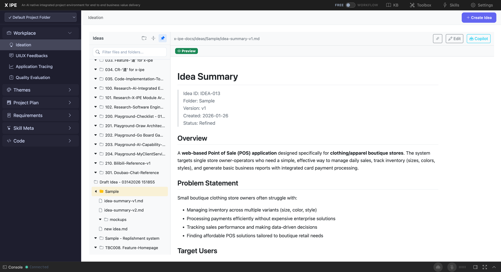
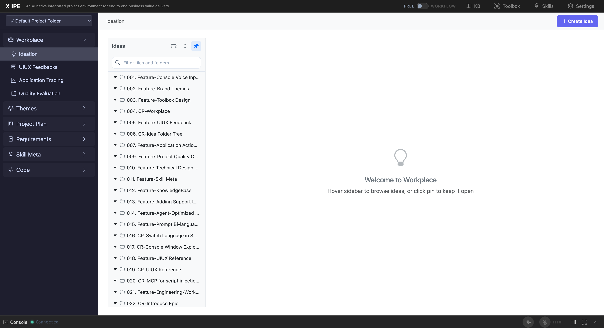

# 5. Common Workflows

## Instructions

This section describes the most common end-to-end workflows users will follow when using X-IPE Ideation, from capturing a raw idea to advancing it through the engineering pipeline.

## Content

### 5.1 Workflow: Create and Refine an Idea (Free Mode)

This is the most common workflow for capturing and developing an idea outside of a formal engineering workflow.

**Steps:**

```
┌─────────────┐    ┌──────────────┐    ┌────────────────┐    ┌──────────────┐
│ 1. Capture   │ →  │ 2. Organize   │ →  │ 3. AI Refine    │ →  │ 4. Review     │
│ (Compose/    │    │ (Rename,      │    │ (Console:       │    │ (Read summary │
│  Upload)     │    │  move)        │    │  "ideate")      │    │  + iterate)   │
└─────────────┘    └──────────────┘    └────────────────┘    └──────────────┘
```

1. **Capture the Raw Idea**
   - Click **"✨ Create Idea"**
   - Choose one of:
     - **Compose** — Write your idea in Markdown
     - **Upload** — Upload documents, images, or code files
     - **UIUX Reference** — Capture design elements from a web page
   - Click **"Submit Idea"**

2. **Organize the Idea Folder**
   - The idea is created with a default name: `Draft Idea - {timestamp}`
   - Rename the folder to something meaningful (right-click → Rename)
   - Add additional files if needed (upload more documents, images)

3. **Refine with AI**
   - Open the Console (bottom panel)
   - Tell the AI agent to refine the idea, e.g.:
     - `"Refine this idea"`
     - `"Brainstorm on this idea"`
     - `"Ideate"`
   - The AI agent will:
     - Read your raw idea files
     - Ask clarifying questions (in auto mode, these are answered by the DAO)
     - Generate a structured **Idea Summary** saved as `idea-summary-v1.md`

4. **Review and Iterate**
   - Open `idea-summary-v1.md` in the content area
   - Review the structured summary (Overview, Problem Statement, Target Users, Solution, Features, Workflow, Architecture, Success Criteria, Roadmap)
   - If changes are needed:
     - Edit the summary directly (Edit button)
     - Or ask the AI to revise specific sections
   - Subsequent refinements create `idea-summary-v2.md`, `v3`, etc.

**Result:** A well-structured idea summary ready for downstream engineering work.

---

### 5.2 Workflow: Idea to Engineering Pipeline (Workflow Mode)

In Workflow Mode, ideas are linked to a formal engineering workflow that progresses through the full X-IPE development lifecycle.

**Steps:**

```
┌──────────┐   ┌──────────┐   ┌──────────┐   ┌──────────┐   ┌──────────┐
│ Compose   │ → │ Refine   │ → │ Mockup   │ → │ Architect│ → │ Require- │
│ Idea      │   │ Idea     │   │          │   │ ure      │   │ ments    │
└──────────┘   └──────────┘   └──────────┘   └──────────┘   └──────────┘
     ↓              ↓              ↓              ↓              ↓
  ┌──────────┐   ┌──────────┐   ┌──────────┐   ┌──────────┐   ┌──────────┐
  │ Feature  │ → │ Technical│ → │ Code     │ → │ Accept-  │ → │ Feature  │
  │ Breakdown│   │ Design   │   │ Implement│   │ ance Test│   │ Closing  │
  └──────────┘   └──────────┘   └──────────┘   └──────────┘   └──────────┘
```

1. **Create a Workflow** — Start a new engineering workflow in the Workflow section
2. **Compose Idea** — The workflow's first action is `compose_idea`
   - An idea folder is auto-created with the naming pattern: `wf-{NNN}-{sanitized-workflow-name}`
   - Example: `wf-001-smart-shopping-list`
3. **Link Files** — Upload or compose content into the workflow-linked idea folder
4. **Progress through Stages** — Each workflow stage is gated by the previous one:
   - **Ideation Stage:** compose_idea → idea_mockup → idea_architecture
   - **Requirements Stage:** requirement_gathering → feature_breakdown → feature_refinement
   - **Design Stage:** technical_design
   - **Implementation Stage:** code_implementation → acceptance_test
   - **Delivery Stage:** human_playground → feature_closing

**Workflow-Linked Folder Features:**
- The idea folder is automatically linked to the workflow
- Deliverables from each stage are saved into the idea folder
- The workflow tracks completion status of each action
- You can view workflow progress from the Workflow section

---

### 5.3 Workflow: Research and Reference Collection

Collect research materials, design references, and supporting documents for a complex idea.

**Steps:**

1. **Create a Base Idea Folder**
   - Create a new idea via Compose or Upload
   - Rename the folder to your project name

2. **Upload Research Materials**
   - Click the folder's **"Add to"** action
   - Upload documents (.docx, .pdf, .md), images, data files
   - Each file is stored in the idea folder

3. **Capture UIUX References**
   - Click **"✨ Create Idea"** → **UIUX Reference** tab
   - Enter the URL of a reference website
   - Capture color palettes, UI elements, and design tokens
   - References are saved in `page-element-references/` subfolder

4. **Attach KB Articles**
   - Open the idea in edit mode
   - Click **"📚 KB Reference"**
   - Browse and select relevant Knowledge Base articles
   - References are stored in `.knowledge-reference.yaml`

5. **Create Sub-Folders** (optional)
   - Create sub-folders within the idea for organization:
     - `research/` — Articles, competitor analysis
     - `design-refs/` — UIUX references, screenshots
     - `notes/` — Meeting notes, brainstorm outputs

**Result:** A comprehensive research folder that AI agents can analyze during refinement.

---

### 5.4 Workflow: Idea Enrichment with Mockups and Architecture

After an idea is refined, enrich it with visual artifacts.

**Steps:**

1. **Start with a Refined Idea** — Ensure `idea-summary-vN.md` exists in the idea folder

2. **Generate a Mockup**
   - Click **"🤖 Copilot Actions"** → **"Create Mockup"**
   - Or use the Console: `"create mockup for this idea"`
   - The AI generates a UI mockup saved in `mockups/` subfolder
   - Mockups are HTML files that can be previewed in the browser

3. **Generate Architecture Diagrams**
   - Click **"🤖 Copilot Actions"** → **"Create Architecture"**
   - Or use the Console: `"create architecture for this idea"`
   - The AI generates architecture diagrams using:
     - **Module View** — Layered architecture with components
     - **Landscape View** — Application ecosystem overview
   - Diagrams are saved as Architecture DSL files in the idea folder

4. **Review Visual Artifacts**
   - Click on mockup or architecture files in the sidebar to preview them
   - Architecture DSL files render as interactive SVG diagrams
   - Mockup HTML files render in a preview panel

**Result:** A visually enriched idea with mockups and architecture diagrams, ready for requirements gathering.

---

### 5.5 Workflow: Sharing an Idea

Convert a refined idea into formats suitable for sharing with stakeholders.

**Steps:**

1. **Ensure Idea is Refined** — An `idea-summary-vN.md` should exist
2. **Share via Copilot Actions:**
   - Click **"🤖 Copilot Actions"** → **"Share Idea"**
   - Or use the Console: `"share this idea as a presentation"`
3. **Choose Format:**
   - **PPTX** — PowerPoint presentation
   - **PDF** — Portable Document Format
   - **DOCX** — Word document
4. **Download** — The generated file is saved and can be downloaded

**Alternative: Manual Copy**
- Open the idea summary in view mode
- Use the **"📋 Copy URL"** button to share a link
- Or copy the rendered content directly

---

### 5.6 Workflow: Managing Multiple Ideas

Organize and manage a portfolio of ideas.

**Folder Organization Tips:**
- Use descriptive folder names (not default timestamps)
- Create category folders and move ideas into them (e.g., `Mobile Apps/`, `Internal Tools/`, `Research/`)
- Use search to quickly find ideas by name
- Pin the sidebar to always have access to the folder tree

**Bulk Operations:**
- Drag-and-drop to rearrange folders
- Duplicate ideas to create variations
- Delete obsolete ideas to keep the workspace clean

**Version Tracking:**
- AI-generated summaries are versioned: `idea-summary-v1.md`, `idea-summary-v2.md`, etc.
- Previous versions are preserved — you can view any version by clicking it in the sidebar
- Compare versions by opening them side-by-side (use the browser's tab feature)

## Screenshots



