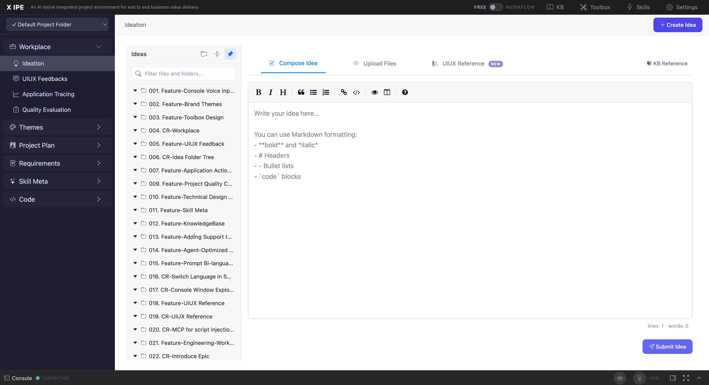

# Appendix A: Navigation & UI Structure

## Instructions

This appendix provides a visual guide to the X-IPE Ideation user interface, covering the layout, navigation elements, and interactive components.

## Content

### Application Layout

The X-IPE Ideation workspace uses a multi-panel layout:

```
┌──────────────────────────────────────────────────────────────┐
│  ⚙️ Header: Logo | Navigation Tabs | Settings               │
├────────────────┬─────────────────────────────────────────────┤
│                │                                             │
│  Left Sidebar  │         Main Content Area                   │
│                │                                             │
│  ┌──────────┐  │  ┌─────────────────────────────────────┐   │
│  │ Workplace │  │  │  File Path Breadcrumb                │   │
│  │  ├ Ideation│  │  │  [Copy URL] [Edit] [Copilot]       │   │
│  │  ├ Workflow│  │  │                                     │   │
│  │  └ ...    │  │  │  ┌─────────────────────────────┐   │   │
│  └──────────┘  │  │  │  Rendered Content             │   │   │
│                │  │  │  (Markdown, Diagrams, etc.)   │   │   │
│  ┌──────────┐  │  │  │                               │   │   │
│  │ Ideas     │  │  │  └─────────────────────────────┘   │   │
│  │ Sidebar   │  │  └─────────────────────────────────────┘   │
│  │           │  │                                             │
│  │ 🔍 Search │  ├─────────────────────────────────────────────┤
│  │ 📁 + 📂 📌│  │  Console (AI Agent Interaction)             │
│  │           │  │  [Input field] [Send]                       │
│  │ > Folder 1│  │                                             │
│  │ > Folder 2│  └─────────────────────────────────────────────┘
│  │ > Folder 3│
│  └──────────┘
└──────────────────────────────────────────────────────────────┘
```

### Navigation Elements

| Element | Location | Description |
|---------|----------|-------------|
| **Workspace Sidebar** | Far left | Top-level navigation: Ideation, Workflow, Settings |
| **Ideas Sidebar** | Left panel (within Ideation) | Folder tree with search, pin, collapse controls |
| **Content Area** | Center/right | Displays file content in view or edit mode |
| **Console** | Bottom panel (toggleable) | AI agent interaction area |
| **Header** | Top | Logo, navigation tabs, settings gear icon |

### Interactive Elements

**Sidebar Controls:**
- **🔍 Search box** — Filter folders/files by name (type to filter, results update live)
- **📁 Create folder** — Creates a new empty folder
- **📂 Collapse all** — Collapses all expanded folder nodes
- **📌 Pin** — Locks the sidebar open (by default it auto-hides)

**Folder Node:**
- **Click** → Expand/collapse folder
- **Action buttons** (visible on hover):
  - **Add to** — Upload/add files to this folder
  - **Rename** — Rename the folder
  - **Enter View** — Navigate into the folder

**File Node:**
- **Click** → Open file in content area
- **Action buttons** (visible on hover):
  - **⬇️ Download** — Download to local machine
  - **✏️ Rename** — Rename the file
  - **🗑️ Delete** — Delete the file

**Content Area Actions:**
- **📋 Copy URL** — Copy a shareable link to the clipboard
- **✏️ Edit** — Switch to edit mode
- **🤖 Copilot Actions** — Open AI-powered actions menu
- **💾 Save** (edit mode) — Save changes
- **Cancel** (edit mode) — Discard changes

### Create Idea Modal

The Create Idea modal has three tabs:

| Tab | Icon | Purpose |
|-----|------|---------|
| **Compose Idea** | 📝 | Write idea in Markdown editor |
| **Upload Files** | 📁 | Drag-and-drop file upload |
| **UIUX Reference** | 🎨 | Capture web page design elements |

Each tab has its own Submit/Create button at the bottom.

## Screenshots




