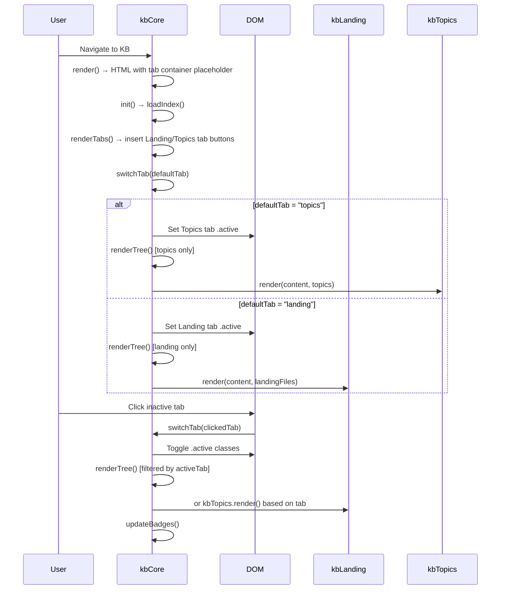

# Technical Design: KB Navigation & Polish

> Feature ID: FEATURE-025-F | Version: v1.0 | Last Updated: 03-03-2026

## Version History

| Version | Date | Description |
|---------|------|-------------|
| v1.0 | 03-03-2026 | Initial technical design |

---

## Part 1: Agent-Facing Summary

> **Purpose:** Quick reference for AI agents navigating large projects.
> **📌 AI Coders:** Focus on this section for implementation context.

### Scope

| Dimension | Value |
|-----------|-------|
| Program Type | frontend |
| Tech Stack | JavaScript/Vanilla, CSS |
| Feature ID | FEATURE-025-F |
| Files to Create | `src/x_ipe/static/css/kb-nav.css` |
| Files to Modify | `src/x_ipe/static/js/features/kb-core.js`, `src/x_ipe/templates/base.html` |
| Dependencies | FEATURE-025-A (kbCore), FEATURE-025-B (kbLanding), FEATURE-025-D (kbTopics), FEATURE-025-E (kbSearch) |

### Key Components Implemented

| Component | Responsibility | Scope/Impact | Tags |
|-----------|----------------|--------------|------|
| `kbCore.activeTab` | State: tracks current tab ("landing" or "topics") | New property on existing `kbCore` | #kb #nav #state #frontend |
| `kbCore.renderTabs()` | Renders section tabs HTML into sidebar between header and search box | New method on `kbCore` | #kb #nav #tabs #frontend |
| `kbCore.switchTab(tabName)` | Handles tab click: updates state, re-renders tree, switches content view | New method on `kbCore` | #kb #nav #tabs #frontend |
| `kbCore.updateBadges()` | Updates tab badge counts from in-memory index/topics data | New method on `kbCore` | #kb #nav #badges #frontend |
| `kb-nav.css` | CSS for section tabs, badges, active/hover states | New CSS file | #kb #nav #css #tabs |

### Dependencies

| Dependency | Source | Design Link | Usage Description |
|------------|--------|-------------|-------------------|
| `kbCore` | FEATURE-025-A | existing | Main KB controller — owns index, topics, sidebar, content area |
| `kbLanding` | FEATURE-025-B | existing | Landing content view — called via `kbLanding.render(container, files)` |
| `kbTopics` | FEATURE-025-D | existing | Topics content view — called via `kbTopics.render(container, topics)` |
| `kbSearch` | FEATURE-025-E | existing | Search modal + preview panel — unaffected, works across both tabs |
| Bootstrap Icons | External | CDN | `bi-inbox`, `bi-layers` icons for tab labels |

### Key Decisions

1. **Modify `kb-core.js` only** — no new JS file needed. Section tabs are a core navigation concern (~80 lines added, keeping total well under 800-line threshold).
2. **New `kb-nav.css`** — dedicated CSS file for tab styling, keeps `kb-core.css` clean and follows the pattern of feature-specific CSS files (`kb-search.css`, `kb-topics.css`).
3. **No new API endpoints** — badge counts derive from already-loaded `kbCore.index.files` and `kbCore.topics`.
4. **Tab state stored in `kbCore.activeTab`** — simple string property, no localStorage needed (resets to default on page load per BR-4).
5. **`renderWelcome()` replaced by `switchTab()`** — the auto-routing logic is removed in favor of explicit tab-driven rendering.

### Major Flow

1. User navigates to Knowledge Base → `kbCore.render()` outputs sidebar HTML with section tabs between header and search box
2. `kbCore.init()` → loads index + topics → calls `renderTabs()` to insert tab buttons → calls `switchTab(defaultTab)` based on topic availability
3. User clicks a tab → `switchTab(tabName)` sets `activeTab`, updates active CSS class, calls `renderTree()` (filtered) + renders content view
4. File upload/delete → `refreshIndex()` → `updateBadges()` recalculates counts from in-memory data

### Usage Example

```javascript
// In kbCore after loading data:
this.activeTab = this.topics.length > 0 ? 'topics' : 'landing';
this.renderTabs();
this.switchTab(this.activeTab);

// Tab switch handler (bound in renderTabs):
switchTab(tabName) {
    this.activeTab = tabName;
    // Update tab active states
    document.querySelectorAll('.kb-section-tab').forEach(t => {
        t.classList.toggle('active', t.dataset.tab === tabName);
    });
    // Re-render sidebar tree for selected section
    this.renderTree();
    // Switch content view
    const content = document.getElementById('kb-content');
    if (tabName === 'landing') {
        const landing = (this.index?.files || []).filter(f => f.path.startsWith('landing/'));
        kbLanding.render(content, landing);
    } else {
        kbTopics.render(content, this.topics);
    }
    this.updateBadges();
}
```

---

## Part 2: Implementation Guide

> **Purpose:** Human-readable details for developers.
> **📌 Emphasis on visual diagrams for comprehension.**

### Workflow Diagram



### Component Architecture

```
┌──────────────────────────────────────────────────┐
│ kb-sidebar                                        │
│  ┌──────────────────────────────────────────┐    │
│  │ kb-sidebar-header ("Knowledge Base" + ⟳)  │    │
│  ├──────────────────────────────────────────┤    │
│  │ kb-section-tabs                           │    │
│  │  ┌─────────────┐ ┌─────────────────┐     │    │
│  │  │ 📥 Landing 3│ │ 📚 Topics  5    │     │    │
│  │  │   (active)   │ │                 │     │    │
│  │  └─────────────┘ └─────────────────┘     │    │
│  ├──────────────────────────────────────────┤    │
│  │ kb-search-box (Filter files...)           │    │
│  ├──────────────────────────────────────────┤    │
│  │ kb-tree (filtered by activeTab)           │    │
│  │  - Landing: landing/ files only           │    │
│  │  - Topics: topic folders only             │    │
│  └──────────────────────────────────────────┘    │
├──────────────────────────────────────────────────┤
│ kb-content                                        │
│  - Landing tab → kbLanding.render()               │
│  - Topics tab  → kbTopics.render()                │
└──────────────────────────────────────────────────┘
```

### HTML Changes in `kbCore.render()`

Add a `<div id="kb-section-tabs">` placeholder between the sidebar header and search box:

```html
<div class="kb-sidebar pinned" id="kb-sidebar">
    <div class="kb-sidebar-header">
        <span class="kb-sidebar-title">Knowledge Base</span>
        <button class="kb-refresh-btn" id="btn-refresh-index" title="Refresh index">
            <i class="bi bi-arrow-clockwise"></i>
        </button>
    </div>
    <!-- NEW: Section tabs container -->
    <div class="kb-section-tabs" id="kb-section-tabs"></div>
    <div class="kb-search-box">
        <input type="text" class="kb-search-input" id="kb-search" placeholder="Filter files...">
    </div>
    <div class="kb-tree" id="kb-tree">
        <div class="kb-loading"><i class="bi bi-hourglass-split"></i> Loading...</div>
    </div>
</div>
```

### New Methods on `kbCore`

#### `renderTabs()`

Populates `#kb-section-tabs` with two tab buttons. Called once after `loadIndex()`.

```javascript
renderTabs() {
    const container = document.getElementById('kb-section-tabs');
    if (!container) return;

    const landingCount = (this.index?.files || []).filter(f => f.path.startsWith('landing/')).length;
    const topicsCount = this.topics.length;

    container.innerHTML = `
        <button class="kb-section-tab${this.activeTab === 'landing' ? ' active' : ''}" data-tab="landing">
            <i class="bi bi-inbox"></i>
            Landing
            <span class="kb-tab-badge" id="kb-badge-landing">${landingCount}</span>
        </button>
        <button class="kb-section-tab${this.activeTab === 'topics' ? ' active' : ''}" data-tab="topics">
            <i class="bi bi-layers"></i>
            Topics
            <span class="kb-tab-badge" id="kb-badge-topics">${topicsCount}</span>
        </button>
    `;

    container.querySelectorAll('.kb-section-tab').forEach(tab => {
        tab.addEventListener('click', () => this.switchTab(tab.dataset.tab));
    });
}
```

#### `switchTab(tabName)`

Switches active tab, re-renders tree and content view.

```javascript
switchTab(tabName) {
    this.activeTab = tabName;

    // Update tab active states
    document.querySelectorAll('.kb-section-tab').forEach(t => {
        t.classList.toggle('active', t.dataset.tab === tabName);
    });

    // Re-render sidebar tree
    this.renderTree();

    // Switch content view
    const content = document.getElementById('kb-content');
    if (!content) return;

    if (tabName === 'landing') {
        const landing = (this.index?.files || []).filter(f => f.path.startsWith('landing/'));
        if (typeof kbLanding !== 'undefined') {
            kbLanding.render(content, landing);
        }
    } else if (tabName === 'topics') {
        if (typeof kbTopics !== 'undefined') {
            kbTopics.render(content, this.topics);
        }
    }
}
```

#### `updateBadges()`

Updates badge text content without re-rendering tabs.

```javascript
updateBadges() {
    const landingBadge = document.getElementById('kb-badge-landing');
    const topicsBadge = document.getElementById('kb-badge-topics');
    const landingCount = (this.index?.files || []).filter(f => f.path.startsWith('landing/')).length;
    
    if (landingBadge) landingBadge.textContent = landingCount;
    if (topicsBadge) topicsBadge.textContent = this.topics.length;
}
```

### Changes to Existing Methods

#### `renderTree()` — filter by `activeTab`

Replace the current tree rendering logic that shows **both** landing and topic folders with a filtered view:

```javascript
renderTree() {
    const container = document.getElementById('kb-tree');
    if (!container) return;

    const files = this.index?.files || [];
    const filteredFiles = this.searchTerm
        ? files.filter(f =>
            f.name.toLowerCase().includes(this.searchTerm) ||
            f.topic?.toLowerCase().includes(this.searchTerm) ||
            f.keywords?.some(k => k.includes(this.searchTerm))
          )
        : files;

    let html = '';

    if (this.activeTab === 'landing') {
        // Landing tab: show only landing/ files
        const landing = filteredFiles.filter(f => f.path.startsWith('landing/'));
        html += `
            <div class="kb-folder">
                <div class="kb-folder-header" data-folder="landing">
                    <i class="bi bi-chevron-down"></i>
                    <i class="bi bi-inbox text-warning"></i>
                    <span>Landing (${landing.length})</span>
                </div>
                <div class="kb-folder-files">
                    ${landing.map(f => this.renderFileItem(f)).join('')}
                    ${landing.length === 0 ? '<div class="kb-empty">No files</div>' : ''}
                </div>
            </div>
        `;
    } else {
        // Topics tab: show only topic folders
        const byTopic = {};
        filteredFiles.forEach(f => {
            if (f.topic && !f.path.startsWith('landing/')) {
                if (!byTopic[f.topic]) byTopic[f.topic] = [];
                byTopic[f.topic].push(f);
            }
        });

        const sortedTopics = Object.keys(byTopic).sort();
        sortedTopics.forEach(topic => {
            const topicFiles = byTopic[topic];
            html += `
                <div class="kb-folder">
                    <div class="kb-folder-header" data-folder="${topic}">
                        <i class="bi bi-chevron-down"></i>
                        <i class="bi bi-folder text-info"></i>
                        <span>${topic} (${topicFiles.length})</span>
                    </div>
                    <div class="kb-folder-files">
                        ${topicFiles.map(f => this.renderFileItem(f)).join('')}
                    </div>
                </div>
            `;
        });

        if (sortedTopics.length === 0) {
            html += '<div class="kb-empty-state"><i class="bi bi-archive"></i><p>No topics yet</p></div>';
        }
    }

    container.innerHTML = html;

    // Bind folder toggle + file click (same as current)
    this._bindTreeEvents(container);
}
```

#### `renderWelcome()` — replace with `switchTab()`

Remove the `renderWelcome()` method entirely. In `init()`, replace the call to `renderWelcome()` with:

```javascript
// In init():
this.activeTab = this.topics.length > 0 ? 'topics' : 'landing';
this.renderTabs();
this.switchTab(this.activeTab);
```

#### `refreshIndex()` — add badge update

After re-rendering the tree, call `updateBadges()`:

```javascript
// In refreshIndex(), after this.renderTree():
this.updateBadges();

// Also handle topic deletion edge case:
if (this.activeTab === 'topics' && this.topics.length === 0) {
    this.switchTab('landing');
}
```

#### `_bindTreeEvents(container)` — extract from `renderTree()`

Extract the existing folder toggle and file click binding logic into a reusable private method to avoid code duplication:

```javascript
_bindTreeEvents(container) {
    container.querySelectorAll('.kb-folder-header').forEach(header => {
        header.addEventListener('click', (e) => {
            const folder = e.currentTarget.closest('.kb-folder');
            folder.classList.toggle('collapsed');
            const icon = e.currentTarget.querySelector('i:first-child');
            icon.classList.toggle('bi-chevron-down');
            icon.classList.toggle('bi-chevron-right');
        });
    });

    container.querySelectorAll('.kb-file-item').forEach(item => {
        item.addEventListener('click', () => {
            container.querySelectorAll('.kb-file-item').forEach(i => i.classList.remove('active'));
            item.classList.add('active');
            this.showFilePreview(item.dataset.path);
        });
    });
}
```

### CSS Specification (`kb-nav.css`)

Derived from mockup `knowledge-base-v1.html` section tab styles:

```css
/* Section Tabs */
.kb-section-tabs {
    display: flex;
    padding: 8px 12px;
    gap: 4px;
    border-bottom: 1px solid var(--border-color, #3d3d3d);
}

.kb-section-tab {
    flex: 1;
    padding: 8px 12px;
    border-radius: 6px;
    background: transparent;
    border: none;
    color: var(--text-muted, #808080);
    font-size: 12px;
    font-weight: 500;
    cursor: pointer;
    transition: all 0.15s;
    display: flex;
    align-items: center;
    justify-content: center;
    gap: 6px;
    font-family: inherit;
}

.kb-section-tab:hover {
    background: var(--bg-hover, #2a2a2a);
    color: var(--text-secondary, #cccccc);
}

.kb-section-tab.active {
    background: var(--accent-color, #0d6efd);
    color: #fff;
}

.kb-tab-badge {
    font-size: 10px;
    padding: 2px 6px;
    border-radius: 10px;
    background: rgba(255, 255, 255, 0.1);
}

.kb-section-tab.active .kb-tab-badge {
    background: rgba(255, 255, 255, 0.15);
}
```

### Template Change (`base.html`)

Add the new CSS file to the base template's stylesheet includes (after `kb-search.css`):

```html
<!-- FEATURE-025-F: KB Navigation & Polish -->
<link href="/static/css/kb-nav.css" rel="stylesheet">
```

### Implementation Steps

1. **CSS:** Create `src/x_ipe/static/css/kb-nav.css` with tab styling
2. **Template:** Add `kb-nav.css` link to `base.html` after `kb-search.css`
3. **JS — HTML:** Update `kbCore.render()` to include `#kb-section-tabs` div between header and search box
4. **JS — New property:** Add `activeTab: 'landing'` to `kbCore` object
5. **JS — New methods:** Add `renderTabs()`, `switchTab()`, `updateBadges()`, `_bindTreeEvents()`
6. **JS — Modify `init()`:** Replace `renderWelcome()` call with `renderTabs()` + `switchTab(defaultTab)`
7. **JS — Modify `renderTree()`:** Filter tree items based on `this.activeTab`
8. **JS — Modify `refreshIndex()`:** Add `updateBadges()` call + topic deletion edge case
9. **JS — Remove `renderWelcome()`:** Delete the method (replaced by tab-driven navigation)

### Edge Cases & Error Handling

| Scenario | Expected Behavior |
|----------|-------------------|
| 0 files, 0 topics | Landing tab active, badge "0", empty state in tree |
| Topics deleted while on Topics tab | Badge decrements; auto-switch to Landing if 0 topics remain |
| File upload while on Topics tab | Landing badge increments; user stays on Topics tab |
| Search active when switching tabs | Search term preserved, filter re-applied to new section |
| kbLanding or kbTopics module not loaded | Graceful degradation — content area shows nothing, no errors |
| Rapid tab clicks | No debounce needed — rendering is synchronous from in-memory data |

---

## Design Change Log

| Date | Phase | Change Summary |
|------|-------|----------------|
| 03-03-2026 | Initial Design | Frontend-only design: section tabs in kb-core.js, new kb-nav.css. No API changes. |
