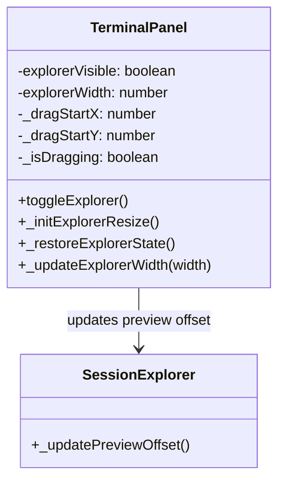
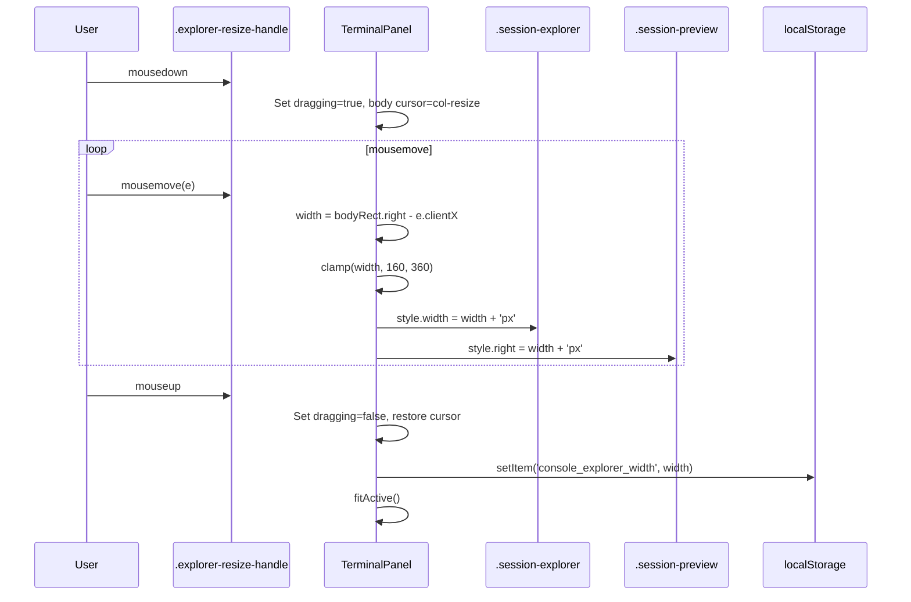
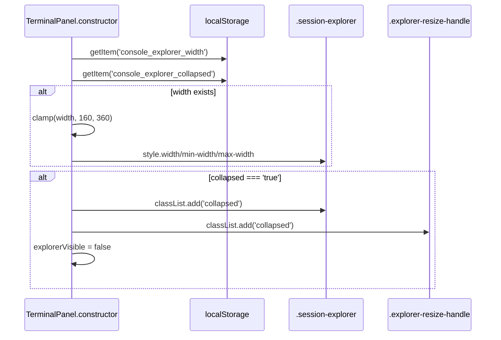
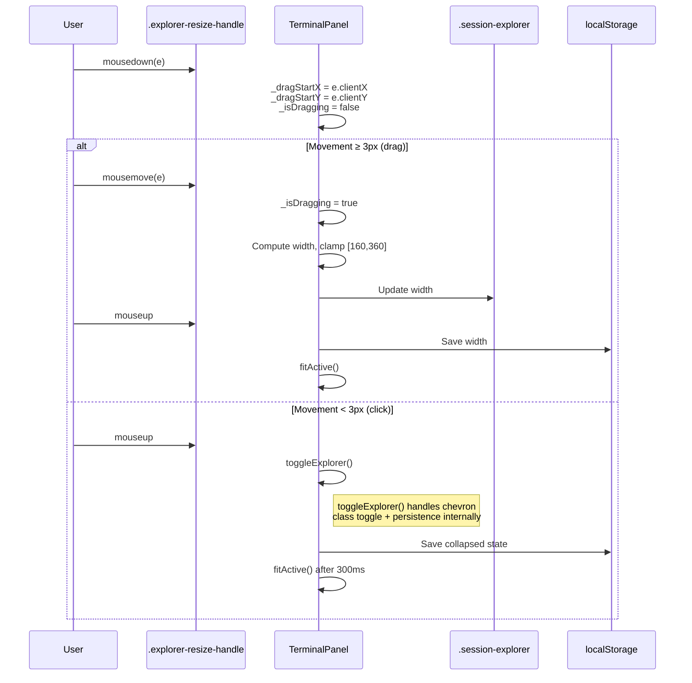

# Technical Design: Explorer UI Controls

> Feature ID: FEATURE-029-D
> Version: v1.1
> Last Updated: 03-16-2026

## Version History

| Version | Date | Description |
|---------|------|-------------|
| v1.1 | 03-16-2026 | CR-001: Border toggle — click-vs-drag detection, chevron indicator, visible handle when collapsed |
| v1.0 | 02-12-2026 | Initial technical design |

---

# Part 1: Agent-Facing Summary

## Overview

Add drag-to-resize, border toggle, and localStorage persistence to the Console Session Explorer panel. The toggle/collapse mechanism (AC-1/AC-2) is already implemented in TASK-322. This design adds:

1. **Resize handle** — 5px drag handle between `.terminal-content` and `.session-explorer`
2. **Drag interaction** — mousedown/mousemove/mouseup to resize explorer width [160–360px]
3. **Border toggle (CR-001)** — click the resize handle to toggle collapse/expand (3px movement threshold distinguishes click from drag). Chevron indicator (`‹`/`›`) shows current state. Handle stays visible when collapsed.
4. **Persistence** — save/restore explorer width and collapsed state via localStorage
5. **Session name persistence** — already implemented via `_saveSessionNames()`/`_getStoredSessionNames()` (AC-15/AC-16 are satisfied by existing code)

## Key Components Implemented

| Component | File | Tags |
|-----------|------|------|
| Explorer resize handle (HTML) | `src/x_ipe/templates/index.html` | `[Frontend] [HTML] [Explorer] [Resize]` |
| Explorer resize handle (CSS) | `src/x_ipe/static/css/terminal.css` | `[Frontend] [CSS] [Explorer] [Resize] [DragHandle]` |
| Explorer drag resize (JS) | `src/x_ipe/static/js/terminal.js` → `TerminalPanel` | `[Frontend] [JS] [Explorer] [Resize] [Drag]` |
| Explorer persistence (JS) | `src/x_ipe/static/js/terminal.js` → `TerminalPanel` | `[Frontend] [JS] [Explorer] [Persistence] [localStorage]` |
| Preview offset sync (JS) | `src/x_ipe/static/js/terminal.js` → `SessionExplorer` | `[Frontend] [JS] [Preview] [Explorer] [Resize]` |
| Border toggle click detection (JS) | `src/x_ipe/static/js/terminal.js` → `TerminalPanel._initExplorerResize()` | `[Frontend] [JS] [Explorer] [Toggle] [ClickDetection] [CR-001]` |
| Chevron indicator (CSS) | `src/x_ipe/static/css/terminal.css` | `[Frontend] [CSS] [Explorer] [Chevron] [Toggle] [CR-001]` |
| Visible handle when collapsed (CSS+JS) | `src/x_ipe/static/css/terminal.css` + `terminal.js` | `[Frontend] [CSS] [JS] [Explorer] [Collapsed] [Handle] [CR-001]` |

## Usage Example

```javascript
// On page load, TerminalPanel constructor restores explorer state:
const savedWidth = localStorage.getItem('console_explorer_width');
const savedCollapsed = localStorage.getItem('console_explorer_collapsed');
// Apply to explorer element; handle stays visible even when collapsed

// Drag handle interaction (existing):
// mousedown → track mousemove → if movement ≥ 3px → resize mode →
// compute width = bodyRect.right - e.clientX, clamp [160, 360] →
// on mouseup save to localStorage + fitActive()

// Border toggle interaction (CR-001):
// mousedown → record startX/startY → mouseup → if movement < 3px →
// treat as click → call toggleExplorer() → chevron flips ‹↔›
// Handle shows ‹ when expanded, › when collapsed (CSS ::before)
```

## Dependencies

| Dependency | Type | Status |
|------------|------|--------|
| FEATURE-029-A (Session Explorer Core) | Internal | ✅ Complete |
| TASK-322 (Toggle + Collapse CSS/JS) | Internal | ✅ Complete |
| FEATURE-029-C (Hover Preview) | Internal | ✅ Complete |

---

# Part 2: Implementation Guide

## Architecture

The implementation adds a drag handle element and persistence logic to the existing terminal panel architecture. No new classes are introduced — all logic extends `TerminalPanel`.



## Workflow: Drag Resize



## Workflow: Page Load Restore



## Handle State Diagram (CR-001)

```mermaid
stateDiagram-v2
    [*] --> Expanded_Idle
    
    Expanded_Idle --> MouseDown : mousedown on handle
    MouseDown --> Dragging : mousemove > 3px
    MouseDown --> Click_Toggle : mouseup AND movement ≤ 3px
    
    Dragging --> Expanded_Idle : mouseup (save width)
    Click_Toggle --> Collapsed_Idle : was expanded → collapse
    Click_Toggle --> Expanded_Idle : was collapsed → expand
    
    Collapsed_Idle --> Click_Expand : click on handle strip
    Click_Expand --> Expanded_Idle : expand to saved width
    
    state Expanded_Idle {
        cursor: col-resize
        chevron: ‹
        drag: enabled
    }
    state Collapsed_Idle {
        cursor: pointer
        chevron: ›
        drag: disabled
    }
```

## Workflow: Click-vs-Drag Detection (CR-001)



## Implementation Details

### 1. HTML: Add Resize Handle

**File:** `src/x_ipe/templates/index.html`

Insert a resize handle div between `.terminal-content` and `.session-explorer` inside `.terminal-body`:

```html
<div class="terminal-body" id="terminal-body">
    <div class="terminal-content" id="terminal-content">
        <!-- Session containers inserted dynamically -->
    </div>
    <div class="explorer-resize-handle" id="explorer-resize-handle"></div>  <!-- NEW -->
    <div class="session-explorer" id="session-explorer">
        ...
    </div>
</div>
```

### 2. CSS: Resize Handle Styles

**File:** `src/x_ipe/static/css/terminal.css`

Add after the Session Explorer section (~line 251, after `.session-explorer.collapsed`):

```css
/* Explorer resize handle */
.explorer-resize-handle {
    width: 5px;
    cursor: col-resize;
    background: #333;
    flex-shrink: 0;
    position: relative;
    transition: background 0.15s;
    z-index: 10;
}

.explorer-resize-handle:hover,
.explorer-resize-handle.dragging {
    background: rgba(78, 201, 176, 0.3);
}

.explorer-resize-handle::after {
    content: '';
    position: absolute;
    top: 50%;
    left: 50%;
    transform: translate(-50%, -50%);
    width: 2px;
    height: 24px;
    border-radius: 1px;
    background: #888;
    opacity: 0;
    transition: opacity 0.15s;
}

.explorer-resize-handle:hover::after {
    opacity: 1;
}
```

Also update `.session-explorer` to remove fixed min/max-width (allow dynamic width):

```css
.session-explorer {
    width: 220px;
    /* REMOVE min-width and max-width fixed values */
    flex-shrink: 0;
    ...
}
```

### 3. JavaScript: TerminalPanel Extensions

**File:** `src/x_ipe/static/js/terminal.js`

#### 3a. Constants (add near line 16)

```javascript
const EXPLORER_WIDTH_KEY = 'console_explorer_width';
const EXPLORER_COLLAPSED_KEY = 'console_explorer_collapsed';
const EXPLORER_DEFAULT_WIDTH = 220;
const EXPLORER_MIN_WIDTH = 160;
const EXPLORER_MAX_WIDTH = 360;
```

#### 3b. TerminalPanel Constructor — add state and restore

In the constructor (after `this.explorerVisible = true;`):

```javascript
this.explorerWidth = EXPLORER_DEFAULT_WIDTH;
this.explorerResizeHandle = document.getElementById('explorer-resize-handle');

// Restore persisted state
this._restoreExplorerState();
```

#### 3c. TerminalPanel._restoreExplorerState()

```javascript
_restoreExplorerState() {
    const explorer = document.getElementById('session-explorer');
    if (!explorer) return;

    // Restore width
    try {
        const savedWidth = localStorage.getItem(EXPLORER_WIDTH_KEY);
        if (savedWidth !== null) {
            const w = Math.max(EXPLORER_MIN_WIDTH, Math.min(EXPLORER_MAX_WIDTH, parseInt(savedWidth, 10)));
            if (!isNaN(w)) {
                this.explorerWidth = w;
                this._updateExplorerWidth(w);
            }
        }
    } catch (e) {}

    // Restore collapsed state
    try {
        const savedCollapsed = localStorage.getItem(EXPLORER_COLLAPSED_KEY);
        if (savedCollapsed === 'true') {
            this.explorerVisible = false;
            explorer.classList.add('collapsed');
            explorer.style.width = '';
            explorer.style.minWidth = '';
            explorer.style.maxWidth = '';
            if (this.explorerResizeHandle) this.explorerResizeHandle.classList.add('collapsed');
        }
    } catch (e) {}
}
```

#### 3d. TerminalPanel._updateExplorerWidth(width)

Sets explorer width and syncs preview panel offset:

```javascript
_updateExplorerWidth(width) {
    const explorer = document.getElementById('session-explorer');
    if (!explorer) return;
    explorer.style.width = width + 'px';
    explorer.style.minWidth = width + 'px';
    explorer.style.maxWidth = width + 'px';

    // Sync preview panel offset
    const preview = document.querySelector('.session-preview');
    if (preview) {
        preview.style.right = width + 'px';
    }
}
```

#### 3e. TerminalPanel._initExplorerResize()

Called from `_bindEvents()`:

```javascript
_initExplorerResize() {
    const handle = this.explorerResizeHandle;
    if (!handle) return;

    handle.addEventListener('mousedown', (e) => {
        e.preventDefault();
        handle.classList.add('dragging');
        document.body.style.cursor = 'col-resize';
        document.body.style.userSelect = 'none';

        const body = document.getElementById('terminal-body');

        const onMove = (e) => {
            const bodyRect = body.getBoundingClientRect();
            const newWidth = bodyRect.right - e.clientX;
            const clamped = Math.max(EXPLORER_MIN_WIDTH, Math.min(EXPLORER_MAX_WIDTH, newWidth));
            this.explorerWidth = clamped;
            this._updateExplorerWidth(clamped);
        };

        const onUp = () => {
            document.removeEventListener('mousemove', onMove);
            document.removeEventListener('mouseup', onUp);
            handle.classList.remove('dragging');
            document.body.style.cursor = '';
            document.body.style.userSelect = '';
            this._saveExplorerWidth(this.explorerWidth);
            this.terminalManager.fitActive();
        };

        document.addEventListener('mousemove', onMove);
        document.addEventListener('mouseup', onUp);
    });
}
```

#### 3f. Persistence helpers

```javascript
_saveExplorerWidth(width) {
    try { localStorage.setItem(EXPLORER_WIDTH_KEY, String(width)); } catch (e) {}
}

_saveExplorerCollapsed(collapsed) {
    try { localStorage.setItem(EXPLORER_COLLAPSED_KEY, String(collapsed)); } catch (e) {}
}
```

#### 3g. Update toggleExplorer()

Modify existing `toggleExplorer()` to persist state and hide/show resize handle:

```javascript
toggleExplorer() {
    const explorer = document.getElementById('session-explorer');
    if (!explorer) return;
    this.explorerVisible = !this.explorerVisible;
    explorer.classList.toggle('collapsed', !this.explorerVisible);

    // Hide/show resize handle
    if (this.explorerResizeHandle) {
        this.explorerResizeHandle.style.display = this.explorerVisible ? '' : 'none';
    }

    // Persist collapsed state
    this._saveExplorerCollapsed(!this.explorerVisible);

    // Re-apply width when expanding
    if (this.explorerVisible) {
        this._updateExplorerWidth(this.explorerWidth);
    }

    setTimeout(() => this.terminalManager.fitActive(), 300);
}
```

### 3.5 CR-001: Border Toggle Implementation

**Files modified:** `src/x_ipe/static/js/terminal.js`, `src/x_ipe/static/css/terminal.css`

#### 3.5a. Click-vs-Drag Detection (modify `_initExplorerResize()`)

The existing `_initExplorerResize()` only handles drag. Update to detect click vs drag using a 3px movement threshold:

```javascript
_initExplorerResize() {
    const handle = this.explorerResizeHandle;
    if (!handle) return;

    handle.addEventListener('mousedown', (e) => {
        e.preventDefault();
        const startX = e.clientX;
        const startY = e.clientY;
        let isDragging = false;
        const body = document.getElementById('terminal-body');

        const onMove = (ev) => {
            const dx = Math.abs(ev.clientX - startX);
            const dy = Math.abs(ev.clientY - startY);

            if (!isDragging && (dx + dy) >= 3) {
                // Threshold crossed → enter drag mode
                isDragging = true;
                handle.classList.add('dragging');
                document.body.style.cursor = 'col-resize';
                document.body.style.userSelect = 'none';
            }

            if (isDragging && this.explorerVisible) {
                const w = Math.max(EXPLORER_MIN_WIDTH, Math.min(EXPLORER_MAX_WIDTH,
                    body.getBoundingClientRect().right - ev.clientX));
                this.explorerWidth = w;
                this._updateExplorerWidth(w);
            }
        };

        const onUp = () => {
            document.removeEventListener('mousemove', onMove);
            document.removeEventListener('mouseup', onUp);

            if (isDragging) {
                // Was a drag → save width
                handle.classList.remove('dragging');
                document.body.style.cursor = '';
                document.body.style.userSelect = '';
                try { localStorage.setItem(EXPLORER_WIDTH_KEY, String(this.explorerWidth)); } catch {}
                this.terminalManager.fitActive();
            } else {
                // Was a click (movement < 3px) → toggle
                this.toggleExplorer();
            }
        };

        document.addEventListener('mousemove', onMove);
        document.addEventListener('mouseup', onUp);
    });
}
```

**Key design decisions:**
- Movement threshold: `dx + dy >= 3` (Manhattan distance). Simple, fast, no sqrt needed.
- Drag mode CSS (`dragging` class, body cursor) only applied AFTER threshold crossed, not on mousedown.
- When collapsed, `this.explorerVisible` is false → drag resize skipped (only click-to-expand works).

#### 3.5b. Chevron Indicator (CSS `::before` pseudo-element)

Use a CSS `::before` pseudo-element on the handle for the chevron. No HTML changes needed.

```css
/* Chevron indicator on resize handle */
.explorer-resize-handle::before {
    content: '‹';  /* Points toward explorer (expanded state) */
    position: absolute;
    top: 50%;
    left: 50%;
    transform: translate(-50%, -50%);
    font-size: 14px;
    line-height: 1;
    color: #8b949e;
    opacity: 0;
    transition: opacity 0.15s;
    pointer-events: none;
    z-index: 1;
}

/* Show chevron on hover */
.explorer-resize-handle:hover::before {
    opacity: 1;
}

/* Collapsed state: always show chevron, change to › */
.explorer-resize-handle.collapsed::before {
    content: '›';  /* Points away from explorer (collapsed state) */
    opacity: 1;    /* Always visible when collapsed */
}

/* Hide the dot indicator (::after) when chevron is visible */
.explorer-resize-handle:hover::after {
    opacity: 0;  /* Chevron replaces dot on hover */
}

.explorer-resize-handle.collapsed::after {
    opacity: 0;  /* No dot when collapsed */
}
```

**Design decision:** Chevron shown on hover when expanded (to hint at clickability) but always visible when collapsed (since the handle strip is the only affordance to expand).

#### 3.5c. Handle Visibility When Collapsed

**Remove** `display: none` from three locations:

1. **`toggleExplorer()`** — Replace:
   ```javascript
   if (this.explorerResizeHandle) this.explorerResizeHandle.style.display = this.explorerVisible ? '' : 'none';
   ```
   With:
   ```javascript
   if (this.explorerResizeHandle) {
       this.explorerResizeHandle.classList.toggle('collapsed', !this.explorerVisible);
   }
   ```

2. **`_restoreExplorerState()`** — Replace:
   ```javascript
   if (this.explorerResizeHandle) this.explorerResizeHandle.style.display = 'none';
   ```
   With:
   ```javascript
   if (this.explorerResizeHandle) this.explorerResizeHandle.classList.add('collapsed');
   ```

3. **CSS for collapsed handle:**
   ```css
   .explorer-resize-handle.collapsed {
       cursor: pointer;  /* Click only, no drag */
       display: block;   /* Ensure visible — override any inherited display:none */
   }
   ```

#### 3.5d. `_updateHandleChevron()` helper

```javascript
_updateHandleChevron() {
    if (!this.explorerResizeHandle) return;
    this.explorerResizeHandle.classList.toggle('collapsed', !this.explorerVisible);
}
```

Note: The chevron content (`‹`/`›`) is handled entirely by CSS via the `.collapsed` class — no JS content manipulation needed.

#### 3.5e. Animation Guard (Edge Case 7)

In `toggleExplorer()`, add a guard to prevent rapid re-toggling during animation:

```javascript
toggleExplorer() {
    if (this._toggleAnimating) return;  // Guard: ignore during animation
    this._toggleAnimating = true;
    setTimeout(() => { this._toggleAnimating = false; }, 300);  // Match CSS transition duration

    const explorer = document.getElementById('session-explorer');
    if (!explorer) return;
    this.explorerVisible = !this.explorerVisible;
    explorer.classList.toggle('collapsed', !this.explorerVisible);
    
    // Update handle: toggle .collapsed class (controls chevron + cursor)
    if (this.explorerResizeHandle) {
        this.explorerResizeHandle.classList.toggle('collapsed', !this.explorerVisible);
    }
    
    try { localStorage.setItem(EXPLORER_COLLAPSED_KEY, String(!this.explorerVisible)); } catch {}
    if (this.explorerVisible) {
        this._updateExplorerWidth(this.explorerWidth);
    } else {
        // Clear inline width so CSS .collapsed { width: 0 } takes effect
        explorer.style.width = '';
        explorer.style.minWidth = '';
        explorer.style.maxWidth = '';
    }
    setTimeout(() => this.terminalManager.fitActive(), 300);
}
```

### 4. Preview Offset Sync

The `_initPreviewContainer()` in SessionExplorer currently sets `style.right = '220px'` via CSS. After this change, the CSS rule `.session-preview { right: 220px; }` serves as the default. The `_updateExplorerWidth()` method dynamically updates `preview.style.right` to match the current explorer width.

When the preview is shown, it should also pick up the current width:

In `_showPreview()`, after `this._previewContainer.style.display = 'flex'`:

```javascript
// Sync preview offset with current explorer width
const explorer = document.getElementById('session-explorer');
if (explorer && !explorer.classList.contains('collapsed')) {
    this._previewContainer.style.right = explorer.style.width || '';
}
```

### 3.6 Touch Support (Edge Case 9)

Add touch event handlers to `_initExplorerResize()` for mobile/tablet devices. A touch tap (touchstart→touchend without significant touchmove) maps to a click toggle:

```javascript
// Add after the mousedown listener in _initExplorerResize():
handle.addEventListener('touchstart', (e) => {
    const touch = e.touches[0];
    const startX = touch.clientX;
    const startY = touch.clientY;
    let moved = false;

    const onTouchMove = (ev) => {
        const t = ev.touches[0];
        if (Math.abs(t.clientX - startX) + Math.abs(t.clientY - startY) >= 3) {
            moved = true;
        }
    };

    const onTouchEnd = () => {
        handle.removeEventListener('touchmove', onTouchMove);
        handle.removeEventListener('touchend', onTouchEnd);
        if (!moved) {
            e.preventDefault();  // Prevent ghost click
            this.toggleExplorer();
        }
        // Note: touch drag-to-resize is NOT supported (too imprecise on 5px target).
        // Only tap-to-toggle works on touch devices.
    };

    handle.addEventListener('touchmove', onTouchMove);
    handle.addEventListener('touchend', onTouchEnd);
}, { passive: false });
```

**Design decision:** Touch drag-to-resize is intentionally NOT supported — a 5px handle is too narrow for precise finger dragging. Touch tap-to-toggle is the only touch interaction.

### 5. Session Name Persistence (AC-15/AC-16)

**Already implemented.** The existing `_saveSessionNames()` and `_getStoredSessionNames()` methods in `TerminalManager` use `localStorage` key `terminal_session_names` to persist UUID→name mappings. On reload, stored names are restored at line 153. The spec calls for key `console_session_names` but the existing `terminal_session_names` key serves the same purpose — no change needed to avoid breaking existing stored data.

## CSS Changes Summary

| What | Change |
|------|--------|
| `.session-explorer` | Remove `min-width: 220px; max-width: 220px;` to allow dynamic width. Keep `width: 220px` as CSS default. Add `flex-shrink: 0;` (already present via `min/max`). |
| `.session-explorer.collapsed` | No change (already transitions to 0). |
| `.explorer-resize-handle` | Existing rule — 5px, col-resize, accent hover, centered dot pseudo-element. |
| `.explorer-resize-handle::before` | **CR-001:** Chevron indicator (`‹` expanded, `›` collapsed). Hidden by default, shown on hover. Always visible when collapsed. |
| `.explorer-resize-handle.collapsed` | **CR-001:** `cursor: pointer` (no drag). Chevron `::before` always visible with `›` content. Dot `::after` hidden. |
| `.session-preview` | Default `right: 220px` stays; JS overrides dynamically. |

## Testing Considerations

1. **Drag resize** — verify width clamps to [160, 360], cursor changes, terminal re-fits
2. **Persistence** — set width, reload page, verify width restored
3. **Collapsed persistence** — toggle collapse, reload, verify collapsed state
4. **Edge cases** — localStorage unavailable, stored value out of range, rapid toggle
5. **Preview sync** — resize explorer, hover a session, verify preview aligns
6. **Mockup compliance** — handle styling matches mockup v2 (5px, accent highlight, chevron)
7. **Click-vs-drag detection (CR-001)** — mousedown+mouseup with < 3px movement → toggle; ≥ 3px → resize
8. **Chevron indicator (CR-001)** — `‹` when expanded (visible on hover), `›` when collapsed (always visible)
9. **Handle visibility when collapsed (CR-001)** — handle stays visible, cursor is `pointer`, drag disabled
10. **Animation guard (CR-001)** — rapid clicks during transition are ignored (300ms debounce)
11. **Collapsed click-to-expand (CR-001)** — clicking handle when collapsed expands to previously saved width

## Design Change Log

| Date | Change | Rationale |
|------|--------|-----------|
| 03-16-2026 | CR-001: Added border toggle — click-vs-drag detection (3px threshold), chevron indicator (CSS ::before), visible handle when collapsed, animation guard | UIUX Feedback: Users expect IDE-standard click-to-toggle on panel borders. Reuses existing toggleExplorer() for state management. |
| 02-12-2026 | Initial design | FEATURE-029-D implementation |
