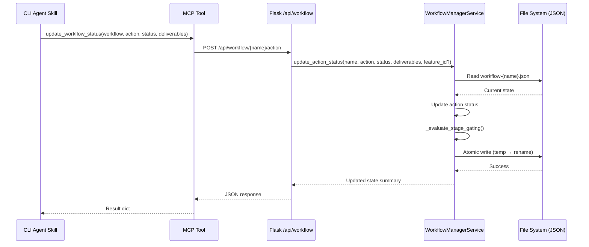
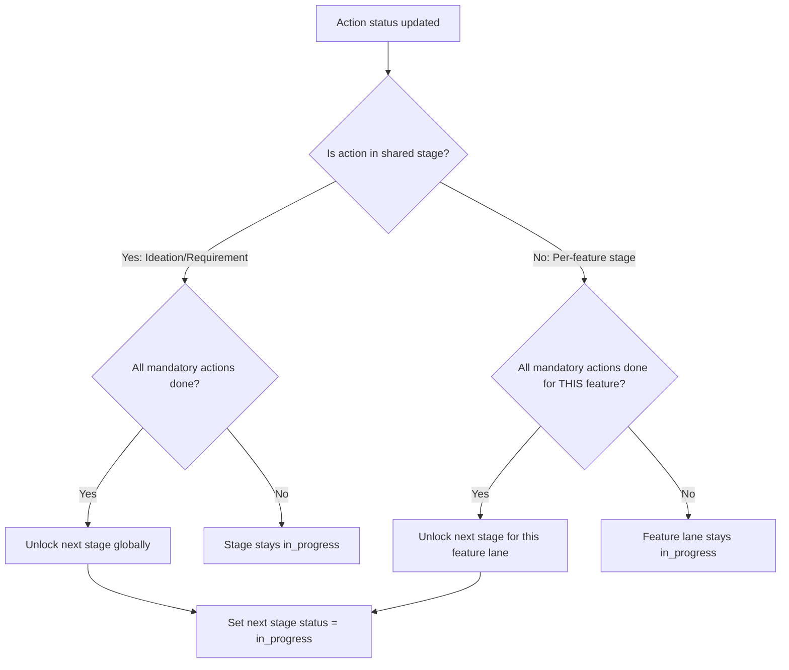
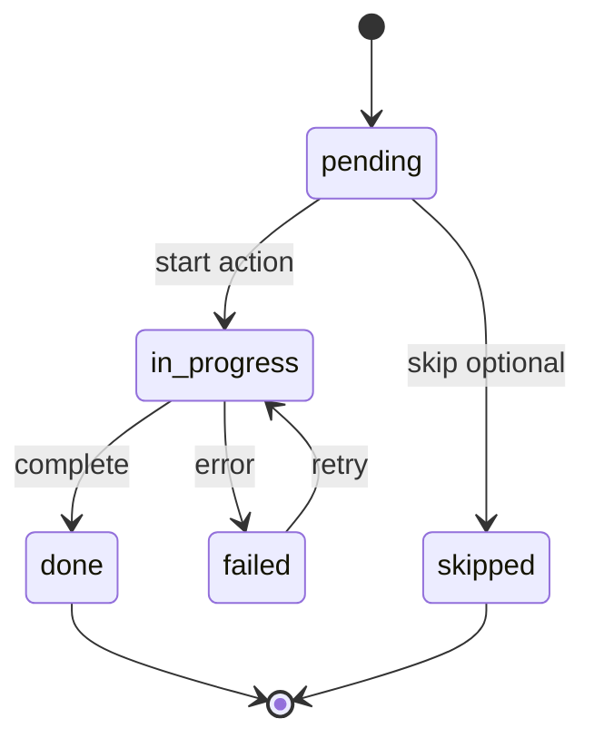

# Technical Design: Workflow Manager & State Persistence

> Feature ID: FEATURE-036-A | Version: v1.0 | Last Updated: 02-17-2026

---

## Part 1: Agent-Facing Summary

> **Purpose:** Quick reference for AI agents navigating large projects.
> **📌 AI Coders:** Focus on this section for implementation context.

### Key Components Implemented

| Component | Responsibility | Scope/Impact | Tags |
|-----------|----------------|--------------|------|
| `WorkflowManagerService` | Workflow CRUD, stage gating, dependency evaluation, next-action suggestion | Core backend for all EPIC-036 features | #workflow #manager #backend #service |
| `workflow_bp` (Blueprint) | Flask REST endpoints for workflow operations | API layer consumed by frontend (FEATURE-036-B–E) | #flask #routes #api #workflow |
| `update_workflow_status` (MCP) | MCP tool for agent skills to report action completion | Agent-to-workflow bridge via MCP | #mcp #tool #agent #status |
| `get_workflow_state` (MCP) | MCP tool for agent skills to query workflow state | Agent context loading via MCP | #mcp #tool #agent #query |

### Dependencies

| Dependency | Source | Design Link | Usage Description |
|------------|--------|-------------|-------------------|
| `FastMCP` server | FEATURE-033 | [specification.md](../EPIC-033/FEATURE-033-A/specification.md) | Register `update_workflow_status` and `get_workflow_state` tools on existing `x-ipe-app-and-agent-interaction` MCP |
| `@x_ipe_tracing()` | Foundation | (decorator in codebase) | Observability for all service methods |
| `_resolve_base_url()` | FEATURE-033 | `x_ipe/mcp/app_agent_interaction.py` | MCP tools use this to locate Flask backend |

### Major Flow

1. **Workflow CRUD:** Frontend calls `POST/GET/DELETE /api/workflow/*` → `workflow_bp` → `WorkflowManagerService` → reads/writes `x-ipe-docs/engineering-workflow/workflow-{name}.json`
2. **Action Status Update (MCP):** Agent skill calls `update_workflow_status` MCP tool → HTTP POST to Flask → `WorkflowManagerService.update_action_status()` → atomic JSON write → stage gating re-evaluation
3. **State Query (MCP):** Agent skill calls `get_workflow_state` MCP tool → HTTP GET to Flask → `WorkflowManagerService.get_workflow()` → returns parsed JSON
4. **Stage Gating:** On every status update, `_evaluate_stage_gating()` checks mandatory actions → unlocks next stage if all done

### Usage Example

```python
# Service usage (from Flask route)
service = WorkflowManagerService(project_root="/path/to/project")

# Create workflow
result = service.create_workflow("my-feature-project")
# → Creates engineering-workflow/workflow-my-feature-project.json

# Get workflow state
state = service.get_workflow("my-feature-project")
# → Returns full workflow state dict

# Update action status
result = service.update_action_status(
    workflow_name="my-feature-project",
    action="refine_idea",
    status="done",
    deliverables=["x-ipe-docs/ideas/my-idea/idea-summary-v1.md"]
)
# → Updates action, re-evaluates gating, returns updated state

# Check feature dependencies
deps = service.check_dependencies("my-feature-project", "FEATURE-036-B")
# → Returns {"blocked": False, "blockers": []}

# Add features after breakdown
service.add_features("my-feature-project", [
    {"id": "FEATURE-040-A", "name": "Login Page", "depends_on": []},
    {"id": "FEATURE-040-B", "name": "Dashboard", "depends_on": ["FEATURE-040-A"]}
])
```

```python
# MCP tool usage (from agent skill context)
# Agent calls update_workflow_status tool:
result = update_workflow_status({
    "workflow_name": "my-feature-project",
    "action": "requirement_gathering",
    "status": "done",
    "deliverables": ["x-ipe-docs/requirements/requirement-details-part-9.md"]
})

# Agent calls get_workflow_state tool:
state = get_workflow_state({"workflow_name": "my-feature-project"})
```

---

## Part 2: Implementation Guide

> **Purpose:** Human-readable details for developers.
> **📌 Emphasis on visual diagrams for comprehension.**

### Workflow Diagram — Action Status Update



### Workflow Diagram — Stage Gating Logic



### Class Diagram

```mermaid
classDiagram
    class WorkflowManagerService {
        -Path _project_root
        -Path _workflow_dir
        -dict _stage_config
        +create_workflow(name: str) dict
        +get_workflow(name: str) dict
        +list_workflows() list
        +delete_workflow(name: str) dict
        +update_action_status(name, action, status, deliverables, feature_id?) dict
        +check_dependencies(name, feature_id) dict
        +get_next_action(name) dict
        +add_features(name, features: list) dict
        +link_idea_folder(name, idea_folder_path) dict
        -_read_state(name: str) dict
        -_write_state(name: str, state: dict) None
        -_evaluate_stage_gating(state: dict) dict
        -_validate_workflow_name(name: str) None
        -_get_workflow_path(name: str) Path
        -_build_initial_state(name: str) dict
    }

    class WorkflowBlueprint {
        +POST /api/workflow/create
        +GET /api/workflow/list
        +GET /api/workflow/{name}
        +DELETE /api/workflow/{name}
        +POST /api/workflow/{name}/action
        +POST /api/workflow/{name}/features
        +POST /api/workflow/{name}/link-idea
        +GET /api/workflow/{name}/dependencies/{feature_id}
        +GET /api/workflow/{name}/next-action
    }

    class MCPTools {
        +update_workflow_status(data: dict) dict
        +get_workflow_state(data: dict) dict
    }

    WorkflowBlueprint --> WorkflowManagerService : uses
    MCPTools --> WorkflowBlueprint : HTTP calls
```

### State Diagram — Action Lifecycle



### Data Model — Workflow State JSON

```python
# Workflow state schema (v1.0)
INITIAL_STATE = {
    "schema_version": "1.0",
    "name": "",                    # Workflow name
    "created": "",                 # ISO 8601 timestamp
    "last_activity": "",           # ISO 8601 timestamp, updated on every write
    "idea_folder": None,           # Path or null
    "current_stage": "ideation",   # Current highest active stage
    "stages": {
        "ideation": {
            "status": "in_progress",  # in_progress | completed | locked
            "actions": {
                "compose_idea":   {"status": "pending", "deliverables": []},
                "reference_uiux": {"status": "pending", "deliverables": []},
                "refine_idea":    {"status": "pending", "deliverables": []},
                "design_mockup":  {"status": "pending", "deliverables": []}
            }
        },
        "requirement": {
            "status": "locked",
            "actions": {
                "requirement_gathering": {"status": "pending", "deliverables": []},
                "feature_breakdown":     {"status": "pending", "deliverables": [], "features_created": []}
            }
        },
        "implement": {"status": "locked", "features": {}},
        "validation": {"status": "locked", "features": {}},
        "feedback":   {"status": "locked", "features": {}}
    }
}

# Per-feature entry (populated after Feature Breakdown)
FEATURE_ENTRY = {
    "name": "",
    "depends_on": [],
    "actions": {
        "feature_refinement":  {"status": "pending", "deliverables": []},
        "technical_design":    {"status": "pending", "deliverables": []},
        "implementation":      {"status": "pending", "deliverables": []},
        "acceptance_testing":  {"status": "pending", "deliverables": []},
        "quality_evaluation":  {"status": "skipped", "deliverables": []},
        "change_request":      {"status": "pending", "deliverables": []}
    }
}
```

### Stage Gating Configuration

```python
# Data-driven stage config — not hardcoded logic
STAGE_CONFIG = {
    "ideation": {
        "type": "shared",           # shared = workflow-level gating
        "mandatory_actions": ["compose_idea", "refine_idea"],
        "optional_actions": ["reference_uiux", "design_mockup"],
        "next_stage": "requirement"
    },
    "requirement": {
        "type": "shared",
        "mandatory_actions": ["requirement_gathering", "feature_breakdown"],
        "optional_actions": [],
        "next_stage": "implement"
    },
    "implement": {
        "type": "per_feature",      # per_feature = independent per lane
        "mandatory_actions": ["feature_refinement", "technical_design", "implementation"],
        "optional_actions": [],
        "next_stage": "validation"
    },
    "validation": {
        "type": "per_feature",
        "mandatory_actions": ["acceptance_testing"],
        "optional_actions": ["quality_evaluation"],
        "next_stage": "feedback"
    },
    "feedback": {
        "type": "per_feature",
        "mandatory_actions": [],
        "optional_actions": ["change_request"],
        "next_stage": None          # Terminal stage
    }
}
```

### API Specification

#### POST /api/workflow/create

**Request:**
```json
{"name": "my-feature-project"}
```

**Response (201):**
```json
{
    "success": true,
    "data": {
        "name": "my-feature-project",
        "created": "2026-02-17T12:00:00Z",
        "current_stage": "ideation"
    }
}
```

**Errors:**
| Status | Error Code | Description |
|--------|-----------|-------------|
| 400 | `INVALID_NAME` | Name contains invalid characters or exceeds 100 chars |
| 409 | `ALREADY_EXISTS` | Workflow with this name already exists |

#### GET /api/workflow/list

**Response (200):**
```json
{
    "success": true,
    "data": [
        {
            "name": "my-feature-project",
            "created": "2026-02-17T12:00:00Z",
            "last_activity": "2026-02-17T14:00:00Z",
            "current_stage": "requirement",
            "feature_count": 5
        }
    ]
}
```

#### GET /api/workflow/{name}

**Response (200):** Full workflow state JSON.

**Errors:**
| Status | Error Code | Description |
|--------|-----------|-------------|
| 404 | `NOT_FOUND` | Workflow file does not exist |
| 500 | `CORRUPTED_STATE` | JSON parse error in state file |

#### DELETE /api/workflow/{name}

**Response (200):**
```json
{"success": true, "message": "Workflow 'my-feature-project' deleted"}
```

#### POST /api/workflow/{name}/action

**Request:**
```json
{
    "action": "refine_idea",
    "status": "done",
    "feature_id": null,
    "deliverables": ["x-ipe-docs/ideas/my-idea/idea-summary-v1.md"]
}
```

**Response (200):**
```json
{
    "success": true,
    "data": {
        "action_updated": "refine_idea",
        "new_status": "done",
        "stage_unlocked": "requirement",
        "current_stage": "requirement",
        "next_action": {"action": "requirement_gathering", "stage": "requirement"}
    }
}
```

**Errors:**
| Status | Error Code | Description |
|--------|-----------|-------------|
| 400 | `INVALID_STATUS` | Status not in valid set |
| 400 | `STAGE_LOCKED` | Action belongs to a locked stage |
| 400 | `FEATURE_NOT_FOUND` | feature_id provided but not in workflow |
| 404 | `NOT_FOUND` | Workflow not found |

#### POST /api/workflow/{name}/features

**Request:**
```json
{
    "features": [
        {"id": "FEATURE-040-A", "name": "Login Page", "depends_on": []},
        {"id": "FEATURE-040-B", "name": "Dashboard", "depends_on": ["FEATURE-040-A"]}
    ]
}
```

**Response (200):**
```json
{"success": true, "data": {"features_added": 2}}
```

#### POST /api/workflow/{name}/link-idea

**Request:**
```json
{"idea_folder": "x-ipe-docs/ideas/021. Feature-Engineering-Workflow"}
```

**Response (200):**
```json
{"success": true, "data": {"idea_folder": "x-ipe-docs/ideas/021. Feature-Engineering-Workflow"}}
```

#### GET /api/workflow/{name}/dependencies/{feature_id}

**Response (200):**
```json
{
    "success": true,
    "data": {
        "feature_id": "FEATURE-040-B",
        "blocked": true,
        "blockers": [
            {"feature_id": "FEATURE-040-A", "current_stage": "implement", "required_stage": "implement"}
        ]
    }
}
```

#### GET /api/workflow/{name}/next-action

**Response (200):**
```json
{
    "success": true,
    "data": {
        "action": "feature_refinement",
        "stage": "implement",
        "feature_id": "FEATURE-040-A",
        "reason": "First unblocked feature with pending mandatory action"
    }
}
```

### MCP Tool Implementation

```python
# In x_ipe/mcp/app_agent_interaction.py — add alongside existing save_uiux_reference

@mcp.tool
def update_workflow_status(data: dict) -> dict:
    """Update workflow action status and deliverables.
    
    Args:
        data: Dict with required fields: workflow_name, action, status.
              Optional: feature_id, deliverables (list of file paths).
    
    Returns: Updated workflow state summary.
    """
    required = ["workflow_name", "action", "status"]
    missing = [f for f in required if f not in data]
    if missing:
        return {"success": False, "error": "MISSING_FIELDS", "message": f"Missing: {missing}"}

    try:
        resp = requests.post(
            f"{BASE_URL}/api/workflow/{data['workflow_name']}/action",
            json={
                "action": data["action"],
                "status": data["status"],
                "feature_id": data.get("feature_id"),
                "deliverables": data.get("deliverables", [])
            },
            timeout=30
        )
        return resp.json()
    except requests.ConnectionError:
        return {"success": False, "error": "BACKEND_UNREACHABLE"}
    except requests.Timeout:
        return {"success": False, "error": "BACKEND_TIMEOUT"}


@mcp.tool
def get_workflow_state(data: dict) -> dict:
    """Get current workflow state for agent context.
    
    Args:
        data: Dict with required field: workflow_name.
    
    Returns: Full workflow state as JSON.
    """
    if "workflow_name" not in data:
        return {"success": False, "error": "MISSING_FIELDS", "message": "Missing: workflow_name"}

    try:
        resp = requests.get(
            f"{BASE_URL}/api/workflow/{data['workflow_name']}",
            timeout=30
        )
        return resp.json()
    except requests.ConnectionError:
        return {"success": False, "error": "BACKEND_UNREACHABLE"}
    except requests.Timeout:
        return {"success": False, "error": "BACKEND_TIMEOUT"}
```

### Implementation Steps

1. **Service Layer:** Create `src/x_ipe/services/workflow_manager_service.py`
   - `WorkflowManagerService` class with all CRUD + gating + dependency methods
   - Atomic write helper using `tempfile.NamedTemporaryFile` + `os.replace()`
   - Stage config as class-level dict constant
   - `@x_ipe_tracing()` on all public methods

2. **Routes Layer:** Create `src/x_ipe/routes/workflow_routes.py`
   - `workflow_bp = Blueprint('workflow', __name__)`
   - All 9 endpoints as defined in API Specification above
   - Per-request service instantiation: `WorkflowManagerService(project_root)`
   - Standard error handling: try/except → jsonify with error codes

3. **Blueprint Registration:** Update `src/x_ipe/app.py`
   - Import `workflow_bp` in `_register_blueprints()`
   - Register: `app.register_blueprint(workflow_bp)`

4. **MCP Tools:** Update `src/x_ipe/mcp/app_agent_interaction.py`
   - Add `update_workflow_status` and `get_workflow_state` tool functions
   - Follow existing pattern: validate input → HTTP POST/GET to Flask → return response

5. **Directory Setup:** Ensure `x-ipe-docs/engineering-workflow/` auto-created by service on first write

### File Structure

```
src/x_ipe/
├── services/
│   └── workflow_manager_service.py   # NEW (~400 lines)
├── routes/
│   └── workflow_routes.py            # NEW (~200 lines)
├── mcp/
│   └── app_agent_interaction.py      # MODIFIED (add 2 tool functions, ~60 lines)
└── app.py                            # MODIFIED (register blueprint, ~2 lines)

x-ipe-docs/
└── engineering-workflow/              # NEW directory, auto-created
    └── workflow-{name}.json           # Created per workflow
```

### Edge Cases & Error Handling

| Scenario | Implementation |
|----------|---------------|
| Corrupted JSON on read | Catch `json.JSONDecodeError`, return `CORRUPTED_STATE` error with file path |
| Concurrent writes | Atomic write (temp + `os.replace`) — last writer wins, no partial state |
| Workflow dir missing | `_workflow_dir.mkdir(parents=True, exist_ok=True)` on first write |
| Invalid name chars | Regex validation: `^[a-zA-Z0-9-]+$`, max 100 chars, reject early |
| Action on locked stage | Check `stage.status != "locked"` before allowing update |
| Feature action before features | Check `len(stage.features) > 0` before allowing per-feature action |
| Circular dependencies | Not validated at write time (Feature Breakdown enforces DAG); dependency check at query time will detect if blocked by itself |
| Missing deliverable paths | Accept as-is — Deliverables Resolver (FEATURE-036-E) handles verification |

---

## Design Change Log

| Date | Phase | Change Summary |
|------|-------|----------------|
| 02-17-2026 | Initial Design | Initial technical design for Workflow Manager & State Persistence. Backend service with 8 FR methods, 9 REST endpoints, 2 MCP tools, atomic JSON persistence, data-driven stage gating. |
