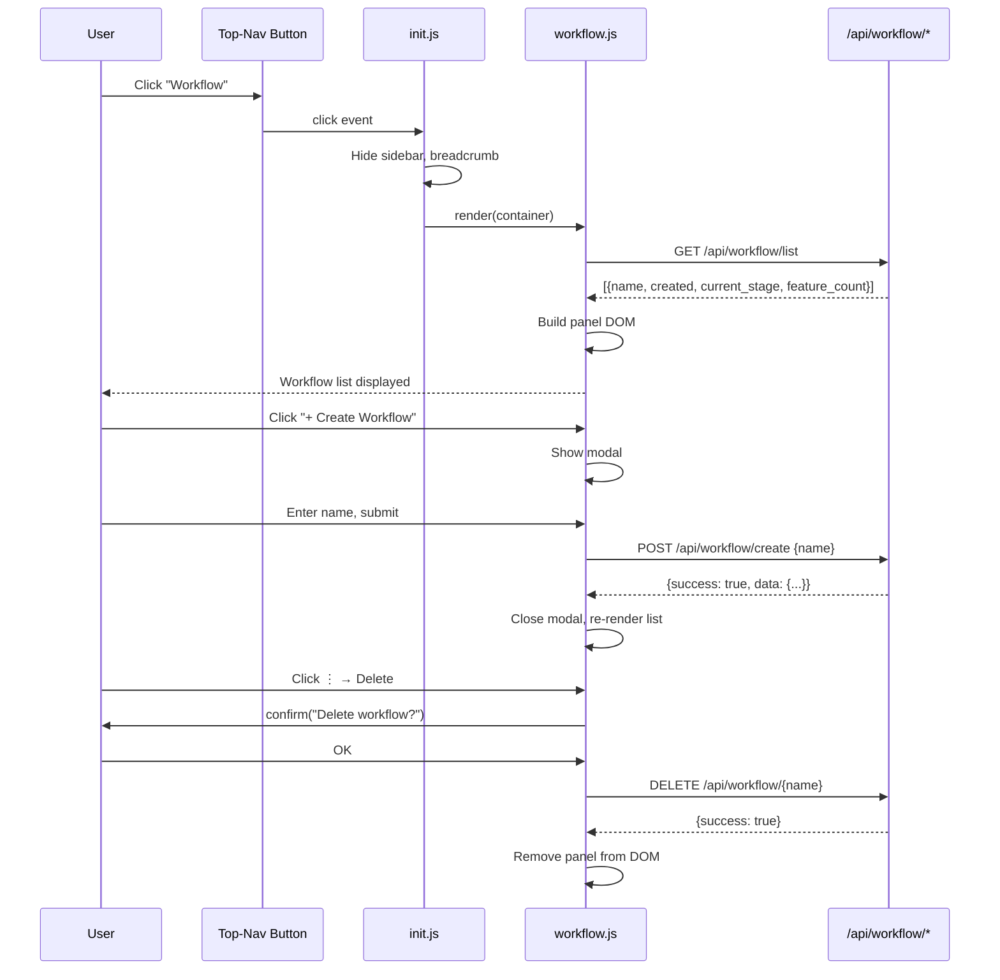
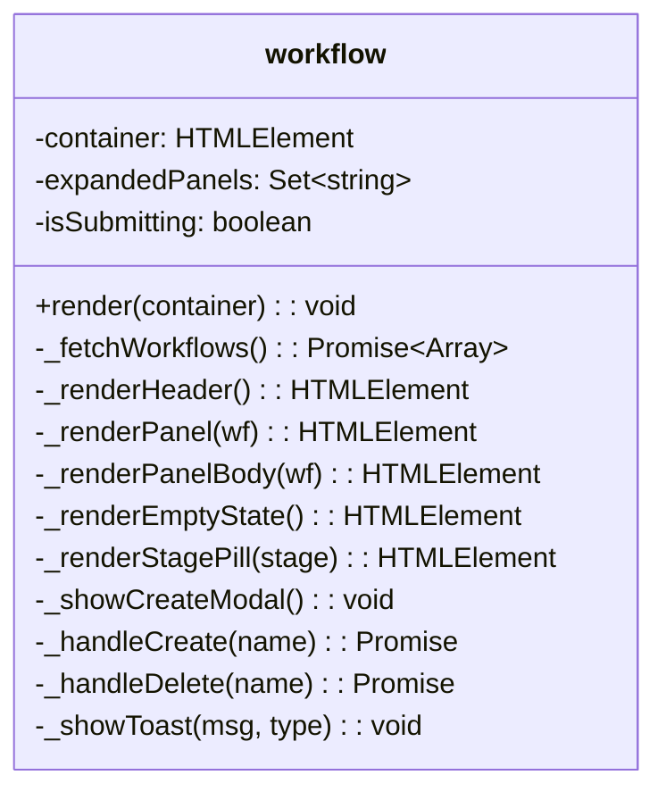
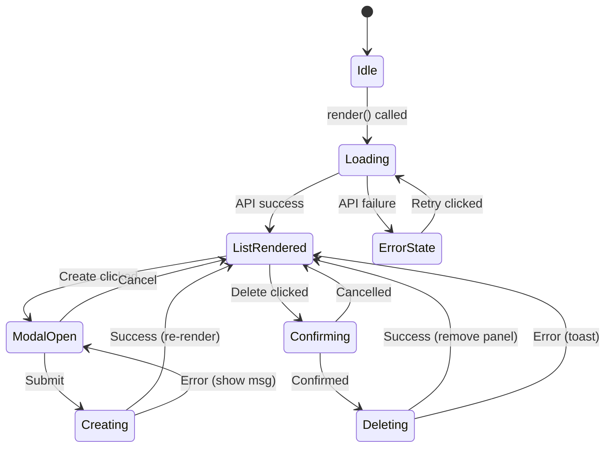

# FEATURE-036-B: Workflow View Shell & CRUD — Technical Design

## Part 1: Design Overview

### Key Components

| Component | File | Responsibility |
|-----------|------|----------------|
| Workflow View Module | `src/x_ipe/static/js/features/workflow.js` | Renders workflow list, create modal, delete actions |
| Navigation Button | `src/x_ipe/templates/index.html` | Top-nav "Workflow" button in `.menu-actions` |
| Init Registration | `src/x_ipe/static/js/init.js` | Click handler binding for the nav button |
| Styles | `src/x_ipe/static/css/workflow.css` | Workflow-specific styles (panels, pills, modal) |

### Dependencies

| Dependency | Component | Usage |
|-----------|-----------|-------|
| FEATURE-036-A | `/api/workflow/*` | All CRUD API calls |
| FEATURE-001 | `sidebar.js` | Navigation pattern reference |
| FEATURE-025-B | `kb-landing.js` | Content-area takeover pattern reference |
| Bootstrap Icons | CDN | `bi-diagram-3` icon for nav button |

### Major Flow

```
User clicks "Workflow" button
  → init.js handler fires
  → Hides sidebar, clears content-body
  → Calls workflow.render(contentBody)
    → Fetches GET /api/workflow/list
    → Renders header bar (title + Create button)
    → Renders workflow panels (or empty state)
  → User clicks "+ Create Workflow"
    → Opens modal with name input
    → On submit: POST /api/workflow/create
    → On success: re-renders list
  → User clicks ⋮ → Delete
    → confirm() dialog
    → DELETE /api/workflow/{name}
    → Removes panel from DOM
```

### Usage Example

```javascript
// In init.js — binding the top-nav button
const workflowBtn = document.getElementById('btn-workflow');
workflowBtn.addEventListener('click', () => {
    const container = document.getElementById('content-body');
    document.getElementById('sidebar').style.display = 'none';
    document.querySelector('.sidebar-resize-handle').style.display = 'none';
    document.querySelector('.content-header').style.display = 'none';
    workflow.render(container);
});
```

---

## Part 2: Detailed Design

### Sequence Diagram



### Component Diagram



### State Flow



### Data Models

**Workflow List Response** (from API):
```json
{
  "success": true,
  "data": [
    {
      "name": "epic-036",
      "created": "2026-02-17T10:00:00Z",
      "last_activity": "2026-02-17T12:00:00Z",
      "current_stage": "implement",
      "feature_count": 5
    }
  ]
}
```

### Module Structure — `workflow.js`

```javascript
/**
 * FEATURE-036-B: Engineering Workflow View Shell & CRUD
 */
const workflow = {
    container: null,
    expandedPanels: new Set(),
    isSubmitting: false,

    render(container) { /* entry point */ },

    async _fetchWorkflows() { /* GET /api/workflow/list */ },
    _renderHeader() { /* title + create button */ },
    _renderPanel(wf) { /* expandable panel card */ },
    _renderPanelBody(wf) { /* stage, dates, metadata */ },
    _renderEmptyState() { /* empty placeholder */ },
    _renderStagePill(stage) { /* colored stage badge */ },
    _showCreateModal() { /* name input modal overlay */ },
    async _handleCreate(name) { /* POST + re-render */ },
    async _handleDelete(name) { /* confirm + DELETE + remove */ },
    _showToast(msg, type) { /* notification toast */ },
};
```

### HTML Changes — `index.html`

Add one button to `.menu-actions` before the Settings link:

```html
<!-- FEATURE-036-B: Engineering Workflow Button -->
<button class="menu-link" id="btn-workflow" title="Engineering Workflow - Manage development workflows">
    <i class="bi bi-diagram-3"></i>
    <span>Workflow</span>
</button>
```

### Init.js Changes

Add click handler (~15 lines) after existing `btn-stage-toolbox` handler:

```javascript
// FEATURE-036-B: Workflow button
const workflowBtn = document.getElementById('btn-workflow');
if (workflowBtn) {
    workflowBtn.addEventListener('click', () => {
        const container = document.getElementById('content-body');
        document.getElementById('sidebar').style.display = 'none';
        document.querySelector('.sidebar-resize-handle').style.display = 'none';
        document.querySelector('.content-header').style.display = 'none';
        container.innerHTML = '';
        workflow.render(container);
    });
}
```

### CSS — `workflow.css`

Key styles needed:
- `.workflow-view` — full-height flex container
- `.workflow-header` — flex row with title + create button
- `.workflow-panel` — card with border, rounded corners, dark theme
- `.workflow-panel-header` — clickable header row
- `.workflow-panel-body` — collapsible body section
- `.workflow-stage-pill` — colored badge (green/blue/gray)
- `.workflow-modal-overlay` — centered overlay
- `.workflow-modal` — modal card with input and buttons
- `.workflow-empty` — centered empty state
- `.workflow-toast` — fixed-position notification

### Script Tag

Add to `base.html` or `index.html`:
```html
<link rel="stylesheet" href="{{ url_for('static', filename='css/workflow.css') }}">
<script src="{{ url_for('static', filename='js/features/workflow.js') }}"></script>
```

### Implementation Steps

1. **Create `workflow.css`** — panel, modal, pill, toast styles (~80 lines)
2. **Create `workflow.js`** — full module with render, CRUD, modal (~250 lines)
3. **Update `index.html`** — add nav button + script/css tags
4. **Update `init.js`** — add click handler (~15 lines)
5. **Run tests** — verify all existing tests still pass, write frontend tests if applicable

### Edge Cases

| Scenario | Handling |
|----------|----------|
| API unreachable | Show error banner in container with "Retry" button |
| Create duplicate name | Show "Workflow already exists" in modal |
| Delete fails | Toast notification with error message |
| Long workflow name (100 chars) | CSS `text-overflow: ellipsis` on panel header |
| Empty list | Empty state placeholder with icon + message |
| Double-click create submit | `isSubmitting` flag disables button |
