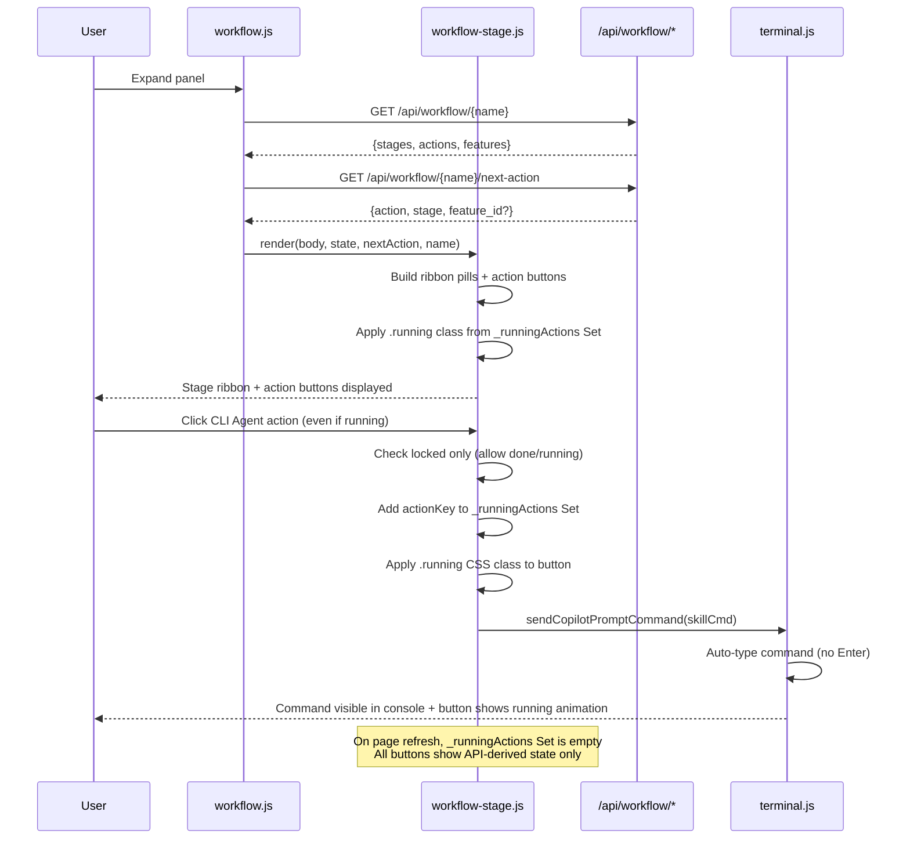
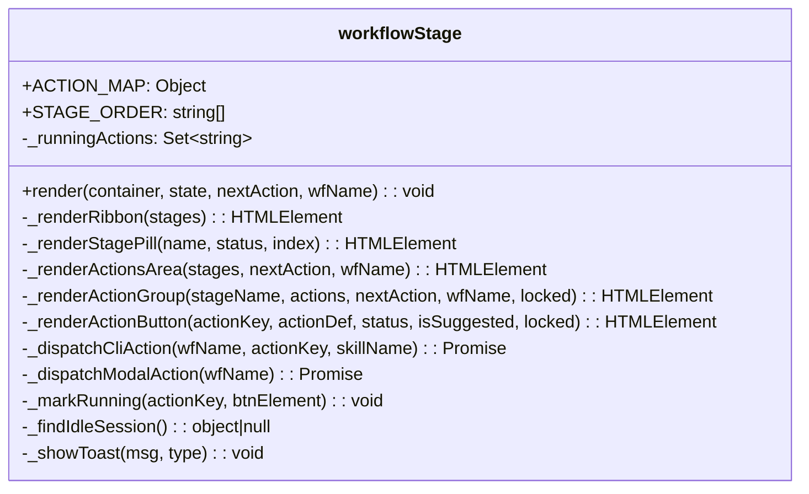

# FEATURE-036-C: Stage Ribbon & Action Execution — Technical Design

> Feature ID: FEATURE-036-C | Version: v1.1 | Last Updated: 03-04-2026

## Version History

| Version | Date | Description | Change Request |
|---------|------|-------------|----------------|
| v1.1 | 03-04-2026 | Action running state: clickable buttons during execution, CSS pulse-ring animation, client-side running state tracking | [CR-001](x-ipe-docs/requirements/EPIC-036/FEATURE-036-C/CR-001.md) |
| v1.0 | 02-17-2026 | Initial technical design | - |

## Part 1: Design Overview

### Key Components Implemented

| Component | Responsibility | Scope/Impact | Tags |
|-----------|----------------|--------------|------|
| Stage Ribbon Module | Render stage ribbon, action buttons, handle action dispatch, track client-side running state | `src/x_ipe/static/js/features/workflow-stage.js` | #workflow #stage #action-btn #running-state |
| Workflow View | Integrate stage module into panel body | `src/x_ipe/static/js/features/workflow.js` | #workflow #panel |
| Stage Styles | Stage ribbon, action button CSS, running animation | `src/x_ipe/static/css/workflow.css` | #css #animation #running |
| Action Execution Modal | Modal UI for action configuration before dispatch | `src/x_ipe/static/js/features/action-execution-modal.js` | #modal #action-execution |
| Action Modal Styles | Modal styles, remove in-progress click-blocking | `src/x_ipe/static/css/features/action-execution-modal.css` | #css #modal |

### Dependencies

| Dependency | Component | Usage |
|-----------|-----------|-------|
| FEATURE-036-A | `/api/workflow/{name}`, `/api/workflow/{name}/next-action` | Stage/action state, next-action suggestion |
| FEATURE-036-B | `workflow.js`, `workflow.css` | Panel container, panel body insertion point |
| Terminal | `terminal.js` → `sendCopilotPromptCommand()` | Auto-type CLI commands into idle session |

### Major Flow

```
Panel expanded → workflow.js calls workflow._fetchFullState(name)
  → GET /api/workflow/{name} returns full state with stages/actions
  → GET /api/workflow/{name}/next-action returns suggested action
  → workflowStage.renderRibbon(panelBody, workflowState, nextAction)
    → Renders stage pills (completed/active/pending/locked)
    → Renders action button groups per stage
    → Applies .running class to buttons in _runningActions Set
  → User clicks CLI Agent action button
    → workflowStage._dispatchCliAction(actionKey, skillName)
    → Button click allowed regardless of current status (only locked blocked)
    → Add actionKey to _runningActions Set → apply .running class
    → Find idle console session via terminal API
    → Auto-type skill command (no Enter)
  → User clicks Compose/Upload Idea
    → workflowStage._dispatchModalAction(workflowName)
    → Check idea_folder linked
    → If not: prompt → POST /api/workflow/{name}/link-idea
    → Open idea creation UI
  → On page refresh → _runningActions Set is empty → all buttons show API-derived state
```

### Usage Example

```javascript
// In workflow.js — when rendering expanded panel body
const body = document.createElement('div');
body.className = 'workflow-panel-body';

// Fetch full state for expanded panel
const fullState = await this._fetchFullState(wf.name);
const nextAction = await this._fetchNextAction(wf.name);

// Render stage ribbon + actions into body
workflowStage.render(body, fullState, nextAction, wf.name);

panel.appendChild(body);
```

---

## Part 2: Detailed Design

### Sequence Diagram



### Component Diagram



### Data Models

**ACTION_MAP — Static Configuration:**
```javascript
const ACTION_MAP = {
    ideation: {
        label: 'Ideation',
        actions: {
            compose_idea:    { label: 'Compose Idea',    icon: '📝', mandatory: true,  interaction: 'modal' },
            reference_uiux:  { label: 'Reference UIUX',  icon: '🎨', mandatory: false, interaction: 'cli', skill: 'x-ipe-tool-uiux-reference' },
            refine_idea:     { label: 'Refine Idea',     icon: '💡', mandatory: true,  interaction: 'cli', skill: 'x-ipe-task-based-ideation-v2' },
            design_mockup:   { label: 'Design Mockup',   icon: '🖼', mandatory: false, interaction: 'cli', skill: 'x-ipe-task-based-idea-mockup' },
        }
    },
    requirement: {
        label: 'Requirement',
        actions: {
            requirement_gathering: { label: 'Requirement Gathering', icon: '📋', mandatory: true, interaction: 'cli', skill: 'x-ipe-task-based-requirement-gathering' },
            feature_breakdown:     { label: 'Feature Breakdown',     icon: '🔀', mandatory: true, interaction: 'cli', skill: 'x-ipe-task-based-feature-breakdown' },
        }
    },
    implement: {
        label: 'Implement',
        actions: {
            feature_refinement: { label: 'Feature Refinement', icon: '📐', mandatory: true, interaction: 'cli', skill: 'x-ipe-task-based-feature-refinement' },
            technical_design:   { label: 'Technical Design',   icon: '⚙',  mandatory: true, interaction: 'cli', skill: 'x-ipe-task-based-technical-design' },
            implementation:     { label: 'Implementation',     icon: '💻', mandatory: true, interaction: 'cli', skill: 'x-ipe-task-based-code-implementation' },
        }
    },
    validation: {
        label: 'Validation',
        actions: {
            acceptance_testing:    { label: 'Acceptance Testing',    icon: '✅', mandatory: true,  interaction: 'cli', skill: 'x-ipe-task-based-feature-acceptance-test' },
            quality_evaluation:    { label: 'Quality Evaluation',    icon: '📊', mandatory: false, interaction: 'cli', skill: null, deferred: true },
        }
    },
    feedback: {
        label: 'Feedback',
        actions: {
            change_request: { label: 'Change Request', icon: '🔄', mandatory: false, interaction: 'cli', skill: 'x-ipe-task-based-change-request' },
        }
    }
};
```

**Workflow State (from API):**
```json
{
  "name": "my-workflow",
  "current_stage": "implement",
  "stages": {
    "ideation": {
      "status": "completed",
      "actions": {
        "compose_idea": { "status": "done", "deliverables": [] },
        "reference_uiux": { "status": "done", "deliverables": [] },
        "refine_idea": { "status": "done", "deliverables": [] },
        "design_mockup": { "status": "skipped", "deliverables": [] }
      }
    },
    "requirement": {
      "status": "completed",
      "actions": {
        "requirement_gathering": { "status": "done", "deliverables": [] },
        "feature_breakdown": { "status": "done", "deliverables": [] }
      }
    },
    "implement": {
      "status": "in_progress",
      "features": {}
    }
  }
}
```

**Next Action (from API):**
```json
{
  "success": true,
  "data": {
    "action": "feature_refinement",
    "stage": "implement",
    "feature_id": "FEATURE-040"
  }
}
```

### Module Structure — `workflow-stage.js`

```javascript
/**
 * FEATURE-036-C: Stage Ribbon & Action Execution
 * Renders stage progression ribbon and action buttons inside workflow panels.
 * v1.1: Client-side running state tracking (CR-001)
 */
const workflowStage = {
    STAGE_ORDER: ['ideation', 'requirement', 'implement', 'validation', 'feedback'],
    ACTION_MAP: { /* as defined above */ },

    // CR-001: Client-side running state — resets on page refresh
    _runningActions: new Set(),

    render(container, workflowState, nextAction, workflowName) {
        // 1. Render stage ribbon
        container.appendChild(this._renderRibbon(workflowState.stages));
        // 2. Render action button areas (applies .running from _runningActions Set)
        container.appendChild(this._renderActionsArea(workflowState.stages, nextAction, workflowName));
    },

    _renderRibbon(stages) {
        // Create .stage-ribbon div with .stage-item pills separated by .stage-arrow spans
    },

    _renderStagePill(name, status, index) {
        // Create a stage pill with appropriate visual state
    },

    _renderActionsArea(stages, nextAction, wfName) {
        // Group actions: completed stages grouped, active stage shown, first locked stage shown
    },

    _renderActionGroup(stageName, actions, nextAction, wfName, locked) {
        // Render label + action button grid for one stage
    },

    _renderActionButton(actionKey, actionDef, status, isSuggested, locked, wfName, isOptional) {
        // Create button with state: done/suggested/normal/locked
        // CR-001: After applying API-derived class, also apply .running if actionKey in _runningActions
        const btn = document.createElement('button');
        // ... set base class from API status ...
        if (this._runningActions.has(actionKey)) {
            btn.classList.add('running');
        }
        // Click handler — only block locked actions
        btn.onclick = () => {
            if (locked || actionDef.deferred) return;
            // Allow clicks even on done/running actions
            this._markRunning(actionKey, btn);
            // ... dispatch to modal or CLI ...
        };
        return btn;
    },

    // CR-001: Mark action as running (client-side only)
    _markRunning(actionKey, btnElement) {
        this._runningActions.add(actionKey);
        btnElement.classList.add('running');
    },

    async _dispatchCliAction(wfName, actionKey, skillName) {
        // 1. Only block locked (not done/in_progress)
        // 2. Find idle session
        // 3. Auto-type skill command
    },

    async _dispatchModalAction(wfName) {
        // 1. Check idea_folder
        // 2. Prompt if missing → link via API
        // 3. Open idea creation UI
    },

    _findIdleSession() {
        // Inspect terminal pane manager for idle session
    },

    _showToast(msg, type) {
        // Reuse workflow toast pattern
    }
};
```

### Changes to `workflow.js`

**Panel body rendering** — replace current static body with rich content:

```javascript
// Current (FEATURE-036-B):
body.innerHTML = `
    <div class="workflow-panel-body-row">...</div>`;

// Updated (FEATURE-036-C):
// 1. Fetch full state when panel is expanded
// 2. Call workflowStage.render() to populate body
// 3. Keep metadata rows at the bottom

async _renderPanelBody(wf, body) {
    try {
        const [stateResp, nextResp] = await Promise.all([
            fetch(`/api/workflow/${wf.name}`).then(r => r.json()),
            fetch(`/api/workflow/${wf.name}/next-action`).then(r => r.json())
        ]);
        if (stateResp.success) {
            workflowStage.render(body, stateResp.data, nextResp.data, wf.name);
        }
    } catch (err) {
        body.innerHTML = `<div class="workflow-error">Failed to load workflow details. <button onclick="...">Retry</button></div>`;
    }
    // Append metadata rows after ribbon
    const meta = document.createElement('div');
    meta.className = 'workflow-panel-meta-section';
    const created = wf.created ? new Date(wf.created).toLocaleDateString() : 'N/A';
    const lastAct = wf.last_activity ? new Date(wf.last_activity).toLocaleString() : 'N/A';
    meta.innerHTML = `
        <div class="workflow-panel-body-row"><span class="workflow-panel-body-label">Created</span><span>${created}</span></div>
        <div class="workflow-panel-body-row"><span class="workflow-panel-body-label">Last Activity</span><span>${lastAct}</span></div>`;
    body.appendChild(meta);
}
```

**Panel expand trigger** — lazy-load full state:

The existing `header.onclick` toggle handler should call `_renderPanelBody` when expanding (first time or refresh):

```javascript
header.onclick = async () => {
    const exp = panel.classList.toggle('expanded');
    if (exp) {
        this.expandedPanels.add(wf.name);
        body.innerHTML = ''; // Clear previous content
        await this._renderPanelBody(wf, body);
    } else {
        this.expandedPanels.delete(wf.name);
    }
};
```

### CSS Additions to `workflow.css`

```css
/* Stage Ribbon */
.stage-ribbon { display: flex; align-items: center; padding: 14px 16px; gap: 0; overflow-x: auto; border-bottom: 1px solid var(--border-color, #333); }
.stage-item { display: flex; align-items: center; gap: 6px; padding: 6px 14px; border-radius: 9999px; font-size: 12px; font-weight: 600; white-space: nowrap; }
.stage-item.completed { background: rgba(34,197,94,0.15); color: #22c55e; border: 1px solid rgba(34,197,94,0.3); }
.stage-item.active { background: linear-gradient(135deg, #10b981 0%, #059669 100%); color: #fff; border: 1px solid transparent; box-shadow: 0 2px 8px rgba(16,185,129,0.3); }
.stage-item.pending { background: rgba(255,255,255,0.05); color: #94a3b8; border: 1px solid #334155; }
.stage-item.locked { background: rgba(255,255,255,0.02); color: #475569; border: 1px solid #1e293b; opacity: 0.5; }
.stage-check { width: 16px; height: 16px; border-radius: 50%; background: #22c55e; display: flex; align-items: center; justify-content: center; color: #fff; font-size: 10px; }
.stage-dot { width: 8px; height: 8px; border-radius: 50%; background: rgba(255,255,255,0.6); animation: pulse-dot 2s infinite; }
.stage-num { width: 16px; height: 16px; border-radius: 50%; border: 1.5px solid #475569; display: flex; align-items: center; justify-content: center; font-size: 9px; }
.stage-arrow { color: #475569; font-size: 14px; padding: 0 6px; }

@keyframes pulse-dot { 0%,100% { opacity: 0.6; transform: scale(1); } 50% { opacity: 1; transform: scale(1.3); } }

/* Actions Area */
.actions-area { padding: 14px 16px; border-bottom: 1px solid var(--border-color, #333); }
.actions-label { font-size: 11px; font-weight: 600; text-transform: uppercase; letter-spacing: 0.8px; color: #94a3b8; margin-bottom: 10px; }
.actions-label .actions-label-sub { font-weight: 400; text-transform: none; letter-spacing: normal; color: #64748b; margin-left: 4px; }
.actions-grid { display: flex; flex-wrap: wrap; gap: 8px; }

/* Action Buttons */
.action-btn { display: flex; align-items: center; gap: 6px; padding: 7px 12px; border-radius: 6px; font-size: 12px; font-weight: 500; cursor: pointer; transition: all 0.2s; border: 1.5px solid; }
.action-btn .action-icon { font-size: 14px; flex-shrink: 0; }
.action-btn.done { background: rgba(34,197,94,0.1); border-color: rgba(34,197,94,0.3); color: #22c55e; }
.action-btn.done::before { content: '✓'; font-size: 10px; font-weight: 700; width: 14px; height: 14px; border-radius: 50%; background: #22c55e; color: #fff; display: flex; align-items: center; justify-content: center; }
.action-btn.suggested { background: rgba(245,158,11,0.1); border-color: #f59e0b; border-style: dashed; color: #f59e0b; animation: gentle-glow 3s ease-in-out infinite; }
.action-btn.suggested::before { content: '→'; font-size: 12px; font-weight: 700; color: #f59e0b; }
.action-btn.suggested:hover { border-style: solid; background: rgba(245,158,11,0.15); transform: translateY(-1px); }
.action-btn.normal { background: rgba(255,255,255,0.05); border-color: #334155; color: #94a3b8; }
.action-btn.normal::before { content: '○'; font-size: 11px; color: #475569; }
.action-btn.normal:hover { border-color: #64748b; background: rgba(255,255,255,0.08); }
.action-btn.locked { background: rgba(255,255,255,0.02); border-color: #1e293b; color: #475569; cursor: not-allowed; opacity: 0.5; }
.action-btn.locked::before { content: '🔒'; font-size: 10px; }

@keyframes gentle-glow { 0%,100% { box-shadow: 0 0 0 0 transparent; } 50% { box-shadow: 0 0 0 3px rgba(245,158,11,0.15); } }

/* Meta section below ribbon */
.workflow-panel-meta-section { padding: 10px 16px; border-top: 1px solid var(--border-color, #333); }
.workflow-panel-meta-section .workflow-panel-body-row { font-size: 12px; }

/* Error state */
.workflow-error { padding: 20px; text-align: center; color: #ef4444; }
.workflow-error button { margin-top: 8px; padding: 4px 12px; border-radius: 4px; border: 1px solid #ef4444; background: transparent; color: #ef4444; cursor: pointer; }
```

### Script Tag Addition

Add to `base.html` after the `workflow.js` script tag:
```html
<script src="{{ url_for('static', filename='js/features/workflow-stage.js') }}"></script>
```

### Console Integration — Finding Idle Session

```javascript
_findIdleSession() {
    // Access the terminal pane manager (global)
    if (typeof paneManager === 'undefined') return null;
    // Find a session that is not currently running a command
    // Use the same pattern as the copilot button
    const activeIdx = paneManager.activeIndex;
    if (activeIdx >= 0) return { index: activeIdx };
    return null;
},

async _dispatchCliAction(wfName, actionKey, skillName) {
    if (!skillName) {
        this._showToast('This action is not yet available', 'error');
        return;
    }

    // Open console if hidden
    const consoleEl = document.querySelector('.console-container');
    if (consoleEl && consoleEl.classList.contains('hidden')) {
        document.querySelector('[title*="Toggle terminal"]')?.click();
    }

    // Find idle session & type command
    setTimeout(() => {
        if (typeof sendCopilotPromptCommand === 'function') {
            sendCopilotPromptCommand(skillName);
        } else if (typeof paneManager !== 'undefined' && paneManager._typeWithEffect) {
            const socket = paneManager.sockets[paneManager.activeIndex];
            if (socket) {
                paneManager._typeWithEffect(socket, skillName, null, false);
            } else {
                this._showToast('No idle console session available. Open a new session first.', 'error');
            }
        } else {
            this._showToast('Console not available', 'error');
        }
    }, 300);
}
```

### Implementation Steps

1. **Create `workflow-stage.js`** — module with render, ribbon, actions, dispatch logic (~200 lines)
2. **Update `workflow.css`** — append stage ribbon and action button styles (~80 lines)
3. **Update `workflow.js`** — modify `_renderPanel` to use `_renderPanelBody` with lazy-load on expand (~30 lines changed)
4. **Update `base.html`** — add `<script>` tag for `workflow-stage.js`
5. **Run tests** — verify existing workflow tests pass, run new tests

### Edge Cases

| Scenario | Handling |
|----------|----------|
| API error fetching full state | Show error div in panel body with retry button |
| No idle console session | Toast: "No idle console session available" |
| Action already done | Toast: "Action already completed" |
| Locked action clicked | Toast: "Complete {stage} to unlock this action" |
| Quality Evaluation (deferred) | Button rendered with disabled state + "Coming Soon" tooltip |
| Workflow has no features yet | Implement/Validation/Feedback stages show as locked |
| Rapid panel expand/collapse | Debounce API calls; abort previous fetch on re-expand |
