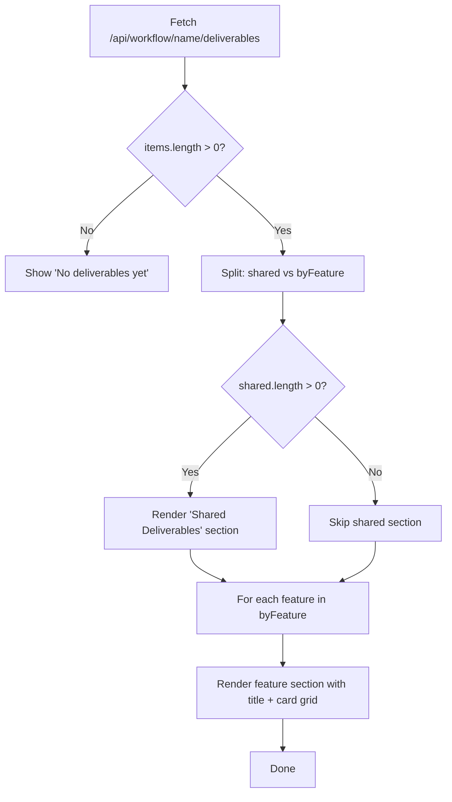

# FEATURE-036-E: Technical Design — Deliverables, Polling & Lifecycle

## Version History

| Version | Date | Author | Changes |
|---------|------|--------|---------|
| v1.1 | 03-05-2026 | Drift | CR-001: Restructure deliverables from stage-grouped to feature-grouped layout |
| v1.0 | 02-17-2026 | Spark | Initial design |

## References

- [Specification](x-ipe-docs/requirements/EPIC-036/FEATURE-036-E/specification.md)
- [Mockup](x-ipe-docs/requirements/EPIC-036/mockups/workflow-view-v1.html) (deliverables: lines ~856–964, 1537–1605)

---

## 1. Component Diagram

```
┌──────────────────────────────────────────────────────────────────┐
│ Backend                                                          │
│  workflow_manager_service.py                                     │
│    ├── resolve_deliverables(name)       ★ NEW                    │
│    ├── archive_stale_workflows()        ★ NEW                    │
│    └── list_workflows()                 MOD (exclude archived)   │
│                                                                  │
│  workflow_routes.py                                              │
│    └── GET /api/workflow/<name>/deliverables   ★ NEW             │
├──────────────────────────────────────────────────────────────────┤
│ Frontend                                                         │
│  workflow-stage.js (extended)                                    │
│    ├── _renderDeliverables()            ★ NEW (v1.0)             │
│    │     └── CR-001: grouping changed   MOD (v1.1)              │
│    ├── _renderDeliverableCard()         ★ NEW                    │
│    └── _renderContextMenu()            ★ NEW (manual override)   │
│                                                                  │
│  workflow.js (extended)                                          │
│    ├── _startPolling()                  ★ NEW                    │
│    ├── _stopPolling()                   ★ NEW                    │
│    └── _renderPanelBody()              MOD (+ deliverables)      │
│                                                                  │
│  workflow.css (extended)                                         │
│    └── deliverables + context menu CSS  ★ NEW                    │
└──────────────────────────────────────────────────────────────────┘
```

## 2. Data Models

### 2.1 Deliverables API Response

```javascript
// GET /api/workflow/{name}/deliverables
{
  "success": true,
  "data": {
    "deliverables": [
      { "name": "idea-summary-v2.md", "path": "ideas/021/idea-summary-v2.md", "category": "ideas", "exists": true },
      { "name": "specification.md", "path": "requirements/FEATURE-040/specification.md", "category": "requirements", "exists": true },
      { "name": "missing-file.py", "path": "src/missing.py", "category": "implementations", "exists": false }
    ],
    "count": 3
  }
}
```

### 2.2 Deliverable Categories

```python
DELIVERABLE_CATEGORIES = {
    "compose_idea":         "ideas",
    "refine_idea":          "ideas",
    "reference_uiux":       "mockups",
    "design_mockup":        "mockups",
    "requirement_gathering": "requirements",
    "feature_breakdown":    "requirements",
    "feature_refinement":   "requirements",
    "technical_design":     "requirements",
    "implementation":       "implementations",
    "acceptance_testing":   "quality",
    "quality_evaluation":   "quality",
    "change_request":       "requirements",
}
```

### 2.3 Category UI Config

```javascript
const DELIVERABLE_ICONS = {
    ideas:           { icon: '💡', label: 'Ideas' },
    mockups:         { icon: '🎨', label: 'Mockups' },
    requirements:    { icon: '📋', label: 'Requirements' },
    implementations: { icon: '💻', label: 'Implementations' },
    quality:         { icon: '📊', label: 'Quality' },
};
```

## 3. Implementation Steps

### Step 1: Backend — Deliverables Resolver

**File:** `src/x_ipe/services/workflow_manager_service.py`

Add method `resolve_deliverables(workflow_name)`:
```
1. Read workflow state
2. Iterate all stages and all actions (shared + per-feature)
3. For each action with non-empty deliverables array:
   - Determine category from DELIVERABLE_CATEGORIES map
   - For each deliverable path:
     - Extract filename (basename)
     - Check file existence: (project_root / path).exists()
     - Add to result list
4. Return { deliverables: [...], count: N }
```

### Step 2: Backend — Auto-Archive

**File:** `src/x_ipe/services/workflow_manager_service.py`

Add method `archive_stale_workflows(days=30)`:
```
1. Create archive directory if not exists
2. For each workflow JSON in workflow_dir:
   - Parse last_activity timestamp
   - If now - last_activity > days: move file to archive/
3. Return count of archived workflows
```

Modify `list_workflows()`:
- Already only reads from `workflow_dir` (not archive), so no change needed.

### Step 3: Backend — New API Route

**File:** `src/x_ipe/routes/workflow_routes.py`

Add route:
```python
@workflow_bp.route('/api/workflow/<name>/deliverables', methods=['GET'])
def get_deliverables(name):
    result = _get_service().resolve_deliverables(name)
    return jsonify({'success': True, 'data': result})
```

### Step 4: Frontend — Deliverables Section

**File:** `src/x_ipe/static/js/features/workflow-stage.js`

Add methods:
- `_renderDeliverables(container, wfName)` — fetch deliverables API, render collapsible section
- `_renderDeliverableCard(item)` — individual card with icon, name, path, existence status

Modify `render()`:
```
render(container, workflowState, nextAction, workflowName) {
    // ... existing ribbon + lanes/actions ...
    this._renderDeliverables(container, workflowName);
}
```

### Step 5: Frontend — Polling

**File:** `src/x_ipe/static/js/features/workflow.js`

Add polling logic:
- `_startPolling(wfName, body, wf)` — setInterval(7000) that:
  1. Fetches `GET /api/workflow/{name}`
  2. Compares `last_activity` with stored value
  3. If changed: clear body, re-render via `_renderPanelBody()`
- `_stopPolling(wfName)` — clearInterval
- Store intervals in `this._pollingIntervals = {}`

Modify `_renderPanelBody()`:
- After rendering, call `_startPolling()` for this panel

Modify panel collapse:
- Call `_stopPolling(wf.name)` on collapse

### Step 6: Frontend — Context Menu (Manual Override)

**File:** `src/x_ipe/static/js/features/workflow-stage.js`

Add `_renderContextMenu(actionKey, wfName, featureId)`:
- Create positioned div with "Mark as Done" / "Reset to Pending" options
- On click: call `POST /api/workflow/{name}/action` with status
- Close on outside click

Add context menu trigger:
- On `_renderActionButton()` and feature lane stage dots: `btn.oncontextmenu = (e) => ...`

### Step 7: CSS

**File:** `src/x_ipe/static/css/workflow.css`

Append CSS for:
- `.deliverables-area`, `.deliverables-header`, `.deliverables-grid`
- `.deliverable-card`, `.deliverable-icon.{category}`, `.deliverable-name`, `.deliverable-path`
- `.deliverable-missing` (⚠️ indicator)
- `.deliverables-count` badge
- `.deliverables-toggle` chevron
- `.context-menu`, `.context-menu-item`

## 4. CSS Specifications

```css
/* Deliverables */
.deliverables-area          { padding: 16px 0; border-top: 1px solid var(--border-color); margin-top: 12px; }
.deliverables-header        { display: flex; justify-content: space-between; align-items: center; cursor: pointer; padding: 4px 0; }
.deliverables-title         { font-size: 13px; font-weight: 600; color: var(--text-primary); display: flex; align-items: center; gap: 8px; }
.deliverables-count         { font-size: 11px; padding: 1px 8px; background: rgba(59,130,246,0.15); color: #3b82f6; border-radius: 10px; }
.deliverables-toggle        { font-size: 14px; color: var(--text-muted); transition: transform 0.2s; }
.deliverables-grid          { display: grid; grid-template-columns: repeat(auto-fill, minmax(200px, 1fr)); gap: 8px; margin-top: 10px; }
.deliverables-empty         { color: var(--text-muted); font-size: 12px; padding: 12px 0; }
.deliverable-card           { display: flex; align-items: center; gap: 10px; padding: 10px 12px; background: var(--card-bg); border: 1px solid var(--border-color); border-radius: 6px; transition: all 0.2s; cursor: default; }
.deliverable-card:hover     { border-color: var(--accent); }
.deliverable-card.missing   { opacity: 0.6; }
.deliverable-icon           { width: 32px; height: 32px; display: flex; align-items: center; justify-content: center; border-radius: 6px; font-size: 16px; flex-shrink: 0; }
.deliverable-icon.ideas           { background: rgba(168,85,247,0.15); }
.deliverable-icon.mockups         { background: rgba(236,72,153,0.15); }
.deliverable-icon.requirements    { background: rgba(59,130,246,0.15); }
.deliverable-icon.implementations { background: rgba(245,158,11,0.15); }
.deliverable-icon.quality         { background: rgba(16,185,129,0.15); }
.deliverable-info           { flex: 1; min-width: 0; }
.deliverable-name           { font-size: 12px; font-weight: 500; color: var(--text-primary); white-space: nowrap; overflow: hidden; text-overflow: ellipsis; }
.deliverable-path           { font-size: 10px; font-family: monospace; color: var(--text-muted); white-space: nowrap; overflow: hidden; text-overflow: ellipsis; }
.deliverable-missing-badge  { font-size: 10px; color: #ef4444; white-space: nowrap; }

/* Context Menu */
.wf-context-menu            { position: fixed; z-index: 100; background: var(--card-bg); border: 1px solid var(--border-color); border-radius: 6px; box-shadow: 0 4px 16px rgba(0,0,0,0.3); min-width: 160px; padding: 4px 0; }
.wf-context-menu-item       { display: block; width: 100%; padding: 8px 14px; font-size: 12px; color: var(--text-primary); background: none; border: none; cursor: pointer; text-align: left; }
.wf-context-menu-item:hover { background: rgba(255,255,255,0.08); }
```

## 5. Sequence Diagrams

### 5.1 Deliverables Load

```
User expands panel
  │
  ├── workflow.js._renderPanelBody()
  │     ├── workflowStage.render()  (ribbon + lanes/actions)
  │     └── workflowStage._renderDeliverables(container, wfName)
  │           ├── GET /api/workflow/{name}/deliverables
  │           ├── Render collapsible section with grid
  │           └── Each card: icon + name + path + exists check
  │
  └── Deliverables section visible in panel body
```

### 5.2 Polling Flow

```
Panel expanded → _startPolling(wfName)
  │
  ├── setInterval(7000)
  │     ├── GET /api/workflow/{name}
  │     ├── Compare last_activity
  │     ├── IF changed:
  │     │     ├── Clear body
  │     │     └── _renderPanelBody() (full re-render)
  │     └── IF same: no-op
  │
  └── Panel collapsed → _stopPolling(wfName)
       └── clearInterval
```

### 5.3 Manual Override

```
User right-clicks action button
  │
  ├── preventDefault() (suppress native menu)
  ├── _renderContextMenu(actionKey, wfName, featureId)
  │     ├── "Mark as Done" → POST /api/workflow/{name}/action { status: "done" }
  │     └── "Reset to Pending" → POST /api/workflow/{name}/action { status: "pending" }
  │
  └── UI refreshes via polling or immediate re-render
```

## 6. Integration Points

| Component | Change | Impact |
|-----------|--------|--------|
| `workflow_manager_service.py` | Add resolve_deliverables(), archive_stale_workflows() | Low — additive |
| `workflow_routes.py` | Add GET /deliverables endpoint | Low — additive |
| `workflow-stage.js` render() | Add deliverables call after ribbon+lanes | Low |
| `workflow-stage.js` action buttons | Add oncontextmenu handler | Low |
| `workflow.js` _renderPanelBody() | Add polling start | Low |
| `workflow.js` panel collapse | Add polling stop | Low |
| `workflow.css` | Append deliverables + context menu CSS | None (additive) |

## 7. Edge Cases

| Case | Handling |
|------|----------|
| No deliverables | Show "No deliverables yet" message |
| API error on deliverables fetch | Show error state in section |
| Poll returns same state | No re-render (timestamp comparison) |
| Multiple panels expanded | Each has independent polling interval |
| Navigate away from Workflow | Stop all polling intervals |
| Right-click on locked action | Context menu still shows (override allowed) |
| Archive directory doesn't exist | Create it on first archive |

---

## Part 1: Agent-Facing Summary (CR-001 Update)

> **Purpose:** Quick reference for AI agents implementing CR-001 changes only.
> **📌 AI Coders:** This section covers the v1.1 delta — feature-grouped deliverables layout.

### Key Components Implemented

| Component | Responsibility | Scope/Impact | Tags |
|-----------|----------------|--------------|------|
| `_renderDeliverables()` in workflow-stage.js | Restructure grouping from stage-first to feature-first for per-feature deliverables | Lines 973–1113 of workflow-stage.js | #deliverables #frontend #grouping #cr-001 |
| CSS: `.deliverables-feature-section`, `.deliverables-feature-section-title` | New CSS classes for feature sections | workflow.css deliverables block | #css #deliverables #layout |

### Dependencies

| Dependency | Source | Design Link | Usage Description |
|------------|--------|-------------|-------------------|
| Backend API `/api/workflow/{name}/deliverables` | FEATURE-036-E v1.0 | This document §2.1 | Returns `feature_id`/`feature_name` per item — already exists, no changes needed |
| `DeliverableViewer` | FEATURE-038-C | `x-ipe-docs/requirements/EPIC-038/FEATURE-038-C/technical-design.md` | Renders folder-type cards — called per-card, independent of grouping |
| `FolderBrowserModal` | FEATURE-039-B | `x-ipe-docs/requirements/EPIC-039/FEATURE-039-B/specification.md` | Opens on folder card click — independent of grouping |

### Major Flow (CR-001 Delta)

1. Fetch deliverables from API (unchanged)
2. Split items into `shared` (no `feature_id`) and `byFeature` (grouped by `feature_id`)
3. Render "Shared Deliverables" section with shared items in a card grid
4. For each feature that has deliverables, render a feature section with title and card grid
5. Card rendering (icons, preview, folder modal) unchanged

### Usage Example

```javascript
// CR-001: New grouping logic inside _renderDeliverables()
const shared = [];
const byFeature = {};

items.forEach(item => {
    if (!item.feature_id) {
        shared.push(item);
    } else {
        if (!byFeature[item.feature_id]) {
            byFeature[item.feature_id] = { name: item.feature_name || item.feature_id, items: [] };
        }
        byFeature[item.feature_id].items.push(item);
    }
});

// Render shared section (if any)
if (shared.length > 0) {
    const section = createSection('Shared Deliverables');
    shared.forEach(item => section.grid.appendChild(renderCard(item)));
    grid.appendChild(section.el);
}

// Render per-feature sections
for (const [fid, fdata] of Object.entries(byFeature)) {
    const section = createSection(fdata.name);
    fdata.items.forEach(item => section.grid.appendChild(renderCard(item)));
    grid.appendChild(section.el);
}
```

---

## Part 2: Implementation Guide (CR-001 Update)

### Workflow Diagram



### Implementation Steps

#### Step 1: Modify `_renderDeliverables()` in workflow-stage.js (lines 1017–1104)

**Replace** the current grouping logic (lines 1023–1104) which uses `CATEGORY_STAGE`, `SHARED_STAGES`, `sharedByStage`, `featureByStage`, and the stage-ordered rendering loop.

**New logic:**

```javascript
// 1. Split items into shared vs per-feature
const shared = [];
const byFeature = {};
items.forEach(item => {
    if (!item.feature_id) {
        shared.push(item);
    } else {
        if (!byFeature[item.feature_id]) {
            byFeature[item.feature_id] = { name: item.feature_name || item.feature_id, items: [] };
        }
        byFeature[item.feature_id].items.push(item);
    }
});

// Helper: create a section with title + card grid
const createSection = (title) => {
    const section = document.createElement('div');
    section.className = 'deliverables-feature-section';
    const sTitle = document.createElement('div');
    sTitle.className = 'deliverables-feature-section-title';
    sTitle.textContent = title;
    section.appendChild(sTitle);
    const row = document.createElement('div');
    row.className = 'deliverables-row';
    section.appendChild(row);
    return { el: section, grid: row };
};

// 2. Render shared deliverables section (if any)
if (shared.length > 0) {
    const s = createSection('Shared Deliverables');
    shared.forEach(item => s.grid.appendChild(renderCard(item)));
    grid.appendChild(s.el);
}

// 3. Render per-feature sections
for (const [fid, fdata] of Object.entries(byFeature)) {
    const s = createSection(fdata.name);
    fdata.items.forEach(item => s.grid.appendChild(renderCard(item)));
    grid.appendChild(s.el);
}
```

**What gets removed:**
- `CATEGORY_STAGE` constant
- `SHARED_STAGES` constant
- `sharedByStage` / `featureByStage` objects
- The `for (const stage of allStages)` rendering loop with nested shared/feature sub-loops

**What stays unchanged:**
- `renderCard()` helper (lines 1047–1061) — renders both folder and file cards
- `DeliverableViewer` and `FolderBrowserModal` instantiation (lines 1018–1021)
- Error handling (lines 1106–1112)
- Header, toggle, count badge (lines 978–1004)

#### Step 2: Add CSS for feature sections in workflow.css

**Append after** existing `.deliverables-feature-label` rule (line 581):

```css
.deliverables-feature-section { margin-bottom: 16px; }
.deliverables-feature-section:last-child { margin-bottom: 0; }
.deliverables-feature-section-title { font-size: 11px; font-weight: 600; color: var(--wf-slate-400); text-transform: uppercase; letter-spacing: 0.8px; margin-bottom: 10px; }
```

**Existing classes that can be removed** (dead code after CR-001):
- `.deliverables-stage-section` → replaced by `.deliverables-feature-section`
- `.deliverables-stage-title` → replaced by `.deliverables-feature-section-title`
- `.deliverables-feature-group` → no longer used (features are top-level sections now)
- `.deliverables-feature-label` → replaced by `.deliverables-feature-section-title`

### Edge Cases (CR-001 specific)

| Case | Handling |
|------|---------|
| All deliverables are shared (no features yet) | Only "Shared Deliverables" section shown |
| All deliverables are per-feature (no shared) | Only feature sections shown, no shared section |
| Feature has deliverables across multiple stages | All combined in one feature section |
| Feature with no deliverables | Not shown (empty features omitted) |
| Backend returns items without `feature_id` from implement/validation | Treated as shared (grouped with shared section) |

### Files Changed

| File | Change Type | Lines Affected |
|------|-------------|----------------|
| `src/x_ipe/static/js/features/workflow-stage.js` | Modify | ~1023–1104 (replace grouping logic) |
| `src/x_ipe/static/css/workflow.css` | Add + Remove | Add 3 rules, remove 4 dead rules (lines 577–581) |

---

## Design Change Log

| Date | Phase | Change Summary |
|------|-------|----------------|
| 03-05-2026 | Technical Design (CR-001) | Restructure `_renderDeliverables()` from stage-grouped to feature-grouped layout. Replace `CATEGORY_STAGE`/`SHARED_STAGES`/`sharedByStage`/`featureByStage` with simple `shared`/`byFeature` split based on `feature_id` presence. Add new CSS `.deliverables-feature-section` classes, remove dead `.deliverables-stage-section` classes. No backend changes. |
| 02-17-2026 | Initial Design | Initial technical design created. |
