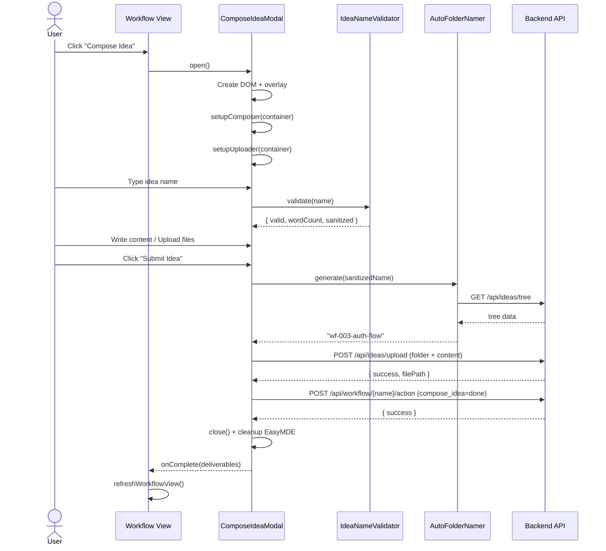
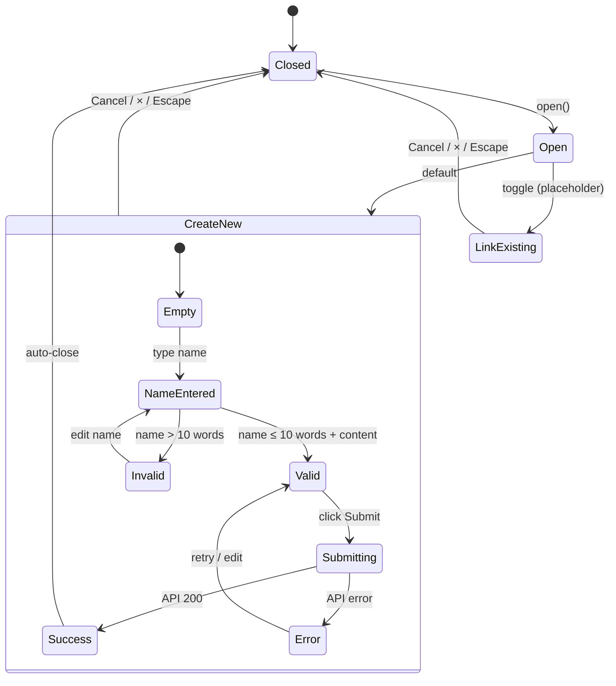
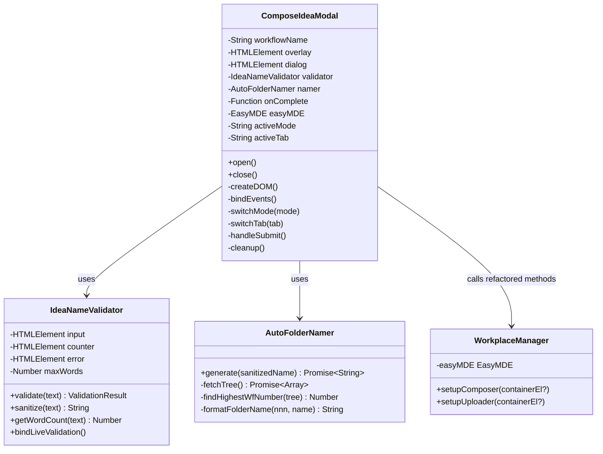

# Technical Design: Compose Idea Modal — Create New

> Feature ID: FEATURE-037-A | Version: v1.0 | Last Updated: 2026-02-19

---

## Part 1: Agent-Facing Summary

> **Purpose:** Quick reference for AI agents navigating large projects.
> **📌 AI Coders:** Focus on this section for implementation context.

### Key Components Implemented

| Component | Responsibility | Scope/Impact | Tags |
|-----------|----------------|--------------|------|
| `ComposeIdeaModal` | Modal lifecycle, toggle, submit orchestration | New JS class in workflow feature | #modal #compose-idea #workflow #frontend |
| `IdeaNameValidator` | Name input validation + sanitization + word count | Reused by both Create New and Link Existing | #validation #input #compose-idea |
| `AutoFolderNamer` | Generate `wf-NNN-{name}` from ideas tree | Scans `/api/ideas/tree` for highest wf-XXX | #naming #folder #compose-idea |
| `WorkplaceManager.setupComposer(containerEl)` | Refactored: accept optional container param | Backward-compatible change in workplace.js | #refactor #workplace #easymde |
| `WorkplaceManager.setupUploader(containerEl)` | Refactored: accept optional container param | Backward-compatible change in workplace.js | #refactor #workplace #upload |

### Dependencies

| Dependency | Source | Design Link | Usage Description |
|------------|--------|-------------|-------------------|
| `WorkplaceManager` | FEATURE-008 | workplace.js | Reuse setupComposer/setupUploader (refactored for container param) |
| `WorkflowManager` | FEATURE-036-A | workflow_manager_service.py | Call update_workflow_action to auto-complete compose_idea |
| `StageRibbon` | FEATURE-036-C | [specification.md](../FEATURE-036-C/specification.md) | Provides "Compose Idea" action button click that opens this modal |
| `/api/ideas/tree` | FEATURE-008 | ideas_routes.py | Fetch tree for wf-NNN auto-increment scan |
| `/api/ideas/upload` | FEATURE-008 | ideas_routes.py | Submit new idea files to generated folder |
| `/api/workflow/{name}/action` | FEATURE-036-A | app_agent_interaction.py | Update compose_idea action status to "done" |
| EasyMDE | External lib | Already in app | Markdown editor in Compose tab |

### Major Flow

1. User clicks "Compose Idea" → `ComposeIdeaModal.open()` creates DOM, shows overlay
2. User types idea name → `IdeaNameValidator` validates word count ≤ 10, enables/disables submit
3. User writes in Compose tab (EasyMDE via refactored `setupComposer(modalContainer)`) or uploads in Upload tab
4. User clicks "Submit Idea" → `AutoFolderNamer.generate()` fetches tree, finds next wf-NNN → `POST /api/ideas/upload` → on success → `POST /api/workflow/{name}/action` with compose_idea=done → modal closes

### Usage Example

```javascript
// Triggered from FEATURE-036-C action button click handler
const modal = new ComposeIdeaModal({
    workflowName: 'my-project',
    onComplete: (deliverables) => {
        // deliverables = { file: 'wf-003-auth-flow/idea.md', folder: 'wf-003-auth-flow' }
        refreshWorkflowView();
    }
});
modal.open();
```

---

## Part 2: Implementation Guide

> **Purpose:** Human-readable details for developers.
> **📌 Emphasis on visual diagrams for comprehension.**

### Workflow Diagram



### State Diagram



### Class Diagram



### Component Architecture

```
compose-idea-modal.js (new file ~400 lines)
├── ComposeIdeaModal        — Modal lifecycle + orchestration
├── IdeaNameValidator       — Name input validation
└── AutoFolderNamer         — wf-NNN folder generation

workplace.js (modify ~30 lines)
├── setupComposer(containerEl?)  — Add optional param
└── setupUploader(containerEl?)  — Add optional param

compose-idea-modal.css (new file ~200 lines)
└── Modal-specific styles (overlay, dialog, toggle, tabs, etc.)
```

### File Changes

| File | Action | Description |
|------|--------|-------------|
| `src/x_ipe/static/js/features/compose-idea-modal.js` | **CREATE** | ComposeIdeaModal, IdeaNameValidator, AutoFolderNamer classes |
| `src/x_ipe/static/css/features/compose-idea-modal.css` | **CREATE** | Modal overlay, dialog, toggle, tabs, name input, action footer styles |
| `src/x_ipe/static/js/features/workplace.js` | **MODIFY** | Refactor setupComposer/setupUploader to accept containerEl param |
| `src/x_ipe/templates/index.html` | **MODIFY** | Add CSS/JS link for compose-idea-modal |
| `src/x_ipe/static/js/features/workflow.js` | **MODIFY** | Wire "Compose Idea" action click → ComposeIdeaModal.open() |

### Implementation Steps

#### Step 1: Workplace JS Refactoring (prerequisite)

Refactor `setupComposer()` and `setupUploader()` in workplace.js:

```javascript
// BEFORE (hardcoded):
setupComposer() {
    const submitBtn = document.getElementById('workplace-submit-idea');
    const textarea = document.getElementById('workplace-compose-textarea');
    // ...
}

// AFTER (parameterized, backward-compatible):
setupComposer(containerEl = null) {
    const root = containerEl || document;
    const submitBtn = root.querySelector('#workplace-submit-idea') ||
                      root.querySelector('[data-action="submit-idea"]');
    const textarea = root.querySelector('#workplace-compose-textarea') ||
                     root.querySelector('[data-role="compose-textarea"]');
    // ... rest unchanged, just use root.querySelector() instead of document.getElementById()
}
```

Same pattern for `setupUploader(containerEl = null)`.

**Validation:** Run existing Workplace tests to confirm backward compatibility.

#### Step 2: Create CSS (compose-idea-modal.css)

Follow existing stage-toolbox modal pattern:

```css
/* Overlay — matches existing app pattern */
.compose-modal-overlay {
    position: fixed;
    inset: 0;
    background: rgba(0, 0, 0, 0.4);
    backdrop-filter: blur(4px);
    z-index: 1051;  /* above stage-toolbox (1050) */
    opacity: 0;
    visibility: hidden;
    transition: all 0.3s ease;
    display: flex;
    align-items: center;
    justify-content: center;
}
.compose-modal-overlay.active {
    opacity: 1;
    visibility: visible;
}

/* Dialog — max-width 720px per spec */
.compose-modal {
    background: #fff;
    border-radius: 12px;
    width: 90%;
    max-width: 720px;
    max-height: 85vh;
    display: flex;
    flex-direction: column;
    box-shadow: 0 20px 60px rgba(0, 0, 0, 0.3);
    transform: scale(0.95) translateY(10px);
    transition: transform 0.3s cubic-bezier(0.34, 1.56, 0.64, 1);
}
.compose-modal-overlay.active .compose-modal {
    transform: scale(1) translateY(0);
}
```

Key CSS sections: header, toggle buttons, name input with counter, tab bar, compose area, upload zone, action footer.

#### Step 3: Create JS (compose-idea-modal.js)

**ComposeIdeaModal class:**

```javascript
class ComposeIdeaModal {
    constructor({ workflowName, onComplete }) {
        this.workflowName = workflowName;
        this.onComplete = onComplete;
        this.overlay = null;
        this.easyMDE = null;
        this.activeMode = 'create';
        this.activeTab = 'compose';
    }

    open() {
        this.createDOM();
        this.bindEvents();
        document.body.appendChild(this.overlay);
        requestAnimationFrame(() => this.overlay.classList.add('active'));
        this.validator.bindLiveValidation();
    }

    close() {
        this.cleanup();
        this.overlay.classList.remove('active');
        setTimeout(() => this.overlay.remove(), 300);
    }

    cleanup() {
        if (this.easyMDE) {
            this.easyMDE.toTextArea();
            this.easyMDE = null;
        }
    }

    async handleSubmit() {
        if (!this.validator.validate(this.nameInput.value).valid) return;
        this.setSubmitting(true);

        try {
            const folderName = await this.namer.generate(
                this.validator.sanitize(this.nameInput.value)
            );
            const content = this.activeTab === 'compose'
                ? this.easyMDE.value()
                : this.getUploadedFiles();

            const result = await fetch(`/api/ideas/upload`, {
                method: 'POST',
                body: this.buildFormData(folderName, content)
            });
            if (!result.ok) throw new Error(await result.text());

            const { file_path } = await result.json();

            await fetch(`/api/workflow/${this.workflowName}/action`, {
                method: 'POST',
                headers: { 'Content-Type': 'application/json' },
                body: JSON.stringify({
                    action: 'compose_idea',
                    status: 'done',
                    deliverables: [file_path, folderName]
                })
            });

            this.onComplete({ file: file_path, folder: folderName });
            this.close();
        } catch (err) {
            this.showError(err.message);
            this.setSubmitting(false);
        }
    }
}
```

**IdeaNameValidator class:**

```javascript
class IdeaNameValidator {
    constructor(inputEl, counterEl, errorEl, maxWords = 10) {
        this.input = inputEl;
        this.counter = counterEl;
        this.error = errorEl;
        this.maxWords = maxWords;
    }

    validate(text) {
        const count = this.getWordCount(text);
        const valid = count > 0 && count <= this.maxWords;
        return { valid, wordCount: count, sanitized: this.sanitize(text) };
    }

    sanitize(text) {
        return text.toLowerCase()
            .replace(/[^a-z0-9\s-]/g, '')
            .replace(/\s+/g, '-')
            .replace(/-+/g, '-')
            .substring(0, 50)
            .replace(/-$/, '');
    }

    getWordCount(text) {
        return text.trim() ? text.trim().split(/\s+/).length : 0;
    }

    bindLiveValidation() {
        this.input.addEventListener('input', () => {
            const { valid, wordCount } = this.validate(this.input.value);
            this.counter.textContent = `${wordCount} / ${this.maxWords} words`;
            this.counter.classList.toggle('over-limit', !valid && wordCount > 0);
            this.error.textContent = wordCount > this.maxWords
                ? `Name must be ${this.maxWords} words or fewer` : '';
        });
    }
}
```

**AutoFolderNamer class:**

```javascript
class AutoFolderNamer {
    async generate(sanitizedName) {
        const tree = await this.fetchTree();
        const highest = this.findHighestWfNumber(tree);
        const nnn = String(highest + 1).padStart(3, '0');
        return `wf-${nnn}-${sanitizedName}`;
    }

    async fetchTree() {
        const res = await fetch('/api/ideas/tree');
        return res.json();
    }

    findHighestWfNumber(tree) {
        let max = 0;
        const traverse = (nodes) => {
            for (const node of nodes) {
                const match = node.name?.match(/^wf-(\d{3})/);
                if (match) max = Math.max(max, parseInt(match[1], 10));
                if (node.children) traverse(node.children);
            }
        };
        traverse(Array.isArray(tree) ? tree : [tree]);
        return max;
    }
}
```

#### Step 4: Wire into Workflow View

In `workflow.js`, find the action button click handler for modal-type actions and dispatch to ComposeIdeaModal:

```javascript
// In the action button click handler (FEATURE-036-C)
if (actionName === 'compose_idea') {
    const modal = new ComposeIdeaModal({
        workflowName: this.currentWorkflow.name,
        onComplete: (deliverables) => this.refreshWorkflow()
    });
    modal.open();
}
```

#### Step 5: Add CSS/JS to index.html

Add `<link>` and `<script>` tags for the new files.

### Mockup Reference

**Source:** [../mockups/compose-idea-modal-v1.html](../mockups/compose-idea-modal-v1.html) (status: current)

**Mockup-to-Component Mapping:**

| Mockup Element | Component | CSS Class |
|---------------|-----------|-----------|
| Overlay backdrop | ComposeIdeaModal.overlay | `.compose-modal-overlay` |
| Modal container | ComposeIdeaModal.dialog | `.compose-modal` |
| Header + close button | createDOM() header section | `.compose-modal-header` |
| Toggle [Create New]/[Link Existing] | switchMode() | `.compose-modal-toggle` |
| Idea Name input + word counter | IdeaNameValidator | `.compose-modal-name` |
| Tab bar (Compose/Upload) | switchTab() | `.compose-modal-tabs` |
| Compose editor area | EasyMDE via setupComposer | `.compose-modal-editor` |
| Upload drop zone | setupUploader | `.compose-modal-upload` |
| Footer (Cancel/Submit) | handleSubmit() | `.compose-modal-footer` |

**Design tokens from mockup:** Slate neutral (#1e293b, #334155, #64748b, #94a3b8, #e2e8f0), Emerald accent (#10b981), DM Sans font, 8px spacing unit, 12px border-radius.

### Edge Cases & Error Handling

| Scenario | Handling |
|----------|----------|
| Name > 10 words | Live counter turns red, error text shown, Submit disabled |
| Name with special chars | Sanitized silently (shown in preview below input: "Folder: wf-003-{sanitized}") |
| No wf-XXX folders exist | Start at wf-001 |
| Folder collision (409) | Inline toast: "Folder already exists. Try a different name." |
| API failure (5xx) | Toast: "Failed to save idea. Please try again." + Retry button |
| Close mid-upload | AbortController cancels fetch requests |
| Escape key | Calls close(), same as Cancel button |
| Overlay click | Does NOT close (per spec — prevent accidental loss) |
| Empty compose content + no uploads | Submit stays disabled |
| EasyMDE cleanup on close | `toTextArea()` + null reference |

---

## Design Change Log

| Date | Phase | Change Summary |
|------|-------|----------------|
| 2026-02-19 | Initial Design | Initial technical design created for FEATURE-037-A. Frontend-only feature: new ComposeIdeaModal class with IdeaNameValidator and AutoFolderNamer. Refactors workplace.js setupComposer/setupUploader for container param. Follows existing stage-toolbox modal CSS pattern. |
