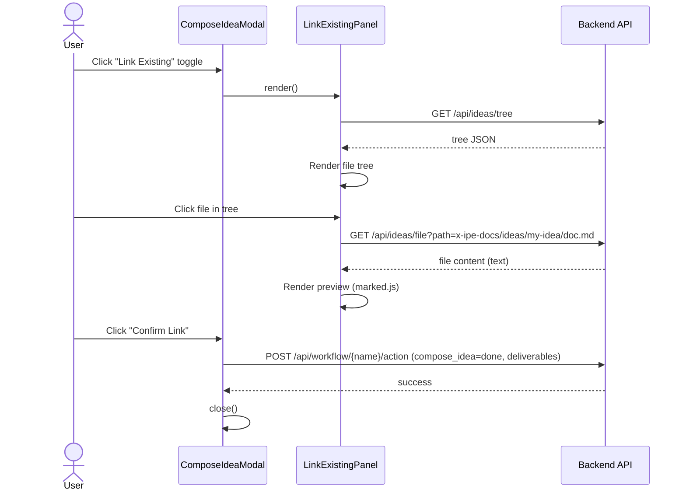
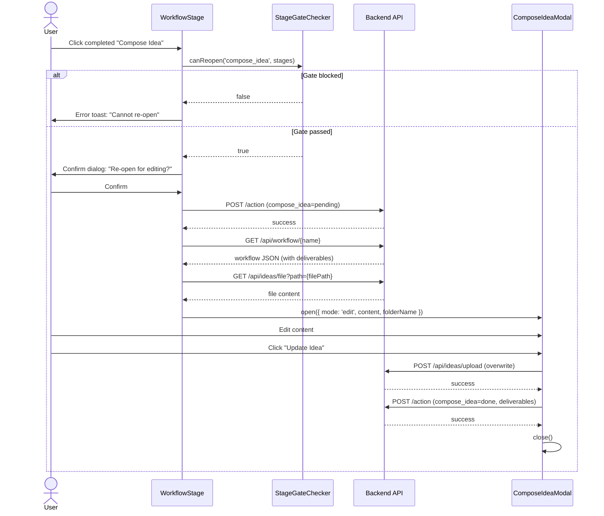
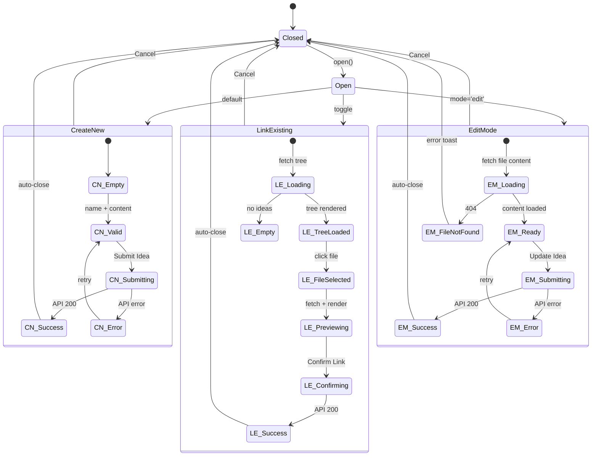
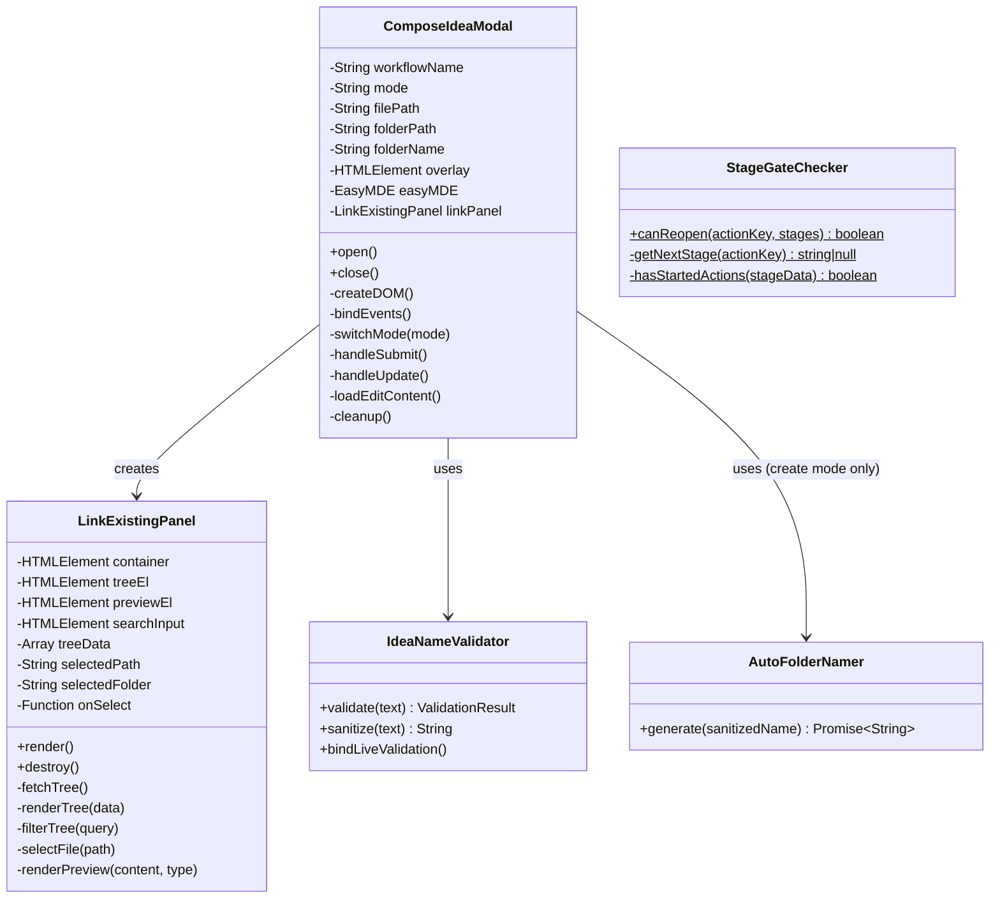

# Technical Design: Compose Idea Modal — Link Existing & Re-Edit

> Feature ID: FEATURE-037-B | Version: v1.2 | Last Updated: 2026-03-16

---

## Part 1: Agent-Facing Summary

> **Purpose:** Quick reference for AI agents navigating large projects.
> **📌 AI Coders:** Focus on this section for implementation context.

### Key Components Implemented

| Component | Responsibility | Scope/Impact | Tags |
|-----------|----------------|--------------|------|
| `ComposeIdeaModal` (extend) | Add edit mode: pre-load content, read-only folder, "Update Idea" button | Modify existing class in compose-idea-modal.js | #modal #edit-mode #re-edit #compose-idea #frontend |
| `LinkExistingPanel` | File tree browser + preview panel for Link Existing toggle | New class in compose-idea-modal.js | #link-existing #file-tree #preview #compose-idea #frontend |
| `StageGateChecker` | Reusable check: can a completed action be re-opened? | New utility in workflow-stage.js | #gate-check #re-open #workflow #stage #frontend |
| `GET /api/ideas/file` | Return raw file content with path security validation | New endpoint in ideas_routes.py | #api #file-read #security #backend |
| `LinkExistingPanel._selectFile()` (CR-002) | Add X-Converted header detection + sandboxed iframe rendering for .docx/.msg | Modify ~15 lines in compose-idea-modal.js | #preview #converted #docx #msg #frontend |

### Dependencies

| Dependency | Source | Design Link | Usage Description |
|------------|--------|-------------|-------------------|
| `ComposeIdeaModal` | FEATURE-037-A | [technical-design.md](x-ipe-docs/requirements/EPIC-037/FEATURE-037-A/technical-design.md) | Extend with edit mode + Link Existing panel |
| `WorkflowStage` | FEATURE-036-C | workflow-stage.js | Modify completed-action click handler to use gate check + confirmation |
| `WorkflowManager` | FEATURE-036-A | workflow_manager_service.py | Call update_action_status to rollback to "pending" and re-complete |
| `/api/ideas/tree` | FEATURE-008 | ideas_routes.py | Fetch tree for Link Existing file browser |
| `/api/workflow/{name}/action` | FEATURE-036-A | workflow_routes.py | Update action status (rollback + re-complete) |
| `/api/workflow/{name}` | FEATURE-036-A | workflow_routes.py | Read workflow JSON to extract deliverables |
| EasyMDE | External lib | Already in app | Pre-load content in edit mode |
| marked.js | External lib | Already in app | Render markdown preview in Link Existing |

### Major Flow

**Flow A — Link Existing:**
1. User clicks "Compose Idea" → modal opens in Create New mode (default, unchanged from 037-A)
2. User clicks "Link Existing" toggle → `LinkExistingPanel.render()` replaces placeholder
3. Panel fetches `/api/ideas/tree` → renders expandable file tree on left, empty preview on right
4. User clicks a file → `GET /api/ideas/file?path={path}` → preview renders content
5. User clicks "Confirm Link" → `POST /api/workflow/{name}/action` with compose_idea=done + deliverables → modal closes

**Flow B — Re-Edit (CR-001):**
1. User clicks completed "Compose Idea" action button
2. `StageGateChecker.canReopen('compose_idea', stages)` → checks next stage (requirement) for in_progress/done actions
3. If blocked → error toast. If allowed → confirmation dialog: "Re-open for editing?"
4. On confirm → `POST /api/workflow/{name}/action` with compose_idea=pending (rollback)
5. Extract file path from deliverables → `GET /api/ideas/file?path={path}` → get content
6. `new ComposeIdeaModal({ workflowName, onComplete, mode: 'edit', filePath, folderPath, folderName })` → modal opens with content pre-loaded
7. User edits → clicks "Update Idea" → `POST /api/ideas/upload` (overwrite) → re-complete action → modal closes

### Usage Example

```javascript
// Flow A: Link Existing (inside ComposeIdeaModal when toggling to Link Existing)
this.linkPanel = new LinkExistingPanel({
    container: this.contentArea,
    onSelect: (filePath, folderName) => {
        this.selectedFile = filePath;
        this.selectedFolder = folderName;
        this.submitBtn.disabled = false;
    }
});
this.linkPanel.render();

// Flow B: Re-Edit (in workflow-stage.js completed action click handler)
const canReopen = StageGateChecker.canReopen('compose_idea', stages);
if (!canReopen) {
    this._showToast('Cannot re-open — requirement stage has already started.', 'error');
    return;
}
this._showConfirmDialog('Re-open for editing?', 'This will set the action back to pending.', async () => {
    await fetch(`/api/workflow/${wfName}/action`, {
        method: 'POST',
        headers: { 'Content-Type': 'application/json' },
        body: JSON.stringify({ action: 'compose_idea', status: 'pending' })
    });
    const wfResp = await fetch(`/api/workflow/${wfName}`);
    const wfData = await wfResp.json();
    const deliverables = wfData.data?.stages?.ideation?.actions?.compose_idea?.deliverables || [];
    const filePath = deliverables[0]; // e.g., "x-ipe-docs/ideas/wf-003-auth/new idea.md"
    const folderPath = deliverables[1]; // e.g., "x-ipe-docs/ideas/wf-003-auth"
    const folderName = folderPath.split('/').pop(); // e.g., "wf-003-auth"

    const modal = new ComposeIdeaModal({
        workflowName: wfName,
        mode: 'edit',
        filePath,
        folderPath,
        folderName,
        onComplete: () => this._refreshView()
    });
    modal.open();
});
```

---

## Part 2: Implementation Guide

> **Purpose:** Human-readable details for developers.
> **📌 Emphasis on visual diagrams for comprehension.**

### Workflow Diagram — Link Existing



### Workflow Diagram — Re-Edit (CR-001)



### State Diagram



### Class Diagram



### Component Architecture

```
compose-idea-modal.js (MODIFY — extend ~150 lines, total ~650 lines)
├── IdeaNameValidator       — Unchanged
├── AutoFolderNamer         — Unchanged
├── ComposeIdeaModal        — Extended:
│   ├── constructor         — Add mode, filePath, folderPath, folderName params
│   ├── open()              — Branch on mode: 'create' (existing) vs 'edit' (new)
│   ├── loadEditContent()   — NEW: fetch file via API, populate EasyMDE
│   ├── handleSubmit()      — Branch: create mode (existing) vs edit mode (overwrite)
│   └── switchMode()        — Replace placeholder with LinkExistingPanel
└── LinkExistingPanel       — NEW class:
    ├── render()            — Fetch tree, build DOM
    ├── fetchTree()         — GET /api/ideas/tree
    ├── renderTree()        — Build expandable folder/file list
    ├── filterTree()        — Client-side search filter
    ├── selectFile()        — Fetch content, render preview
    └── destroy()           — Cleanup DOM

workflow-stage.js (MODIFY — ~40 lines)
├── StageGateChecker        — NEW static utility:
│   ├── canReopen()         — Check next stage for started actions
│   └── getNextStage()      — Map action to its stage, find next
├── btn.onclick handler     — Replace "already completed" toast with gate+confirm flow
└── _dispatchModalAction()  — Pass mode/filePath/folderPath/folderName to ComposeIdeaModal

ideas_routes.py (MODIFY — ~25 lines)
└── GET /api/ideas/file     — NEW endpoint: read file content with path validation
```

### File Changes

| File | Action | Lines Changed | Description |
|------|--------|---------------|-------------|
| `src/x_ipe/static/js/features/compose-idea-modal.js` | **MODIFY** | ~150 added | Add `LinkExistingPanel` class, extend `ComposeIdeaModal` with edit mode, add `loadEditContent()` |
| `src/x_ipe/static/js/features/workflow-stage.js` | **MODIFY** | ~40 added | Add `StageGateChecker`, replace completed-action toast with gate check + confirm dialog + edit mode dispatch |
| `src/x_ipe/routes/ideas_routes.py` | **MODIFY** | ~25 added | Add `GET /api/ideas/file` endpoint with path security |
| `src/x_ipe/static/css/features/compose-idea-modal.css` | **MODIFY** | ~60 added | Add Link Existing panel styles (tree, preview, search) |

### Implementation Steps

#### Step 1: Backend — Add `GET /api/ideas/file` endpoint

```python
@ideas_bp.route('/api/ideas/file', methods=['GET'])
def get_idea_file():
    """Return raw file content. Path must be within project root."""
    rel_path = request.args.get('path', '')
    if not rel_path:
        return jsonify({'error': 'path parameter required'}), 400

    project_root = Path(current_app.config.get('PROJECT_ROOT', '.')).resolve()
    target = (project_root / rel_path).resolve()

    # Security: path must be within project root
    if not str(target).startswith(str(project_root)):
        return jsonify({'error': 'Access denied'}), 403

    if not target.is_file():
        return jsonify({'error': 'File not found'}), 404

    try:
        content = target.read_text(encoding='utf-8')
        return content, 200, {'Content-Type': 'text/plain; charset=utf-8'}
    except UnicodeDecodeError:
        return jsonify({'error': 'Binary file — cannot read as text'}), 415
```

#### Step 2: Frontend — `StageGateChecker` in workflow-stage.js

```javascript
const StageGateChecker = {
    STAGE_ORDER: ['ideation', 'requirement', 'implement', 'validation', 'feedback'],

    canReopen(actionKey, stages) {
        const currentStage = this._findStage(actionKey);
        if (!currentStage) return false;
        const nextStage = this._getNextStage(currentStage);
        if (!nextStage) return true; // last stage — always allow
        return !this._hasStartedActions(stages[nextStage]);
    },

    _findStage(actionKey) {
        for (const stageName of this.STAGE_ORDER) {
            const stageConfig = WorkflowStage.ACTION_MAP[stageName];
            if (stageConfig && stageConfig.actions[actionKey]) return stageName;
        }
        return null;
    },

    _getNextStage(currentStage) {
        const idx = this.STAGE_ORDER.indexOf(currentStage);
        return idx >= 0 && idx < this.STAGE_ORDER.length - 1
            ? this.STAGE_ORDER[idx + 1] : null;
    },

    _hasStartedActions(stageData) {
        if (!stageData?.actions) return false;
        return Object.values(stageData.actions).some(
            a => a.status === 'in_progress' || a.status === 'done'
        );
    }
};
```

#### Step 3: Frontend — Modify completed-action click handler in workflow-stage.js

Replace the current toast at lines 239-241:

```javascript
// BEFORE:
if (status === 'done') {
    this._showToast(`${actionDef.label} is already completed`, 'info');
    return;
}

// AFTER:
if (status === 'done') {
    if (actionDef.interaction !== 'modal') {
        this._showToast(`${actionDef.label} is already completed`, 'info');
        return;
    }
    // Gate check for modal actions (compose_idea)
    const canReopen = StageGateChecker.canReopen(actionKey, stages);
    if (!canReopen) {
        this._showToast(`Cannot re-open — next stage has already started.`, 'error');
        return;
    }
    this._confirmAndReopen(wfName, actionKey, actionDef, stages);
    return;
}
```

New method `_confirmAndReopen()`:

```javascript
async _confirmAndReopen(wfName, actionKey, actionDef, stages) {
    const confirmed = await this._showConfirmDialog(
        'Re-open for editing?',
        'This will set the action back to pending.'
    );
    if (!confirmed) return;

    // Rollback status to pending
    await fetch(`/api/workflow/${encodeURIComponent(wfName)}/action`, {
        method: 'POST',
        headers: { 'Content-Type': 'application/json' },
        body: JSON.stringify({ action: actionKey, status: 'pending' })
    });

    // Get deliverables for edit mode
    const resp = await fetch(`/api/workflow/${encodeURIComponent(wfName)}`);
    const wfData = await resp.json();
    const actionData = wfData.data?.stages?.ideation?.actions?.[actionKey] || {};
    const deliverables = actionData.deliverables || [];

    if (deliverables.length < 2) {
        // No deliverables — open in create mode
        this._dispatchModalAction(wfName, actionKey);
        return;
    }

    const filePath = deliverables[0];
    const folderPath = deliverables[1];
    const folderName = folderPath.split('/').pop();

    const modal = new ComposeIdeaModal({
        workflowName: wfName,
        mode: 'edit',
        filePath,
        folderPath,
        folderName,
        onComplete: () => {
            const container = document.getElementById('workflow-view');
            if (container && window.workflowView) {
                window.workflowView.render(container);
            }
        }
    });
    modal.open();
}
```

#### Step 4: Frontend — Extend `ComposeIdeaModal` for edit mode

```javascript
// Extend constructor:
constructor({ workflowName, onComplete, mode = 'create', filePath = null, folderPath = null, folderName = null }) {
    this.workflowName = workflowName;
    this.onComplete = onComplete || (() => {});
    this.mode = mode; // 'create' or 'edit'
    this.filePath = filePath;
    this.folderPath = folderPath;
    this.folderName = folderName;
    // ... rest unchanged
}

// In open(), after creating DOM:
if (this.mode === 'edit') {
    await this.loadEditContent();
}

// New method:
async loadEditContent() {
    // Set folder name as read-only
    this.nameInput.value = this.folderName.replace(/^wf-\d{3}-/, '').replace(/-/g, ' ');
    this.nameInput.disabled = true;
    this.folderPreview.textContent = `Folder: ${this.folderPath}`;

    // Change button text
    this.submitBtn.textContent = '💾 Update Idea';

    // Fetch and load file content
    try {
        const resp = await fetch(`/api/ideas/file?path=${encodeURIComponent(this.filePath)}`);
        if (!resp.ok) {
            if (resp.status === 404) {
                this.showToast('Original idea file not found. Create a new idea instead.', 'error');
                this.close();
                return;
            }
            throw new Error('Failed to load file');
        }
        const content = await resp.text();
        this.easyMDE.value(content);
    } catch (err) {
        this.showToast('Failed to load idea content.', 'error');
    }
}

// Modify handleSubmit() for edit mode:
async handleSubmit() {
    // ... existing validation ...
    if (this.mode === 'edit') {
        return this.handleUpdate();
    }
    // ... existing create logic ...
}

async handleUpdate() {
    this.setSubmitting(true);
    try {
        const formData = new FormData();
        formData.append('target_folder', this.folderName);
        const content = this.easyMDE.value();
        const blob = new Blob([content], { type: 'text/markdown' });
        const fileName = this.filePath.split('/').pop();
        formData.append('files', blob, fileName);

        const resp = await fetch('/api/ideas/upload', {
            method: 'POST',
            body: formData
        });
        if (!resp.ok) throw new Error(await resp.text());

        // Re-complete action
        await fetch(`/api/workflow/${this.workflowName}/action`, {
            method: 'POST',
            headers: { 'Content-Type': 'application/json' },
            body: JSON.stringify({
                action: 'compose_idea',
                status: 'done',
                deliverables: [this.filePath, this.folderPath]
            })
        });

        this.onComplete({ file: this.filePath, folder: this.folderPath });
        this.close();
    } catch (err) {
        this.showToast('Failed to update idea. Please try again.', 'error');
        this.setSubmitting(false);
    }
}
```

#### Step 5: Frontend — `LinkExistingPanel` class

```javascript
class LinkExistingPanel {
    constructor({ container, onSelect }) {
        this.container = container;
        this.onSelect = onSelect;
        this.treeData = [];
        this.selectedPath = null;
        this.selectedFolder = null;
        this.el = null;
    }

    async render() {
        this.el = document.createElement('div');
        this.el.className = 'link-existing-panel';
        this.el.innerHTML = `
            <div class="le-sidebar">
                <input type="text" class="le-search" placeholder="Search ideas...">
                <div class="le-tree"></div>
            </div>
            <div class="le-preview">
                <p class="le-placeholder">Select a file to preview</p>
            </div>
        `;
        this.container.innerHTML = '';
        this.container.appendChild(this.el);

        this.searchInput = this.el.querySelector('.le-search');
        this.treeEl = this.el.querySelector('.le-tree');
        this.previewEl = this.el.querySelector('.le-preview');

        this.searchInput.addEventListener('input', () => this.filterTree(this.searchInput.value));
        await this.fetchTree();
    }

    async fetchTree() {
        const resp = await fetch('/api/ideas/tree');
        this.treeData = await resp.json();
        this.renderTree(this.treeData);
    }

    renderTree(data, parentEl = null) {
        const target = parentEl || this.treeEl;
        target.innerHTML = '';
        const nodes = Array.isArray(data) ? data : (data.children || []);
        if (nodes.length === 0 && !parentEl) {
            target.innerHTML = '<p class="le-empty">No existing ideas found. Use Create New instead.</p>';
            return;
        }
        for (const node of nodes) {
            const item = document.createElement('div');
            item.className = `le-tree-item ${node.type === 'directory' ? 'le-folder' : 'le-file'}`;
            item.dataset.path = node.path || '';
            item.textContent = node.name;
            if (node.type === 'directory' && node.children?.length) {
                item.addEventListener('click', (e) => {
                    e.stopPropagation();
                    item.classList.toggle('expanded');
                });
                const children = document.createElement('div');
                children.className = 'le-children';
                this.renderTree({ children: node.children }, children);
                item.appendChild(children);
            } else if (node.type === 'file') {
                item.addEventListener('click', () => this.selectFile(node.path, node.name));
            }
            target.appendChild(item);
        }
    }

    filterTree(query) {
        const q = query.toLowerCase();
        this.treeEl.querySelectorAll('.le-tree-item').forEach(item => {
            const name = item.textContent.toLowerCase();
            item.style.display = !q || name.includes(q) ? '' : 'none';
        });
    }

    async selectFile(path) {
        this.selectedPath = path;
        // Extract folder: second path segment under ideas/
        const parts = path.split('/');
        const ideasIdx = parts.indexOf('ideas');
        this.selectedFolder = ideasIdx >= 0 ? parts.slice(0, ideasIdx + 2).join('/') : parts.slice(0, -1).join('/');

        this.treeEl.querySelectorAll('.le-file').forEach(f => f.classList.remove('selected'));
        const fileEl = this.treeEl.querySelector(`[data-path="${CSS.escape(path)}"]`);
        if (fileEl) fileEl.classList.add('selected');

        try {
            const resp = await fetch(`/api/ideas/file?path=${encodeURIComponent(path)}`);
            if (!resp.ok) throw new Error('Failed to load');
            const content = await resp.text();
            const ext = path.split('.').pop().toLowerCase();

            if (['md', 'markdown'].includes(ext)) {
                this.previewEl.innerHTML = marked.parse(content);
            } else if (['png', 'jpg', 'jpeg', 'gif', 'webp'].includes(ext)) {
                this.previewEl.innerHTML = ``;
            } else {
                this.previewEl.innerHTML = `<pre>${this._escapeHtml(content)}</pre>`;
            }
        } catch {
            this.previewEl.innerHTML = '<p class="le-error">Failed to load file preview</p>';
        }

        this.onSelect(this.selectedPath, this.selectedFolder);
    }

    _escapeHtml(text) {
        const div = document.createElement('div');
        div.textContent = text;
        return div.innerHTML;
    }

    destroy() {
        if (this.el) this.el.remove();
    }
}
```

#### Step 6: CSS — Add Link Existing panel styles

```css
/* Link Existing panel — two-column layout */
.link-existing-panel {
    display: flex;
    gap: 1rem;
    height: 350px;
}
.le-sidebar {
    width: 45%;
    display: flex;
    flex-direction: column;
    gap: 0.5rem;
}
.le-search {
    padding: 8px 12px;
    border: 1px solid var(--border-color, #e2e8f0);
    border-radius: 6px;
    font-size: 0.875rem;
}
.le-tree {
    flex: 1;
    overflow-y: auto;
    border: 1px solid var(--border-color, #e2e8f0);
    border-radius: 6px;
    padding: 0.5rem;
}
.le-tree-item {
    padding: 4px 8px;
    cursor: pointer;
    border-radius: 4px;
    font-size: 0.875rem;
}
.le-tree-item:hover { background: var(--hover-bg, #f1f5f9); }
.le-file.selected { background: var(--accent-bg, #d1fae5); font-weight: 600; }
.le-folder::before { content: '📁 '; }
.le-file::before { content: '📄 '; }
.le-children { padding-left: 1rem; display: none; }
.le-folder.expanded > .le-children { display: block; }
.le-preview {
    flex: 1;
    border: 1px solid var(--border-color, #e2e8f0);
    border-radius: 6px;
    padding: 1rem;
    overflow-y: auto;
    font-size: 0.875rem;
}
.le-placeholder, .le-empty { color: var(--muted, #94a3b8); text-align: center; margin-top: 2rem; }
```

### Mockup Reference

**Source:** [../mockups/compose-idea-modal-v1.html](x-ipe-docs/requirements/EPIC-037/mockups/compose-idea-modal-v1.html) (status: current)

**Mockup-to-Component Mapping (Link Existing additions):**

| Mockup Element | Component | CSS Class |
|---------------|-----------|-----------|
| File tree sidebar | LinkExistingPanel.treeEl | `.le-sidebar`, `.le-tree` |
| Search input above tree | LinkExistingPanel.searchInput | `.le-search` |
| Preview panel (right side) | LinkExistingPanel.previewEl | `.le-preview` |
| Confirm Link button | ComposeIdeaModal.submitBtn (label changes) | `.compose-modal-footer` |
| Confirmation dialog | WorkflowStage._showConfirmDialog | Reuse existing modal pattern |

### Edge Cases & Error Handling

| Scenario | Handling |
|----------|----------|
| File path contains `../` | Backend rejects with 403 |
| Deliverable file deleted | `GET /api/ideas/file` returns 404 → toast + close |
| No deliverables in workflow JSON | Open create mode (not edit mode) |
| Binary file preview | Backend returns 415 → show metadata only |
| Gate blocked (next stage started) | Toast error, no modal |
| User cancels confirm dialog | No-op, status unchanged |
| Status rollback succeeds but modal fails | Action stays pending — user re-clicks to retry |
| Empty ideas tree | "No existing ideas found" message |
| Upload API uses existing folder | Overwrite existing files in folder |

### API Specification

#### `GET /api/ideas/file`

| Aspect | Details |
|--------|---------|
| Method | GET |
| Path | `/api/ideas/file` |
| Query Params | `path` (required): relative path from project root |
| Success | 200 + plain text content |
| Not Found | 404 + `{"error": "File not found"}` |
| Forbidden | 403 + `{"error": "Access denied"}` |
| Binary | 415 + `{"error": "Binary file — cannot read as text"}` |
| Missing Param | 400 + `{"error": "path parameter required"}` |

---

## Design Change Log

| Date | Phase | Change Summary |
|------|-------|----------------|
| 2026-02-19 | Initial Design | Technical design for FEATURE-037-B. Extends compose-idea-modal.js with LinkExistingPanel and edit mode. Adds StageGateChecker to workflow-stage.js. New GET /api/ideas/file endpoint. CR-001 enrichments: stage gate, confirmation dialog, edit mode with pre-loaded content. |
| 2026-03-16 | CR-002 | Add .docx/.msg converted preview to Link Existing _selectFile(). Frontend-only change (~15 lines). Same pattern as FEATURE-038-C CR-001 deliverable-viewer.js: check X-Converted header → sandboxed iframe. Handle 413/415 errors. |

---

## CR-002: Converted Binary Preview in Link Existing

### Design Summary

**Scope:** Frontend-only change to `LinkExistingPanel._selectFile()` in `compose-idea-modal.js`.
**Backend:** Already implemented by FEATURE-038-C CR-001 (shared `GET /api/ideas/file` endpoint returns `X-Converted: true` header for .docx/.msg files).

### Implementation Pattern

Reuse exact pattern from `deliverable-viewer.js` (lines 226-238):

```javascript
// In _selectFile(), after const resp = await fetch(...):
// 1. Check X-Converted header
const isConverted = resp.headers && resp.headers.get('X-Converted') === 'true';
if (isConverted) {
    const blob = new Blob([content], { type: 'text/html' });
    const blobUrl = URL.createObjectURL(blob);
    const iframe = document.createElement('iframe');
    iframe.src = blobUrl;
    iframe.setAttribute('sandbox', 'allow-same-origin');
    iframe.style.cssText = 'width:100%;height:300px;border:none;';
    this.previewEl.innerHTML = '';
    this.previewEl.appendChild(iframe);
    return;
}
// 2. Handle 413 (too large) and 415 (unsupported) errors
// 3. Existing markdown rendering continues for .md files
// 4. Other files: show escaped plain text
```

### Security

- Sandboxed iframe: `sandbox="allow-same-origin"` (NO `allow-scripts`)
- Backend already sanitizes converted HTML (strips script/iframe/object/embed/on* attributes)
- Blob URL ensures no network requests from iframe content

### Files Modified

| File | Change | Lines |
|------|--------|-------|
| `src/x_ipe/static/js/features/compose-idea-modal.js` | Update `_selectFile()` with X-Converted detection + sandboxed iframe | ~15 lines |
| `tests/frontend-js/compose-idea-modal.test.js` | Add unit tests for AC-031 through AC-035 | ~60 lines |
