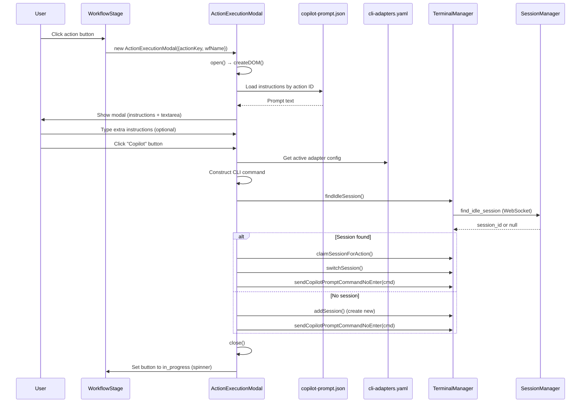
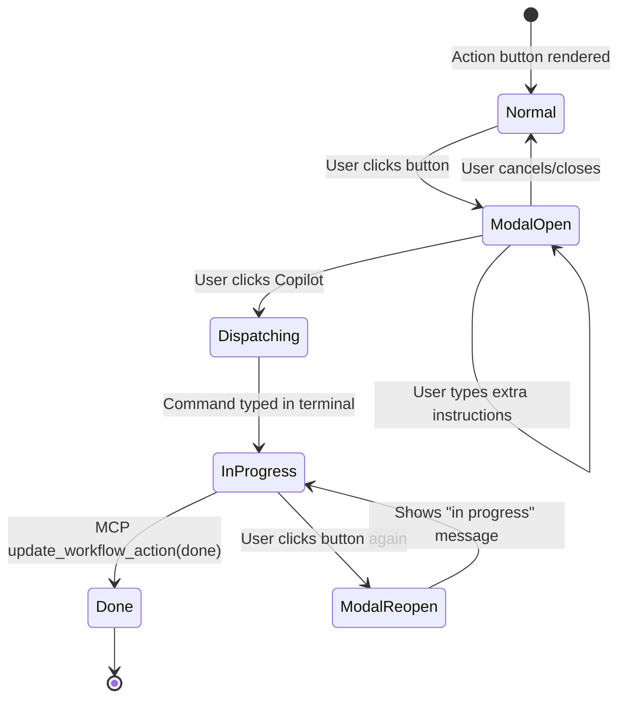

# Technical Design: Action Execution Modal

> Feature ID: FEATURE-038-A | Version: v1.0 | Last Updated: 02-20-2026

---

## Part 1: Agent-Facing Summary

> **Purpose:** Quick reference for AI agents navigating large projects.
> **📌 AI Coders:** Focus on this section for implementation context.

### Key Components Implemented

| Component | Responsibility | Scope/Impact | Tags |
|-----------|----------------|--------------|------|
| `ActionExecutionModal` | Reusable modal for CLI Agent workflow actions | Frontend modal component | #modal #ui #workflow #frontend |
| `ActionExecutionModal.open()` | Create DOM, load instructions, bind events | Modal lifecycle | #modal #dom #events |
| `ActionExecutionModal._loadInstructions()` | Fetch prompt from copilot-prompt.json by action ID | Config loading | #modal #config #prompt |
| `ActionExecutionModal._handleExecute()` | Construct CLI command, dispatch to terminal | Execution flow | #modal #cli #terminal |
| `_dispatchCliAction()` update | Open modal instead of direct terminal dispatch | workflow-stage.js integration | #workflow #stage #integration |
| Spinner/pulse CSS | In-progress animation on action buttons | Button state styling | #css #animation #button |

### Dependencies

| Dependency | Source | Design Link | Usage Description |
|------------|--------|-------------|-------------------|
| `ComposeIdeaModal` | FEATURE-037-A | `src/x_ipe/static/js/features/compose-idea-modal.js` | Pattern reference for modal lifecycle (open/close/cleanup) |
| `workflow-stage.js` | FEATURE-036-C | `src/x_ipe/static/js/features/workflow-stage.js` | Integration point: `_dispatchCliAction()` updated |
| `copilot-prompt.json` | Foundation | `src/x_ipe/resources/config/copilot-prompt.json` | Instructions text source, keyed by action ID |
| `cli-adapters.yaml` | Foundation | `src/x_ipe/resources/config/cli-adapters.yaml` | Agent CLI tool configuration |
| FEATURE-038-B | EPIC-038 | [technical-design.md](x-ipe-docs/requirements/EPIC-038/FEATURE-038-B/technical-design.md) | `findIdleSession()` and `claimSessionForAction()` |
| `TerminalManager` | FEATURE-029-A | `src/x_ipe/static/js/terminal.js` | `sendCopilotPromptCommandNoEnter()` for command dispatch |

### Major Flow

1. User clicks CLI Agent action button → `_dispatchCliAction()` creates `ActionExecutionModal`
2. Modal opens → loads instructions from `copilot-prompt.json` by action ID
3. User optionally types extra instructions (max 500 chars)
4. User clicks "Copilot" button → modal constructs CLI command
5. Modal calls `findIdleSession()` → `claimSessionForAction()` → `sendCopilotPromptCommandNoEnter()`
6. Modal closes → action button transitions to `in_progress` (spinner)
7. Agent executes → MCP `update_workflow_action` → UI re-renders → button shows ✓

### Usage Example

```javascript
// In workflow-stage.js _dispatchCliAction():
_dispatchCliAction(wfName, actionKey, skillName) {
  const modal = new ActionExecutionModal({
    actionKey,
    workflowName: wfName,
    skillName,
    onComplete: () => this._renderWorkflowView()
  });
  modal.open();
}

// Modal internally:
// 1. Loads instructions from copilot-prompt.json
// 2. Shows modal with instructions + extra input
// 3. On "Copilot" click: builds command, dispatches to terminal
```

---

## Part 2: Implementation Guide

> **Purpose:** Human-readable details for developers.

### Workflow Diagram



### State Diagram



### UI Component Structure (from Mockup Scene 2)

```
ActionExecutionModal
├── .modal-overlay (click → close)
└── .modal-container (~500px wide, centered)
    ├── .modal-header
    │   ├── .modal-title (action label from ACTION_MAP)
    │   └── .modal-close-btn (×)
    ├── .modal-body
    │   ├── .instructions-section
    │   │   ├── .instructions-label ("Instructions")
    │   │   └── .instructions-content (readonly, from copilot-prompt.json)
    │   └── .extra-instructions-section
    │       ├── .extra-label ("Extra Instructions")
    │       ├── textarea.extra-input (editable, max 500 chars)
    │       └── .char-counter ("0/500")
    └── .modal-footer
        ├── button.cancel-btn ("Cancel")
        └── button.copilot-btn ("🤖 Copilot")
```

### Class Design

```javascript
class ActionExecutionModal {
  constructor({ actionKey, workflowName, skillName, onComplete }) {
    this.actionKey = actionKey;
    this.workflowName = workflowName;
    this.skillName = skillName;
    this.onComplete = onComplete;
    this.overlay = null;
  }

  open()              // Create DOM, load instructions, bind events, append to body
  close()             // Remove from DOM, cleanup listeners
  _createDOM()        // Build modal HTML structure
  _bindEvents()       // Close btn, Escape, overlay click, textarea input, Copilot btn
  _loadInstructions() // Fetch from copilot-prompt.json by action ID
  _handleExecute()    // Build command → find session → dispatch → close
  _buildCommand(extraInstructions) // Construct CLI command from adapter config
}
```

### Instructions Loading

```javascript
async _loadInstructions() {
  // copilot-prompt.json is loaded at page init, available at window.__copilotPromptConfig
  // or fetch from /api/config/copilot-prompt
  const config = window.__copilotPromptConfig;
  // Map actionKey (e.g., 'refine_idea') to config ID (e.g., 'refine-idea')
  const configId = this.actionKey.replace(/_/g, '-');
  
  // Search all stage sections for matching prompt ID
  for (const [stage, stageData] of Object.entries(config)) {
    if (stageData.prompts) {
      const prompt = stageData.prompts.find(p => p.id === configId);
      if (prompt) {
        const detail = prompt['prompt-details'].find(d => d.language === 'en') || prompt['prompt-details'][0];
        return { label: detail.label, command: detail.command };
      }
    }
  }
  return null; // Not found → show fallback, disable Copilot button
}
```

### Command Construction

```javascript
_buildCommand(extraInstructions) {
  const instructions = this._loadedInstructions;
  let prompt = instructions.command;
  if (extraInstructions && extraInstructions.trim()) {
    prompt += ` with extra instructions: ${extraInstructions.trim()}`;
  }
  // Use adapter config from cli-adapters.yaml (loaded at init)
  // Default: copilot --allow-all-tools -i "{prompt}"
  return window.terminalManager._buildCopilotCmd(prompt);
}
```

### Spinner/Pulse CSS

```css
/* In workflow-stage.css or new action-execution-modal.css */
.action-btn.in-progress {
  position: relative;
  pointer-events: none;
  opacity: 0.8;
}

.action-btn.in-progress::after {
  content: '';
  position: absolute;
  inset: 0;
  border-radius: inherit;
  animation: pulse-ring 1.5s cubic-bezier(0.4, 0, 0.6, 1) infinite;
  border: 2px solid currentColor;
}

@keyframes pulse-ring {
  0%, 100% { opacity: 0.3; transform: scale(1); }
  50% { opacity: 0.1; transform: scale(1.05); }
}
```

### New File

- `src/x_ipe/static/js/features/action-execution-modal.js` — Contains `ActionExecutionModal` class
- `src/x_ipe/static/css/action-execution-modal.css` — Modal styling (or add to existing workflow-stage.css)

### Modified Files

- `src/x_ipe/static/js/features/workflow-stage.js` — Update `_dispatchCliAction()` to instantiate modal

### Implementation Steps

1. **CSS:** Add modal styles and spinner/pulse animation
2. **JS Modal:** Create `ActionExecutionModal` class following `ComposeIdeaModal` pattern
3. **Integration:** Update `_dispatchCliAction()` in `workflow-stage.js` to open modal
4. **Config Loading:** Ensure `copilot-prompt.json` is available at runtime (already loaded)
5. **Button State:** Add `in-progress` CSS class management to action button rendering

### Edge Cases & Error Handling

| Scenario | Expected Behavior |
|----------|-------------------|
| Action ID missing from copilot-prompt.json | Show fallback message, disable Copilot button |
| No CLI adapter configured | Show error toast |
| Extra instructions > 500 chars (paste) | Truncate to 500, update counter |
| Modal opened while in_progress | Show "Execution in progress" message, hide Copilot button |
| Console panel closed | Auto-open console before dispatch |
| No idle session, limit not reached | Create new session, proceed |
| No idle session, limit reached | Show error toast |

---

## Design Change Log

| Date | Phase | Change Summary |
|------|-------|----------------|
| 02-20-2026 | Initial Design | New ActionExecutionModal class, _dispatchCliAction() integration, spinner CSS, copilot-prompt.json instructions loading, CLI command construction via adapter config. |
