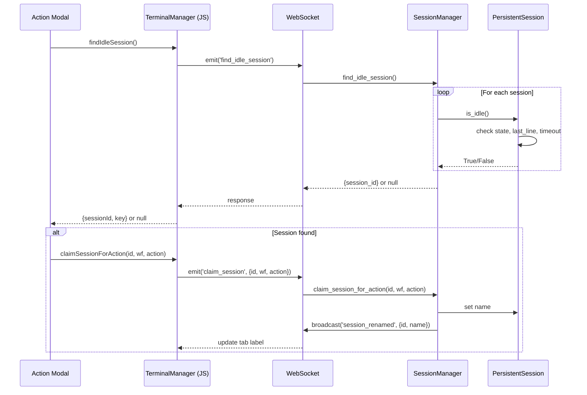
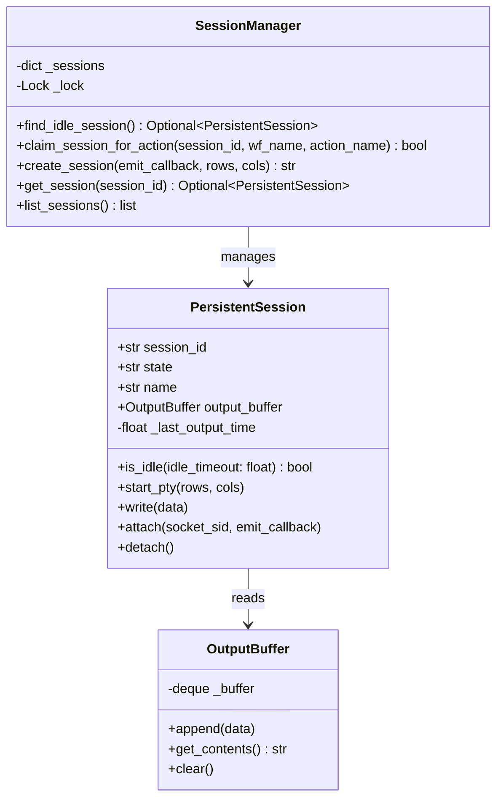

# Technical Design: Session Idle Detection

> Feature ID: FEATURE-038-B | Version: v1.0 | Last Updated: 02-20-2026

---

## Part 1: Agent-Facing Summary

> **Purpose:** Quick reference for AI agents navigating large projects.
> **📌 AI Coders:** Focus on this section for implementation context.

### Key Components Implemented

| Component | Responsibility | Scope/Impact | Tags |
|-----------|----------------|--------------|------|
| `PersistentSession.is_idle()` | Detect if session is at shell prompt | Backend session management | #terminal #session #idle #backend |
| `PersistentSession._last_output_time` | Track timestamp of last output | Backend session state | #terminal #session #timestamp |
| `strip_ansi()` | Remove ANSI escape sequences from text | Utility function | #terminal #ansi #utility |
| `SessionManager.find_idle_session()` | Find first idle connected session | Backend session management | #terminal #session #find |
| `SessionManager.claim_session_for_action()` | Rename session for workflow action | Backend session management | #terminal #session #rename |
| `terminal_handlers: find_idle_session` | WebSocket event handler | Backend WebSocket API | #terminal #websocket #api |
| `terminal_handlers: session_renamed` | WebSocket broadcast event | Backend WebSocket API | #terminal #websocket #broadcast |
| `TerminalManager.findIdleSession()` | Frontend proxy to backend idle detection | Frontend terminal manager | #terminal #frontend #js |

### Dependencies

| Dependency | Source | Design Link | Usage Description |
|------------|--------|-------------|-------------------|
| `PersistentSession` | FEATURE-029-A | `src/x_ipe/services/terminal_service.py` | Session class being extended with is_idle() |
| `SessionManager` | FEATURE-029-A | `src/x_ipe/services/terminal_service.py` | Manager class gaining find/claim methods |
| `OutputBuffer` | FEATURE-029-A | `src/x_ipe/services/terminal_service.py` | Provides get_contents() for last-line analysis |
| `terminal_handlers.py` | FEATURE-029-A | `src/x_ipe/handlers/terminal_handlers.py` | WebSocket event registration |
| `terminal.js` | FEATURE-029-A | `src/x_ipe/static/js/terminal.js` | Frontend TerminalManager class |

### Major Flow

1. Frontend calls `findIdleSession()` → emits WebSocket `find_idle_session`
2. Backend `SessionManager.find_idle_session()` iterates sessions, calls `is_idle()` on each
3. `is_idle()` checks: connected? + last line matches prompt? + no output for 2s?
4. If found → return session_id; caller then calls `claim_session_for_action()` to rename
5. Rename broadcasts `session_renamed` event → frontend updates tab label

### Usage Example

```javascript
// Frontend: Find and claim idle session
const idle = await window.terminalManager.findIdleSession();
if (idle) {
  await window.terminalManager.claimSessionForAction(idle.sessionId, 'hello', 'refine_idea');
  window.terminalManager.switchSession(idle.key);
  window.terminalManager.sendCopilotPromptCommandNoEnter(command);
} else {
  showToast('No available idle sessions', 'warning');
}
```

```python
# Backend: Check if session is idle
session = session_manager.get_session(session_id)
if session and session.is_idle():
    session_manager.claim_session_for_action(session_id, 'hello', 'refine_idea')
```

---

## Part 2: Implementation Guide

> **Purpose:** Human-readable details for developers.

### Workflow Diagram



### Class Diagram



### Data Models

#### ANSI Stripping Utility

```python
import re

_ANSI_RE = re.compile(r'\x1b\[[0-9;]*[a-zA-Z]|\x1b\][^\x07]*\x07|\x1b[()][AB012]')

def strip_ansi(text: str) -> str:
    """Remove ANSI escape sequences from terminal output."""
    return _ANSI_RE.sub('', text)
```

#### Shell Prompt Patterns

```python
# Default prompt patterns: line ends with these suffixes
SHELL_PROMPT_SUFFIXES = ('$ ', '% ', '> ', '# ')
```

### Implementation Steps

1. **Backend — `terminal_service.py`:**
   - Add `_last_output_time: float = 0.0` to `PersistentSession.__init__()`
   - Update `_read_loop()` callback: set `self._last_output_time = time.time()` on each output chunk
   - Add `strip_ansi()` utility function (module-level)
   - Add `is_idle(idle_timeout: float = 2.0) -> bool` method to `PersistentSession`:
     ```python
     def is_idle(self, idle_timeout: float = 2.0) -> bool:
         if self.state != 'connected':
             return False
         contents = self.output_buffer.get_contents()
         if not contents:
             return False
         # Check timeout
         if time.time() - self._last_output_time < idle_timeout:
             return False
         # Get last non-empty line
         lines = contents.rstrip().split('\n')
         last_line = strip_ansi(lines[-1]) if lines else ''
         return any(last_line.endswith(s) for s in SHELL_PROMPT_SUFFIXES)
     ```
   - Add `find_idle_session() -> Optional[PersistentSession]` to `SessionManager`:
     ```python
     def find_idle_session(self) -> Optional[PersistentSession]:
         with self._lock:
             for session in self._sessions.values():
                 if session.is_idle():
                     return session
         return None
     ```
   - Add `claim_session_for_action(session_id, wf_name, action_name) -> bool` to `SessionManager`

2. **Backend — `terminal_handlers.py`:**
   - Add `find_idle_session` WebSocket event handler → calls `session_manager.find_idle_session()`
   - Add `claim_session` WebSocket event handler → calls `session_manager.claim_session_for_action()`
   - Broadcast `session_renamed` event after successful claim

3. **Frontend — `terminal.js`:**
   - Add `findIdleSession()` method to `TerminalManager`:
     ```javascript
     async findIdleSession() {
       return new Promise((resolve) => {
         this.socket.emit('find_idle_session', {}, (response) => {
           if (response && response.session_id) {
             const key = this._findKeyBySessionId(response.session_id);
             resolve({ sessionId: response.session_id, key });
           } else {
             resolve(null);
           }
         });
       });
     }
     ```
   - Add `claimSessionForAction(sessionId, wfName, actionName)` method
   - Add `session_renamed` event listener → update `sessions` Map name + tab label

### Edge Cases & Error Handling

| Scenario | Expected Behavior |
|----------|-------------------|
| Empty output buffer | `is_idle()` → `False` |
| Rapid output (within 2s timeout) | `is_idle()` → `False` |
| Colored prompt with ANSI codes | `strip_ansi()` cleans before matching |
| vim/less/top running | Last line won't match prompt → `False` |
| Session disconnects between find and claim | `claim_session_for_action()` checks state, returns `False` |
| Concurrent claims on same session | Both succeed (rename is idempotent) |
| No sessions exist | `find_idle_session()` → `None` |

---

## Design Change Log

| Date | Phase | Change Summary |
|------|-------|----------------|
| 02-20-2026 | Initial Design | Backend: is_idle() + find_idle_session() + claim_session_for_action() on PersistentSession/SessionManager. Frontend: findIdleSession() + session_renamed handler on TerminalManager. ANSI stripping utility. |
