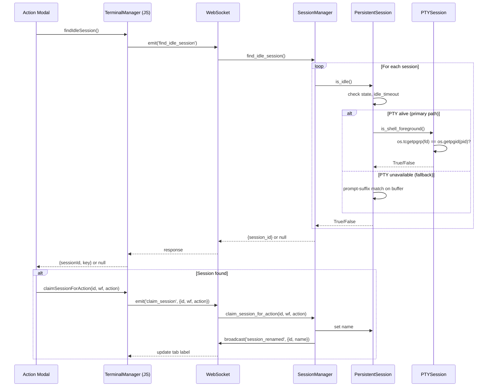
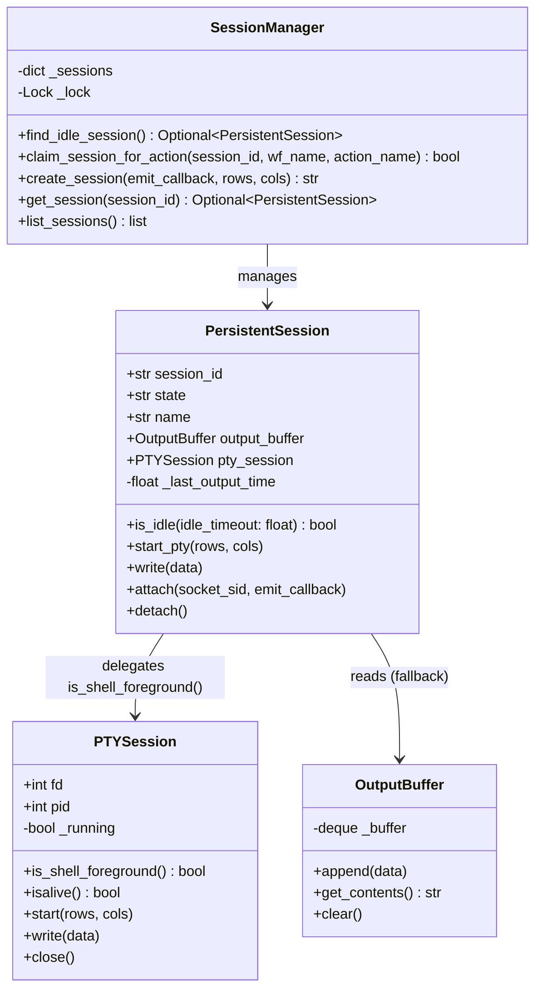

# Technical Design: Session Idle Detection

> Feature ID: FEATURE-038-B | Version: v1.0 | Last Updated: 02-20-2026

---

## Part 1: Agent-Facing Summary

> **Purpose:** Quick reference for AI agents navigating large projects.
> **📌 AI Coders:** Focus on this section for implementation context.

### Key Components Implemented

| Component | Responsibility | Scope/Impact | Tags |
|-----------|----------------|--------------|------|
| `PTYSession.is_shell_foreground()` | OS-level check: shell is foreground process (primary idle signal) | Backend PTY layer | #terminal #pty #process #idle |
| `PersistentSession.is_idle()` | Detect if session is idle (process-based primary, prompt-suffix fallback) | Backend session management | #terminal #session #idle #backend |
| `PersistentSession._last_output_time` | Track timestamp of last output | Backend session state | #terminal #session #timestamp |
| `strip_ansi()` | Remove ANSI escape sequences from text (used by fallback path) | Utility function | #terminal #ansi #utility |
| `SessionManager.find_idle_session()` | Find first idle connected session | Backend session management | #terminal #session #find |
| `SessionManager.claim_session_for_action()` | Rename session for workflow action | Backend session management | #terminal #session #rename |
| `terminal_handlers: find_idle_session` | WebSocket event handler | Backend WebSocket API | #terminal #websocket #api |
| `terminal_handlers: session_renamed` | WebSocket broadcast event | Backend WebSocket API | #terminal #websocket #broadcast |
| `TerminalManager.findIdleSession()` | Frontend proxy to backend idle detection | Frontend terminal manager | #terminal #frontend #js |

### Dependencies

| Dependency | Source | Design Link | Usage Description |
|------------|--------|-------------|-------------------|
| `PersistentSession` | FEATURE-029-A | `src/x_ipe/services/terminal_service.py` | Session class being extended with is_idle() |
| `SessionManager` | FEATURE-029-A | `src/x_ipe/services/terminal_service.py` | Manager class gaining find/claim methods |
| `OutputBuffer` | FEATURE-029-A | `src/x_ipe/services/terminal_service.py` | Provides get_contents() for last-line analysis |
| `terminal_handlers.py` | FEATURE-029-A | `src/x_ipe/handlers/terminal_handlers.py` | WebSocket event registration |
| `terminal.js` | FEATURE-029-A | `src/x_ipe/static/js/terminal.js` | Frontend TerminalManager class |

### Major Flow

1. Frontend calls `findIdleSession()` → emits WebSocket `find_idle_session`
2. Backend `SessionManager.find_idle_session()` iterates sessions, calls `is_idle()` on each
3. **Primary path:** `is_idle()` calls `pty_session.is_shell_foreground()` which uses `os.tcgetpgrp(fd)` to check if the shell's process group is the foreground process group on the PTY — works regardless of prompt format
4. **Fallback path:** If PTY is unavailable, falls back to prompt-suffix matching on the output buffer
5. Both paths require no output for `idle_timeout` seconds (default 2s)
6. If found → return session_id; caller then calls `claim_session_for_action()` to rename
7. Rename broadcasts `session_renamed` event → frontend updates tab label

### Usage Example

```javascript
// Frontend: Find and claim idle session
const idle = await window.terminalManager.findIdleSession();
if (idle) {
  await window.terminalManager.claimSessionForAction(idle.sessionId, 'hello', 'refine_idea');
  window.terminalManager.switchSession(idle.key);
  window.terminalManager.sendCopilotPromptCommandNoEnter(command);
} else {
  showToast('No available idle sessions', 'warning');
}
```

```python
# Backend: Check if session is idle
session = session_manager.get_session(session_id)
if session and session.is_idle():
    session_manager.claim_session_for_action(session_id, 'hello', 'refine_idea')
```

---

## Part 2: Implementation Guide

> **Purpose:** Human-readable details for developers.

### Workflow Diagram



### Class Diagram



### Data Models

#### Process-Based Idle Detection (Primary)

```python
# PTYSession.is_shell_foreground()
# Uses os.tcgetpgrp(fd) to get the foreground process group ID
# and compares it to the shell's PGID (os.getpgid(pid)).
# When shell spawns a foreground command (vim, build, etc.),
# the command's PGID becomes the foreground group → returns False.
# Works with ANY shell prompt format — no parsing needed.

def is_shell_foreground(self) -> bool:
    if self.fd is None or self.pid is None:
        return False
    try:
        fg_pgid = os.tcgetpgrp(self.fd)
        shell_pgid = os.getpgid(self.pid)
        return fg_pgid == shell_pgid
    except OSError:
        return False
```

#### ANSI Stripping Utility (Fallback)

```python
import re

_ANSI_RE = re.compile(r'\x1b\[[0-9;]*[a-zA-Z]|\x1b\][^\x07]*\x07|\x1b[()][AB012]')

def strip_ansi(text: str) -> str:
    """Remove ANSI escape sequences from terminal output."""
    return _ANSI_RE.sub('', text)
```

#### Shell Prompt Patterns (Fallback)

```python
# Default prompt patterns: line ends with these suffixes
SHELL_PROMPT_SUFFIXES = ('$ ', '% ', '> ', '# ')
```

### Implementation Steps

1. **Backend — `terminal_service.py` (PTYSession):**
   - Add `is_shell_foreground() -> bool` method to `PTYSession`:
     ```python
     def is_shell_foreground(self) -> bool:
         if self.fd is None or self.pid is None:
             return False
         try:
             fg_pgid = os.tcgetpgrp(self.fd)
             shell_pgid = os.getpgid(self.pid)
             return fg_pgid == shell_pgid
         except OSError:
             return False
     ```

2. **Backend — `terminal_service.py` (PersistentSession):**
   - Update `is_idle(idle_timeout: float = 2.0) -> bool` to use dual-path detection:
     ```python
     def is_idle(self, idle_timeout: float = 2.0) -> bool:
         if self.state != 'connected':
             return False
         if time.time() - self._last_output_time < idle_timeout:
             return False
         # Primary: process-based detection via PTY
         if self.pty_session and self.pty_session.isalive():
             return self.pty_session.is_shell_foreground()
         # Fallback: prompt-suffix matching on buffer
         contents = self.output_buffer.get_contents()
         if not contents:
             return False
         lines = contents.rstrip('\n\r').split('\n')
         last_line = strip_ansi(lines[-1]) if lines else ''
         return any(last_line.endswith(s) for s in SHELL_PROMPT_SUFFIXES)
     ```

3. **Backend — `terminal_handlers.py`:** (no changes needed — handlers call `is_idle()` which internally delegates)

4. **Frontend — `terminal.js`:** (no changes needed — frontend calls backend via WebSocket)

### Edge Cases & Error Handling

| Scenario | Expected Behavior |
|----------|-------------------|
| Empty output buffer (PTY alive) | Primary path used — `is_shell_foreground()` checks process, not buffer |
| Empty output buffer (PTY dead) | Fallback: `is_idle()` → `False` |
| Rapid output (within 2s timeout) | `is_idle()` → `False` (timeout check runs before process check) |
| Colored prompt with ANSI codes | Primary path ignores prompt entirely; fallback: `strip_ansi()` cleans before matching |
| vim/less/top running | Primary: `tcgetpgrp` returns subprocess PGID ≠ shell PGID → `False` |
| Custom/starship/powerline prompt | Primary path works — process-based, prompt-agnostic |
| Session disconnects between find and claim | `claim_session_for_action()` checks state, returns `False` |
| Concurrent claims on same session | Both succeed (rename is idempotent) |
| No sessions exist | `find_idle_session()` → `None` |
| PTY fd closed unexpectedly | `is_shell_foreground()` catches `OSError`, returns `False` → fallback used |
| `os.tcgetpgrp` unavailable (non-POSIX) | `OSError` caught → falls back to prompt-suffix matching |

---

## Design Change Log

| Date | Phase | Change Summary |
|------|-------|----------------|
| 02-20-2026 | Initial Design | Backend: is_idle() + find_idle_session() + claim_session_for_action() on PersistentSession/SessionManager. Frontend: findIdleSession() + session_renamed handler on TerminalManager. ANSI stripping utility. |
| 02-22-2026 | Bug Fix (TASK-604) | **Replaced fragile prompt-suffix matching with OS-level process-based detection.** Added `PTYSession.is_shell_foreground()` using `os.tcgetpgrp(fd)` to check if the shell's process group is the PTY foreground group. `is_idle()` now uses dual-path: primary (process-based, works with any prompt) + fallback (prompt-suffix, for edge cases when PTY fd is unavailable). Idle timeout check moved before detection to short-circuit early. |
