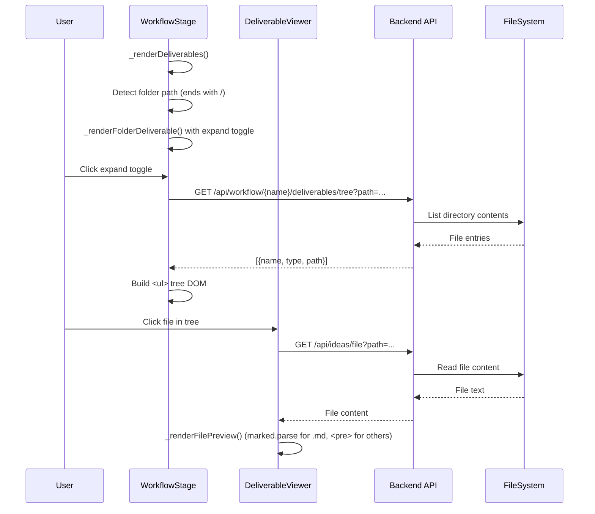
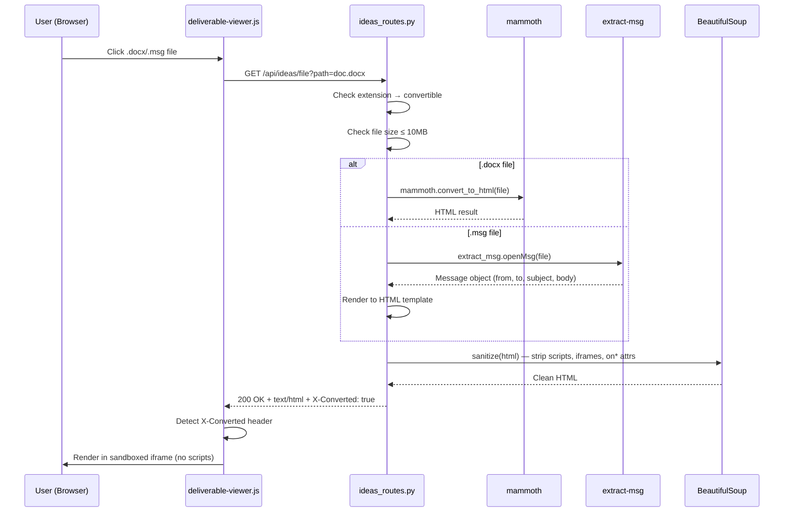
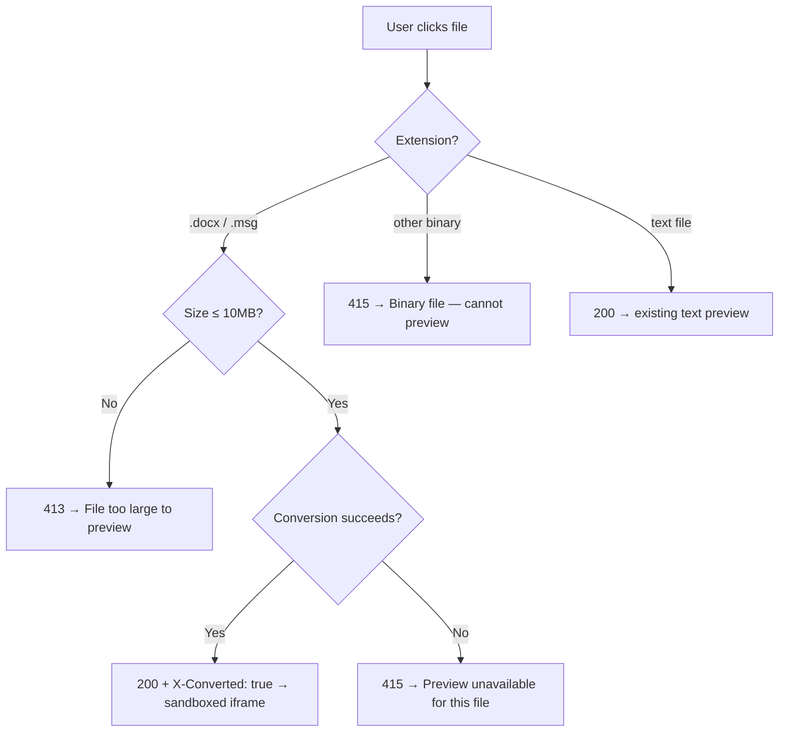
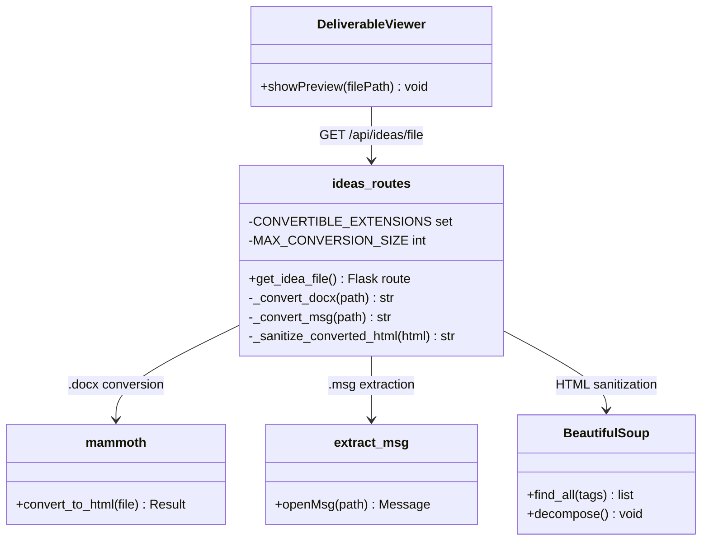
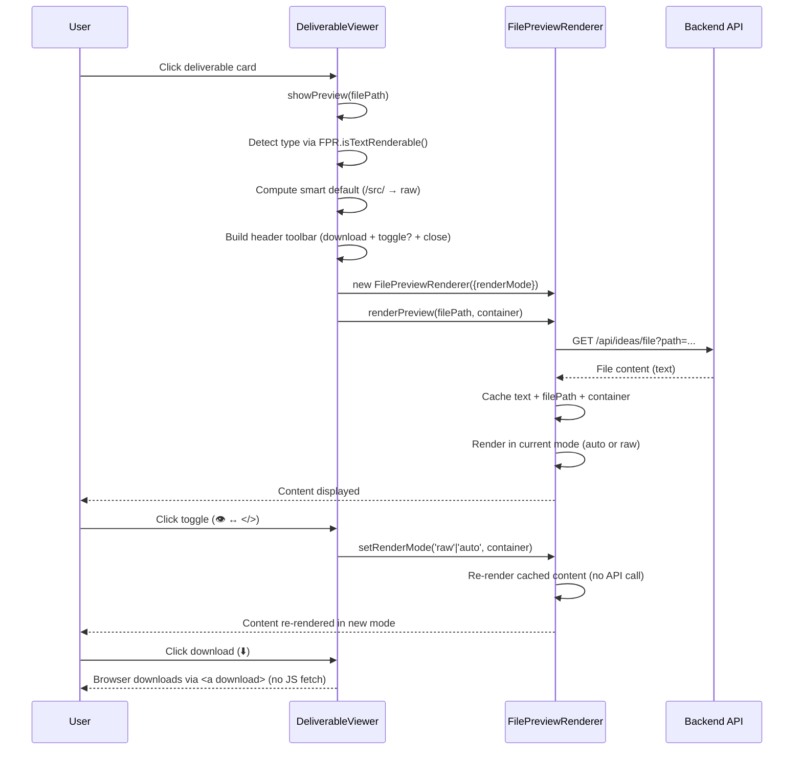
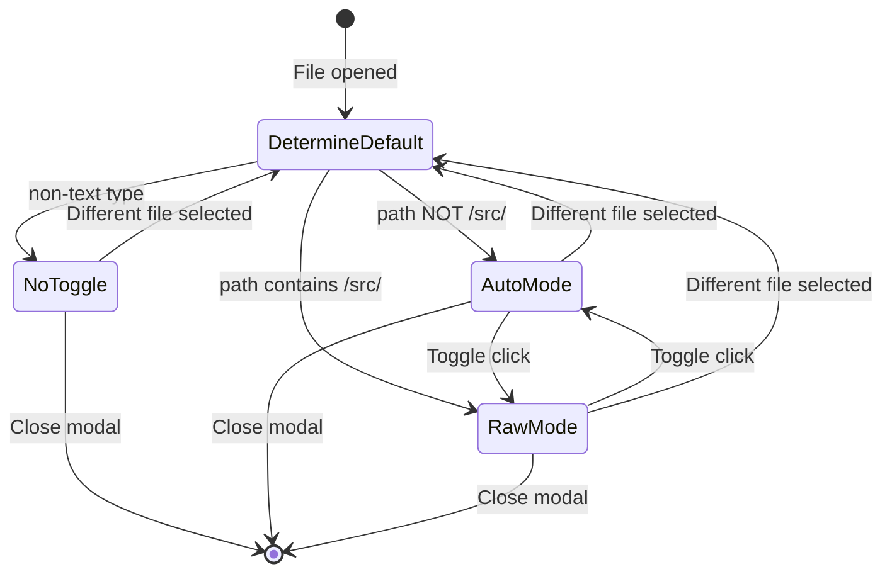
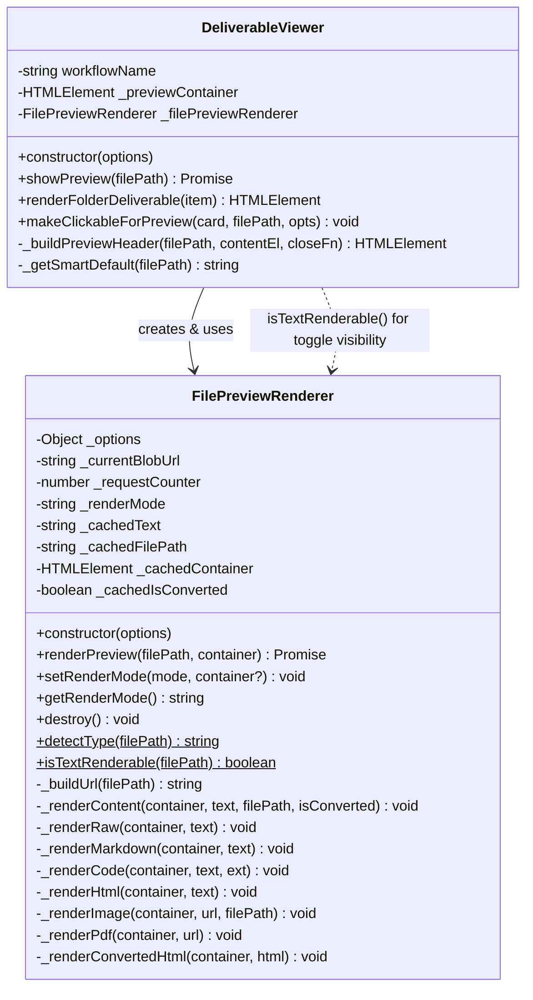

# Technical Design: Enhanced Deliverable Viewer

> Feature ID: FEATURE-038-C | Version: v1.2 | Last Updated: 03-26-2026

## Version History

| Version | Date | Description |
|---------|------|-------------|
| v1.2 | 03-26-2026 | CR-002: Download icon, preview/raw toggle, smart default mode. Extend FilePreviewRenderer with `renderMode` + cached re-render. Update DeliverableViewer header with toolbar. |
| v1.1 | 03-16-2026 | CR-001: Add .docx/.msg server-side conversion to HTML for inline preview |
| v1.0 | 02-20-2026 | Initial design: folder-type deliverables with file-tree and inline preview |

---

## Part 1: Agent-Facing Summary

> **Purpose:** Quick reference for AI agents navigating large projects.
> **📌 AI Coders:** Focus on this section for implementation context.

### Key Components Implemented

| Component | Responsibility | Scope/Impact | Tags |
|-----------|----------------|--------------|------|
| `_renderFolderDeliverable()` | Render file-tree for folder deliverables | workflow-stage.js | #deliverables #filetree #frontend |
| `_renderFilePreview()` | Inline file preview pane | workflow-stage.js | #deliverables #preview #markdown |
| `GET /api/workflow/{name}/deliverables/tree` | Folder contents endpoint | Backend API | #api #deliverables #backend |
| `_convert_docx()` (CR-001) | Convert .docx to HTML via mammoth | ideas_routes.py helper | #conversion #docx #mammoth #preview |
| `_convert_msg()` (CR-001) | Convert .msg to structured HTML via extract-msg | ideas_routes.py helper | #conversion #msg #email #preview |
| `_sanitize_converted_html()` (CR-001) | Strip scripts/iframes/event handlers from converted HTML | ideas_routes.py helper | #security #sanitization #beautifulsoup |
| `get_idea_file()` modified (CR-001) | Add conversion branch before UTF-8 fallback | ideas_routes.py route | #api #preview #conversion |
| `showPreview()` modified (CR-001) | Detect `X-Converted` header → render as sandboxed HTML | deliverable-viewer.js | #frontend #preview #iframe |
| `showPreview()` modified (CR-002) | Header toolbar: download icon + preview/raw toggle + smart default | deliverable-viewer.js | #frontend #preview #toolbar #toggle #download |
| `FilePreviewRenderer.setRenderMode()` (CR-002) | Switch render mode (auto/raw) and re-render without re-fetch | file-preview-renderer.js | #preview #toggle #rendermode #core |
| `FilePreviewRenderer.isTextRenderable()` (CR-002) | Static helper — determines if file type supports raw/preview toggle | file-preview-renderer.js | #preview #filetype #core |

### Dependencies

| Dependency | Source | Design Link | Usage Description |
|------------|--------|-------------|-------------------|
| `_renderDeliverables()` | FEATURE-036-E | `src/x_ipe/static/js/features/workflow-stage.js` | Existing deliverable grid being extended |
| `GET /api/ideas/file` | FEATURE-037-B | `src/x_ipe/routes/ideas_routes.py` | File content retrieval for preview |
| `marked.js` | Foundation | `src/x_ipe/static/3rdparty/js/marked.min.js` | Markdown rendering for .md files |
| `GET /api/workflow/{name}/deliverables` | FEATURE-036-E | `src/x_ipe/routes/workflow_routes.py` | Existing deliverables API |
| `beautifulsoup4` (CR-001) | pyproject.toml | N/A (existing dep) | HTML sanitization of converted output |
| `mammoth` (CR-001) | PyPI (new) | N/A | .docx → HTML conversion |
| `extract-msg` (CR-001) | PyPI (new) | N/A | .msg email metadata + body extraction |
| `FilePreviewRenderer` (CR-002) | FEATURE-049-F CR-008 | [file-preview-renderer.js](src/x_ipe/static/js/core/file-preview-renderer.js) | Shared preview component — extended with `renderMode` and `setRenderMode()` |

### Major Flow

1. Deliverables grid renders → for each deliverable, check if path ends with `/`
2. If folder-type → render card with expand toggle (▸) instead of standard file card
3. User clicks expand → fetch folder contents via API → build nested `<ul>` tree
4. User clicks file in tree → fetch file content via `GET /api/ideas/file` → render preview
5. Markdown files rendered via `marked.parse()`, text files shown as `<pre>`
6. **(CR-001)** `.docx`/`.msg` files → backend converts to HTML → returns with `X-Converted: true` header → frontend renders in sandboxed `<iframe>`
7. **(CR-001)** On conversion error or oversized file → backend returns 413/415 → frontend shows appropriate message
8. **(CR-002)** Preview modal opens → detect file type via `FilePreviewRenderer.isTextRenderable()` → determine smart default mode (`/src/` → raw, else auto)
9. **(CR-002)** Header renders: filename (left) + toolbar group (right): download icon + toggle (if text-renderable) + close button
10. **(CR-002)** User clicks download → browser native download via `<a download>` pointing to `GET /api/ideas/file?path=...`
11. **(CR-002)** User clicks toggle → `FilePreviewRenderer.setRenderMode()` re-renders cached content as raw `<pre>` or auto-detected preview — no API re-fetch
12. **(CR-002)** User switches file → toggle resets to new file's smart default; toggle visibility updated based on new file type

### Usage Example

```javascript
// In _renderDeliverables():
if (item.path.endsWith('/')) {
  card = this._renderFolderDeliverable(item, wfName);
} else {
  card = this._renderFileDeliverable(item); // existing
}

// Folder tree expansion:
async _expandFolderTree(card, folderPath, wfName) {
  const resp = await fetch(`/api/workflow/${wfName}/deliverables/tree?path=${encodeURIComponent(folderPath)}`);
  const entries = await resp.json();
  const tree = this._buildTreeDOM(entries);
  card.appendChild(tree);
}
```

```python
# CR-001: Backend conversion in get_idea_file()
ext = target.suffix.lower()
if ext in CONVERTIBLE_EXTENSIONS:
    file_size = target.stat().st_size
    if file_size > MAX_CONVERSION_SIZE:
        return jsonify({'error': 'File too large to preview (max 10MB)'}), 413
    html = _convert_docx(target)  # or _convert_msg(target)
    html = _sanitize_converted_html(html)
    return html, 200, {'Content-Type': 'text/html; charset=utf-8', 'X-Converted': 'true'}
```

```javascript
// CR-001: Frontend X-Converted detection in showPreview()
if (resp.headers.get('X-Converted') === 'true') {
    const blob = new Blob([text], { type: 'text/html' });
    const iframe = document.createElement('iframe');
    iframe.src = URL.createObjectURL(blob);
    iframe.setAttribute('sandbox', 'allow-same-origin');
    content.appendChild(iframe);
    return;
}
```

```javascript
// CR-002: Smart default + toggle in DeliverableViewer.showPreview()
const isTextRenderable = FilePreviewRenderer.isTextRenderable(filePath);
const isSourceFile = /\/src\//.test(filePath);
const defaultMode = (isTextRenderable && isSourceFile) ? 'raw' : 'auto';

const renderer = new FilePreviewRenderer({
    apiEndpoint: '/api/ideas/file?path={path}',
    endpointStyle: 'query',
    renderMode: defaultMode
});
await renderer.renderPreview(filePath, content);

// Toggle click handler (only wired when isTextRenderable)
toggleBtn.onclick = () => {
    const newMode = renderer.getRenderMode() === 'auto' ? 'raw' : 'auto';
    renderer.setRenderMode(newMode, content);
    toggleBtn.textContent = newMode === 'raw' ? '</>' : '👁️';
    toggleBtn.title = newMode === 'raw' ? 'Raw mode' : 'Preview mode';
};
```

---

## Part 2: Implementation Guide

> **Purpose:** Human-readable details for developers.

### Workflow Diagram



### CR-001: Conversion Flow Diagram



### CR-001: Error Flow



### CR-001: Module Diagram



### UI Component Structure (from Mockup Scene 4)

```
.deliverable-card.folder-type
├── .deliverable-card-header (click → toggle tree)
│   ├── .toggle-icon (▸/▾)
│   ├── 📁 icon
│   ├── .deliverable-name (folder name)
│   └── .deliverable-path (full path, monospace)
├── .deliverable-tree (hidden initially)
│   └── ul.file-tree
│       ├── li.tree-item.folder
│       │   ├── .toggle-icon + 📁 + name
│       │   └── ul.file-tree (nested, collapsed)
│       └── li.tree-item.file (click → preview)
│           └── 📄 + name
└── .deliverable-preview (hidden initially)
    ├── .preview-header (file name)
    └── .preview-content (rendered HTML or <pre>)
```

### Backend API

#### `GET /api/workflow/{name}/deliverables/tree`

```python
@workflow_bp.route('/api/workflow/<name>/deliverables/tree', methods=['GET'])
def get_deliverable_tree(name):
    """
    Query params: path (required) - Relative folder path from project root
    
    Response 200:
    [
      {"name": "idea-summary.md", "type": "file", "path": "x-ipe-docs/ideas/.../refined-idea/idea-summary.md"},
      {"name": "mockups", "type": "dir", "path": "x-ipe-docs/ideas/.../refined-idea/mockups/"}
    ]
    
    Security: Validate path is within project root (no traversal)
    Limit: Return max 50 entries per folder level
    """
```

### Implementation Steps

1. **Backend:** Add `GET /api/workflow/{name}/deliverables/tree` endpoint in `workflow_routes.py`
   - List directory contents (files + subdirs)
   - Validate path is within project root
   - Limit to 50 entries per level
   - Return `[{name, type, path}]` JSON

2. **Frontend — Folder Detection:**
   - In `_renderDeliverables()`, check `item.path.endsWith('/')` 
   - Route to `_renderFolderDeliverable()` for folder-type

3. **Frontend — File-Tree:**
   - `_renderFolderDeliverable(item, wfName)` creates card with expand toggle
   - On expand click: fetch tree → `_buildTreeDOM(entries)` → append
   - Nested folders collapse/expand on click

4. **Frontend — Preview:**
   - `_renderFilePreview(filePath, container)` fetches file content
   - `.md` files → `marked.parse(content)` → inject HTML
   - Other text files → `<pre>${escaped(content)}</pre>`
   - Binary files (415 response) → "Binary file" message

5. **CSS:** Add styles for `.folder-type`, `.file-tree`, `.deliverable-preview`, `.tree-item`

### CR-001: Modified API — `GET /api/ideas/file`

Existing behavior preserved. New conversion branch added for `.docx` and `.msg` extensions.

**New Response (200 — converted):**

| Header | Value |
|--------|-------|
| `Content-Type` | `text/html; charset=utf-8` |
| `X-Converted` | `true` |

Body: Sanitized HTML string (no wrapping JSON).

**New Response (413 — too large):**

```json
{"error": "File too large to preview (max 10MB)"}
```

**Complete status code mapping:**

| Status | Condition |
|--------|-----------|
| 200 | Text file (existing) or converted binary (new) |
| 400 | Missing `path` parameter |
| 403 | Path outside project root |
| 404 | File not found |
| 413 | Convertible file > 10MB (new) |
| 415 | Unconvertible binary OR conversion failure |

### CR-001: Constants

```python
CONVERTIBLE_EXTENSIONS = {'.docx', '.msg'}
MAX_CONVERSION_SIZE = 10 * 1024 * 1024  # 10MB
```

### CR-001: .msg HTML Template

```html
<div class="msg-preview">
  <table class="msg-headers">
    <tr><td><strong>From:</strong></td><td>{sender}</td></tr>
    <tr><td><strong>To:</strong></td><td>{to}</td></tr>
    <tr><td><strong>CC:</strong></td><td>{cc}</td></tr>
    <tr><td><strong>Date:</strong></td><td>{date}</td></tr>
    <tr><td><strong>Subject:</strong></td><td>{subject}</td></tr>
  </table>
  <hr>
  <div class="msg-body">{body_html_or_pre_text}</div>
</div>
```

### CR-001: Implementation Steps

1. **Backend — Add dependencies:** Add `mammoth` and `extract-msg` to `pyproject.toml` dependencies. Run `uv sync`.

2. **Backend — Add helper functions to `ideas_routes.py`:**
   - `_convert_docx(file_path: Path) -> str` — opens file as binary, calls `mammoth.convert_to_html()`, returns `result.value`
   - `_convert_msg(file_path: Path) -> str` — opens with `extract_msg.openMsg()`, extracts metadata (sender, to, cc, date, subject), extracts body (prefer htmlBody, fallback to plain text in `<pre>`), renders into HTML template, closes message object
   - `_sanitize_converted_html(html: str) -> str` — parses with BeautifulSoup, removes `<script>`, `<iframe>`, `<object>`, `<embed>` tags, strips `on*` event attributes from all tags, returns cleaned string

3. **Backend — Modify `get_idea_file()` in `ideas_routes.py`:**
   - Add conversion branch AFTER the `send_file` check for images/PDFs but BEFORE the `try: read_text(encoding='utf-8')` block
   - Check `target.suffix.lower() in CONVERTIBLE_EXTENSIONS`
   - If yes: check file size against `MAX_CONVERSION_SIZE` → 413 if too large
   - Call `_convert_docx()` or `_convert_msg()` based on extension
   - Sanitize result with `_sanitize_converted_html()`
   - Return with `Content-Type: text/html; charset=utf-8` and `X-Converted: true` header
   - Wrap in try/except — any exception returns 415 with "Preview unavailable for this file"

4. **Frontend — Modify `showPreview()` in `deliverable-viewer.js`:**
   - After `const text = await resp.text();` and BEFORE the extension-based dispatch
   - Add: `if (resp.headers.get('X-Converted') === 'true') { ... }`
   - Inside: create Blob with type `text/html`, create iframe with `sandbox='allow-same-origin'` (NO `allow-scripts`), append to content container, return early
   - Also handle 413 status: show "File too large to preview" alongside existing 415 handler

5. **Tests — Backend unit tests:**
   - `_convert_docx()` with small valid .docx fixture
   - `_convert_msg()` with small valid .msg fixture
   - `_sanitize_converted_html()` strips scripts, iframes, on* attributes
   - Route test: .docx returns 200 with X-Converted header
   - Route test: oversized .docx returns 413
   - Route test: corrupted .docx returns 415

6. **Tests — Frontend unit tests:**
   - showPreview detects X-Converted header and renders iframe
   - showPreview handles 413 status with correct message
   - Existing 415 handling unchanged for non-convertible binary

### CR-001: Line Count Impact

| File | Current Lines | Added Lines | Total | Under 800? |
|------|--------------|-------------|-------|------------|
| `ideas_routes.py` | 695 | ~50 | ~745 | ✅ Yes |
| `deliverable-viewer.js` | 257 | ~15 | ~272 | ✅ Yes |

### CR-001: Security Considerations

1. **Path traversal** — already handled by existing `resolve()` + `startswith()` check
2. **HTML sanitization** — BeautifulSoup removes `<script>`, `<iframe>`, `<object>`, `<embed>` tags and all `on*` event attributes
3. **Frontend sandbox** — converted HTML in `<iframe sandbox="allow-same-origin">` without `allow-scripts` (stricter than regular .html preview)
4. **No code execution** — mammoth and extract-msg are read-only parsers; no macro execution
5. **Size guard** — 10MB limit prevents memory exhaustion

### CR-001: Modified Files

- `pyproject.toml` — Add mammoth, extract-msg dependencies
- `src/x_ipe/routes/ideas_routes.py` — Add `_convert_docx()`, `_convert_msg()`, `_sanitize_converted_html()`, modify `get_idea_file()`
- `src/x_ipe/static/js/features/deliverable-viewer.js` — Add X-Converted detection + 413 handling in `showPreview()`

### CR-002: Toggle & Download Flow Diagram



### CR-002: State Diagram — Render Mode



### CR-002: Class Diagram Updates



### CR-002: UI Component Structure — Preview Header Toolbar

```
.deliverable-preview-backdrop
└── .deliverable-preview
    ├── .preview-header (flex: space-between)
    │   ├── span.preview-title (filename, left)
    │   └── span.preview-toolbar-group (flex, gap: 8px, right)
    │       ├── a.preview-download-btn (⬇️, always visible)
    │       ├── button.preview-toggle-btn (👁️/</>, only if text-renderable)
    │       └── span.preview-close (✕)
    └── .preview-content (FilePreviewRenderer renders here)
```

### CR-002: FilePreviewRenderer Modifications

**New constructor option:**

```javascript
constructor(options = {}) {
    this._options = {
        apiEndpoint: options.apiEndpoint || '/api/ideas/file?path={path}',
        endpointStyle: options.endpointStyle || 'path',
        downloadUrl: options.downloadUrl || null,
        renderMode: options.renderMode || 'auto'  // NEW: 'auto' | 'raw'
    };
    this._currentBlobUrl = null;
    this._requestCounter = 0;
    this._renderMode = this._options.renderMode;  // NEW
    // Cache for re-render without re-fetch
    this._cachedText = null;       // NEW
    this._cachedFilePath = null;   // NEW
    this._cachedContainer = null;  // NEW
    this._cachedIsConverted = false; // NEW
}
```

**New static method — `isTextRenderable()`:**

```javascript
static isTextRenderable(filePath) {
    const type = FilePreviewRenderer.detectType(filePath);
    return type === 'markdown' || type === 'code' || type === 'html';
}
```

**New method — `setRenderMode()`:**

```javascript
setRenderMode(mode, container) {
    this._renderMode = mode;
    if (this._cachedText !== null && container) {
        this._renderContent(container, this._cachedText, this._cachedFilePath, this._cachedIsConverted);
    }
}
```

**New method — `getRenderMode()`:**

```javascript
getRenderMode() {
    return this._renderMode;
}
```

**New private method — `_renderRaw()`:**

```javascript
_renderRaw(container, text) {
    container.innerHTML = '';
    const pre = document.createElement('pre');
    pre.className = 'preview-raw-content';
    pre.textContent = text;
    container.appendChild(pre);
}
```

**New private method — `_renderContent()` (extracted from `renderPreview`):**

```javascript
_renderContent(container, text, filePath, isConverted) {
    // Raw mode: always render as plain <pre> (only for text-renderable types)
    if (this._renderMode === 'raw' && !isConverted) {
        this._renderRaw(container, text);
        return;
    }
    // Auto mode: existing type-based rendering
    if (isConverted) {
        this._renderConvertedHtml(container, text);
        return;
    }
    const type = FilePreviewRenderer.detectType(filePath);
    if (type === 'unknown') {
        this._showError(container, 'Cannot preview this file type', filePath);
        return;
    }
    if (type === 'markdown') {
        this._renderMarkdown(container, text);
    } else if (type === 'html') {
        this._renderHtml(container, text);
    } else {
        this._renderCode(container, text, filePath.split('.').pop().toLowerCase());
    }
}
```

**Modified `renderPreview()` — cache + delegate to `_renderContent()`:**

The existing `renderPreview()` method continues to handle image, PDF, fetch, and error cases. After successfully fetching text content, it now:
1. Caches `text`, `filePath`, `container`, `isConverted` 
2. Delegates to `_renderContent()` instead of inline rendering
3. No other behavioral change for existing consumers (default `renderMode` is `auto`)

### CR-002: DeliverableViewer.showPreview() Modifications

**New private method — `_getSmartDefault()`:**

```javascript
_getSmartDefault(filePath) {
    if (!FilePreviewRenderer.isTextRenderable(filePath)) return 'auto';
    return /\/src\//.test(filePath) ? 'raw' : 'auto';
}
```

**New private method — `_buildPreviewHeader()`:**

```javascript
_buildPreviewHeader(filePath, contentEl, closeFn) {
    const header = document.createElement('div');
    header.className = 'preview-header';

    // Left: filename
    const titleSpan = document.createElement('span');
    titleSpan.className = 'preview-title';
    titleSpan.textContent = filePath.split('/').pop();
    header.appendChild(titleSpan);

    // Right: toolbar group
    const toolbar = document.createElement('span');
    toolbar.className = 'preview-toolbar-group';

    // Download icon (always visible)
    const dlBtn = document.createElement('a');
    dlBtn.className = 'preview-download-btn';
    dlBtn.href = `/api/ideas/file?path=${encodeURIComponent(filePath)}&download=true`;
    dlBtn.download = filePath.split('/').pop();
    dlBtn.textContent = '⬇️';
    dlBtn.title = 'Download';
    toolbar.appendChild(dlBtn);

    // Toggle icon (only for text-renderable files)
    const isTextRenderable = FilePreviewRenderer.isTextRenderable(filePath);
    if (isTextRenderable) {
        const defaultMode = this._getSmartDefault(filePath);
        const toggleBtn = document.createElement('span');
        toggleBtn.className = 'preview-toggle-btn';
        toggleBtn.textContent = defaultMode === 'raw' ? '</>' : '👁️';
        toggleBtn.title = defaultMode === 'raw' ? 'Raw mode' : 'Preview mode';
        toggleBtn.onclick = () => {
            const current = this._filePreviewRenderer.getRenderMode();
            const newMode = current === 'auto' ? 'raw' : 'auto';
            this._filePreviewRenderer.setRenderMode(newMode, contentEl);
            toggleBtn.textContent = newMode === 'raw' ? '</>' : '👁️';
            toggleBtn.title = newMode === 'raw' ? 'Raw mode' : 'Preview mode';
        };
        toolbar.appendChild(toggleBtn);
    }

    // Close button
    const closeBtn = document.createElement('span');
    closeBtn.className = 'preview-close';
    closeBtn.textContent = '✕';
    closeBtn.onclick = closeFn;
    toolbar.appendChild(closeBtn);

    header.appendChild(toolbar);
    return header;
}
```

**Modified `showPreview()` — uses `_buildPreviewHeader()` + smart default:**

Replace header construction block (lines 186–195) with call to `_buildPreviewHeader(filePath, close)`. Pass `renderMode: this._getSmartDefault(filePath)` to `FilePreviewRenderer` constructor.

### CR-002: CSS Additions

Add to `workflow.css` after existing `.preview-close:hover` rule:

```css
/* CR-002: Preview toolbar group */
.deliverable-preview .preview-toolbar-group {
    display: flex;
    align-items: center;
    gap: 8px;
}
.deliverable-preview .preview-title {
    overflow: hidden;
    text-overflow: ellipsis;
    white-space: nowrap;
    min-width: 0;
}
.deliverable-preview .preview-download-btn {
    text-decoration: none;
    font-size: 16px;
    line-height: 1;
    padding: 4px;
    border-radius: 4px;
    cursor: pointer;
    transition: all 0.15s;
}
.deliverable-preview .preview-download-btn:hover {
    background: #f1f5f9;
}
.deliverable-preview .preview-toggle-btn {
    background: none;
    border: 1px solid #e2e8f0;
    font-size: 13px;
    line-height: 1;
    padding: 3px 8px;
    border-radius: 4px;
    cursor: pointer;
    color: #64748b;
    transition: all 0.15s;
}
.deliverable-preview .preview-toggle-btn:hover {
    color: #1e293b;
    background: #f1f5f9;
    border-color: #cbd5e1;
}
```

### CR-002: Implementation Steps

1. **Backend — Download bypass in `ideas_routes.py`:**
   - In `get_idea_file()`, add early return when `request.args.get('download') == 'true'`: call `send_file(target, as_attachment=True, download_name=target.name)` before conversion logic
   - This ensures .docx/.msg downloads serve original binary, not converted HTML

2. **FilePreviewRenderer — Add static helper:**
   - Add `static isTextRenderable(filePath)` method that returns `true` for markdown, code, html types
   - This is used by DeliverableViewer for toggle visibility and by `_renderContent()` for raw mode guard

2. **FilePreviewRenderer — Add render mode support:**
   - Add `renderMode` to constructor options (default: `auto`)
   - Add `_renderMode`, `_cachedText`, `_cachedFilePath`, `_cachedContainer`, `_cachedIsConverted` instance properties
   - Add `getRenderMode()` and `setRenderMode(mode, container?)` methods
   - Add `_renderRaw(container, text)` method (plain `<pre>`)
   - Extract `_renderContent(container, text, filePath, isConverted)` from `renderPreview()` — handles mode-aware dispatch

3. **FilePreviewRenderer — Modify `renderPreview()`:**
   - After successful text fetch: cache `text`, `filePath`, `container`, `isConverted`
   - Replace inline rendering logic with call to `_renderContent()`
   - Image, PDF, error paths remain unchanged (no cache needed — toggle hidden for these types)

4. **DeliverableViewer — Add helper methods:**
   - Add `_getSmartDefault(filePath)` — returns `'raw'` if text-renderable AND path matches `/\/src\//`, else `'auto'`
   - Add `_buildPreviewHeader(filePath, closeFn)` — constructs header with toolbar group

5. **DeliverableViewer — Modify `showPreview()`:**
   - Replace inline header construction with `this._buildPreviewHeader(filePath, close)`
   - Pass `renderMode: this._getSmartDefault(filePath)` to `FilePreviewRenderer` constructor

6. **CSS — Add toolbar styles:**
   - `.preview-toolbar-group`, `.preview-title`, `.preview-download-btn`, `.preview-toggle-btn` styles in `workflow.css`

7. **Tests — Frontend unit tests (Vitest):**
   - `FilePreviewRenderer.isTextRenderable()` returns correct results for all types
   - `FilePreviewRenderer.setRenderMode('raw')` re-renders as `<pre>` text
   - `FilePreviewRenderer.setRenderMode('auto')` re-renders with type detection
   - Smart default: `/src/` path → raw, other → auto
   - Toggle hidden for image, PDF, unknown file types
   - Toggle visible for .md, .js, .html files
   - Download link has correct href and download attribute
   - Mode reset when switching files

### CR-002: Line Count Impact

| File | Current Lines | Added Lines | Total | Under 800? |
|------|--------------|-------------|-------|------------|
| `file-preview-renderer.js` | 272 | ~55 | ~327 | ✅ Yes |
| `deliverable-viewer.js` | 222 | ~60 | ~282 | ✅ Yes |
| `workflow.css` | ~650 | ~30 | ~680 | ✅ Yes |
| `ideas_routes.py` | ~745 | ~3 | ~748 | ✅ Yes |

### CR-002: Consumer Compatibility

| Consumer | Uses `renderMode`? | Impact |
|----------|-------------------|--------|
| DeliverableViewer (`showPreview()`) | ✅ Yes — passes smart default, wires toggle | Primary target of CR-002 |
| KBBrowseModal (KB article scene) | ❌ No — omits `renderMode` | No impact: default `auto` = current behavior |
| FolderBrowserModal (preview pane) | ❌ No — has own `_makePreviewHeader()` | No impact: does not use FilePreviewRenderer |
| ComposeIdeaModal (file preview) | ❌ No — omits `renderMode` | No impact: default `auto` = current behavior |
| LinkPreviewManager (link preview) | ❌ No — omits `renderMode` | No impact: default `auto` = current behavior |

> **Note:** FolderBrowserModal has its own download pattern in `_makePreviewHeader()`. Adding toggle to folder browser is a follow-up, not part of CR-002.

### CR-002: No Backend Changes Required

CR-002 is almost entirely frontend. One small backend addition is needed:

**Download bypass for converted files:** The existing `GET /api/ideas/file?path={path}` returns converted HTML for `.docx`/`.msg` files (CR-001). The download icon needs to serve the **original** binary. Add a `&download=true` query parameter that bypasses the conversion branch and returns the raw file via Flask `send_file()` with `as_attachment=True`.

```python
# In get_idea_file() — add at top of function, before any conversion logic:
if request.args.get('download') == 'true':
    return send_file(target, as_attachment=True, download_name=target.name)
```

The download `<a>` href in `_buildPreviewHeader()` uses:
```javascript
dlBtn.href = `/api/ideas/file?path=${encodeURIComponent(filePath)}&download=true`;
```

This ensures all file types (text, image, PDF, .docx, .msg) download as original binary.

### CR-002: Security Considerations

1. **Download** — uses existing API endpoint with existing path traversal validation
2. **Raw mode** — displays user content in `<pre>` with `textContent` (no HTML injection)
3. **Toggle** — client-side only, no new API surface
4. **Smart default** — simple regex on file path string, no security implications

### File Tree CSS

```css
.file-tree {
  list-style: none;
  padding-left: 1.2rem;
  margin: 0;
}

.tree-item {
  padding: 2px 0;
  cursor: pointer;
  white-space: nowrap;
}

.tree-item.file:hover {
  background: var(--bg-hover);
  border-radius: 3px;
}

.deliverable-preview {
  border-top: 1px solid var(--border-color);
  padding: 0.75rem;
  max-height: 400px;
  overflow-y: auto;
}

.preview-header {
  font-weight: 600;
  margin-bottom: 0.5rem;
  font-size: 0.85rem;
}
```

### Modified Files

- `src/x_ipe/static/js/features/workflow-stage.js` — Add `_renderFolderDeliverable()`, `_buildTreeDOM()`, `_renderFilePreview()`
- `src/x_ipe/routes/workflow_routes.py` — Add deliverable tree endpoint
- `src/x_ipe/static/css/workflow-stage.css` — Add file-tree and preview styles

### Edge Cases & Error Handling

| Scenario | Expected Behavior |
|----------|-------------------|
| Empty folder | Show "No files" message in tree |
| >50 files in folder | Show first 50 + "N more files..." |
| Nested 3+ levels | All levels render (no limit) |
| File with no extension | Preview as plain text |
| Large file >100KB | Show first 100KB + "File truncated" |
| Folder doesn't exist | Show "⚠️ folder not found" |
| Path traversal attempt | Rejected by backend, show error |
| Binary file clicked | Show "Binary file" placeholder |
| Valid .docx (CR-001) | 200 + HTML + X-Converted → sandboxed iframe |
| Valid .msg (CR-001) | 200 + HTML email layout → sandboxed iframe |
| Corrupted .docx (CR-001) | 415 → "Preview unavailable for this file" (backend JSON); frontend shows generic "Binary file — cannot preview" for all 415s (see note below) |
| Password-protected .docx (CR-001) | 415 → "Preview unavailable for this file" (backend JSON); frontend shows generic "Binary file — cannot preview" for all 415s |
| .docx > 10MB (CR-001) | 413 → "File too large to preview (max 10MB)" |
| .msg with no body (CR-001) | Shows metadata headers with empty body |
| .msg with HTML body (CR-001) | Sanitized HTML body rendered |
| .msg with plain text body (CR-001) | Body in `<pre>` tag |
| mammoth import fails (CR-001) | 415 → "Preview unavailable for this file" |
| Toggle on .md file (CR-002) | Toggle visible (👁️), default mode = preview (auto) |
| Toggle on .js file under /src/ (CR-002) | Toggle visible (</>), default mode = raw |
| Toggle on .png image (CR-002) | Toggle hidden — only download + close in toolbar |
| Toggle on .docx converted file (CR-002) | Toggle hidden — server-converted HTML always rendered as preview |
| Toggle on .pdf file (CR-002) | Toggle hidden — PDF rendered in iframe, no raw mode |
| File under /src/ that is image (CR-002) | Toggle hidden — non-text rule takes precedence over /src/ smart default |
| File with unknown extension under /src/ (CR-002) | Type = unknown → toggle hidden → smart default irrelevant. Note: `FilePreviewRenderer` shows "Cannot preview" for unknown types (pre-existing behavior from CR-008 refactor). The spec edge case assumes these render as text — this is a pre-existing gap, not a CR-002 regression. |
| User rapidly toggles raw/preview (CR-002) | Re-render uses cached text — synchronous DOM update completes before next click fires. Spec says "debounce" but it's unnecessary: `_renderRaw()` and `_renderContent()` are synchronous and non-blocking. |
| Toggle then download (CR-002) | Download uses `<a download>` to original API URL — always serves original file |
| Switch file while in raw mode (CR-002) | New file opens in its own smart default — previous toggle state discarded |

> **Note (AC-038-C.04e vs actual):** The backend returns distinct error messages for conversion failures ("Preview unavailable for this file") vs unconvertible binaries ("Binary file — cannot read as text"), both as 415. However, the frontend does not parse the JSON body — it uses a single hardcoded message ("Binary file — cannot preview") for all 415 responses. AC-038-C.04e specifies the former message should surface to the user. This is a known simplification in the current frontend implementation.

---

## Design Change Log

| Date | Phase | Change Summary |
|------|-------|----------------|
| 03-26-2026 | Technical Design | CR-002: Download icon, preview/raw toggle, smart default mode. FilePreviewRenderer extended with `renderMode` option, `setRenderMode()`, `getRenderMode()`, `isTextRenderable()`, `_renderRaw()`, `_renderContent()`, and content caching. DeliverableViewer gets `_buildPreviewHeader()` with toolbar group and `_getSmartDefault()`. Backend: `?download=true` bypass in `get_idea_file()` for .docx/.msg binary download. CSS toolbar icon styles. |
| 03-16-2026 | Technical Design | CR-001: Added .docx/.msg conversion. Backend: 3 helper functions + conversion branch in get_idea_file(). Frontend: X-Converted header detection + sandboxed iframe. New deps: mammoth, extract-msg. |
| 02-20-2026 | Initial Design | Backend: folder listing endpoint. Frontend: folder detection in deliverables grid, file-tree DOM builder, inline preview with marked.js for markdown. |
