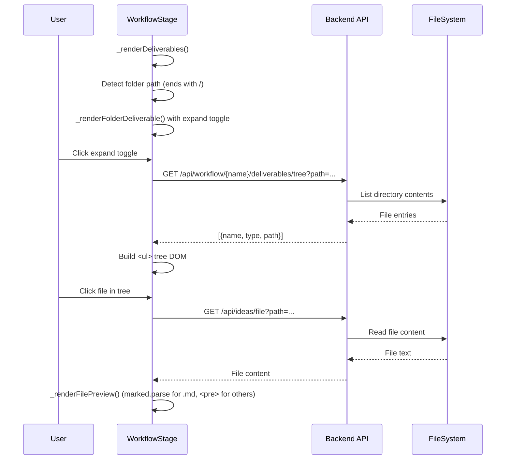

# Technical Design: Enhanced Deliverable Viewer

> Feature ID: FEATURE-038-C | Version: v1.0 | Last Updated: 02-20-2026

---

## Part 1: Agent-Facing Summary

> **Purpose:** Quick reference for AI agents navigating large projects.
> **📌 AI Coders:** Focus on this section for implementation context.

### Key Components Implemented

| Component | Responsibility | Scope/Impact | Tags |
|-----------|----------------|--------------|------|
| `_renderFolderDeliverable()` | Render file-tree for folder deliverables | workflow-stage.js | #deliverables #filetree #frontend |
| `_renderFilePreview()` | Inline file preview pane | workflow-stage.js | #deliverables #preview #markdown |
| `GET /api/workflow/{name}/deliverables/tree` | Folder contents endpoint | Backend API | #api #deliverables #backend |

### Dependencies

| Dependency | Source | Design Link | Usage Description |
|------------|--------|-------------|-------------------|
| `_renderDeliverables()` | FEATURE-036-E | `src/x_ipe/static/js/features/workflow-stage.js` | Existing deliverable grid being extended |
| `GET /api/ideas/file` | FEATURE-037-B | `src/x_ipe/routes/ideas_routes.py` | File content retrieval for preview |
| `marked.js` | Foundation | `src/x_ipe/static/3rdparty/js/marked.min.js` | Markdown rendering for .md files |
| `GET /api/workflow/{name}/deliverables` | FEATURE-036-E | `src/x_ipe/routes/workflow_routes.py` | Existing deliverables API |

### Major Flow

1. Deliverables grid renders → for each deliverable, check if path ends with `/`
2. If folder-type → render card with expand toggle (▸) instead of standard file card
3. User clicks expand → fetch folder contents via API → build nested `<ul>` tree
4. User clicks file in tree → fetch file content via `GET /api/ideas/file` → render preview
5. Markdown files rendered via `marked.parse()`, text files shown as `<pre>`

### Usage Example

```javascript
// In _renderDeliverables():
if (item.path.endsWith('/')) {
  card = this._renderFolderDeliverable(item, wfName);
} else {
  card = this._renderFileDeliverable(item); // existing
}

// Folder tree expansion:
async _expandFolderTree(card, folderPath, wfName) {
  const resp = await fetch(`/api/workflow/${wfName}/deliverables/tree?path=${encodeURIComponent(folderPath)}`);
  const entries = await resp.json();
  const tree = this._buildTreeDOM(entries);
  card.appendChild(tree);
}
```

---

## Part 2: Implementation Guide

> **Purpose:** Human-readable details for developers.

### Workflow Diagram



### UI Component Structure (from Mockup Scene 4)

```
.deliverable-card.folder-type
├── .deliverable-card-header (click → toggle tree)
│   ├── .toggle-icon (▸/▾)
│   ├── 📁 icon
│   ├── .deliverable-name (folder name)
│   └── .deliverable-path (full path, monospace)
├── .deliverable-tree (hidden initially)
│   └── ul.file-tree
│       ├── li.tree-item.folder
│       │   ├── .toggle-icon + 📁 + name
│       │   └── ul.file-tree (nested, collapsed)
│       └── li.tree-item.file (click → preview)
│           └── 📄 + name
└── .deliverable-preview (hidden initially)
    ├── .preview-header (file name)
    └── .preview-content (rendered HTML or <pre>)
```

### Backend API

#### `GET /api/workflow/{name}/deliverables/tree`

```python
@workflow_bp.route('/api/workflow/<name>/deliverables/tree', methods=['GET'])
def get_deliverable_tree(name):
    """
    Query params: path (required) - Relative folder path from project root
    
    Response 200:
    [
      {"name": "idea-summary.md", "type": "file", "path": "x-ipe-docs/ideas/.../refined-idea/idea-summary.md"},
      {"name": "mockups", "type": "dir", "path": "x-ipe-docs/ideas/.../refined-idea/mockups/"}
    ]
    
    Security: Validate path is within project root (no traversal)
    Limit: Return max 50 entries per folder level
    """
```

### Implementation Steps

1. **Backend:** Add `GET /api/workflow/{name}/deliverables/tree` endpoint in `workflow_routes.py`
   - List directory contents (files + subdirs)
   - Validate path is within project root
   - Limit to 50 entries per level
   - Return `[{name, type, path}]` JSON

2. **Frontend — Folder Detection:**
   - In `_renderDeliverables()`, check `item.path.endsWith('/')` 
   - Route to `_renderFolderDeliverable()` for folder-type

3. **Frontend — File-Tree:**
   - `_renderFolderDeliverable(item, wfName)` creates card with expand toggle
   - On expand click: fetch tree → `_buildTreeDOM(entries)` → append
   - Nested folders collapse/expand on click

4. **Frontend — Preview:**
   - `_renderFilePreview(filePath, container)` fetches file content
   - `.md` files → `marked.parse(content)` → inject HTML
   - Other text files → `<pre>${escaped(content)}</pre>`
   - Binary files (415 response) → "Binary file" message

5. **CSS:** Add styles for `.folder-type`, `.file-tree`, `.deliverable-preview`, `.tree-item`

### File Tree CSS

```css
.file-tree {
  list-style: none;
  padding-left: 1.2rem;
  margin: 0;
}

.tree-item {
  padding: 2px 0;
  cursor: pointer;
  white-space: nowrap;
}

.tree-item.file:hover {
  background: var(--bg-hover);
  border-radius: 3px;
}

.deliverable-preview {
  border-top: 1px solid var(--border-color);
  padding: 0.75rem;
  max-height: 400px;
  overflow-y: auto;
}

.preview-header {
  font-weight: 600;
  margin-bottom: 0.5rem;
  font-size: 0.85rem;
}
```

### Modified Files

- `src/x_ipe/static/js/features/workflow-stage.js` — Add `_renderFolderDeliverable()`, `_buildTreeDOM()`, `_renderFilePreview()`
- `src/x_ipe/routes/workflow_routes.py` — Add deliverable tree endpoint
- `src/x_ipe/static/css/workflow-stage.css` — Add file-tree and preview styles

### Edge Cases & Error Handling

| Scenario | Expected Behavior |
|----------|-------------------|
| Empty folder | Show "No files" message in tree |
| >50 files in folder | Show first 50 + "N more files..." |
| Nested 3+ levels | All levels render (no limit) |
| File with no extension | Preview as plain text |
| Large file >100KB | Show first 100KB + "File truncated" |
| Folder doesn't exist | Show "⚠️ folder not found" |
| Path traversal attempt | Rejected by backend, show error |
| Binary file clicked | Show "Binary file" placeholder |

---

## Design Change Log

| Date | Phase | Change Summary |
|------|-------|----------------|
| 02-20-2026 | Initial Design | Backend: folder listing endpoint. Frontend: folder detection in deliverables grid, file-tree DOM builder, inline preview with marked.js for markdown. |
