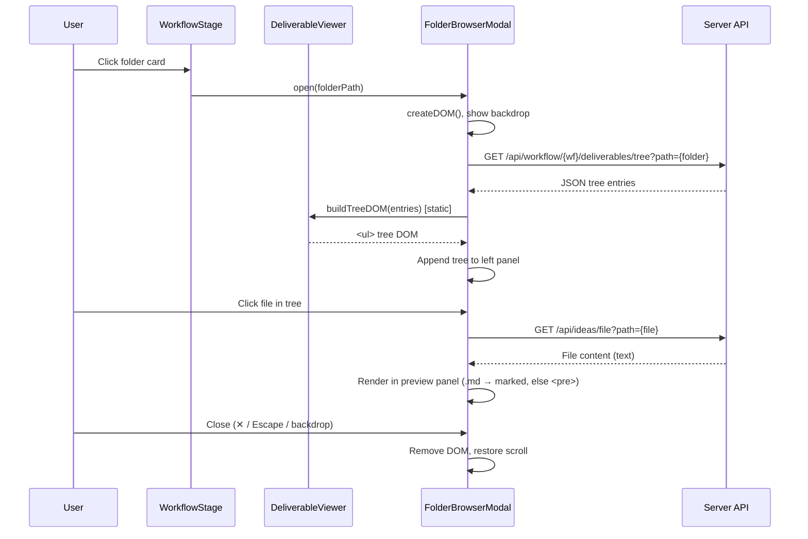
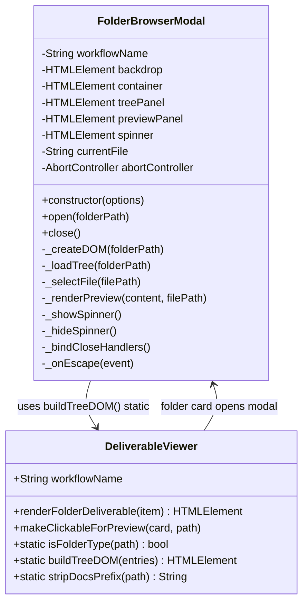
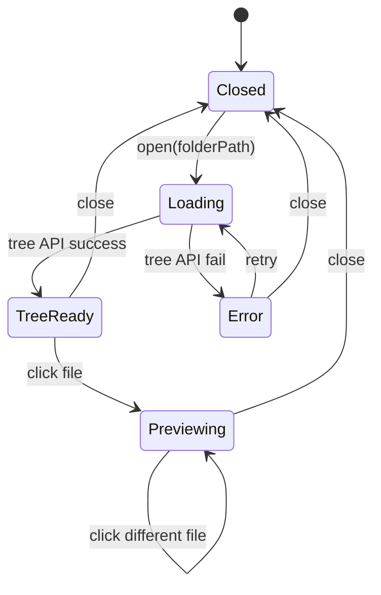

# Technical Design: Folder Browser Modal (MVP)

> Feature ID: FEATURE-039-A | Version: v1.0 | Last Updated: 02-22-2026

---

## Part 1: Agent-Facing Summary

> **Purpose:** Quick reference for AI agents navigating large projects.
> **📌 AI Coders:** Focus on this section for implementation context.

### Key Components Implemented

| Component | Responsibility | Scope/Impact | Tags |
|-----------|----------------|--------------|------|
| `FolderBrowserModal` | Two-panel modal (tree + preview) for browsing folder deliverables | New file: `src/static/js/folder-browser-modal.js` | #modal #folder-browser #deliverable #frontend |
| `folder-browser-modal.css` | Modal styling (backdrop, panels, tree, preview) | New file: `src/static/css/folder-browser-modal.css` | #css #modal #styling |
| `DeliverableViewer` (modified) | Remove inline tree; folder card click → opens modal | Modified: `src/static/js/deliverable-viewer.js` | #refactor #cleanup #deliverable |
| `workflow.css` (modified) | Remove dead inline tree CSS; add folder card bg variable | Modified: `src/static/css/workflow.css` | #css #cleanup |
| `base.html` (modified) | Include new JS/CSS files | Modified: `src/templates/base.html` | #template #includes |

### Dependencies

| Dependency | Source | Design Link | Usage Description |
|------------|--------|-------------|-------------------|
| `DeliverableViewer.buildTreeDOM()` | FEATURE-038-C | deliverable-viewer.js | Static method reused for tree DOM construction (DRY) |
| `DeliverableViewer.isFolderType()` | FEATURE-038-C | deliverable-viewer.js | Static method reused for folder detection |
| `marked.js` | 3rd-party (global) | N/A | Markdown → HTML rendering in preview panel |
| `GET /api/workflow/{wf}/deliverables/tree` | FEATURE-036-E | N/A | Fetch folder structure for tree panel |
| `GET /api/ideas/file` | Foundation | N/A | Fetch file content for preview panel |

### Major Flow

1. User clicks folder-type deliverable card → `FolderBrowserModal.open(folderPath)` called
2. Modal creates backdrop + container DOM, appends to `document.body`, locks scroll
3. Tree panel fetches `/api/workflow/{wf}/deliverables/tree?path={folder}` → calls `DeliverableViewer.buildTreeDOM()` → renders tree
4. User clicks file in tree → preview panel fetches `/api/ideas/file?path={file}` → renders markdown or preformatted text
5. User closes modal (✕ / Escape / backdrop click) → DOM removed, scroll restored

### Usage Example

```javascript
// In workflow-stage.js — when rendering deliverable cards
const modal = new FolderBrowserModal({ workflowName: wfName });

// Folder card click handler (set up by DeliverableViewer.renderFolderDeliverable)
folderCard.addEventListener('click', () => {
    modal.open(item.path);
});

// Modal handles its own lifecycle (close, cleanup)
```

---

## Part 2: Implementation Guide

> **Purpose:** Human-readable details for developers.
> **📌 Emphasis on visual diagrams for comprehension.**

### Workflow Diagram



### Class Diagram



### State Diagram



### Component Architecture

```
FolderBrowserModal DOM Structure
================================

document.body
└── .folder-browser-backdrop          [position:fixed, z-index:1051]
    └── .folder-browser-modal         [80vw, centered, flex column]
        ├── .folder-browser-header    [flex, space-between]
        │   ├── .folder-browser-title [📁 folder name]
        │   └── .folder-browser-close [✕ button]
        └── .folder-browser-body      [flex row, flex:1]
            ├── .folder-browser-tree  [30%, overflow-y:auto, border-right]
            │   ├── .folder-browser-spinner [loading state]
            │   └── ul.file-tree      [reused from buildTreeDOM()]
            │       ├── li.tree-item.dir-item  [📁 click→expand/collapse]
            │       └── li.tree-item.file-item [📄 click→preview]
            └── .folder-browser-preview [70%, overflow-y:auto]
                ├── .folder-browser-preview-header [filename]
                └── .folder-browser-preview-content [rendered content]
```

### CSS Variables

```css
/* New variables added to workflow.css or :root */
--deliverable-folder-bg: rgba(99, 102, 241, 0.06);    /* folder card background */
--folder-browser-backdrop: rgba(0, 0, 0, 0.4);         /* modal backdrop */
--folder-browser-bg: var(--bg-primary, #ffffff);        /* modal background */
--folder-browser-border: var(--border-color, #e2e8f0);  /* panel divider */
--folder-browser-selected: var(--accent, #6366f1);      /* selected tree item */
```

### Implementation Steps

#### Step 1: CSS — `src/static/css/folder-browser-modal.css` (new file)

Create modal styles following the project's existing pattern (`.compose-modal-*` reference):

```css
/* Backdrop */
.folder-browser-backdrop {
    position: fixed;
    inset: 0;
    background: var(--folder-browser-backdrop, rgba(0,0,0,0.4));
    backdrop-filter: blur(4px);
    z-index: 1051;
    display: flex;
    align-items: center;
    justify-content: center;
    opacity: 0;
    visibility: hidden;
    transition: opacity 0.2s, visibility 0.2s;
}
.folder-browser-backdrop.active {
    opacity: 1;
    visibility: visible;
}

/* Modal container */
.folder-browser-modal {
    background: var(--folder-browser-bg, #fff);
    border-radius: 12px;
    width: 80vw;
    max-height: 85vh;
    display: flex;
    flex-direction: column;
    box-shadow: 0 20px 60px rgba(0,0,0,0.15);
    transform: scale(0.95);
    transition: transform 0.2s;
}
.folder-browser-backdrop.active .folder-browser-modal {
    transform: scale(1);
}

/* Header */
.folder-browser-header {
    display: flex;
    align-items: center;
    justify-content: space-between;
    padding: 14px 20px;
    border-bottom: 1px solid var(--folder-browser-border, #e2e8f0);
    flex-shrink: 0;
}
.folder-browser-title {
    font-size: 14px;
    font-weight: 600;
}
.folder-browser-close {
    background: none;
    border: none;
    font-size: 18px;
    cursor: pointer;
    padding: 4px 8px;
    border-radius: 4px;
    color: var(--text-secondary, #64748b);
}
.folder-browser-close:hover {
    background: rgba(0,0,0,0.06);
}

/* Body — two panels */
.folder-browser-body {
    display: flex;
    flex: 1;
    min-height: 0;
    overflow: hidden;
}

/* Tree panel (left) */
.folder-browser-tree {
    width: 30%;
    overflow-y: auto;
    border-right: 1px solid var(--folder-browser-border, #e2e8f0);
    padding: 12px 0;
}
.folder-browser-tree .file-tree {
    list-style: none;
    padding: 0 12px;
    margin: 0;
}
.folder-browser-tree .tree-item {
    padding: 4px 8px;
    border-radius: 4px;
    cursor: pointer;
    font-size: 13px;
    white-space: nowrap;
    overflow: hidden;
    text-overflow: ellipsis;
}
.folder-browser-tree .tree-item:hover {
    background: rgba(0,0,0,0.04);
}
.folder-browser-tree .tree-item.selected {
    background: rgba(99,102,241,0.1);
    color: var(--folder-browser-selected, #6366f1);
}

/* Preview panel (right) */
.folder-browser-preview {
    width: 70%;
    display: flex;
    flex-direction: column;
    overflow: hidden;
}
.folder-browser-preview-header {
    padding: 10px 20px;
    font-size: 12px;
    font-weight: 500;
    color: var(--text-secondary, #64748b);
    border-bottom: 1px solid var(--folder-browser-border, #e2e8f0);
    flex-shrink: 0;
}
.folder-browser-preview-content {
    padding: 20px;
    overflow-y: auto;
    flex: 1;
    font-size: 14px;
}
.folder-browser-preview-content pre {
    white-space: pre-wrap;
    word-wrap: break-word;
    background: #f8fafc;
    padding: 16px;
    border-radius: 8px;
    font-size: 13px;
}
.folder-browser-preview-empty {
    display: flex;
    align-items: center;
    justify-content: center;
    height: 100%;
    color: var(--text-muted, #94a3b8);
    font-size: 13px;
}

/* Spinner */
.folder-browser-spinner {
    display: flex;
    align-items: center;
    justify-content: center;
    padding: 40px;
}
.folder-browser-spinner::after {
    content: '';
    width: 24px;
    height: 24px;
    border: 2px solid #e2e8f0;
    border-top-color: var(--accent, #6366f1);
    border-radius: 50%;
    animation: fb-spin 0.6s linear infinite;
}
@keyframes fb-spin {
    to { transform: rotate(360deg); }
}

/* Error state */
.folder-browser-error {
    text-align: center;
    padding: 40px 20px;
    color: var(--text-secondary, #64748b);
}
.folder-browser-error button {
    margin-top: 12px;
    padding: 6px 16px;
    border: 1px solid var(--border-color, #e2e8f0);
    border-radius: 6px;
    background: none;
    cursor: pointer;
    font-size: 13px;
}
```

#### Step 2: JavaScript — `src/static/js/folder-browser-modal.js` (new file)

```
class FolderBrowserModal:

  constructor({ workflowName })
    - Store workflowName
    - Initialize: backdrop=null, currentFile=null, abortController=null
    - Bind _onEscape to this

  open(folderPath)
    - If already open, close first
    - Call _createDOM(folderPath)
    - Append backdrop to document.body
    - document.body.style.overflow = 'hidden'
    - requestAnimationFrame → add .active class (triggers transition)
    - _bindCloseHandlers()
    - _loadTree(folderPath)

  close()
    - If not open (no backdrop), return
    - Remove .active class
    - After transition (200ms) → remove backdrop from DOM
    - document.body.style.overflow = ''
    - Remove escape listener
    - Abort any pending fetch
    - Reset state (backdrop=null, currentFile=null)

  _createDOM(folderPath)
    - Create backdrop div.folder-browser-backdrop
    - innerHTML for modal structure:
      .folder-browser-modal
        .folder-browser-header (📁 folderName + ✕ close)
        .folder-browser-body
          .folder-browser-tree (empty, gets tree)
          .folder-browser-preview
            .folder-browser-preview-empty ("Select a file to preview")
    - Cache refs: this.container, this.treePanel, this.previewPanel

  _loadTree(folderPath)
    - Show spinner in treePanel
    - this.abortController = new AbortController()
    - Fetch GET /api/workflow/{workflowName}/deliverables/tree?path={folderPath}
    - On success:
      - Parse JSON entries
      - Call DeliverableViewer.buildTreeDOM(entries) for UL
      - Replace spinner with tree UL
      - Wire click handlers: .file-item → _selectFile, .dir-item → toggle children
    - On error:
      - Show error message + retry button
      - Retry button → _loadTree(folderPath)
    - On empty:
      - Show "No files in this folder"

  _selectFile(filePath)
    - If filePath === currentFile, return (debounce same file)
    - Remove .selected from previous tree item
    - Add .selected to new tree item
    - Set currentFile = filePath
    - Abort previous preview fetch if pending
    - Show spinner in preview panel
    - Fetch GET /api/ideas/file?path={filePath}
    - On success: _renderPreview(content, filePath)
    - On 404: Show "File not found"
    - On error: Show "Failed to load preview"

  _renderPreview(content, filePath)
    - Clear previewPanel
    - Add .folder-browser-preview-header with filename
    - Add .folder-browser-preview-content
    - If filePath ends with .md: content = marked.parse(content)
    - Else: content = <pre>{escaped content}</pre>
    - Set innerHTML of preview content

  _bindCloseHandlers()
    - Close button click → close()
    - Backdrop click (not on modal) → close()
    - document.addEventListener('keydown', _onEscape)

  _onEscape(event)
    - If event.key === 'Escape' → close()

  _showSpinner() / _hideSpinner()
    - Toggle .folder-browser-spinner element
```

#### Step 3: Modify `deliverable-viewer.js`

**Remove:**
- `_expandFolderTree()` method — entire method
- `showPreview()` method — entire method (preview now in modal)
- `.deliverable-preview-backdrop` DOM creation
- `.deliverable-tree` container from `renderFolderDeliverable()`
- `.deliverable-card-header` with toggle icon (▸/▾)
- `_escapeHtml()` method (move to FolderBrowserModal if needed, or keep if used elsewhere)

**Modify `renderFolderDeliverable(item)`:**
```javascript
// BEFORE: Card with toggle + hidden tree container
// AFTER: Simple card with folder bg — click handler set externally
renderFolderDeliverable(item) {
    const card = document.createElement('div');
    card.className = 'deliverable-card folder-type clickable';
    // Icon
    const icon = document.createElement('div');
    icon.className = 'deliverable-icon folders';
    icon.textContent = '📁';
    // Info
    const info = document.createElement('div');
    info.className = 'deliverable-info';
    const name = document.createElement('div');
    name.className = 'deliverable-name';
    name.textContent = item.name || item.path.split('/').filter(Boolean).pop();
    name.title = item.path;
    const path = document.createElement('div');
    path.className = 'deliverable-path';
    path.textContent = DeliverableViewer.stripDocsPrefix(item.path);
    info.appendChild(name);
    info.appendChild(path);
    card.appendChild(icon);
    card.appendChild(info);
    // No toggle, no tree container — modal handles browsing
    return card;
}
```

**Keep (static, reused by FolderBrowserModal):**
- `static buildTreeDOM(entries)` — tree DOM builder
- `static isFolderType(path)` — folder detection
- `static stripDocsPrefix(path)` — path display helper
- `makeClickableForPreview(card, path)` — still used for file-type cards (non-folder)

#### Step 4: Modify `workflow-stage.js`

In the deliverable rendering section (~lines 959-971):

```javascript
// BEFORE:
const viewer = typeof DeliverableViewer !== 'undefined'
    ? new DeliverableViewer({ workflowName: wfName }) : null;
items.forEach(item => {
    if (viewer && DeliverableViewer.isFolderType(item.path)) {
        grid.appendChild(viewer.renderFolderDeliverable(item));
    } else { ... }
});

// AFTER:
const viewer = typeof DeliverableViewer !== 'undefined'
    ? new DeliverableViewer({ workflowName: wfName }) : null;
const folderModal = typeof FolderBrowserModal !== 'undefined'
    ? new FolderBrowserModal({ workflowName: wfName }) : null;
items.forEach(item => {
    if (viewer && DeliverableViewer.isFolderType(item.path)) {
        const card = viewer.renderFolderDeliverable(item);
        if (folderModal) {
            card.addEventListener('click', () => folderModal.open(item.path));
        }
        grid.appendChild(card);
    } else { ... }
});
```

#### Step 5: Modify `workflow.css`

**Remove dead CSS rules:**
- `.deliverable-tree` (no longer exists)
- `.deliverable-card-header` (toggle removed)
- `.toggle-icon` (expand/collapse removed)
- `.deliverable-preview-backdrop` and children (preview now in modal)
- `.preview-header`, `.preview-close`, `.preview-content` (moved to modal CSS)

**Add folder card background:**
```css
.deliverable-card.folder-type {
    background: var(--deliverable-folder-bg, rgba(99, 102, 241, 0.06));
    cursor: pointer;
    /* Remove: flex-wrap: wrap; (no longer needed without tree) */
}
```

#### Step 6: Modify `base.html`

Add new includes:
```html
<!-- In <head> CSS section -->
<link href="/static/css/folder-browser-modal.css" rel="stylesheet">

<!-- In <body> JS section, after deliverable-viewer.js -->
<script src="/static/js/folder-browser-modal.js"></script>
```

### File Change Summary

| File | Action | Changes |
|------|--------|---------|
| `src/static/js/folder-browser-modal.js` | **CREATE** | New `FolderBrowserModal` class (~120 lines) |
| `src/static/css/folder-browser-modal.css` | **CREATE** | Modal styling (~140 lines) |
| `src/static/js/deliverable-viewer.js` | **MODIFY** | Remove `_expandFolderTree`, `showPreview`, toggle, tree container; simplify `renderFolderDeliverable` |
| `src/static/js/workflow-stage.js` | **MODIFY** | Instantiate `FolderBrowserModal`, wire folder card click → `modal.open()` |
| `src/static/css/workflow.css` | **MODIFY** | Remove dead inline tree/preview CSS; add `--deliverable-folder-bg` |
| `src/templates/base.html` | **MODIFY** | Add CSS/JS includes for folder-browser-modal |

### Edge Cases & Error Handling

| Scenario | Expected Behavior |
|----------|-------------------|
| Empty folder | Tree panel: "No files in this folder" |
| Tree API error (500) | Error message with "Retry" button → re-call `_loadTree()` |
| File not found (404) | Preview: "File not found" message |
| Binary file selected | Preview: "Binary file — cannot preview" (check extension: `.png`, `.jpg`, `.gif`, `.pdf`, `.zip`, etc.) |
| Very long file names | CSS `text-overflow: ellipsis` + `title` tooltip |
| Rapid file clicks | `abortController.abort()` cancels previous fetch; only last click loads |
| Modal open + navigate away | Handled if SPA navigation calls `close()` (no SPA in current app — N/A) |
| `DeliverableViewer` not loaded | `typeof` guard → folder cards render without click handler |
| `FolderBrowserModal` not loaded | `typeof` guard → folder cards render without click handler |
| `marked` not available | Fallback to `<pre>` for all files |

### Binary File Detection

```javascript
const BINARY_EXTENSIONS = new Set([
    '.png', '.jpg', '.jpeg', '.gif', '.svg', '.webp', '.ico',
    '.pdf', '.zip', '.gz', '.tar', '.7z',
    '.mp3', '.mp4', '.wav', '.avi',
    '.woff', '.woff2', '.ttf', '.eot',
    '.exe', '.dll', '.so', '.dylib'
]);

function isBinaryFile(path) {
    const ext = path.substring(path.lastIndexOf('.')).toLowerCase();
    return BINARY_EXTENSIONS.has(ext);
}
```

---

## Design Change Log

| Date | Phase | Change Summary |
|------|-------|----------------|
| 02-22-2026 | Initial Design | Initial technical design created. New FolderBrowserModal class replacing inline tree expansion. Two files created (JS+CSS), three files modified (deliverable-viewer, workflow-stage, workflow.css, base.html). Reuses buildTreeDOM() static method (DRY). |
