# Technical Design: Modal Generalization & Core Actions (MVP)

> Feature ID: FEATURE-040-A | Version: v1.0 | Last Updated: 02-22-2026

---

## Part 1: Agent-Facing Summary

> **Purpose:** Quick reference for AI agents navigating large projects.
> **📌 AI Coders:** Focus on this section for implementation context.

### Key Components Implemented

| Component | Responsibility | Scope/Impact | Tags |
|-----------|----------------|--------------|------|
| `ActionExecutionModal._resolveInputFiles()` | Generic input file resolution from workflow deliverables | Replaces `_resolveIdeaFiles()`, serves all actions | #frontend #modal #core |
| `ActionExecutionModal._getConfigEntry()` | Unified config lookup across all copilot-prompt sections | New helper method | #frontend #config |
| `copilot-prompt.json` — `workflow` section | Prompt configs for requirement_gathering, feature_breakdown | New section alongside `ideation` and `evaluation` | #config #prompts |
| `copilot-prompt.json` — `input_source` field | Declares which previous action deliverables to resolve | Added to existing + new entries | #config #schema |

### Dependencies

| Dependency | Source | Design Link | Usage Description |
|------------|--------|-------------|-------------------|
| `ActionExecutionModal` | FEATURE-038-A | [technical-design.md](../EPIC-038/FEATURE-038-A/technical-design.md) | Base modal class being extended |
| `WorkflowStage.ACTION_MAP` | FEATURE-038-A | — | Provides action metadata (label, icon, skill) |
| `/api/workflow/{name}` | Existing | workflow_routes.py | Fetches workflow state with action deliverables |
| `/api/workflow/{name}/deliverables/tree` | Existing | workflow_routes.py | Scans folder deliverables for file listing |
| `/api/config/copilot-prompt` | Existing | workflow_routes.py | Serves copilot-prompt.json config |

### Major Flow

1. User clicks action button → `_dispatchCliAction()` creates `ActionExecutionModal` (no change)
2. `modal.open()` → `_loadInstructions()` searches ALL config sections for matching `id`
3. If config has `input_source` → `_resolveInputFiles(inputSource)` resolves deliverables from listed source actions
4. If no `input_source` → falls back to legacy `_resolveIdeaFiles()` behavior
5. If no config found → shows "Configuration not yet available" message, disables execute button
6. Modal renders file selector (dropdown or manual text input fallback) + extra instructions + execute

### Usage Example

```javascript
// Requirement Gathering action clicked — now opens modal with auto-resolved files
const modal = new ActionExecutionModal({
    actionKey: 'requirement_gathering',
    workflowName: 'wf-myproject',
    skillName: 'x-ipe-task-based-requirement-gathering',
    onComplete: () => workflowView.render(container)
});
modal.open();
// Modal auto-resolves files from refine_idea + design_mockup deliverables
// User sees dropdown with .md files, selects one, clicks Execute
```

---

## Part 2: Implementation Guide

> **Purpose:** Human-readable details for developers.

### Architecture Diagram

```mermaid
sequenceDiagram
    participant U as User
    participant WS as WorkflowStage
    participant AEM as ActionExecutionModal
    participant API as /api/workflow/{name}
    participant CFG as copilot-prompt.json
    participant T as Terminal

    U->>WS: Click action button
    WS->>AEM: new ActionExecutionModal({actionKey, workflowName, ...})
    AEM->>AEM: open()
    AEM->>CFG: _loadInstructions() — search all sections
    CFG-->>AEM: config entry (id, command, input_source)
    
    alt input_source present
        AEM->>API: GET /api/workflow/{name} (get workflow state)
        API-->>AEM: stages.{stage}.actions.{source}.deliverables
        AEM->>API: GET /api/workflow/{name}/deliverables/tree (scan folders)
        API-->>AEM: file entries
        AEM->>AEM: _resolveInputFiles() → merged file list
    else no input_source (legacy)
        AEM->>AEM: _resolveIdeaFiles() (backward compat)
    end
    
    AEM->>AEM: _createDOM() — render file selector + instructions
    U->>AEM: Select file, add extra instructions, click Execute
    AEM->>AEM: _buildCommand() — replace <input-file> placeholder
    AEM->>T: dispatch command to idle session
```



### Data Model Changes

#### copilot-prompt.json — New `input_source` Field

Add `input_source` to prompt entries that need auto-resolved input files:

```json
{
  "version": "3.1",
  "ideation": {
    "prompts": [
      {
        "id": "refine-idea",
        "icon": "bi-stars",
        "input_source": ["compose_idea"],
        "prompt-details": [...]
      },
      {
        "id": "generate-mockup",
        "icon": "bi-palette",
        "input_source": ["refine_idea", "compose_idea"],
        "prompt-details": [...]
      }
    ]
  },
  "workflow": {
    "prompts": [
      {
        "id": "requirement-gathering",
        "icon": "bi-clipboard-data",
        "input_source": ["refine_idea", "design_mockup"],
        "prompt-details": [
          {
            "language": "en",
            "label": "Requirement Gathering",
            "command": "gather requirements from <input-file> with requirement gathering skill"
          }
        ]
      },
      {
        "id": "feature-breakdown",
        "icon": "bi-diagram-2",
        "input_source": ["requirement_gathering"],
        "prompt-details": [
          {
            "language": "en",
            "label": "Feature Breakdown",
            "command": "break down features from <input-file> with feature breakdown skill"
          }
        ]
      }
    ]
  },
  "placeholder": {
    "current-idea-file": "Replaced with currently open file path",
    "input-file": "Replaced with selected input file path from source action deliverables",
    "evaluation-file": "x-ipe-docs/quality-evaluation/project-quality-evaluation.md"
  }
}
```

#### Input Source Resolution Chain

```
compose_idea → refine_idea → design_mockup → requirement_gathering → feature_breakdown
                                           ↘ requirement_gathering ↗
```

Each action's `input_source` declares which previous action(s) provide its input files.

### Implementation Steps

#### Step 1: Extend copilot-prompt.json Config (config layer)

**File:** `x-ipe-docs/config/copilot-prompt.json` + `src/x_ipe/resources/config/copilot-prompt.json`

Changes:
1. Bump version to `"3.1"`
2. Add `input_source` to `refine-idea`: `["compose_idea"]`
3. Add `input_source` to `generate-mockup`: `["refine_idea", "compose_idea"]`
4. Add new `"workflow"` section with `requirement-gathering` and `feature-breakdown` entries
5. Add `"input-file"` to `placeholder` section
6. Keep all existing entries unchanged

#### Step 2: Refactor `_loadInstructions()` (modal — config lookup)

**File:** `src/x_ipe/static/js/features/action-execution-modal.js`

**Current logic (lines 43-77):** Iterates sections, finds matching `id`, handles only `<current-idea-file>` placeholder.

**New logic:**
```javascript
async _loadInstructions() {
    let config = window.__copilotPromptConfig;
    if (!config) {
        try {
            const resp = await fetch('/api/config/copilot-prompt');
            if (resp.ok) {
                config = await resp.json();
                window.__copilotPromptConfig = config;
            }
        } catch (e) { /* ignore */ }
    }
    if (!config) return;

    const entry = this._getConfigEntry(config);
    if (!entry) return;

    const detail = entry['prompt-details'].find(d => d.language === 'en')
        || entry['prompt-details'][0];
    let command = detail.command;

    // Resolve input files from input_source or legacy <current-idea-file>
    const hasInputPlaceholder = command.includes('<input-file>') || command.includes('<current-idea-file>');
    if (hasInputPlaceholder && this.workflowName) {
        if (entry.input_source) {
            this._inputFiles = await this._resolveInputFiles(entry.input_source);
        } else {
            // Legacy fallback for entries without input_source
            this._inputFiles = await this._resolveIdeaFiles();
        }
        this._commandTemplate = command;
        const selected = this._inputFiles.length ? this._inputFiles[0] : null;
        this._selectedInputFile = selected;
        if (selected) {
            command = command.replace(/<input-file>|<current-idea-file>/g, selected);
        }
    }

    this._loadedInstructions = { label: detail.label, command };
}
```

#### Step 3: Add `_getConfigEntry()` helper

**File:** `src/x_ipe/static/js/features/action-execution-modal.js`

```javascript
_getConfigEntry(config) {
    const configId = this.actionKey.replace(/_/g, '-');
    for (const [, sectionData] of Object.entries(config)) {
        // Search in .prompts arrays (ideation, workflow)
        if (sectionData.prompts) {
            const found = sectionData.prompts.find(p => p.id === configId);
            if (found) return found;
        }
        // Search in evaluation.evaluate (single object)
        if (sectionData.id === configId) return sectionData;
        // Search in evaluation.refactoring array
        if (Array.isArray(sectionData)) {
            const found = sectionData.find(p => p.id === configId);
            if (found) return found;
        }
    }
    return null;
}
```

#### Step 4: Add `_resolveInputFiles()` method

**File:** `src/x_ipe/static/js/features/action-execution-modal.js`

New method after `_resolveIdeaFiles()`:

```javascript
async _resolveInputFiles(inputSource) {
    const files = [];
    try {
        const resp = await fetch(`/api/workflow/${encodeURIComponent(this.workflowName)}`);
        if (!resp.ok) return files;
        const json = await resp.json();
        const stages = (json.data || {}).stages || {};

        for (const sourceAction of inputSource) {
            // Find the source action across all stages
            for (const [, stageData] of Object.entries(stages)) {
                const action = (stageData.actions || {})[sourceAction];
                if (!action || !action.deliverables) continue;
                
                for (const d of action.deliverables) {
                    if (d.endsWith('.md') && !files.includes(d)) {
                        files.push(d);
                    }
                    // If deliverable is a folder, scan it
                    if (!d.includes('.')) {
                        try {
                            const treeResp = await fetch(
                                `/api/workflow/${encodeURIComponent(this.workflowName)}/deliverables/tree?path=${encodeURIComponent(d)}`
                            );
                            if (treeResp.ok) {
                                const treeJson = await treeResp.json();
                                const entries = Array.isArray(treeJson) ? treeJson : (treeJson.data || treeJson.entries || []);
                                for (const entry of entries) {
                                    if (entry.type === 'file' && entry.path && entry.path.endsWith('.md')) {
                                        if (!files.includes(entry.path)) files.push(entry.path);
                                    }
                                }
                            }
                        } catch (e) { /* folder may not exist */ }
                    }
                }
            }
        }
    } catch (e) { /* ignore */ }
    return files;
}
```

#### Step 5: Update `_createDOM()` (modal — UI generalization)

**File:** `src/x_ipe/static/js/features/action-execution-modal.js`

Changes to lines 114-164:

1. Replace `this._ideaFiles` references with `this._inputFiles`
2. Change selector label from "Current Selected Idea" to "Input File"
3. Add manual path text input fallback when `_inputFiles` is empty but command has `<input-file>` placeholder
4. Add "Configuration not yet available" message when `_loadedInstructions` is null

```javascript
// In _createDOM(), replace the idea-selector-section:
${this._inputFiles && this._inputFiles.length > 0 ? `
<div class="input-selector-section">
    <div class="instructions-label">Input File</div>
    <select class="input-selector">
        ${this._inputFiles.map((f, i) => `<option value="${this._escapeHtml(f)}" ${i === 0 ? 'selected' : ''}>${this._escapeHtml(f.split('/').pop())} <span class="path-hint">(${this._escapeHtml(f)})</span></option>`).join('')}
    </select>
</div>
` : this._commandTemplate && (this._commandTemplate.includes('<input-file>') || this._commandTemplate.includes('<current-idea-file>')) ? `
<div class="input-selector-section">
    <div class="instructions-label">Input File</div>
    <input type="text" class="input-path-manual" placeholder="Enter file path...">
</div>
` : ''}
```

#### Step 6: Update `_bindEvents()` (event handling)

**File:** `src/x_ipe/static/js/features/action-execution-modal.js`

Changes to lines 184-194:

1. Replace `.idea-selector` event listener with `.input-selector`
2. Add `.input-path-manual` event listener for manual text input
3. Both update `_selectedInputFile` and replace `<input-file>` AND `<current-idea-file>` in command

```javascript
// Replace idea-selector binding:
const inputSelector = this.overlay.querySelector('.input-selector');
if (inputSelector) {
    inputSelector.addEventListener('change', () => {
        this._selectedInputFile = inputSelector.value;
        const newCommand = this._commandTemplate.replace(/<input-file>|<current-idea-file>/g, this._selectedInputFile);
        this._loadedInstructions.command = newCommand;
        const contentEl = this.overlay.querySelector('.instructions-content');
        if (contentEl) contentEl.textContent = newCommand;
    });
}

// Add manual path input binding:
const manualInput = this.overlay.querySelector('.input-path-manual');
if (manualInput) {
    manualInput.addEventListener('input', () => {
        this._selectedInputFile = manualInput.value;
        if (manualInput.value.trim()) {
            const newCommand = this._commandTemplate.replace(/<input-file>|<current-idea-file>/g, manualInput.value.trim());
            this._loadedInstructions.command = newCommand;
            const contentEl = this.overlay.querySelector('.instructions-content');
            if (contentEl) contentEl.textContent = newCommand;
        }
    });
}
```

### Backward Compatibility Strategy

| Aspect | Legacy Behavior | New Behavior | Compat Approach |
|--------|----------------|--------------|-----------------|
| `<current-idea-file>` placeholder | Replaced by `_resolveIdeaFiles()` | Both `<current-idea-file>` and `<input-file>` handled | Regex replaces both: `/<input-file>\|<current-idea-file>/g` |
| `_resolveIdeaFiles()` | Only method for file resolution | Kept as fallback | Called when no `input_source` in config |
| `refine-idea` config | No `input_source` field | Has `input_source: ["compose_idea"]` | Method still works without `input_source` |
| `.idea-selector` CSS class | Used in DOM + tests | Replaced by `.input-selector` | Update existing tests; `.idea-selector` no longer emitted |
| `_ideaFiles` / `_selectedIdeaFile` | Instance properties | Renamed to `_inputFiles` / `_selectedInputFile` | Old properties removed; tests updated |

### CSS Changes

**File:** `src/x_ipe/static/css/features/action-execution-modal.css`

Minimal changes:
1. Rename `.idea-selector-section` → `.input-selector-section` (if class exists in CSS)
2. Add `.input-path-manual` style (text input for fallback): same styling as `.extra-input` but single-line
3. Add `.no-config-message` style for "Configuration not yet available" message

```css
.input-path-manual {
    width: 100%;
    padding: 8px 12px;
    border: 1px solid var(--border-color, #ccc);
    border-radius: 4px;
    font-size: 0.9rem;
    background: var(--bg-color, #fff);
    color: var(--text-color, #333);
}

.no-config-message {
    text-align: center;
    padding: 24px;
    color: var(--text-muted, #888);
    font-style: italic;
}
```

### Edge Cases & Error Handling

| Scenario | Handling |
|----------|---------|
| Source action has no deliverables | `_resolveInputFiles()` returns empty → manual input fallback shown |
| API returns 500 | catch block → return empty files → manual input fallback |
| Config entry not found for action | `_getConfigEntry()` returns null → "Configuration not yet available" message |
| Both `<input-file>` and `<current-idea-file>` in same command | Regex replaces both simultaneously |
| Empty manual path input | Execute button remains enabled; command sent with unresolved placeholder (agent handles) |
| Multiple deliverable folders | Each scanned via tree API; all .md files merged and deduped |

### Files Changed Summary

| File | Change Type | Description |
|------|-------------|-------------|
| `src/x_ipe/static/js/features/action-execution-modal.js` | Modified | Refactor `_loadInstructions()`, add `_getConfigEntry()`, add `_resolveInputFiles()`, update `_createDOM()` + `_bindEvents()` |
| `src/x_ipe/static/css/features/action-execution-modal.css` | Modified | Add `.input-path-manual`, `.no-config-message` styles |
| `x-ipe-docs/config/copilot-prompt.json` | Modified | Add `workflow` section, `input_source` fields, `input-file` placeholder |
| `src/x_ipe/resources/config/copilot-prompt.json` | Modified | Same changes as x-ipe-docs copy (keep in sync) |
| `tests/frontend-js/action-execution-modal.test.js` | Modified | Update tests for new method names and behaviors |

### program_type and tech_stack

- **program_type:** `frontend`
- **tech_stack:** `["JavaScript/Vanilla", "HTML/CSS", "JSON"]`

---

## Design Change Log

| Date | Phase | Change Summary |
|------|-------|----------------|
| 02-22-2026 | Initial Design | Initial technical design for FEATURE-040-A |
