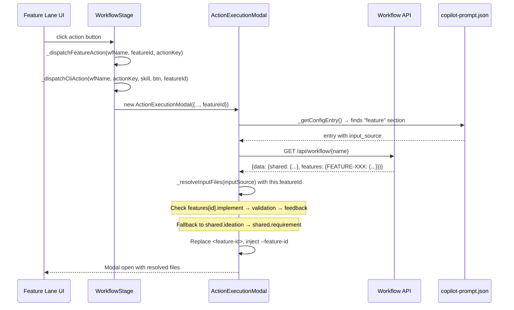
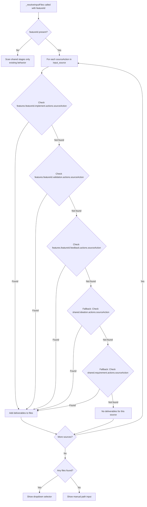

# Technical Design: Per-Feature Config & Core Resolution (MVP)

> Feature ID: FEATURE-041-A | Epic ID: EPIC-041 | Version: v1.0 | Last Updated: 02-25-2026

---

## Part 1: Agent-Facing Summary

> **Purpose:** Quick reference for AI agents navigating large projects.
> **📌 AI Coders:** Focus on this section for implementation context.

### Key Components Implemented

| Component | Responsibility | Scope/Impact | Tags |
|-----------|----------------|--------------|------|
| `copilot-prompt.json` "feature" section | Config entries for 5 per-feature actions with `input_source` | Config — auto-discovered by `_getConfigEntry()` | #config #copilot-prompt #feature-actions |
| `ActionExecutionModal.featureId` | Store + propagate feature ID through modal lifecycle | Frontend JS — constructor, _loadInstructions, _buildCommand | #modal #feature-id #propagation |
| `ActionExecutionModal._resolveInputFiles()` | Per-feature deliverable resolution with cross-stage fallback | Frontend JS — extends existing resolver | #resolver #deliverables #per-feature |
| `WorkflowStage._dispatchFeatureAction()` | Pass featureId to `_dispatchCliAction()` | Frontend JS — one-line wire change | #dispatch #feature-lane |
| `WorkflowStage._dispatchCliAction()` | Accept + forward featureId to modal constructor | Frontend JS — parameter addition | #dispatch #modal-creation |

### Dependencies

| Dependency | Source | Design Link | Usage Description |
|------------|--------|-------------|-------------------|
| `ActionExecutionModal` | FEATURE-038-A | [specification.md](../EPIC-038/FEATURE-038-A/specification.md) | Base modal class being extended |
| `_resolveInputFiles()` | FEATURE-040-A | [specification.md](../EPIC-040/FEATURE-040-A/specification.md) | Input source resolution method being enhanced |
| `_getConfigEntry()` | FEATURE-040-A | Same as above | Config lookup — no changes needed (auto-discovers new section) |
| Workflow API | FEATURE-036-A | [specification.md](../EPIC-036/FEATURE-036-A/specification.md) | GET `/api/workflow/{name}` returns feature deliverables |

### Major Flow

1. User clicks action button in Feature Lane → `_dispatchFeatureAction(wfName, featureId, actionKey, ...)` called
2. `_dispatchFeatureAction` passes `featureId` to `_dispatchCliAction(wfName, actionKey, skill, btn, featureId)`
3. `_dispatchCliAction` creates `new ActionExecutionModal({ ..., featureId })` 
4. Modal's `_loadInstructions()` finds config in `"feature"` section, calls `_resolveInputFiles(inputSource)` using `this.featureId`
5. Resolver checks `features[featureId].implement|validation|feedback` first → falls back to `shared.*` stages
6. `_loadInstructions()` replaces `<feature-id>` placeholder; `_buildCommand()` injects `--feature-id` flag
7. User clicks Copilot → command dispatched to terminal with feature context

### Usage Example

```javascript
// Feature Lane button click triggers:
this._dispatchFeatureAction('my-workflow', 'FEATURE-041-A', 'feature_refinement', featureData);

// Which creates modal with feature context:
const modal = new ActionExecutionModal({
    actionKey: 'feature_refinement',
    workflowName: 'my-workflow',
    skillName: 'x-ipe-task-based-feature-refinement',
    featureId: 'FEATURE-041-A',      // NEW
    triggerBtn: btn,
    onComplete: () => { /* re-render */ }
});

// Resulting CLI command:
// --workflow-mode@my-workflow refine feature FEATURE-041-A from x-ipe-docs/requirements/... --feature-id FEATURE-041-A
```

---

## Part 2: Implementation Guide

> **Purpose:** Human-readable details for developers.

### Workflow Diagram



### Resolution Fallback Diagram



### File Changes

#### 1. `src/x_ipe/resources/config/copilot-prompt.json`

**Change:** Add `"feature"` section and `"feature-id"` placeholder. Bump version to 3.2.

```json
{
  "version": "3.2",
  "ideation": { ... },
  "evaluation": { ... },
  "workflow": { ... },
  "feature": {
    "prompts": [
      {
        "id": "feature-refinement",
        "icon": "bi-rulers",
        "input_source": ["feature_breakdown"],
        "prompt-details": [
          {
            "language": "en",
            "label": "Feature Refinement",
            "command": "refine feature <feature-id> from <input-file> with feature refinement skill"
          }
        ]
      },
      {
        "id": "technical-design",
        "icon": "bi-gear",
        "input_source": ["feature_refinement"],
        "prompt-details": [
          {
            "language": "en",
            "label": "Technical Design",
            "command": "create technical design for <feature-id> from <input-file> with technical design skill"
          }
        ]
      },
      {
        "id": "implementation",
        "icon": "bi-code-slash",
        "input_source": ["technical_design"],
        "prompt-details": [
          {
            "language": "en",
            "label": "Implementation",
            "command": "implement <feature-id> from <input-file> with code implementation skill"
          }
        ]
      },
      {
        "id": "acceptance-testing",
        "icon": "bi-check2-circle",
        "input_source": ["implementation"],
        "prompt-details": [
          {
            "language": "en",
            "label": "Acceptance Testing",
            "command": "run acceptance tests for <feature-id> from <input-file> with feature acceptance test skill"
          }
        ]
      },
      {
        "id": "change-request",
        "icon": "bi-arrow-repeat",
        "prompt-details": [
          {
            "language": "en",
            "label": "Change Request",
            "command": "process change request for <feature-id> with change request skill"
          }
        ]
      }
    ]
  },
  "placeholder": {
    "current-idea-file": "Replaced with currently open file path",
    "input-file": "Replaced with selected input file path from source action deliverables",
    "feature-id": "Replaced with the target feature ID (e.g. FEATURE-041-A) for per-feature actions",
    "evaluation-file": "x-ipe-docs/quality-evaluation/project-quality-evaluation.md"
  }
}
```

#### 2. `src/x_ipe/static/js/features/action-execution-modal.js`

**Changes:**

**(a) Constructor — accept featureId (line 9):**

```javascript
constructor({ actionKey, workflowName, skillName, onComplete, status, triggerBtn, featureId }) {
    // ... existing assignments ...
    this.featureId = featureId || null;
}
```

**(b) _loadInstructions — replace `<feature-id>` placeholder and pass featureId to resolver (line 43):**

After the `input_source` / `_resolveIdeaFiles` branching (around line 66-71), add feature-id placeholder replacement:

```javascript
// Resolve input files — pass featureId for per-feature scoping
if (hasInputPlaceholder && this.workflowName) {
    if (entry.input_source) {
        this._inputFiles = await this._resolveInputFiles(entry.input_source);
    } else {
        this._inputFiles = await this._resolveIdeaFiles();
    }
    // ... existing template/selection logic ...
}

// Replace <feature-id> placeholder
if (this.featureId && command.includes('<feature-id>')) {
    command = command.replace(/<feature-id>/g, this.featureId);
}
```

**(c) _resolveInputFiles — per-feature resolution with cross-stage fallback (line 132):**

Replace the existing method body. The new logic:

```javascript
async _resolveInputFiles(inputSource) {
    const files = [];
    try {
        const resp = await fetch(`/api/workflow/${encodeURIComponent(this.workflowName)}`);
        if (!resp.ok) return files;
        const json = await resp.json();
        const data = json.data || {};
        const shared = data.shared || {};
        const featureData = this.featureId && data.features
            ? data.features[this.featureId] : null;

        for (const sourceAction of inputSource) {
            let actionObj = null;

            // 1. Per-feature stages (if featureId present)
            if (featureData) {
                for (const stage of ['implement', 'validation', 'feedback']) {
                    const stageData = featureData[stage];
                    actionObj = (stageData && stageData.actions || {})[sourceAction];
                    if (actionObj && actionObj.deliverables && actionObj.deliverables.length) break;
                    actionObj = null;
                }
            }

            // 2. Fallback to shared stages
            if (!actionObj) {
                for (const [, stageData] of Object.entries(shared)) {
                    actionObj = (stageData.actions || {})[sourceAction];
                    if (actionObj && actionObj.deliverables && actionObj.deliverables.length) break;
                    actionObj = null;
                }
            }

            if (!actionObj || !actionObj.deliverables) continue;

            for (const d of actionObj.deliverables) {
                if (d.endsWith('.md') && !files.includes(d)) {
                    files.push(d);
                }
                // Scan folder deliverables
                if (!d.includes('.')) {
                    try {
                        const treeResp = await fetch(
                            `/api/workflow/${encodeURIComponent(this.workflowName)}/deliverables/tree?path=${encodeURIComponent(d)}`
                        );
                        if (treeResp.ok) {
                            const treeJson = await treeResp.json();
                            const entries = Array.isArray(treeJson) ? treeJson : (treeJson.data || treeJson.entries || []);
                            for (const entry of entries) {
                                if (entry.type === 'file' && entry.path && entry.path.endsWith('.md')) {
                                    if (!files.includes(entry.path)) files.push(entry.path);
                                }
                            }
                        }
                    } catch (e) { /* folder may not exist */ }
                }
            }
        }
    } catch (e) { /* ignore */ }
    return files;
}
```

**(d) _buildCommand — inject --feature-id flag (line 298):**

```javascript
_buildCommand(extraInstructions) {
    if (!this._loadedInstructions) return '';
    let prompt = this._loadedInstructions.command;
    const wfSuffix = this.workflowName ? `@${this.workflowName}` : '';
    let cmd = `--workflow-mode${wfSuffix} ${prompt}`;
    // Inject feature ID flag for per-feature actions
    if (this.featureId) {
        cmd += ` --feature-id ${this.featureId}`;
    }
    if (extraInstructions && extraInstructions.trim()) {
        cmd += ` --extra-instructions ${extraInstructions.trim()}`;
    }
    return cmd;
}
```

#### 3. `src/x_ipe/static/js/features/workflow-stage.js`

**Changes:**

**(a) _dispatchFeatureAction — pass featureId to _dispatchCliAction (line 902):**

```javascript
// Before:
this._dispatchCliAction(wfName, actionKey, skill);

// After:
this._dispatchCliAction(wfName, actionKey, skill, null, featureId);
```

**(b) _dispatchCliAction — accept featureId parameter (line 515):**

```javascript
// Before:
async _dispatchCliAction(wfName, actionKey, skillName, triggerBtn) {

// After:
async _dispatchCliAction(wfName, actionKey, skillName, triggerBtn, featureId) {
```

**(c) _dispatchCliAction — pass featureId to modal constructor (line 523):**

```javascript
const modal = new ActionExecutionModal({
    actionKey,
    workflowName: wfName,
    skillName,
    featureId,    // NEW
    triggerBtn,
    onComplete: () => { /* ... */ }
});
```

### Implementation Steps

1. **Config (copilot-prompt.json):** Add `"feature"` section with 5 entries + `"feature-id"` placeholder. Bump version 3.1 → 3.2.
2. **Modal Constructor:** Add `featureId` parameter to constructor, store as `this.featureId`.
3. **Feature ID in _loadInstructions:** After input file resolution, replace `<feature-id>` placeholder.
4. **Per-feature resolver:** Rewrite `_resolveInputFiles()` to check per-feature stages first, then shared fallback.
5. **Feature ID in _buildCommand:** Append `--feature-id {featureId}` when present.
6. **Dispatch wiring:** Pass `featureId` from `_dispatchFeatureAction` → `_dispatchCliAction` → modal constructor.
7. **Test:** Verify existing shared actions still work (regression), new per-feature actions resolve correctly.

### Edge Cases & Error Handling

| Scenario | Expected Behavior |
|----------|-------------------|
| `featureId` undefined (shared action) | No per-feature search, no `--feature-id` flag — identical to current behavior |
| Feature has no deliverables yet | Falls back to shared stages → if still empty, manual path input shown |
| `data.features` undefined (no features) | `featureData` is null → skips per-feature search, shared fallback only |
| Source action in shared stage (e.g. `feature_breakdown`) | Per-feature search finds nothing → shared fallback finds it correctly |
| copilot-prompt.json fetch fails | Existing behavior — modal shows "No instructions available" |
| Feature ID with hyphens (FEATURE-041-A) | Passed as-is — valid in CLI flags and URL parameters |

### Design Change Log

| Date | Phase | Change Summary |
|------|-------|----------------|
| 02-25-2026 | Initial Design | Initial technical design for FEATURE-041-A |
