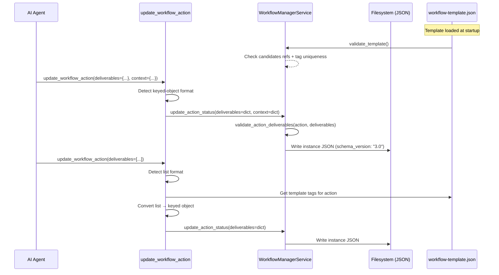
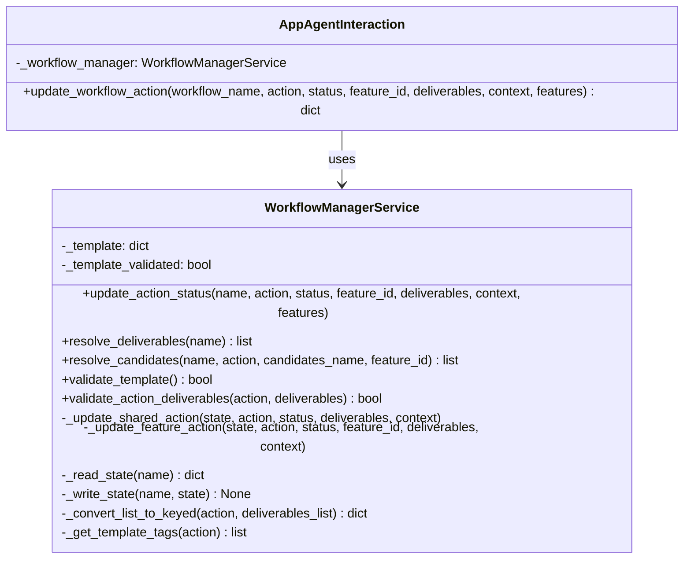

# Technical Design: Deliverable Tagging & Action Context Schema (MVP)

> Feature ID: FEATURE-041-E | Epic ID: EPIC-041 | CR: CR-002 | Version: v1.0 | Last Updated: 02-26-2026

---

## Part 1: Agent-Facing Summary

> **Purpose:** Quick reference for AI agents navigating large projects.
> **📌 AI Coders:** Focus on this section for implementation context.

### Key Components Implemented

| Component | Responsibility | Scope/Impact | Tags |
|-----------|----------------|--------------|------|
| `workflow-template.json` | Replace `deliverable_category` with tagged `deliverables` + `action_context` | Config — all stages, all actions | #template #deliverables #action-context #config |
| `WorkflowManagerService._update_shared_action()` | Accept dict deliverables, store keyed object in instance | Backend — shared stage actions | #backend #deliverables #keyed-object |
| `WorkflowManagerService._update_feature_action()` | Accept dict deliverables + context for per-feature actions | Backend — per-feature stage actions | #backend #deliverables #per-feature |
| `WorkflowManagerService.validate_template()` | Static validation of template at load time | Backend — one-time at startup | #validation #template #static |
| `WorkflowManagerService.validate_action_deliverables()` | Runtime validation of instance deliverables vs template tags | Backend — at action completion | #validation #runtime #deliverables |
| `WorkflowManagerService.resolve_candidates()` | Candidate resolution algorithm for `action_context` | Backend — utility function for UI | #resolution #candidates #algorithm |
| `app_agent_interaction.update_workflow_action()` | Dual-format deliverables + context parameter | MCP tool — agent-facing | #mcp #tool #deliverables #dual-format |

### Dependencies

| Dependency | Source | Design Link | Usage Description |
|------------|--------|-------------|-------------------|
| `WorkflowManagerService` | FEATURE-036-A | [technical-design.md](../../architecture/technical-designs/workflow.md) | Base service being extended with new deliverables logic |
| `app_agent_interaction` | FEATURE-036-A | Same | MCP tool module being extended |
| `FEATURE-041-A` | EPIC-041 | [technical-design.md](x-ipe-docs/requirements/EPIC-041/FEATURE-041-A/technical-design.md) | Per-feature instance structure (`features[].implement.{action}`) |

### Major Flow

1. Template loaded → `validate_template()` checks all `candidates` references resolve and tag names are unique per stage
2. Agent calls `update_workflow_action(deliverables={...}, context={...})` → MCP tool detects keyed-object format → passes to service
3. Agent calls `update_workflow_action(deliverables=[...])` → MCP tool detects list format → converts to keyed-object using template tag order → passes to service
4. Service stores keyed deliverables + context in instance JSON → sets `schema_version: "3.0"`
5. Frontend calls `resolve_candidates(workflow_name, action, candidates_name)` → service walks `stage_order`, collects matching deliverables, returns file list

### Usage Example

```python
# Agent updates action with keyed deliverables (new format)
update_workflow_action(
    workflow_name="my-workflow",
    action="refine_idea",
    status="done",
    deliverables={
        "refined-idea": "x-ipe-docs/ideas/my-wf/refined-idea/idea-summary-v1.md",
        "refined-ideas-folder": "x-ipe-docs/ideas/my-wf/refined-idea"
    },
    context={
        "raw-idea": "x-ipe-docs/ideas/my-wf/new idea.md",
        "uiux-reference": "auto-detect"
    }
)

# Agent updates action with list deliverables (legacy format - auto-converted)
update_workflow_action(
    workflow_name="my-workflow",
    action="refine_idea",
    status="done",
    deliverables=[
        "x-ipe-docs/ideas/my-wf/refined-idea/idea-summary-v1.md",
        "x-ipe-docs/ideas/my-wf/refined-idea"
    ]
)
# Auto-converts to: {"refined-idea": "...", "refined-ideas-folder": "..."}
# using template tag order for refine_idea: ["$output:refined-idea", "$output-folder:refined-ideas-folder"]
```

---

## Part 2: Implementation Guide

> **Purpose:** Human-readable details for developers.

### Workflow Diagram



### Class Diagram



### Data Models

**Template Action (workflow-template.json):**
```python
# Before (current)
{
    "compose_idea": {
        "optional": False,
        "deliverable_category": "ideas",          # OLD: flat string
        "next_actions_suggested": [...]
    }
}

# After (new)
{
    "compose_idea": {
        "optional": False,
        "deliverables": ["$output:raw-idea", "$output-folder:ideas-folder"],  # NEW: tagged array
        "next_actions_suggested": [...]
    },
    "refine_idea": {
        "optional": False,
        "action_context": {                        # NEW: context declaration
            "raw-idea": {"required": True, "candidates": "ideas-folder"},
            "uiux-reference": {"required": False}
        },
        "deliverables": ["$output:refined-idea", "$output-folder:refined-ideas-folder"],
        "next_actions_suggested": [...]
    }
}
```

**Instance Action (workflow-{name}.json):**
```python
# Before (current)
{
    "compose_idea": {
        "status": "done",
        "deliverables": ["path/to/idea.md", "path/to/folder"],  # OLD: flat list
        "next_actions_suggested": [...]
    }
}

# After (new)
{
    "compose_idea": {
        "status": "done",
        "deliverables": {                           # NEW: keyed object
            "raw-idea": "path/to/idea.md",
            "ideas-folder": "path/to/folder"
        },
        "next_actions_suggested": [...]
    },
    "refine_idea": {
        "status": "done",
        "context": {                                # NEW: persisted selections
            "raw-idea": "path/to/idea.md",
            "uiux-reference": "N/A"
        },
        "deliverables": {
            "refined-idea": "path/to/refined-idea.md",
            "refined-ideas-folder": "path/to/refined-idea"
        },
        "next_actions_suggested": [...]
    }
}
```

### Implementation Steps

#### Step 1: Update workflow-template.json

Replace ALL actions' `deliverable_category` with tagged `deliverables` arrays. Add `action_context` to actions with prior dependencies. Use the proposed template from the idea summary (idea-summary-v1.md "Complete Workflow Template" section).

**File:** `x-ipe-docs/config/workflow-template.json`

#### Step 2: Add template validation

Add `validate_template()` to `WorkflowManagerService`:

```python
def validate_template(self):
    """Static validation at template load time."""
    template = self._load_template()
    stage_order = template["stage_order"]
    all_tags_by_stage = {}  # {stage_name: set(tag_names)}
    all_folder_tags = {}    # {tag_name: (stage_name, action_name)}
    
    for stage_name in stage_order:
        stage = template["stages"][stage_name]
        stage_tags = set()
        for action_name, action_def in stage["actions"].items():
            for tag_str in action_def.get("deliverables", []):
                prefix, name = tag_str.split(":", 1)
                if name in stage_tags:
                    raise ValueError(f"Duplicate tag '{name}' in stage '{stage_name}'")
                stage_tags.add(name)
                if prefix == "$output-folder":
                    all_folder_tags[name] = (stage_name, action_name)
            
            # Validate action_context candidates
            for ref_name, ref_def in action_def.get("action_context", {}).items():
                candidates = ref_def.get("candidates")
                if candidates and candidates not in all_folder_tags:
                    raise ValueError(
                        f"action_context '{ref_name}' in '{action_name}' references "
                        f"unknown candidates '{candidates}'"
                    )
        all_tags_by_stage[stage_name] = stage_tags
```

**File:** `src/x_ipe/services/workflow_manager_service.py`

#### Step 3: Update MCP tool for dual-format

Modify `update_workflow_action` in `app_agent_interaction.py`:

```python
def update_workflow_action(self, workflow_name, action, status, 
                           feature_id=None, deliverables=None, 
                           context=None, features=None):
    # Dual-format detection
    if deliverables is not None and isinstance(deliverables, list):
        deliverables = self._convert_list_to_keyed(action, deliverables)
    
    # Pass context through
    return self._workflow_manager.update_action_status(
        workflow_name, action, status, feature_id, 
        deliverables, context, features
    )

def _convert_list_to_keyed(self, action, deliverables_list):
    """Convert legacy list format to keyed object using template tags."""
    template = self._workflow_manager._load_template()
    tags = self._get_template_tags(template, action)
    result = {}
    for i, path in enumerate(deliverables_list):
        if i < len(tags):
            result[tags[i]] = path
    return result

def _get_template_tags(self, template, action):
    """Extract tag names from template deliverables array for an action."""
    for stage in template["stages"].values():
        if action in stage.get("actions", {}):
            deliverables = stage["actions"][action].get("deliverables", [])
            return [tag.split(":", 1)[1] for tag in deliverables]
    return []
```

**File:** `src/x_ipe/services/app_agent_interaction.py`

#### Step 4: Update service methods for keyed deliverables + context

Modify `_update_shared_action` and `_update_feature_action`:

```python
def _update_shared_action(self, state, action, status, deliverables=None, context=None):
    for stage_name in state.get("stage_order", []):
        stage = state.get("shared", {}).get(stage_name, {})
        if action in stage.get("actions", {}):
            stage["actions"][action]["status"] = status
            if deliverables is not None:
                stage["actions"][action]["deliverables"] = deliverables  # now dict
            if context is not None:
                stage["actions"][action]["context"] = context  # NEW field
            if "schema_version" not in state or state["schema_version"] < "3.0":
                if isinstance(deliverables, dict):
                    state["schema_version"] = "3.0"
            return True
    return False
```

**File:** `src/x_ipe/services/workflow_manager_service.py`

#### Step 5: Add candidate resolution API

Add `resolve_candidates()` method and REST endpoint:

```python
def resolve_candidates(self, workflow_name, action, candidates_name, feature_id=None):
    """Resolve candidates to list of file paths for dropdown population."""
    state = self._read_state(workflow_name)
    template = self._load_template()
    stage_order = template["stage_order"]
    
    # Find current action's stage
    current_stage_idx = self._find_action_stage_index(template, action)
    
    results = []
    # Walk stages from first to current (inclusive of prior stages only)
    for i in range(current_stage_idx):
        stage_name = stage_order[i]
        stage_def = template["stages"][stage_name]
        
        for act_name, act_def in stage_def["actions"].items():
            for tag_str in act_def.get("deliverables", []):
                prefix, name = tag_str.split(":", 1)
                if name == candidates_name:
                    # Get actual path from instance
                    path = self._get_instance_deliverable(state, stage_name, act_name, name, feature_id)
                    if path:
                        if prefix == "$output":
                            results.append({"type": "file", "path": path})
                        elif prefix == "$output-folder":
                            results.append({"type": "folder", "path": path})
    
    # Per-feature scoping: check current feature first if in per_feature stage
    if feature_id:
        feature_results = self._resolve_in_feature(state, feature_id, candidates_name)
        if feature_results:
            results = feature_results + results  # feature takes precedence
    
    return results
```

**File:** `src/x_ipe/services/workflow_manager_service.py`
**Route:** `GET /api/workflow/{name}/candidates/{action}/{candidates_name}?feature_id={id}`

#### Step 6: Update resolve_deliverables for backward compat

Modify `resolve_deliverables` to handle both formats:

```python
def resolve_deliverables(self, workflow_name):
    state = self._read_state(workflow_name)
    results = []
    # ... existing iteration logic ...
    for action_name, action_data in actions.items():
        deliverables = action_data.get("deliverables", [])
        if isinstance(deliverables, dict):
            # New keyed format
            for tag_name, path in deliverables.items():
                results.append({"name": tag_name, "path": path, ...})
        elif isinstance(deliverables, list):
            # Legacy list format
            for path in deliverables:
                results.append({"name": os.path.basename(path), "path": path, ...})
    return results
```

#### Step 7: Add runtime validation

```python
def validate_action_deliverables(self, action, deliverables):
    """Runtime validation: check instance keys match template tags."""
    if not isinstance(deliverables, dict):
        return True  # skip validation for legacy format
    template = self._load_template()
    expected_tags = set(self._get_template_tags(template, action))
    actual_tags = set(deliverables.keys())
    missing = expected_tags - actual_tags
    if missing:
        logger.warning(f"Action '{action}' missing deliverable tags: {missing}")
    return len(missing) == 0
```

### Edge Cases & Error Handling

| Scenario | Handling |
|----------|----------|
| Template validation fails | Raise `ValueError` with descriptive message at startup; fail fast |
| Runtime validation finds missing tags | Log warning, allow action to proceed |
| Legacy list with more items than template tags | Extra items ignored with warning |
| Legacy list with fewer items than template tags | Missing tags get `None` value |
| Instance has no `schema_version` field | Treat as v2.0 (legacy), duck-type deliverables |
| `context` field missing in instance action | Return `{}` (no context) |
| `candidates` references a tag in the same stage | Valid only if the producing action comes before in action order |

### REST API Changes

| Method | Path | Change |
|--------|------|--------|
| POST | `/api/workflow/{name}/action` | Accept `deliverables` as dict or list; accept new `context` field |
| GET | `/api/workflow/{name}/candidates/{action}/{candidates}` | **NEW** — resolve candidates for dropdown population |
| GET | `/api/workflow/{name}` | No change — returns full state (now with keyed deliverables + context) |

---

## Design Change Log

| Date | Phase | Change Summary |
|------|-------|----------------|
| 02-26-2026 | Initial Design | Initial technical design for deliverable tagging, action context schema, dual-format MCP tool, template/runtime validation, and candidate resolution algorithm. |
