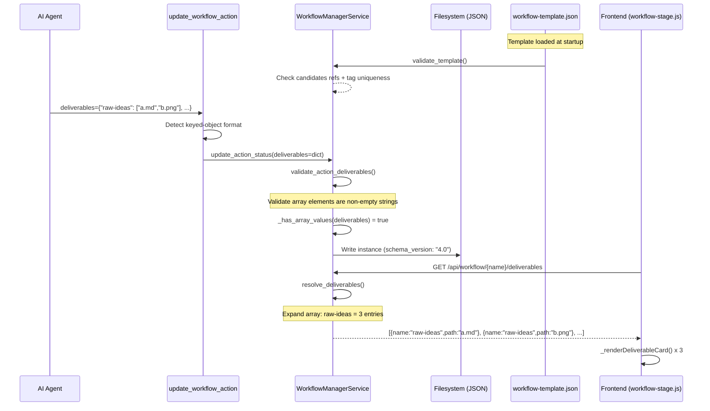
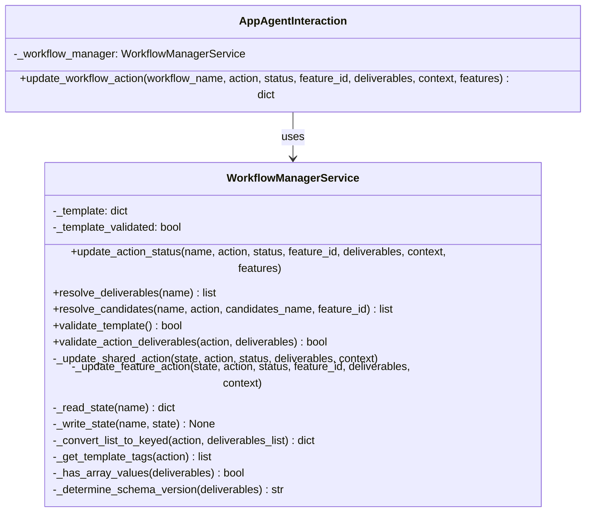

# Technical Design: Deliverable Tagging & Action Context Schema (MVP)

> Feature ID: FEATURE-041-E | Epic ID: EPIC-041 | CR: CR-002, CR-003 | Version: v2.0 | Last Updated: 03-14-2026

## Version History

| Version | Date | Change Summary |
|---------|------|----------------|
| v1.0 | 02-26-2026 | Initial design: deliverable tagging, action context schema, dual-format MCP tool, template/runtime validation, candidate resolution |
| v2.0 | 03-14-2026 | CR-003: Array-valued deliverable tags, template rename raw-idea to raw-ideas, schema version 4.0, array expansion in resolve_deliverables, frontend rendering of array entries |

---

## Part 1: Agent-Facing Summary

> **Purpose:** Quick reference for AI agents navigating large projects.
> **AI Coders:** Focus on this section for implementation context.

### Key Components Implemented

| Component | Responsibility | Scope/Impact | Tags |
|-----------|----------------|--------------|------|
| `workflow-template.json` | Replace `deliverable_category` with tagged `deliverables` + `action_context`; rename `raw-idea` to `raw-ideas` | Config - all stages, all actions (x2 copies) | #template #deliverables #action-context #config |
| `copilot-prompt.json` | Update `$output:raw-idea$` to `$output:raw-ideas$` in template tokens | Config - prompt templates (x2 copies) | #config #prompt #token-resolution |
| `WorkflowManagerService._update_shared_action()` | Accept dict deliverables (string or array values), store in instance | Backend - shared stage actions | #backend #deliverables #keyed-object #array |
| `WorkflowManagerService._update_feature_action()` | Accept dict deliverables + context for per-feature actions | Backend - per-feature stage actions | #backend #deliverables #per-feature |
| `WorkflowManagerService.resolve_deliverables()` | Expand array-valued tags into individual file entries for rendering | Backend - deliverable listing API | #backend #deliverables #array-expansion |
| `WorkflowManagerService.validate_template()` | Static validation of template at load time | Backend - one-time at startup | #validation #template #static |
| `WorkflowManagerService.validate_action_deliverables()` | Runtime validation: keys match template tags + array elements are valid strings | Backend - at action completion | #validation #runtime #deliverables #array |
| `WorkflowManagerService.resolve_candidates()` | Candidate resolution algorithm for `action_context` | Backend - utility function for UI | #resolution #candidates #algorithm |
| `app_agent_interaction.update_workflow_action()` | Dual-format deliverables + context; accepts `dict[str, str or list[str]]` | MCP tool - agent-facing | #mcp #tool #deliverables #dual-format #array |
| `workflow-stage.js._renderDeliverables()` | Render expanded array deliverable entries as individual cards | Frontend - deliverable card grid | #frontend #deliverables #rendering #array |
| `action-execution-modal.js._resolveTemplate()` | Resolve `$output:tag$` to first element when tag value is array | Frontend - prompt template resolution | #frontend #template #token-resolution #array |

### Dependencies

| Dependency | Source | Design Link | Usage Description |
|------------|--------|-------------|-------------------|
| `WorkflowManagerService` | FEATURE-036-A | [technical-design.md](x-ipe-docs/architecture/technical-designs/workflow.md) | Base service being extended with array deliverables logic |
| `app_agent_interaction` | FEATURE-036-A | Same | MCP tool module being extended |
| `FEATURE-041-A` | EPIC-041 | [technical-design.md](x-ipe-docs/requirements/EPIC-041/FEATURE-041-A/technical-design.md) | Per-feature instance structure (`features[].implement.{action}`) |
| `FEATURE-036-E` | EPIC-036 | N/A | Frontend deliverable card rendering consumes expanded API output |

### Major Flow

1. Template loaded -> `validate_template()` checks all `candidates` references resolve and tag names are unique per stage
2. Agent calls `update_workflow_action(deliverables={"raw-ideas": ["a.md","b.png"], ...})` -> MCP tool detects keyed-object with array values -> passes to service
3. Agent calls `update_workflow_action(deliverables=[...])` -> MCP tool detects list format -> converts to keyed-object using template tag order -> passes to service
4. Service validates array elements (non-empty strings) -> stores deliverables in instance JSON -> sets `schema_version: "4.0"` if any array values present (else "3.0")
5. Frontend calls `resolve_deliverables` API -> service expands array-valued tags into individual entries -> frontend renders each as a separate card
6. Template token `$output:raw-ideas$` resolves to first array element for prompt text

### Usage Example

```python
# Agent updates compose_idea with array-valued deliverables (CR-003)
update_workflow_action(
    workflow_name="my-workflow",
    action="compose_idea",
    status="done",
    deliverables={
        "raw-ideas": [
            "x-ipe-docs/ideas/my-wf/new idea.md",
            "x-ipe-docs/ideas/my-wf/uploaded1.png",
            "x-ipe-docs/ideas/my-wf/uploaded2.png"
        ],
        "ideas-folder": "x-ipe-docs/ideas/my-wf"
    }
)
# Stores array directly; schema_version bumped to "4.0"
# resolve_deliverables returns 4 entries: 3 files from raw-ideas + 1 folder

# Agent updates with single-value deliverables (backward compat)
update_workflow_action(
    workflow_name="my-workflow",
    action="refine_idea",
    status="done",
    deliverables={
        "refined-idea": "x-ipe-docs/ideas/my-wf/refined-idea/idea-summary-v1.md",
        "refined-ideas-folder": "x-ipe-docs/ideas/my-wf/refined-idea"
    },
    context={
        "raw-ideas": "x-ipe-docs/ideas/my-wf/new idea.md",
        "uiux-reference": "auto-detect"
    }
)
# String values continue to work identically to v1.0

# Legacy list format still supported (auto-converted)
update_workflow_action(
    workflow_name="my-workflow",
    action="refine_idea",
    status="done",
    deliverables=[
        "x-ipe-docs/ideas/my-wf/refined-idea/idea-summary-v1.md",
        "x-ipe-docs/ideas/my-wf/refined-idea"
    ]
)
```

---

## Part 2: Implementation Guide

> **Purpose:** Human-readable details for developers.

### Workflow Diagram



### Class Diagram



### Data Models

**Template Action (workflow-template.json) - v2.0 with CR-003 rename:**
```python
{
    "compose_idea": {
        "optional": False,
        "deliverables": ["$output:raw-ideas", "$output-folder:ideas-folder"],  # CR-003: renamed raw-idea to raw-ideas
        "next_actions_suggested": [...]
    },
    "refine_idea": {
        "optional": False,
        "action_context": {
            "raw-ideas": {"required": True, "candidates": "ideas-folder"},  # CR-003: updated ref name
            "uiux-reference": {"required": False}
        },
        "deliverables": ["$output:refined-idea", "$output-folder:refined-ideas-folder"],
        "next_actions_suggested": [...]
    }
}
```

**Instance Action (workflow-{name}.json) - v2.0 with array values:**
```python
{
    "schema_version": "4.0",  # Bumped from "3.0" when array values present
    "compose_idea": {
        "status": "done",
        "deliverables": {
            "raw-ideas": [                             # CR-003: array of file paths
                "x-ipe-docs/ideas/wf/new idea.md",
                "x-ipe-docs/ideas/wf/uploaded1.png",
                "x-ipe-docs/ideas/wf/uploaded2.png"
            ],
            "ideas-folder": "x-ipe-docs/ideas/wf"     # Folder tags stay string (never array)
        },
        "next_actions_suggested": [...]
    },
    "refine_idea": {
        "status": "done",
        "context": {
            "raw-ideas": "x-ipe-docs/ideas/wf/new idea.md",  # Context stores first/selected file
            "uiux-reference": "N/A"
        },
        "deliverables": {
            "refined-idea": "path/to/refined-idea.md",        # Single string still valid
            "refined-ideas-folder": "path/to/refined-idea"
        },
        "next_actions_suggested": [...]
    }
}
```

**Type system summary:**
```
Template deliverables: list[str]                       # ["$output:tag", "$output-folder:tag"]
Instance deliverables: dict[str, str | list[str]]      # {"tag": "path" | ["path1", "path2"]}
                       | list[str]                     # Legacy format (auto-converted)
$output-folder tags:   always str (never array)
Context values:        str                             # Always single path / "N/A" / "auto-detect"
```

### Implementation Steps

#### Step 1: Rename template tags (Config - CR-003)

Rename `$output:raw-idea` to `$output:raw-ideas` in `compose_idea` action across both template copies and all `action_context` references.

**Files (must stay in sync):**
- `x-ipe-docs/config/workflow-template.json`
- `src/x_ipe/resources/config/workflow-template.json`

Update `$output:raw-idea$` to `$output:raw-ideas$` in prompt template tokens:
- `x-ipe-docs/config/copilot-prompt.json`
- `src/x_ipe/resources/config/copilot-prompt.json`

#### Step 2: Add array value support to update_action_status (Backend - CR-003)

Modify `_update_shared_action` and `_update_feature_action` to handle array tag values and determine schema version:

```python
def _has_array_values(self, deliverables: dict) -> bool:
    """Check if any deliverable tag has an array value."""
    if not isinstance(deliverables, dict):
        return False
    return any(isinstance(v, list) for v in deliverables.values())

def _determine_schema_version(self, deliverables) -> str:
    """Return '4.0' if array values present, '3.0' for keyed dict, None for legacy."""
    if not isinstance(deliverables, dict):
        return None
    return "4.0" if self._has_array_values(deliverables) else "3.0"

def _update_shared_action(self, state, action, status, deliverables=None, context=None):
    for stage_name in state.get("stage_order", []):
        stage = state.get("shared", {}).get(stage_name, {})
        if action in stage.get("actions", {}):
            stage["actions"][action]["status"] = status
            if deliverables is not None:
                stage["actions"][action]["deliverables"] = deliverables
            # FR-4.3: If keyed deliverables provided but context is None, default to {}
            if deliverables is not None and isinstance(deliverables, dict):
                if context is not None:
                    stage["actions"][action]["context"] = context
                elif "context" not in stage["actions"][action]:
                    stage["actions"][action]["context"] = {}
            elif context is not None:
                stage["actions"][action]["context"] = context
            # Schema version: never downgrade, bump to "4.0" if array values
            new_version = self._determine_schema_version(deliverables)
            if new_version:
                current = state.get("schema_version", "2.0")
                if new_version > current:
                    state["schema_version"] = new_version
            return True
    return False
```

**File:** `src/x_ipe/services/workflow_manager_service.py`

#### Step 3: Update runtime validation for array elements (Backend - CR-003)

Extend `validate_action_deliverables` to validate array element types:

```python
def validate_action_deliverables(self, action, deliverables):
    """Runtime validation: check keys match template + array elements are valid."""
    if not isinstance(deliverables, dict):
        return True  # skip for legacy format

    template = self._load_template()
    expected_tags = set(self._get_template_tags(template, action))
    actual_tags = set(deliverables.keys())

    # Check missing tags
    missing = expected_tags - actual_tags
    if missing:
        logger.warning(f"Action '{action}' missing deliverable tags: {missing}")

    # FR-8.5: Reject array values for $output-folder tags (CR-003)
    template = self._load_template()
    folder_tags = {
        tag.replace("$output-folder:", "")
        for tag in template.get(action, {}).get("deliverables", [])
        if tag.startswith("$output-folder:")
    }
    for tag_name, value in deliverables.items():
        if tag_name in folder_tags and isinstance(value, list):
            logger.error(
                f"Action '{action}' folder tag '{tag_name}' must be a single string, "
                f"not an array. $output-folder tags do not support array values."
            )
            return False

    # Validate array elements (CR-003)
    for tag_name, value in deliverables.items():
        if isinstance(value, list):
            for i, element in enumerate(value):
                if not isinstance(element, str) or not element.strip():
                    logger.error(
                        f"Action '{action}' tag '{tag_name}' array element [{i}] "
                        f"is invalid: must be a non-empty string, got {type(element).__name__}"
                    )
                    return False

    return len(missing) == 0
```

**File:** `src/x_ipe/services/workflow_manager_service.py`

#### Step 4: Update resolve_deliverables for array expansion (Backend - CR-003)

Expand array-valued tags into individual file entries:

```python
def resolve_deliverables(self, workflow_name):
    state = self._read_state(workflow_name)
    results = []
    # ... existing stage iteration logic ...
    for action_name, action_data in actions.items():
        deliverables = action_data.get("deliverables", [])
        if isinstance(deliverables, dict):
            for tag_name, value in deliverables.items():
                if isinstance(value, list):
                    # CR-003: Expand array into individual entries
                    for path in value:
                        exists = os.path.exists(os.path.join(self._base_path, path))
                        results.append({
                            "name": tag_name,
                            "path": path,
                            "category": stage_name,
                            "stage": stage_name,
                            "feature_id": feature_id,
                            "feature_name": feature_name,
                            "exists": exists
                        })
                else:
                    # Single string value (unchanged from v1.0)
                    exists = os.path.exists(os.path.join(self._base_path, value))
                    results.append({
                        "name": tag_name,
                        "path": value,
                        "category": stage_name,
                        "stage": stage_name,
                        "feature_id": feature_id,
                        "feature_name": feature_name,
                        "exists": exists
                    })
        elif isinstance(deliverables, list):
            # Legacy list format (unchanged from v1.0)
            for path in deliverables:
                results.append({"name": os.path.basename(path), "path": path})
    return results
```

**File:** `src/x_ipe/services/workflow_manager_service.py`

#### Step 5: Update _get_instance_deliverable for array values (Backend - CR-003)

When retrieving a specific deliverable for template token resolution, return first element for arrays:

```python
def _get_instance_deliverable(self, state, stage_name, action_name, tag_name, feature_id=None):
    """Retrieve deliverable value. For arrays, returns the first element."""
    # ... existing lookup logic to get action_data ...
    deliverables = action_data.get("deliverables", {})
    if isinstance(deliverables, dict):
        value = deliverables.get(tag_name)
        if isinstance(value, list):
            return value[0] if value else None  # CR-003: first element for token resolution
        return value
    elif isinstance(deliverables, list):
        # Legacy: map by template tag index
        idx = self._get_tag_index(action_name, tag_name)
        return deliverables[idx] if idx is not None and idx < len(deliverables) else None
```

**File:** `src/x_ipe/services/workflow_manager_service.py`

#### Step 6: Update MCP tool parameter type (Backend - CR-003)

Update the `deliverables` parameter type in `update_workflow_action` tool definition:

```python
# Parameter type change in tool definition
"deliverables": {
    "type": ["object", "array", "null"],
    "description": "Keyed dict {tagName: path | [path1, path2, ...]} or legacy list [path1, path2]",
    # Accept: dict[str, str | list[str]] | list[str] | None
}
```

The existing dual-format detection (`isinstance(deliverables, list)` -> convert) remains unchanged. Dict values with array entries pass through directly.

**File:** `src/x_ipe/services/app_agent_interaction.py`

#### Step 7: Update frontend template resolution (Frontend - CR-003)

In `_resolveTemplate`, handle array-valued tag resolution:

```javascript
_resolveTemplate(template, contextValues) {
    // Replace $output:tag-name$ tokens
    return template.replace(/\$output(?:-folder)?:([^$]+)\$/g, (match, tagName) => {
        const value = contextValues[tagName];
        if (value === undefined) return match;
        // CR-003: If value is an array, use first element for prompt text
        if (Array.isArray(value)) return value.length > 0 ? value[0] : match;
        return value;
    });
}
```

**File:** `src/x_ipe/static/js/features/action-execution-modal.js`

#### Step 8: Frontend deliverable rendering (Frontend - CR-003)

No changes needed to `_renderDeliverableCard` - it already takes individual `{name, path, category, exists}` items. The array expansion happens server-side in `resolve_deliverables` (Step 4), so the frontend receives pre-expanded entries.

Verify that `_renderDeliverables` correctly handles multiple cards with the same `name` (tag name) - they should render as individual cards without deduplication.

**File:** `src/x_ipe/static/js/features/workflow-stage.js` - verify only, likely no code changes needed.

#### Step 9: Candidate resolution algorithm (Backend - FR-7)

Implement `resolve_candidates()` to walk stages in order and resolve folder/file deliverables for the action context UI:

```python
def resolve_candidates(self, workflow_name, action, candidates_name, feature_id=None):
    """Resolve candidates by walking stage_order, collecting matching deliverable paths.

    FR-7.1: Walk stages first-to-current; later stage overrides earlier.
    FR-7.2: In per_feature stages, search current feature first, fall back to shared.
    FR-7.3: If matched value is an array, return all paths.
    """
    state = self._read_state(workflow_name)
    template = self._load_template()
    stage_order = state.get("stage_order", [])
    matched_path = None  # later stage wins (precedence)

    for stage_name in stage_order:
        stage_template = template.get("stages", {}).get(stage_name, {})
        stage_type = stage_template.get("type", "shared")

        if stage_type == "per_feature" and feature_id:
            # FR-7.2: Search feature-specific deliverables first
            feature_actions = (
                state.get("features", {})
                .get(feature_id, {})
                .get(stage_name, {})
                .get("actions", {})
            )
            result = self._find_candidate_in_actions(feature_actions, candidates_name)
            if result is not None:
                matched_path = result
                continue

        # Shared or fallback: search shared stage deliverables
        shared_actions = state.get("shared", {}).get(stage_name, {}).get("actions", {})
        result = self._find_candidate_in_actions(shared_actions, candidates_name)
        if result is not None:
            matched_path = result

    if matched_path is None:
        return []

    # FR-7.3: If array, return all paths; if string, return as single-item list
    if isinstance(matched_path, list):
        return matched_path
    return [matched_path]

def _find_candidate_in_actions(self, actions, candidates_name):
    """Search actions for a deliverable matching the candidates_name tag.
    Within same stage, later action order wins (FR-7.1 step 4)."""
    result = None
    for action_name, action_data in actions.items():
        deliverables = action_data.get("deliverables", {})
        if isinstance(deliverables, dict):
            if candidates_name in deliverables:
                result = deliverables[candidates_name]
    return result
```

**File:** `src/x_ipe/services/workflow_manager_service.py`

#### Step 10: Static template validation (Backend - FR-5)

Implement `validate_template()` to run once at load time, checking candidates references and tag uniqueness:

```python
def validate_template(self):
    """Static validation at load time. Raises ValueError on failure.

    FR-5.1: Parse all action_context.*.candidates values.
    FR-5.2: Verify each candidates ref matches a $output-folder tag in a prior stage.
    FR-5.3: Verify tag name uniqueness within each stage.
    FR-5.4: Raise clear error with offending action + candidates value.
    """
    template = self._load_template()
    stage_order = template.get("stage_order", [])
    errors = []

    # Collect all $output-folder tags per stage for lookup
    folder_tags_by_stage = {}  # {stage_name: set of tag names}
    for stage_name in stage_order:
        stage = template.get("stages", {}).get(stage_name, {})
        folder_tags = set()
        for action_name, action_def in stage.get("actions", {}).items():
            for tag in action_def.get("deliverables", []):
                if tag.startswith("$output-folder:"):
                    folder_tags.add(tag.replace("$output-folder:", ""))
        folder_tags_by_stage[stage_name] = folder_tags

    for stage_idx, stage_name in enumerate(stage_order):
        stage = template.get("stages", {}).get(stage_name, {})
        stage_tags = []  # all tag names in this stage for uniqueness check

        for action_name, action_def in stage.get("actions", {}).items():
            # Collect tag names for uniqueness (FR-5.3)
            for tag in action_def.get("deliverables", []):
                tag_name = tag.replace("$output:", "").replace("$output-folder:", "")
                stage_tags.append(tag_name)

            # Validate candidates references (FR-5.1, FR-5.2)
            action_context = action_def.get("action_context", {})
            for ref_name, ref_def in action_context.items():
                candidates_val = ref_def.get("candidates")
                if candidates_val:
                    # Must find matching $output-folder tag in prior stages
                    found = False
                    for prior_stage in stage_order[:stage_idx]:
                        if candidates_val in folder_tags_by_stage.get(prior_stage, set()):
                            found = True
                            break
                    # Also check current stage (actions before this one)
                    if not found and candidates_val in folder_tags_by_stage.get(stage_name, set()):
                        found = True
                    if not found:
                        errors.append(
                            f"Action '{action_name}' context '{ref_name}' references "
                            f"candidates '{candidates_val}' but no prior $output-folder:"
                            f"{candidates_val} found"
                        )

        # FR-5.3: Check tag uniqueness within stage
        seen = set()
        for tag_name in stage_tags:
            if tag_name in seen:
                errors.append(
                    f"Stage '{stage_name}' has duplicate tag name '{tag_name}'"
                )
            seen.add(tag_name)

    if errors:
        raise ValueError(
            f"Template validation failed with {len(errors)} error(s):\n"
            + "\n".join(f"  - {e}" for e in errors)
        )
    self._template_validated = True
```

**File:** `src/x_ipe/services/workflow_manager_service.py`

#### Step 11: Backward compatibility for renamed tags

Old workflow instances may have `raw-idea` as a tag name (pre-rename). Handle this gracefully:

```python
# In _get_instance_deliverable, after looking up tag_name:
value = deliverables.get(tag_name)
if value is None and tag_name == "raw-ideas":
    # Backward compat: fall back to old tag name for pre-rename instances
    value = deliverables.get("raw-idea")
```

This duck-typed fallback allows old instances to continue working until the action is re-executed and the new `raw-ideas` tag is written. No migration script is needed — instances self-heal on next write.

**File:** `src/x_ipe/services/workflow_manager_service.py`

### Edge Cases & Error Handling

| Scenario | Handling |
|----------|----------|
| Template validation fails | Raise `ValueError` at startup; fail fast |
| Runtime validation finds missing tags | Log warning, allow action to proceed |
| Legacy list with more items than template tags | Extra items ignored with warning |
| Legacy list with fewer items than template tags | Missing tags get `None` value |
| Instance has no `schema_version` field | Treat as v2.0 (legacy), duck-type deliverables |
| `context` field missing in instance action | Return `{}` (no context) |
| `candidates` references a tag in the same stage | Valid only if producing action comes before |
| Tag value is empty array `[]` | Accepted; no deliverable entries produced; warning logged |
| Tag value is single-element array `["path"]` | Functionally equivalent to string `"path"` - one card rendered |
| Array element is empty string `["path", ""]` | Validation fails - all elements must be non-empty strings |
| Array element is non-string `["path", 123]` | Validation fails - all elements must be strings |
| Dict with mix of string and array values | Both accepted in same dict |
| Old instance has `raw-idea` tag (pre-rename) | Backward compat fallback: `_get_instance_deliverable` checks `raw-idea` if `raw-ideas` not found. Self-heals on next action write. |
| `$output-folder` tag given array value | Validation rejects in Step 3 — folder tags must be single string (FR-8.5) |
| `_get_instance_deliverable` for array tag | Returns first element (for token resolution / context dropdown) |

### REST API Changes

| Method | Path | Change |
|--------|------|--------|
| POST | `/api/workflow/{name}/action` | `deliverables` accepts `dict[str, str or list[str]]` or legacy list; `context` unchanged |
| GET | `/api/workflow/{name}/deliverables` | Returns expanded entries - array tags produce multiple entries with same `name` |
| GET | `/api/workflow/{name}/candidates/{action}/{candidates}` | No change (candidates resolve to folders/single files) |
| GET | `/api/workflow/{name}` | Returns raw state including array values in deliverables |

### Test Changes

| Test File | Changes |
|-----------|---------|
| `tests/test_workflow_manager.py` | Add: array storage, array validation, schema "4.0" bump, array expansion in resolve_deliverables, mixed string/array dict, folder-tag array rejection, candidates resolution |
| `tests/test_workflow_feature_lanes.py` | Update `raw-idea` to `raw-ideas` in fixtures; add array-valued per-feature tests; per-feature candidate scoping |
| `tests/frontend-js/workflow-stage.test.js` | Add: verify multiple cards rendered for array-expanded deliverables |
| `tests/frontend-js/action-execution-modal.test.js` | Add: template resolution with array values uses first element |
| All fixtures using `raw-idea` tag | Rename to `raw-ideas` (~30+ file references) |

---

## Design Change Log

| Date | Phase | Change Summary |
|------|-------|----------------|
| 02-26-2026 | Initial Design | Initial technical design for deliverable tagging, action context schema, dual-format MCP tool, template/runtime validation, and candidate resolution algorithm. |
| 03-14-2026 | CR-003 Update | Array-valued deliverable tags: data model `dict[str, str or list[str]]`, resolve_deliverables array expansion, schema "4.0" bump, template rename `raw-idea` to `raw-ideas`, validation of array elements, folder-tag array rejection (FR-8.5), frontend token resolution for arrays. Added Steps 1-11 implementation guide including candidate resolution (FR-7), static template validation (FR-5), context defaulting (FR-4.3), and backward compat for renamed tags. |
