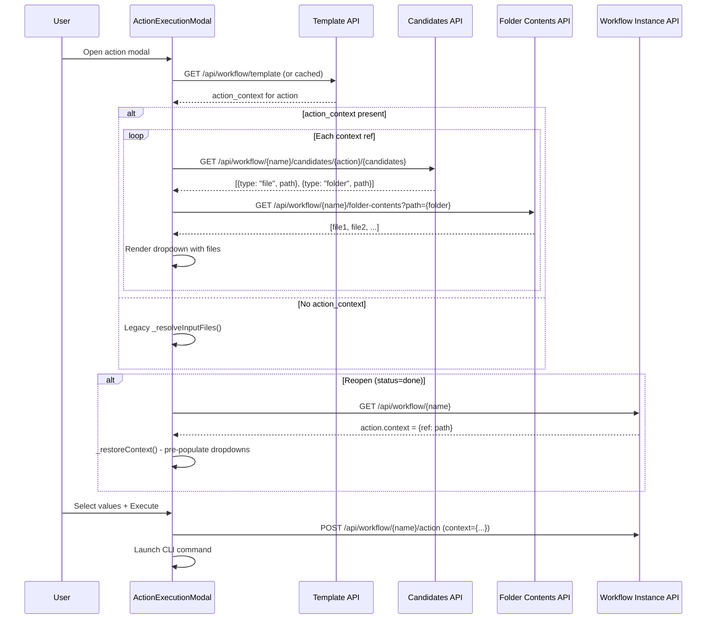
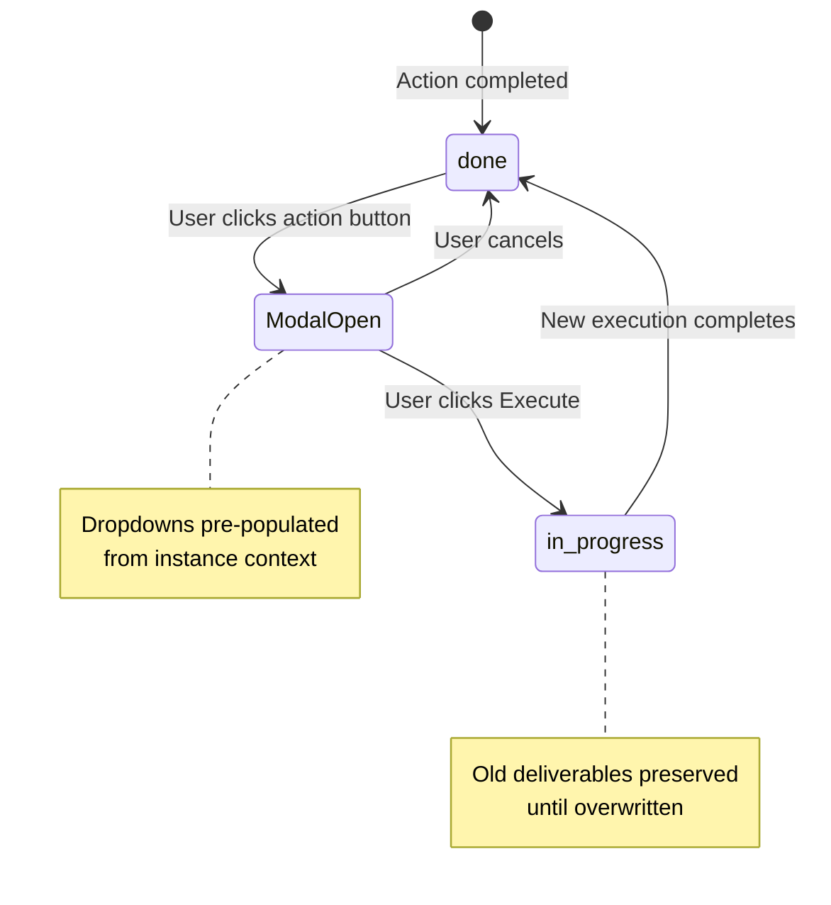
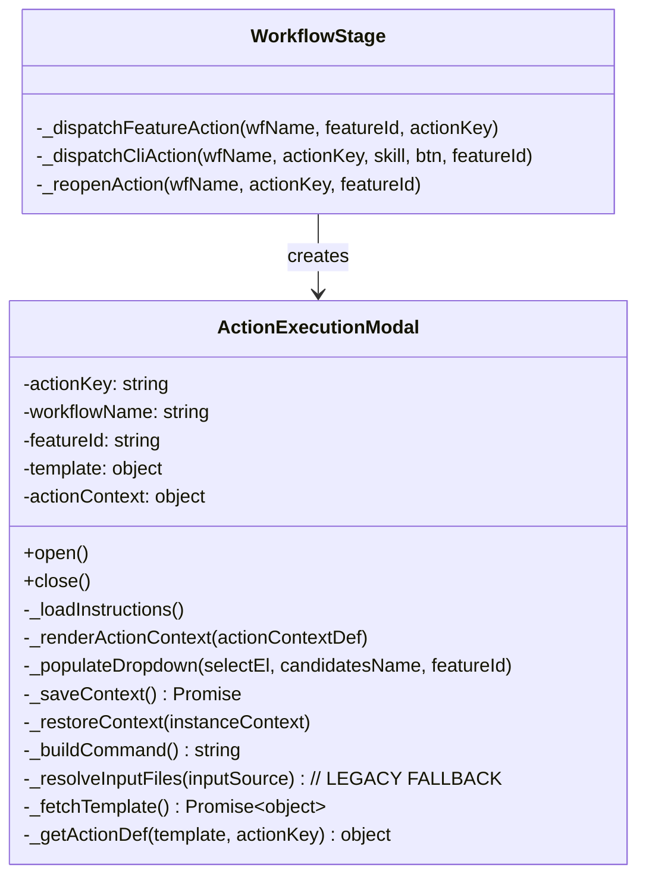

# Technical Design: Action Context Modal UI & Persistence

> Feature ID: FEATURE-041-F | Epic ID: EPIC-041 | CR: CR-002 | Version: v1.0 | Last Updated: 02-26-2026

---

## Part 1: Agent-Facing Summary

> **Purpose:** Quick reference for AI agents navigating large projects.
> **📌 AI Coders:** Focus on this section for implementation context.

### Key Components Implemented

| Component | Responsibility | Scope/Impact | Tags |
|-----------|----------------|--------------|------|
| `ActionExecutionModal._renderActionContext()` | Replace `_resolveInputFiles()` with template-driven context dropdowns | Frontend JS — modal rendering | #modal #action-context #dropdowns #frontend |
| `ActionExecutionModal._populateDropdown()` | Populate dropdown from candidate resolution API | Frontend JS — dropdown population | #modal #dropdown #candidates #frontend |
| `ActionExecutionModal._saveContext()` | Persist selections to instance before CLI launch | Frontend JS — context persistence | #modal #context #persistence #frontend |
| `ActionExecutionModal._restoreContext()` | Pre-populate dropdowns from instance for reopen | Frontend JS — reopen support | #modal #reopen #pre-populate #frontend |
| `WorkflowStage._reopenAction()` | Feature-level action reopen with context restoration | Frontend JS — feature lane reopen | #feature-lane #reopen #context |
| `GET /api/workflow/{name}/folder-contents` | List files in a folder path | Backend API — new endpoint | #api #folder-listing #backend |

### Dependencies

| Dependency | Source | Design Link | Usage Description |
|------------|--------|-------------|-------------------|
| `ActionExecutionModal` | FEATURE-038-A | [specification.md](x-ipe-docs/requirements/EPIC-038/FEATURE-038-A/specification.md) | Base modal class being extended |
| `_resolveInputFiles()` | FEATURE-041-A | [technical-design.md](x-ipe-docs/requirements/EPIC-041/FEATURE-041-A/technical-design.md) | Method being REPLACED (not extended) |
| `workflow-template.json` (action_context) | FEATURE-041-E | [technical-design.md](x-ipe-docs/requirements/EPIC-041/FEATURE-041-E/technical-design.md) | Template schema driving dropdown rendering |
| `resolve_candidates()` API | FEATURE-041-E | [technical-design.md](x-ipe-docs/requirements/EPIC-041/FEATURE-041-E/technical-design.md) | Backend API resolving candidate deliverables |
| Instance `context` field | FEATURE-041-E | [technical-design.md](x-ipe-docs/requirements/EPIC-041/FEATURE-041-E/technical-design.md) | Where selections are stored/read |

### Major Flow

1. Modal opens → reads `action_context` from template for current action
2. If `action_context` present → `_renderActionContext()` creates dropdowns
3. For each context ref with `candidates` → calls `resolve_candidates` API → populates dropdown with files
4. If action was previously done (reopen) → `_restoreContext()` pre-populates from instance
5. User selects values → clicks Execute → `_saveContext()` writes to instance → CLI command launched
6. If `action_context` absent → falls back to legacy `_resolveInputFiles()` with "Input Files" label

### Usage Example

```javascript
// Template-driven context rendering (replaces _resolveInputFiles)
const template = await this._fetchTemplate();
const actionDef = this._getActionDef(template, this.actionKey);

if (actionDef.action_context) {
    // New path: template-driven dropdowns
    this._renderActionContext(actionDef.action_context);
} else {
    // Legacy fallback: copilot-prompt.json input_source
    await this._resolveInputFiles(configEntry.input_source);
}

// Reopen with pre-populated context:
const modal = new ActionExecutionModal({
    actionKey: 'refine_idea',
    workflowName: 'my-workflow',
    featureId: null,  // shared action
});
// Modal detects action status="done" → calls _restoreContext() → dropdowns pre-filled
```

---

## Part 2: Implementation Guide

> **Purpose:** Human-readable details for developers.

### Workflow Diagram



### State Diagram (Reopen)



### Component Architecture



### Implementation Steps

#### Step 1: Add template fetching to modal

```javascript
// action-execution-modal.js
async _fetchTemplate() {
    if (this._templateCache) return this._templateCache;
    const resp = await fetch('/api/workflow/template');
    this._templateCache = await resp.json();
    return this._templateCache;
}

_getActionDef(template, actionKey) {
    for (const stage of Object.values(template.stages)) {
        if (stage.actions && stage.actions[actionKey]) {
            return stage.actions[actionKey];
        }
    }
    return null;
}
```

#### Step 2: Replace _resolveInputFiles with _renderActionContext

```javascript
async _renderActionContext(actionContextDef) {
    const container = this._el.querySelector('.input-files-section');
    container.innerHTML = '';
    
    const heading = document.createElement('h4');
    heading.textContent = 'Action Context';
    container.appendChild(heading);
    
    for (const [refName, refDef] of Object.entries(actionContextDef)) {
        const group = this._createDropdownGroup(refName, refDef);
        container.appendChild(group);
        
        if (refDef.candidates) {
            await this._populateDropdown(group.querySelector('select'), refDef.candidates);
        }
    }
}

_createDropdownGroup(refName, refDef) {
    const group = document.createElement('div');
    group.className = 'context-ref-group';
    group.dataset.refName = refName;
    
    const label = document.createElement('label');
    label.textContent = refName.replace(/-/g, ' ');
    if (refDef.required) {
        label.innerHTML += ' <span class="required">*</span>';
    } else {
        label.innerHTML += ' <span class="optional">(optional)</span>';
    }
    group.appendChild(label);
    
    const select = document.createElement('select');
    select.name = refName;
    select.required = refDef.required;
    
    // Always start with auto-detect
    select.add(new Option('auto-detect', 'auto-detect'));
    
    // Optional fields get N/A
    if (!refDef.required) {
        select.add(new Option('N/A', 'N/A'));
    }
    
    group.appendChild(select);
    return group;
}
```

#### Step 3: Populate dropdowns from candidates API

```javascript
async _populateDropdown(selectEl, candidatesName) {
    const url = `/api/workflow/${this.workflowName}/candidates/${this.actionKey}/${candidatesName}`;
    const params = this.featureId ? `?feature_id=${this.featureId}` : '';
    
    const resp = await fetch(url + params);
    const results = await resp.json();
    
    for (const result of results) {
        if (result.type === 'file') {
            selectEl.add(new Option(result.path, result.path));
        } else if (result.type === 'folder') {
            // List folder contents
            const files = await this._listFolderContents(result.path);
            for (const file of files) {
                selectEl.add(new Option(file, file));
            }
        }
    }
}

async _listFolderContents(folderPath) {
    const resp = await fetch(`/api/workflow/${this.workflowName}/folder-contents?path=${encodeURIComponent(folderPath)}`);
    return await resp.json();
}
```

#### Step 4: Context persistence

```javascript
async _saveContext() {
    const context = {};
    const groups = this._el.querySelectorAll('.context-ref-group');
    for (const group of groups) {
        const refName = group.dataset.refName;
        const select = group.querySelector('select');
        context[refName] = select.value;
    }
    
    // Save to instance via API
    await fetch(`/api/workflow/${this.workflowName}/action`, {
        method: 'POST',
        headers: {'Content-Type': 'application/json'},
        body: JSON.stringify({
            action: this.actionKey,
            status: 'in_progress',
            feature_id: this.featureId,
            context: context
        })
    });
    
    return context;
}
```

#### Step 5: Reopen pre-population

```javascript
async _restoreContext(instanceContext) {
    if (!instanceContext) return;
    
    for (const [refName, value] of Object.entries(instanceContext)) {
        const group = this._el.querySelector(`[data-ref-name="${refName}"]`);
        if (!group) continue;
        
        const select = group.querySelector('select');
        const option = Array.from(select.options).find(o => o.value === value);
        if (option) {
            select.value = value;
        } else if (value && value !== 'auto-detect' && value !== 'N/A') {
            // Path no longer in options (file deleted) - add with (missing) label
            const missingOpt = new Option(`${value} (missing)`, value);
            select.add(missingOpt);
            select.value = value;
        }
    }
}
```

#### Step 6: Add folder contents API endpoint

```python
# workflow_routes.py
@workflow_bp.route('/api/workflow/<name>/folder-contents', methods=['GET'])
def folder_contents(name):
    folder_path = request.args.get('path')
    if not folder_path or not os.path.isdir(folder_path):
        return jsonify([])
    
    files = []
    for entry in sorted(os.listdir(folder_path)):
        full_path = os.path.join(folder_path, entry)
        if os.path.isfile(full_path):
            files.append(os.path.join(folder_path, entry))
    return jsonify(files)
```

#### Step 7: Add template serving endpoint

```python
# workflow_routes.py
@workflow_bp.route('/api/workflow/template', methods=['GET'])
def get_template():
    template = workflow_manager.load_template()
    return jsonify(template)
```

### Edge Cases & Error Handling

| Scenario | Handling |
|----------|----------|
| `action_context` absent | Fall back to `_resolveInputFiles()` with "Input Files" label |
| Candidates API returns empty | Dropdown shows only "auto-detect" (+ "N/A" if optional) |
| Folder has 100+ files | Use lazy loading — show first 50, load more on scroll |
| Stored context path no longer in dropdown | Add with "(missing)" label |
| Network error fetching candidates | Show error toast, allow manual path input |
| Required field not selected on Execute | Prevent execution, highlight field |
| Feature-level action with no prior deliverables | Fall back to shared-stage deliverables |

### CSS Additions

```css
.context-ref-group {
    margin-bottom: 12px;
}
.context-ref-group label {
    display: block;
    font-weight: 500;
    margin-bottom: 4px;
}
.context-ref-group .required {
    color: var(--danger-color, #dc3545);
}
.context-ref-group .optional {
    color: var(--muted-color, #6c757d);
    font-weight: normal;
    font-size: 0.85em;
}
.context-ref-group select {
    width: 100%;
}
```

---

## Design Change Log

| Date | Phase | Change Summary |
|------|-------|----------------|
| 02-26-2026 | Initial Design | Initial technical design for Action Context Modal UI. Replaces `_resolveInputFiles()` with template-driven dropdowns, adds context persistence, reopen pre-population, and folder contents API. |
