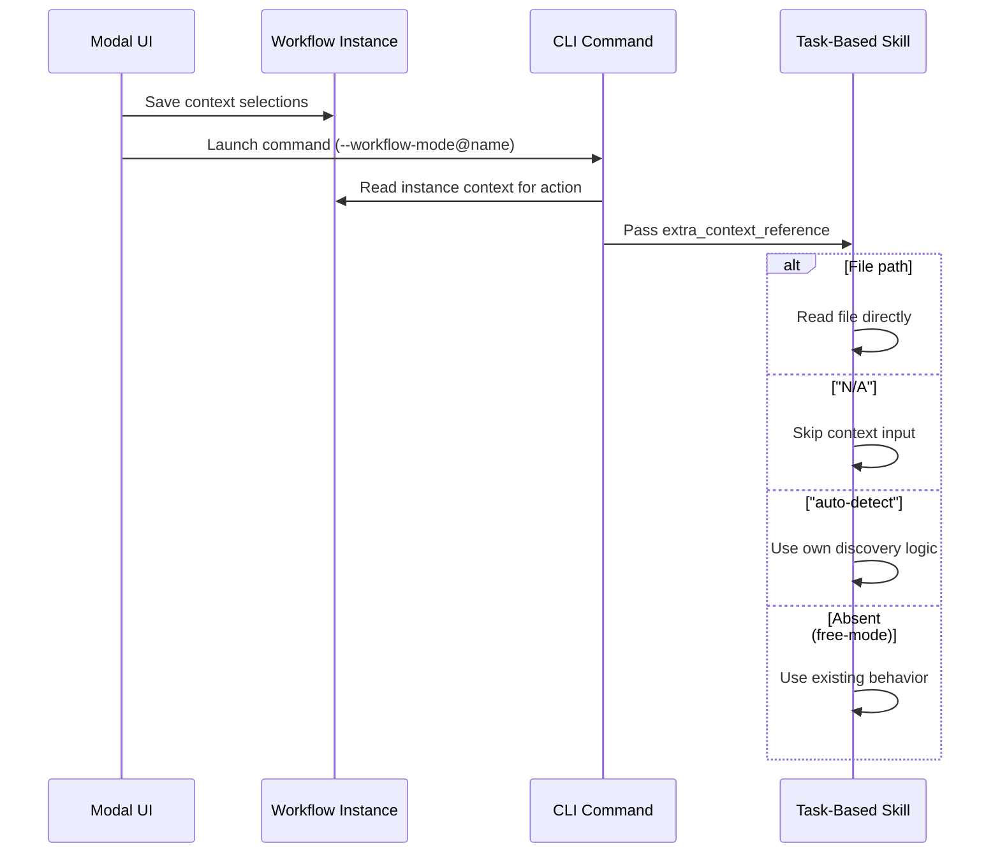

# Technical Design: Skill Extra Context Reference

> Feature ID: FEATURE-041-G | Epic ID: EPIC-041 | CR: CR-002 | Version: v1.0 | Last Updated: 02-26-2026

---

## Part 1: Agent-Facing Summary

> **Purpose:** Quick reference for AI agents navigating large projects.
> **📌 AI Coders:** Focus on this section for implementation context.

### Key Components Implemented

| Component | Responsibility | Scope/Impact | Tags |
|-----------|----------------|--------------|------|
| SKILL.md `extra_context_reference` | New workflow input parameter in all workflow-aware skills | 9+ skill files | #skills #extra-context #workflow-input |
| Execution procedure updates | Conditional context reading in skill steps | Per-skill procedure sections | #skills #procedure #context-handling |
| `copilot-prompt.json` deprecation note | Document `input_source` as deprecated | Config documentation | #deprecation #input-source #copilot-prompt |

### Dependencies

| Dependency | Source | Design Link | Usage Description |
|------------|--------|-------------|-------------------|
| Skill SKILL.md structure | Framework convention | `.github/skills/x-ipe-task-based-*/SKILL.md` | Standard skill input YAML block being extended |
| Workflow instance `context` field | FEATURE-041-E | [technical-design.md](../FEATURE-041-E/technical-design.md) | Source of context values passed to skills at runtime |

### Major Flow

1. Workflow UI persists user's context selections in instance `context` field (FEATURE-041-F)
2. When CLI command launches a skill in workflow mode, the orchestrator reads instance `context` for the action
3. Orchestrator passes context as `extra_context_reference` in the skill's workflow input
4. Skill reads `extra_context_reference`: file path → use directly; "N/A" → skip; "auto-detect" → self-discover
5. If `extra_context_reference` is absent (free-mode), skill uses existing discovery logic

### Usage Example

```yaml
# Skill input in workflow mode (e.g., refine_idea)
input:
  workflow:
    name: "my-workflow"
    action: "refine_idea"
    extra_context_reference:
      raw-idea: "x-ipe-docs/ideas/my-wf/new idea.md"
      uiux-reference: "N/A"

# Skill execution procedure step:
# Step 2: Gather Context
# 1. IF workflow mode AND extra_context_reference.raw-idea is a path:
#      READ that file as the raw idea input
#    ELSE:
#      Scan x-ipe-docs/ideas/ for idea files (existing discovery logic)
# 2. IF extra_context_reference.uiux-reference is "N/A":
#      Skip UIUX reference input
#    ELIF extra_context_reference.uiux-reference is "auto-detect":
#      Use existing UIUX reference discovery logic
#    ELIF extra_context_reference.uiux-reference is a path:
#      READ that file as UIUX reference input
```

---

## Part 2: Implementation Guide

> **Purpose:** Human-readable details for developers.

### Workflow Diagram



### Skill Input Block Change Pattern

For each workflow-aware skill, add `extra_context_reference` to the `workflow` input block:

```yaml
# BEFORE (current)
input:
  workflow:
    name: "N/A"
    action: "{action_name}"

# AFTER (new)
input:
  workflow:
    name: "N/A"
    action: "{action_name}"
    extra_context_reference:
      ref-name-1: "path | N/A | auto-detect"
      ref-name-2: "path | N/A | auto-detect"
```

### Execution Procedure Change Pattern

For each skill step that reads context, add conditional:

```xml
<!-- BEFORE -->
<step_2>
  <name>Gather Context</name>
  <action>
    1. READ x-ipe-docs/ideas/{folder}/new idea.md
    2. ...
  </action>
</step_2>

<!-- AFTER -->
<step_2>
  <name>Gather Context</name>
  <action>
    1. IF workflow mode AND extra_context_reference.raw-idea is a file path:
         READ extra_context_reference.raw-idea as raw idea input
       ELIF extra_context_reference.raw-idea is "auto-detect":
         Use existing discovery logic (scan ideas folder)
       ELIF extra_context_reference.raw-idea is "N/A":
         Skip raw idea input
       ELSE (free-mode / absent):
         READ x-ipe-docs/ideas/{folder}/new idea.md (existing behavior)
    2. ...
  </action>
</step_2>
```

### Skills to Update

| # | Skill | Action | Context Refs | Priority |
|---|-------|--------|-------------|----------|
| 1 | `x-ipe-task-based-ideation-v2` | `refine_idea` | `raw-idea`, `uiux-reference` | High |
| 2 | `x-ipe-task-based-idea-mockup` | `design_mockup` | `refined-idea`, `uiux-reference` | Medium |
| 3 | `x-ipe-task-based-requirement-gathering` | `requirement_gathering` | `refined-idea`, `mockup-html` | High |
| 4 | `x-ipe-task-based-feature-breakdown` | `feature_breakdown` | `requirement-doc` | High |
| 5 | `x-ipe-task-based-feature-refinement` | `feature_refinement` | `requirement-doc`, `features-list` | High |
| 6 | `x-ipe-task-based-technical-design` | `technical_design` | `specification` | High |
| 7 | `x-ipe-task-based-code-implementation` | `implementation` | `tech-design`, `specification` | High |
| 8 | `x-ipe-task-based-feature-acceptance-test` | `acceptance_testing` | `specification`, `impl-files` | Medium |
| 9 | `x-ipe-task-based-change-request` | `change_request` | `eval-report`, `specification` | Low |

### Implementation Steps

#### Step 1: Update each SKILL.md input block

For each skill in the table above:
1. Open `.github/skills/{skill-name}/SKILL.md`
2. Find the `input:` YAML block
3. Add `extra_context_reference` under `workflow:` with the correct ref names
4. Default value: `N/A`

#### Step 2: Update execution procedures

For each skill:
1. Find the step that reads context (typically Step 2: Gather Context)
2. Add the conditional pattern: if workflow mode + path → read; if auto-detect → discover; if N/A → skip; if absent → existing behavior
3. Do NOT add duplicate logic — integrate into existing steps

#### Step 3: Add deprecation note

In `x-ipe-docs/config/copilot-prompt.json` (or its documentation):
```
// DEPRECATED: input_source is deprecated for actions with action_context
// in workflow-template.json. Use extra_context_reference instead.
// Will be removed after full migration to action_context system.
```

### Edge Cases & Error Handling

| Scenario | Handling |
|----------|----------|
| `extra_context_reference` absent | Skill uses existing behavior (free-mode); no error |
| Unknown ref name in `extra_context_reference` | Skill ignores silently |
| File path points to non-existent file | Skill logs warning, falls back to discovery logic |
| All refs are "auto-detect" | Equivalent to free-mode behavior |
| All refs are "N/A" | Skill runs with no external context; relies on internal defaults |
| New skill added later without `extra_context_reference` | Works fine — field is optional; add it when skill becomes workflow-aware |

---

## Design Change Log

| Date | Phase | Change Summary |
|------|-------|----------------|
| 02-26-2026 | Initial Design | Initial technical design for skill extra_context_reference input parameter. Pure SKILL.md documentation changes across 9 workflow-aware skills. |
