# Technical Design: Workflow Prompts Config & Basic Template Resolution (MVP)

> Feature ID: FEATURE-042-A | Epic ID: EPIC-042 | Version: v1.0 | Last Updated: 02-27-2026

---

## Part 1: Agent-Facing Summary

> **Purpose:** Quick reference for AI agents navigating large projects.
> **📌 AI Coders:** Focus on this section for implementation context.

### Key Components Implemented

| Component | Responsibility | Scope/Impact | Tags |
|-----------|----------------|--------------|------|
| `copilot-prompt.json` `workflow-prompts` array | Dedicated prompt templates for workflow-mode actions with `$output:tag$` variable syntax | Config — additive schema change | #config #workflow-prompts #copilot-prompt #schema |
| `ActionExecutionModal._getWorkflowPrompt()` | Look up prompt entry from `workflow-prompts` by action key | Frontend JS — prompt lookup | #modal #prompt-lookup #workflow-mode #frontend |
| `ActionExecutionModal._resolveTemplate()` | Parse `$output:tag$`, `$output-folder:tag$`, `$feature-id$` tokens and substitute with dropdown values | Frontend JS — template resolution | #modal #template-resolver #variable-tokens #frontend |
| `ActionExecutionModal._loadInstructions()` (modified) | Branch on workflow mode to use `workflow-prompts` instead of legacy sections | Frontend JS — mode routing | #modal #instructions #mode-detection #frontend |

### Dependencies

| Dependency | Source | Design Link | Usage Description |
|------------|--------|-------------|-------------------|
| `ActionExecutionModal` (action context dropdowns) | FEATURE-041-F | [technical-design.md](../../EPIC-041/FEATURE-041-F/technical-design.md) | Provides `_renderActionContext()`, dropdown groups with `data-ref-name`, and context persistence. Template resolution reads dropdown values from these elements. |
| `workflow-template.json` (action_context) | FEATURE-041-E | [technical-design.md](../../EPIC-041/FEATURE-041-E/technical-design.md) | `action_context` ref names (e.g., `raw-idea`, `uiux-reference`) are the canonical tag names that `$output:tag$` tokens resolve against. |
| `copilot-prompt.json` (existing sections) | FEATURE-038-A | N/A | Legacy prompt sections (`ideation.prompts`, `workflow.prompts`, `feature.prompts`) remain unchanged for free-mode fallback. |

### Major Flow

1. **`copilot-prompt.json`** gains a new top-level `"workflow-prompts"` array with prompt entries containing `$output:tag$` variable syntax
2. **Modal opens** → `_loadInstructions()` detects workflow mode via `this.workflowName`
3. **Workflow branch** → calls `_getWorkflowPrompt(actionKey)` to find matching entry in `workflow-prompts` by `action` field
4. **Template resolution** → `_resolveTemplate(template, contextValues)` parses `$output:tag$`, `$output-folder:tag$`, `$feature-id$` tokens using regex
5. **Value substitution** → For each token, looks up the matching `action_context` dropdown (rendered by FEATURE-041-F) and reads its selected value
6. **Display** → Resolved command string is shown in the instructions area; free-mode path is completely unchanged

### Usage Example

```javascript
// --- Prompt lookup from workflow-prompts ---
_getWorkflowPrompt(actionKey) {
    const config = window.__copilotPromptConfig;
    const prompts = config?.['workflow-prompts'];
    if (!Array.isArray(prompts)) return null;
    return prompts.find(p => p.action === actionKey) || null;
}

// --- Template resolver (pure function) ---
_resolveTemplate(template, contextValues) {
    // contextValues = { 'raw-idea': 'x-ipe-docs/ideas/my-project/raw-idea.md',
    //                   'uiux-reference': 'N/A',
    //                   '$feature-id': 'FEATURE-042-A' }
    let resolved = template;

    // $output:tag-name$
    resolved = resolved.replace(/\$output:([a-z0-9-]+)\$/g, (match, tag) => {
        return contextValues[tag] ?? match;
    });

    // $output-folder:tag-name$
    resolved = resolved.replace(/\$output-folder:([a-z0-9-]+)\$/g, (match, tag) => {
        return contextValues[tag] ?? match;
    });

    // $feature-id$
    resolved = resolved.replace(/\$feature-id\$/g, () => {
        return contextValues['$feature-id'] ?? '';
    });

    return resolved;
}

// --- Modified _loadInstructions() branch ---
// In workflow mode:
const wpEntry = this._getWorkflowPrompt(this.actionKey);
if (wpEntry) {
    const detail = wpEntry['prompt-details'].find(d => d.language === 'en')
        || wpEntry['prompt-details'][0];
    const contextValues = this._collectContextValues();
    const resolved = this._resolveTemplate(detail.command, contextValues);
    this._loadedInstructions = { label: detail.label, command: resolved };
}
// In free mode: existing _getConfigEntry() + legacy placeholder logic unchanged
```

---

## Part 2: Implementation Guide

> **Purpose:** Human-readable details for developers.

### Workflow Diagram

```mermaid
sequenceDiagram
    participant User as User
    participant Modal as ActionExecutionModal
    participant Config as copilot-prompt.json (cached)
    participant Dropdowns as Action Context Dropdowns

    User->>Modal: Open action modal (actionKey, workflowName)
    Modal->>Config: Read config (cached in window.__copilotPromptConfig)

    alt Workflow mode (workflowName is set)
        Modal->>Modal: _getWorkflowPrompt(actionKey)
        alt Entry found in workflow-prompts
            Modal->>Modal: Select prompt-details by language
            Modal->>Dropdowns: _collectContextValues() — read all dropdown selections
            Dropdowns-->>Modal: { "raw-idea": "path/to/file.md", ... }
            Modal->>Modal: _resolveTemplate(command, contextValues)
            Modal->>Modal: Display resolved command in instructions area
        else No entry found
            Modal->>Modal: Fallback to _getConfigEntry() (legacy sections)
            Note right of Modal: Console warning logged
        end
    else Free mode (workflowName is null)
        Modal->>Modal: _getConfigEntry() — search legacy sections
        Modal->>Modal: Resolve <input-file>, <current-idea-file>, <feature-id>
        Modal->>Modal: Display command (existing behavior unchanged)
    end

    User->>Modal: Optionally edits extra instructions
    User->>Modal: Clicks Execute
```



### Data Models

#### `workflow-prompts` Entry Schema

```json
{
  "id": "refine-idea",
  "action": "refine_idea",
  "icon": "bi-stars",
  "input_source": ["compose_idea"],
  "prompt-details": [
    {
      "language": "en",
      "label": "Refine Idea",
      "command": "refine the idea $output:raw-idea$ with ideation skill"
    },
    {
      "language": "zh",
      "label": "完善创意",
      "command": "使用创意技能, 完善创意 $output:raw-idea$"
    }
  ]
}
```

| Field | Type | Required | Description |
|-------|------|----------|-------------|
| `id` | string | ✅ | Unique identifier (kebab-case, e.g., `"refine-idea"`) |
| `action` | string | ✅ | Maps 1:1 to action key in `workflow-template.json` (e.g., `"refine_idea"`) |
| `icon` | string | ✅ | Bootstrap icon class (e.g., `"bi-stars"`) |
| `input_source` | string[] | ✅ | Prior action keys whose deliverables feed this action. **Informational only** — not used for runtime resolution. |
| `prompt-details` | array | ✅ | One or more language-specific prompt entries |
| `prompt-details[].language` | string | ✅ | ISO 639-1 code (`"en"`, `"zh"`) |
| `prompt-details[].label` | string | ✅ | Display name shown in modal header |
| `prompt-details[].command` | string | ✅ | Prompt template with `$output:tag$` / `$output-folder:tag$` / `$feature-id$` tokens |

#### Variable Token Grammar

| Token Pattern | Regex | Resolves From |
|---------------|-------|---------------|
| `$output:tag-name$` | `/\$output:([a-z0-9-]+)\$/g` | Action context dropdown value (file path) |
| `$output-folder:tag-name$` | `/\$output-folder:([a-z0-9-]+)\$/g` | Action context dropdown value (folder path) |
| `$feature-id$` | `/\$feature-id\$/g` | `this.featureId` from modal constructor |

### Frontend Components

#### `_getWorkflowPrompt(actionKey)` — Prompt Lookup

**Location:** `action-execution-modal.js` — new method on `ActionExecutionModal`

```javascript
/**
 * Look up a workflow-specific prompt entry by action key.
 * @param {string} actionKey - e.g., "refine_idea"
 * @returns {object|null} The matching workflow-prompts entry or null
 */
_getWorkflowPrompt(actionKey) {
    const config = window.__copilotPromptConfig;
    const prompts = config?.['workflow-prompts'];
    if (!Array.isArray(prompts) || prompts.length === 0) {
        console.warn(`No workflow-prompts array found in config`);
        return null;
    }
    const entry = prompts.find(p => p.action === actionKey);
    if (!entry) {
        console.warn(`No workflow-prompt found for action: ${actionKey}, falling back to legacy prompts`);
    }
    return entry || null;
}
```

#### `_resolveTemplate(template, contextValues)` — Template Resolution

**Location:** `action-execution-modal.js` — new method on `ActionExecutionModal`

```javascript
/**
 * Resolve $output:tag$, $output-folder:tag$, and $feature-id$ tokens in a template string.
 * Pure function: no side effects, no DOM access.
 *
 * @param {string} template - Prompt template with variable tokens
 * @param {Record<string, string>} contextValues - Map of tag-name → value
 *        Special key '$feature-id' holds the feature ID.
 * @returns {string} Resolved template string
 */
_resolveTemplate(template, contextValues) {
    if (!template) return '';

    let resolved = template;

    // 1. $output:tag-name$ → file path from action context dropdown
    resolved = resolved.replace(/\$output:([a-z0-9-]+)\$/g, (match, tag) => {
        return contextValues[tag] ?? match;
    });

    // 2. $output-folder:tag-name$ → folder path from action context dropdown
    resolved = resolved.replace(/\$output-folder:([a-z0-9-]+)\$/g, (match, tag) => {
        return contextValues[tag] ?? match;
    });

    // 3. $feature-id$ → current feature ID from modal context
    resolved = resolved.replace(/\$feature-id\$/g, () => {
        const fid = contextValues['$feature-id'];
        if (fid === undefined || fid === null) {
            console.warn('$feature-id$ used but no featureId set in modal context');
            return '';
        }
        return fid;
    });

    return resolved;
}
```

#### `_collectContextValues()` — Build Context Map from DOM

**Location:** `action-execution-modal.js` — new method on `ActionExecutionModal`

```javascript
/**
 * Read all action context dropdown values and build a context map for template resolution.
 * @returns {Record<string, string>} Map of ref-name → selected dropdown value
 */
_collectContextValues() {
    const values = {};

    // Read action context dropdowns (rendered by FEATURE-041-F _renderActionContext)
    if (this.overlay) {
        const groups = this.overlay.querySelectorAll('.context-ref-group');
        for (const group of groups) {
            const refName = group.dataset.refName;
            const select = group.querySelector('select');
            if (refName && select) {
                values[refName] = select.value;
            }
        }
    }

    // Add feature-id to context map
    if (this.featureId) {
        values['$feature-id'] = this.featureId;
    }

    return values;
}
```

#### `_loadInstructions()` Modification — Workflow-Mode Branch

**Location:** `action-execution-modal.js` — modify existing method (lines 67–109)

The existing `_loadInstructions()` currently always uses `_getConfigEntry()` to search legacy prompt sections. The modification adds a workflow-mode branch at the top that attempts `_getWorkflowPrompt()` first.

```javascript
async _loadInstructions() {
    let config = window.__copilotPromptConfig;
    if (!config) {
        try {
            const resp = await fetch('/api/config/copilot-prompt');
            if (resp.ok) {
                config = await resp.json();
                window.__copilotPromptConfig = config;
            }
        } catch (e) { /* ignore */ }
    }
    if (!config) return;

    // === NEW: Workflow-mode branch ===
    if (this.workflowName) {
        const wpEntry = this._getWorkflowPrompt(this.actionKey);
        if (wpEntry && wpEntry['prompt-details']) {
            const detail = wpEntry['prompt-details'].find(d => d.language === 'en')
                || wpEntry['prompt-details'][0];
            if (detail) {
                // Store raw template for later re-resolution on dropdown change
                this._workflowCommandTemplate = detail.command;
                this._loadedInstructions = { label: detail.label, command: detail.command };
                return; // Template resolution happens after dropdowns render in open()
            }
        }
        // No workflow-prompt found → fall through to legacy path
    }

    // === EXISTING: Legacy prompt path (unchanged) ===
    const entry = this._getConfigEntry(config);
    if (!entry) return;

    const detail = entry['prompt-details'].find(d => d.language === 'en')
        || entry['prompt-details'][0];
    let command = detail.command;

    // Resolve input files from input_source or legacy <current-idea-file>
    const hasInputPlaceholder = command.includes('<input-file>') || command.includes('<current-idea-file>');
    if (hasInputPlaceholder && this.workflowName) {
        if (entry.input_source) {
            this._inputFiles = await this._resolveInputFiles(entry.input_source);
        } else {
            this._inputFiles = await this._resolveIdeaFiles();
        }
        this._commandTemplate = command;
        const selected = this._inputFiles.length ? this._inputFiles[0] : null;
        this._selectedInputFile = selected;
        if (selected) {
            command = command.replace(/<input-file>|<current-idea-file>/g, selected);
        }
    }

    if (this.featureId && command.includes('<feature-id>')) {
        command = command.replace(/<feature-id>/g, this.featureId);
    }

    this._loadedInstructions = { label: detail.label, command };
}
```

#### Template Resolution Wiring in `open()` — After Dropdowns Render

**Location:** `action-execution-modal.js` — modify existing `open()` method

After `_renderActionContext()` completes and dropdowns are populated, resolve the workflow template:

```javascript
async open() {
    await this._loadInstructions();
    this._createDOM();
    this._bindEvents();
    document.body.appendChild(this.overlay);

    // Template-driven action context (FEATURE-041-F)
    if (this.workflowName) {
        try {
            const template = await this._fetchTemplate();
            const actionDef = this._getActionDef(template, this.actionKey);
            if (actionDef && actionDef.action_context) {
                this._actionContextDef = actionDef.action_context;
                const legacyInput = this.overlay.querySelector('.input-selector-section');
                if (legacyInput) legacyInput.style.display = 'none';
                await this._renderActionContext(actionDef.action_context);
                // Reopen: restore previous context
                const instance = await this._fetchInstance();
                if (instance) {
                    const ctx = this._getInstanceContext(instance, this.actionKey, this.featureId);
                    if (ctx) await this._restoreContext(ctx);
                }

                // === NEW (FEATURE-042-A): Resolve workflow template after dropdowns ready ===
                if (this._workflowCommandTemplate) {
                    this._resolveAndDisplayWorkflowPrompt();
                }
            }
        } catch (e) { /* fallback to legacy */ }
    }
}
```

#### `_resolveAndDisplayWorkflowPrompt()` — Trigger Resolution + Update DOM

```javascript
/**
 * Resolve the workflow prompt template using current dropdown values and update the display.
 */
_resolveAndDisplayWorkflowPrompt() {
    if (!this._workflowCommandTemplate || !this.overlay) return;

    const contextValues = this._collectContextValues();
    const resolved = this._resolveTemplate(this._workflowCommandTemplate, contextValues);

    this._loadedInstructions.command = resolved;
    const contentEl = this.overlay.querySelector('.instructions-content');
    if (contentEl) contentEl.textContent = resolved;
}
```

### Implementation Steps

#### Step 1: Add `workflow-prompts` Array to `copilot-prompt.json`

**File:** `src/x_ipe/resources/config/copilot-prompt.json`

Add a new top-level `"workflow-prompts"` key alongside existing keys. Bump `version` to `"3.3"`. Start with one entry for `refine_idea`:

```json
{
  "version": "3.3",
  "workflow-prompts": [
    {
      "id": "refine-idea",
      "action": "refine_idea",
      "icon": "bi-stars",
      "input_source": ["compose_idea"],
      "prompt-details": [
        {
          "language": "en",
          "label": "Refine Idea",
          "command": "refine the idea $output:raw-idea$ with ideation skill"
        },
        {
          "language": "zh",
          "label": "完善创意",
          "command": "使用创意技能, 完善创意 $output:raw-idea$"
        }
      ]
    }
  ],
  "ideation": { "..." : "unchanged" },
  "evaluation": { "..." : "unchanged" },
  "workflow": { "..." : "unchanged" },
  "feature": { "..." : "unchanged" },
  "placeholder": { "..." : "unchanged" }
}
```

**Validation:** All existing keys unchanged. `workflow-prompts` is additive only.

#### Step 2: Create `_getWorkflowPrompt()` Method

**File:** `src/x_ipe/static/js/features/action-execution-modal.js`

Add the method after `_getConfigEntry()` (around line 159). See [Frontend Components](#_getworkflowpromptactionkey--prompt-lookup) above for full implementation.

**Acceptance:** Given `action === "refine_idea"`, returns the workflow-prompts entry. Given unknown action, returns `null` with console warning.

#### Step 3: Create `_resolveTemplate()` and `_collectContextValues()` Methods

**File:** `src/x_ipe/static/js/features/action-execution-modal.js`

Add both methods after `_getWorkflowPrompt()`. See [Frontend Components](#_resolvetemplatetemplate-contextvalues--template-resolution) above.

**Acceptance:**
- `_resolveTemplate('refine $output:raw-idea$', {'raw-idea': 'path/file.md'})` → `'refine path/file.md'`
- `_resolveTemplate('$output:unknown$', {})` → `'$output:unknown$'` (unresolved)
- `_resolveTemplate('build $feature-id$', {'$feature-id': 'FEATURE-042-A'})` → `'build FEATURE-042-A'`
- Malformed tokens (`$output:$`, `$output:tag`, `$$`) → left as-is

#### Step 4: Modify `_loadInstructions()` to Branch on Workflow Mode

**File:** `src/x_ipe/static/js/features/action-execution-modal.js`

Insert the workflow-mode branch at the top of `_loadInstructions()`, after config is loaded but before `_getConfigEntry()`. See [Frontend Components](#_loadinstructions-modification--workflow-mode-branch) above.

**Key behavior:**
- Workflow mode + entry found → stores raw template in `this._workflowCommandTemplate`, sets `_loadedInstructions` with unresolved template, returns early
- Workflow mode + no entry → falls through to legacy path (console warning)
- Free mode → skips workflow branch entirely, existing behavior unchanged

#### Step 5: Wire Template Resolution to Dropdown Values in `open()`

**File:** `src/x_ipe/static/js/features/action-execution-modal.js`

After `_renderActionContext()` and `_restoreContext()` complete in `open()`, call `_resolveAndDisplayWorkflowPrompt()` to resolve the template with actual dropdown values and update the instructions display.

Also add a dropdown `change` event listener so re-resolution happens when the user changes a dropdown:

```javascript
// Inside _renderActionContext(), after each dropdown is created:
select.addEventListener('change', () => {
    this._resolveAndDisplayWorkflowPrompt();
});
```

**Acceptance:** When dropdown value changes, instructions area updates with newly resolved template.

### Edge Cases & Error Handling

| Scenario | Handling | Reference |
|----------|----------|-----------|
| `workflow-prompts` array empty | Fallback to legacy `_getConfigEntry()` with console warning | EC-1 |
| Action not found in `workflow-prompts` | Fallback to legacy sections with console warning | EC-2 |
| Requested language not in `prompt-details` | Use first entry (typically `"en"`) | EC-3 |
| `$output:$` (missing tag name) | Not matched by regex — left as-is | EC-4 |
| `$output:raw-idea` (missing closing `$`) | Not matched by regex — left as-is | EC-5 |
| `$$` (empty token) | Not matched — left as-is | EC-6 |
| `$unknown-type:tag$` (invalid type) | Not matched by any of the three regexes — left as-is | EC-7 |
| Dropdown value is `"auto-detect"` | Token resolves to literal string `"auto-detect"` | EC-8 |
| Dropdown value is `"N/A"` (optional ref) | Token resolves to `"N/A"` | EC-9 |
| `$feature-id$` on shared action (no featureId) | Resolves to `""` with console warning | EC-10 |
| Multiple occurrences of same token | All replaced with same value (global regex) | EC-12 |
| Duplicate `action` in `workflow-prompts` | First match used, console warning | EC-13 |
| Config API failure | `_loadInstructions()` exits early, modal shows "No instructions" | Existing |

### Key Design Decisions

| Decision | Rationale |
|----------|-----------|
| **Frontend-only resolution** — no backend template processing | Keeps resolution latency < 50ms; dropdown values are already in the DOM. No API round-trip needed. |
| **`action_context` is authoritative** — `input_source` in `workflow-prompts` is informational | Prevents two sources of truth for which refs an action uses. `workflow-template.json` action_context is already the canonical definition (FEATURE-041-E). |
| **Pure resolver function** — `_resolveTemplate(template, contextValues)` | Testable in isolation. No DOM access inside resolver. Context map is built separately by `_collectContextValues()`. |
| **Single-pass resolution** — no cascading re-resolution | A resolved value cannot introduce new `$...$` tokens. Prevents infinite loops and makes behavior predictable. |
| **Raw template stored** — `this._workflowCommandTemplate` | Enables re-resolution when dropdowns change without re-fetching config. |
| **Free mode completely untouched** — branch skips workflow-prompts entirely | Zero regression risk for free-mode users. The `if (this.workflowName)` guard ensures the new code path is never entered in free mode. |
| **Additive config change** — `workflow-prompts` alongside existing keys | No migration needed. Existing consumers ignore unknown keys. Version bump from `3.2` → `3.3` signals the addition. |

---

## Design Change Log

| Date | Phase | Change Summary |
|------|-------|----------------|
| 02-27-2026 | Initial Design | Technical design for workflow-prompts config array and basic template resolution. Adds `_getWorkflowPrompt()`, `_resolveTemplate()`, `_collectContextValues()` to `ActionExecutionModal`. Modifies `_loadInstructions()` with workflow-mode branch. Frontend-only, no backend changes. |
