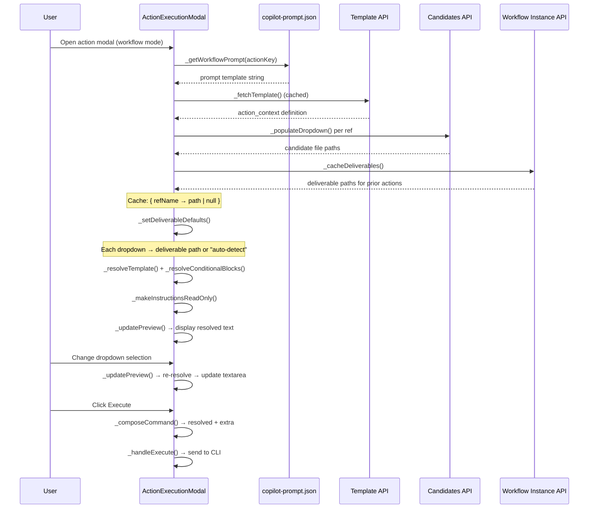

# Technical Design: Deliverable-Default Dropdowns & Read-Only Preview

> Feature ID: FEATURE-042-C | Epic ID: EPIC-042 | Version: v1.0 | Last Updated: 02-27-2026

---

## Part 1: Agent-Facing Summary

> **Purpose:** Quick reference for AI agents navigating large projects.
> **📌 AI Coders:** Focus on this section for implementation context.

### Key Components Implemented

| Component | Responsibility | Scope/Impact | Tags |
|-----------|----------------|--------------|------|
| `ActionExecutionModal._cacheDeliverables()` | Fetch and cache prior action deliverable paths on modal open | Frontend JS — deliverable resolution | #modal #deliverables #cache #frontend |
| `ActionExecutionModal._setDeliverableDefaults()` | Set dropdown defaults from cached deliverables (fallback: "auto-detect") | Frontend JS — dropdown defaults | #modal #dropdown #defaults #frontend |
| `ActionExecutionModal._makeInstructionsReadOnly()` | Set INSTRUCTIONS textarea to `readonly` in workflow mode with visual styling | Frontend JS — read-only preview | #modal #readonly #preview #frontend |
| `ActionExecutionModal._updatePreview()` | Re-resolve template on dropdown change, update INSTRUCTIONS textarea | Frontend JS — live preview | #modal #preview #template #frontend |
| `ActionExecutionModal._composeCommand()` | Combine resolved instructions + extra instructions into final command | Frontend JS — command composition | #modal #command #composition #frontend |
| `.instructions-readonly` CSS class | Visual distinction for read-only INSTRUCTIONS textarea | Frontend CSS — styling | #css #readonly #styling |

### Dependencies

| Dependency | Source | Design Link | Usage Description |
|------------|--------|-------------|-------------------|
| `ActionExecutionModal._resolveTemplate()` | FEATURE-042-A | [specification.md](x-ipe-docs/requirements/EPIC-042/FEATURE-042-A/specification.md) | Template resolver: `$output:tag$`, `$output-folder:tag$`, `$feature-id$` substitution |
| `ActionExecutionModal._getWorkflowPrompt()` | FEATURE-042-A | [specification.md](x-ipe-docs/requirements/EPIC-042/FEATURE-042-A/specification.md) | Fetch workflow-mode prompt template from `copilot-prompt.json` `workflow-prompts` array |
| `_resolveConditionalBlocks()` | FEATURE-042-B | [specification.md](x-ipe-docs/requirements/EPIC-042/FEATURE-042-B/specification.md) | `<>` conditional block evaluation — skip block when any variable is N/A, strip delimiters when all resolve |
| `ActionExecutionModal._renderActionContext()` | FEATURE-041-F | [technical-design.md](x-ipe-docs/requirements/EPIC-041/FEATURE-041-F/technical-design.md) | Creates context dropdowns from `action_context` in workflow-template.json |
| `ActionExecutionModal._populateDropdown()` | FEATURE-041-F | [technical-design.md](x-ipe-docs/requirements/EPIC-041/FEATURE-041-F/technical-design.md) | Populates dropdowns with candidate files from candidate resolution API |
| Workflow Instance API | Foundation | `GET /api/workflow/{name}` | Source of prior action deliverable paths |

### Major Flow

1. **Modal opens** → `_getWorkflowPrompt()` loads template from `workflow-prompts` → `_renderActionContext()` creates dropdowns
2. **Fetch deliverables** → `_cacheDeliverables()` queries workflow instance once → stores `{ refName: path | null }` in `this._deliverableCache`
3. **Set defaults** → `_setDeliverableDefaults()` iterates each dropdown: if deliverable exists → set as default; else → "auto-detect"
4. **Resolve template** → `_resolveTemplate()` (042-A) + `_resolveConditionalBlocks()` (042-B) produce fully resolved instructions
5. **Display preview** → `_makeInstructionsReadOnly()` sets `readonly` attribute, applies `.instructions-readonly` CSS, shows resolved text
6. **Dropdown change** → change event → `_updatePreview()` re-resolves template with current dropdown values → updates textarea
7. **Execute** → `_composeCommand()` returns `resolvedInstructions + ("\n\n" + extraInstructions if non-empty)` → sent to CLI

### Usage Example

```javascript
// Modal opens in workflow mode
const modal = new ActionExecutionModal({
    actionKey: 'refine_idea',
    workflowName: 'my-project',
    featureId: null
});
await modal.open();

// Inside open(), after dropdowns are rendered:
// 1. Cache deliverables (one-time fetch)
await this._cacheDeliverables();
// this._deliverableCache = { "raw-idea": "x-ipe-docs/ideas/my-project/raw-idea.md", "uiux-reference": null }

// 2. Set dropdown defaults from cache
this._setDeliverableDefaults();
// raw-idea dropdown → "x-ipe-docs/ideas/my-project/raw-idea.md"
// uiux-reference dropdown → "auto-detect" (no deliverable)

// 3. Make instructions readonly and show resolved preview
this._makeInstructionsReadOnly();
this._updatePreview();
// INSTRUCTIONS textarea shows: "Refine the idea x-ipe-docs/ideas/my-project/raw-idea.md ..."
// (readonly, user cannot edit)

// 4. User changes raw-idea dropdown to a different file
// → change event fires → _updatePreview() → textarea content re-resolved

// 5. User clicks Execute
const cmd = this._composeCommand();
// cmd = resolvedInstructions + "\n\n" + extraInstructions (if any)
```

---

## Part 2: Implementation Guide

> **Purpose:** Human-readable details for developers.

### Workflow Diagram



### Deliverable Default Logic

#### Cache Structure

```javascript
// Populated once on modal open via _cacheDeliverables()
this._deliverableCache = {
    "raw-idea": "x-ipe-docs/ideas/my-project/raw-idea.md",       // deliverable exists
    "uiux-reference": null,                                         // no deliverable
    "architecture": "x-ipe-docs/ideas/my-project/architecture.md"  // deliverable exists
};
```

#### Resolution Rules

| Condition | Dropdown Default | Behavior |
|-----------|-----------------|----------|
| Deliverable exists AND file path found in dropdown options | Deliverable file path | Auto-selected |
| Deliverable exists BUT file path NOT in dropdown options | "auto-detect" | Deliverable file may have been deleted; graceful fallback |
| No deliverable for this ref | "auto-detect" | Standard fallback |
| User overrides default | User's selection | Always respected; no re-defaulting |

### Read-Only Preview

#### INSTRUCTIONS Textarea Behavior by Mode

| Mode | `readonly` Attribute | Content Source | CSS Class | User Can Edit |
|------|---------------------|----------------|-----------|---------------|
| Workflow | `readonly` | Fully resolved template | `.instructions-readonly` | ❌ No |
| Free | (none) | Raw prompt from config | (none) | ✅ Yes |

#### Visual Styling

The `.instructions-readonly` class provides a subtle visual cue that the textarea is non-editable:
- Slightly different background color (e.g., `#f1f5f9` vs. `#f8fafc`)
- Cursor changes to `default` instead of `text`
- No focus ring on click (since editing is disabled)

### Command Composition

```javascript
_composeCommand() {
    const resolved = this._getResolvedInstructions();   // from INSTRUCTIONS textarea
    const extra = this._getExtraInstructions();          // from EXTRA INSTRUCTIONS textarea

    if (extra && extra.trim()) {
        return resolved + '\n\n' + extra.trim();
    }
    return resolved;
}
```

**Rules:**
- `resolved` = fully resolved template text (all `$output:tag$` replaced, `<>` blocks evaluated)
- `extra` = raw user text from EXTRA INSTRUCTIONS — no template resolution applied
- Separator is always `\n\n` when extra instructions are present
- No trailing newlines when extra is empty

### Implementation Steps

#### Step 1: Create `_cacheDeliverables()` — called once on modal open

```javascript
async _cacheDeliverables() {
    this._deliverableCache = {};
    if (!this.workflowName || !this._actionContextDef) return;

    try {
        const instance = await this._fetchInstance();
        if (!instance) return;

        const stages = instance.stages || instance.shared || {};
        const featureData = this.featureId && instance.features
            ? (Array.isArray(instance.features)
                ? instance.features.find(f => f.feature_id === this.featureId)
                : instance.features[this.featureId])
            : null;

        for (const refName of Object.keys(this._actionContextDef)) {
            const refDef = this._actionContextDef[refName];
            const sourceActions = refDef.source_actions || [];
            let deliverablePath = null;

            for (const sourceAction of sourceActions) {
                let actionObj = null;

                // Check feature lanes first
                if (featureData) {
                    for (const stage of ['implement', 'validation', 'feedback']) {
                        const stageData = featureData[stage];
                        actionObj = (stageData && stageData.actions || {})[sourceAction];
                        if (actionObj && actionObj.deliverables && actionObj.deliverables.length) break;
                        actionObj = null;
                    }
                }

                // Fallback to shared stages
                if (!actionObj) {
                    for (const [, stageData] of Object.entries(stages)) {
                        actionObj = (stageData.actions || {})[sourceAction];
                        if (actionObj && actionObj.deliverables && actionObj.deliverables.length) break;
                        actionObj = null;
                    }
                }

                if (actionObj && actionObj.deliverables && actionObj.deliverables.length) {
                    deliverablePath = actionObj.deliverables.find(d => d.endsWith('.md')) || actionObj.deliverables[0];
                    break;
                }
            }

            this._deliverableCache[refName] = deliverablePath;
        }
    } catch (e) {
        console.warn('Failed to cache deliverables:', e);
    }
}
```

#### Step 2: Create `_setDeliverableDefaults()` — set dropdown defaults from cache

```javascript
_setDeliverableDefaults() {
    if (!this._deliverableCache || !this.overlay) return;

    for (const [refName, deliverablePath] of Object.entries(this._deliverableCache)) {
        if (!deliverablePath) continue;

        const group = this.overlay.querySelector(`[data-ref-name="${refName}"]`);
        if (!group) continue;

        const select = group.querySelector('select');
        if (!select) continue;

        // Check if deliverable path exists in dropdown options
        const option = Array.from(select.options).find(o => o.value === deliverablePath);
        if (option) {
            select.value = deliverablePath;
        }
        // If path not in options, leave as "auto-detect" (file may have been deleted)
    }
}
```

#### Step 3: Modify INSTRUCTIONS textarea to be readonly in workflow mode

```javascript
_makeInstructionsReadOnly() {
    if (!this.workflowName || !this.overlay) return;

    const instructionsContent = this.overlay.querySelector('.instructions-content');
    if (!instructionsContent) return;

    // Convert .instructions-content div to a textarea for readonly behavior
    // Or, if already a textarea, set readonly
    instructionsContent.setAttribute('readonly', '');
    instructionsContent.classList.add('instructions-readonly');
}
```

> **Note:** The current implementation uses a `<div class="instructions-content">` for displaying instructions. In workflow mode this element will gain the `.instructions-readonly` class and its `contentEditable` will be explicitly set to `false` (it already is not editable as a div, but the class provides the visual cue). The resolved template text is set via `textContent`, which is safe for a div element. No conversion to `<textarea>` is required — the div naturally prevents user editing.

#### Step 4: Create `_updatePreview()` — re-resolve template on dropdown change

```javascript
_updatePreview() {
    if (!this.workflowName || !this._workflowPromptTemplate || !this.overlay) return;

    // Build context map from current dropdown selections
    const contextMap = {};
    const groups = this.overlay.querySelectorAll('.context-ref-group');
    for (const group of groups) {
        const refName = group.dataset.refName;
        const select = group.querySelector('select');
        if (select) contextMap[refName] = select.value;
    }

    // Add feature-id to context map
    if (this.featureId) {
        contextMap['feature-id'] = this.featureId;
    }

    // Resolve template: variable substitution (042-A) + conditional blocks (042-B)
    let resolved = this._resolveTemplate(this._workflowPromptTemplate, contextMap);
    resolved = this._resolveConditionalBlocks(resolved, contextMap);

    // Update the instructions display
    const instructionsContent = this.overlay.querySelector('.instructions-content');
    if (instructionsContent) {
        instructionsContent.textContent = resolved;
    }
}
```

#### Step 5: Create `_composeCommand()` — combine resolved + extra

```javascript
_composeCommand() {
    const instructionsContent = this.overlay ? this.overlay.querySelector('.instructions-content') : null;
    const resolved = instructionsContent ? instructionsContent.textContent : '';

    const extraTextarea = this.overlay ? this.overlay.querySelector('.extra-input') : null;
    const extra = extraTextarea ? extraTextarea.value : '';

    if (extra && extra.trim()) {
        return resolved + '\n\n' + extra.trim();
    }
    return resolved;
}
```

#### Step 6: Add change event listeners on context dropdowns to trigger `_updatePreview()`

```javascript
// Inside open(), after _renderActionContext() and _setDeliverableDefaults():
_bindDropdownChangeListeners() {
    if (!this.workflowName || !this.overlay) return;

    const selects = this.overlay.querySelectorAll('.context-ref-group select');
    for (const select of selects) {
        select.addEventListener('change', () => {
            this._updatePreview();
        });
    }
}
```

#### Step 7: Add CSS for `.instructions-readonly`

```css
/* --- Read-Only Instructions Preview (FEATURE-042-C) --- */
.modal-overlay .instructions-content.instructions-readonly {
    background: #f1f5f9;
    border-color: #cbd5e1;
    cursor: default;
    user-select: text;
}

.modal-overlay .instructions-content.instructions-readonly:focus {
    outline: none;
    box-shadow: none;
}
```

### Integration into `open()` Method

The new methods are called in the `open()` method after existing action context rendering:

```javascript
async open() {
    await this._loadInstructions();
    this._createDOM();
    this._bindEvents();
    document.body.appendChild(this.overlay);

    if (this.workflowName) {
        try {
            const template = await this._fetchTemplate();
            const actionDef = this._getActionDef(template, this.actionKey);
            if (actionDef && actionDef.action_context) {
                this._actionContextDef = actionDef.action_context;
                const legacyInput = this.overlay.querySelector('.input-selector-section');
                if (legacyInput) legacyInput.style.display = 'none';
                await this._renderActionContext(actionDef.action_context);

                // --- FEATURE-042-C additions ---
                await this._cacheDeliverables();          // Step 1: fetch + cache
                this._setDeliverableDefaults();           // Step 2: set dropdown defaults
                this._makeInstructionsReadOnly();          // Step 3: readonly + CSS
                this._updatePreview();                     // Step 4: initial resolved preview
                this._bindDropdownChangeListeners();       // Step 6: live updates
                // --- End FEATURE-042-C additions ---

                // Reopen: restore previous context (overrides defaults if available)
                const instance = await this._fetchInstance();
                if (instance) {
                    const ctx = this._getInstanceContext(instance, this.actionKey, this.featureId);
                    if (ctx) {
                        await this._restoreContext(ctx);
                        this._updatePreview();  // Re-resolve after restoring context
                    }
                }
            }
        } catch (e) { /* fallback to legacy */ }
    }
}
```

### Modification to `_handleExecute()`

Replace the existing `_buildCommand()` call with `_composeCommand()` in workflow mode:

```javascript
async _handleExecute() {
    const textarea = this.overlay ? this.overlay.querySelector('.extra-input') : null;
    const extraText = textarea ? textarea.value : '';

    let cmd;
    if (this.workflowName && this._workflowPromptTemplate) {
        // Workflow mode: use composed command (resolved + extra)
        const composed = this._composeCommand();
        const wfSuffix = `@${this.workflowName}`;
        cmd = `--workflow-mode${wfSuffix} ${composed}`;
        if (this.featureId) {
            cmd += ` --feature-id ${this.featureId}`;
        }
    } else {
        // Free mode: use legacy _buildCommand()
        cmd = this._buildCommand(extraText);
    }

    if (!cmd) return;
    // ... rest of execution logic unchanged
}
```

### Edge Cases

| # | Scenario | Expected Behavior |
|---|----------|-------------------|
| 1 | No prior deliverables exist for any ref | All dropdowns default to "auto-detect"; preview resolves with "auto-detect" literals |
| 2 | Deliverable file path not in dropdown options (deleted) | Dropdown stays at "auto-detect"; cache entry exists but default is not applied |
| 3 | Modal opened in free mode | No `_cacheDeliverables()`, no `_setDeliverableDefaults()`, no `_makeInstructionsReadOnly()`; INSTRUCTIONS editable as before |
| 4 | EXTRA INSTRUCTIONS is empty | `_composeCommand()` returns resolved instructions only — no trailing newlines |
| 5 | Very long resolved command | INSTRUCTIONS div scrolls via parent overflow; no truncation |
| 6 | Multiple dropdowns changed rapidly | `_updatePreview()` is synchronous (frontend-only regex); last state wins, no race conditions |
| 7 | Conditional block references tag set to "auto-detect" | `_resolveConditionalBlocks()` (042-B) treats "auto-detect" as non-concrete; block omitted |
| 8 | All conditional blocks evaluate to false | Only unconditional portions remain in the preview |
| 9 | Deliverable path contains spaces or unicode | Path used as-is; no encoding/escaping — opaque string |
| 10 | Modal reopened for same action | Fresh `_cacheDeliverables()` call; previous cache discarded; defaults re-evaluated |
| 11 | Reopen with saved context + deliverable defaults | `_restoreContext()` overrides `_setDeliverableDefaults()`; saved selection takes priority |
| 12 | `_actionContextDef` has no `source_actions` field | `_cacheDeliverables()` finds no source actions for that ref; cache entry is `null`; dropdown defaults to "auto-detect" |

---

## Design Change Log

| Date | Phase | Change Summary |
|------|-------|----------------|
| 02-27-2026 | Initial Design | Initial technical design for Deliverable-Default Dropdowns & Read-Only Preview. Adds `_cacheDeliverables()`, `_setDeliverableDefaults()`, `_makeInstructionsReadOnly()`, `_updatePreview()`, `_composeCommand()`, `.instructions-readonly` CSS, and dropdown change listeners. Integrates into `open()` after FEATURE-041-F context rendering. |
