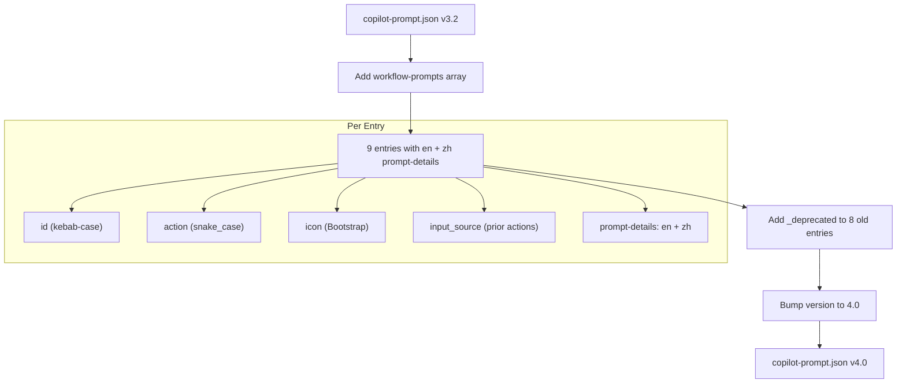

# Technical Design: Full Migration & i18n

> Feature ID: FEATURE-042-D | Epic ID: EPIC-042 | Version: v1.0 | Last Updated: 02-27-2026

---

## Part 1: Agent-Facing Summary

> **Purpose:** Quick reference for AI agents navigating large projects.
> **📌 AI Coders:** Focus on this section for implementation context.

### Key Components Implemented

| Component | Responsibility | Scope/Impact | Tags |
|-----------|----------------|--------------|------|
| `copilot-prompt.json` → `workflow-prompts` array | 9 workflow-prompt entries with `$output:tag$` syntax and bilingual `prompt-details` | Config — consumed by template resolver (FEATURE-042-A) | #workflow-prompts #migration #i18n #copilot-prompt |
| `copilot-prompt.json` → `_deprecated` markers | Deprecation fields on 8 old prompt entries in `ideation.prompts`, `workflow.prompts`, `feature.prompts` | Config — informational, no runtime effect | #deprecation #backward-compat |
| `copilot-prompt.json` → version bump | Increment version to `4.0` signaling full workflow-prompts migration complete | Config — metadata only | #version #migration-complete |

### Dependencies

| Dependency | Source | Design Link | Usage Description |
|------------|--------|-------------|-------------------|
| `workflow-prompts` schema | FEATURE-042-A | [specification.md](../FEATURE-042-A/specification.md) | Defines the `workflow-prompts` array structure, `$output:tag$`/`$feature-id$` variable syntax, and the template resolver that consumes entries |
| Conditional `<>` block parser | FEATURE-042-B | [specification.md](../FEATURE-042-B/specification.md) | Parses `<>` conditional blocks in command templates; 3 of the 9 entries use conditional blocks for optional context |
| Deliverable-default dropdowns | FEATURE-042-C | [specification.md](../FEATURE-042-C/specification.md) | Provides dropdown defaulting from `input_source` and read-only instructions preview that displays resolved commands |
| `workflow-template.json` | EPIC-041 | [workflow-template.json](../../../config/workflow-template.json) | Authoritative source for action keys (snake_case) and `action_context` refs — all `$output:tag$` variables must align |

### Major Flow

1. **Read** existing `copilot-prompt.json` (v3.2, 328 lines) — identify old prompt entries and their placeholders
2. **Create** `workflow-prompts` top-level array with 9 entries, each containing `id`, `action`, `icon`, `input_source`, and `prompt-details` with English + Chinese translations
3. **Map** old `<current-idea-file>`, `<input-file>`, `<feature-id>` placeholders → new `$output:tag$` / `$feature-id$` syntax per action's `action_context` refs
4. **Wrap** optional tags in `<>` conditional blocks (3 entries: `refine_idea`, `design_mockup`, `requirement_gathering`)
5. **Add** `"_deprecated"` field to 8 old entries mapping to their `workflow-prompts` replacement
6. **Bump** version from `3.2` → `4.0`

### Usage Example

```json
{
  "version": "4.0",
  "workflow-prompts": [
    {
      "id": "refine-idea",
      "action": "refine_idea",
      "icon": "bi-stars",
      "input_source": ["compose_idea"],
      "prompt-details": [
        {
          "language": "en",
          "label": "Refine Idea",
          "command": "refine the idea $output:raw-idea$ <and uiux reference: $output:uiux-reference$> with ideation skill"
        },
        {
          "language": "zh",
          "label": "完善创意",
          "command": "使用创意技能, 完善创意 $output:raw-idea$ <以及UIUX参考: $output:uiux-reference$>"
        }
      ]
    }
  ],
  "ideation": {
    "prompts": [
      {
        "id": "refine-idea",
        "_deprecated": "DEPRECATED: superseded by workflow-prompts[refine_idea]",
        "icon": "bi-stars",
        "input_source": ["compose_idea"],
        "prompt-details": [ "..." ]
      }
    ]
  }
}
```

---

## Part 2: Implementation Guide

> **Purpose:** Human-readable details for developers.

### Migration Overview Diagram



### Full Migration Table

All 9 actions with their prompt ID, tags, conditional blocks, English command, and Chinese command:

| # | Action Key | Prompt ID | Icon | input_source | Tags Used | Conditional Blocks |
|---|------------|-----------|------|--------------|-----------|-------------------|
| 1 | `refine_idea` | `refine-idea` | `bi-stars` | `["compose_idea"]` | `$output:raw-idea$`, `$output:uiux-reference$` | `<and uiux reference: $output:uiux-reference$>` |
| 2 | `design_mockup` | `design-mockup` | `bi-palette` | `["refine_idea", "compose_idea"]` | `$output:refined-idea$`, `$output:uiux-reference$` | `<and uiux reference: $output:uiux-reference$>` |
| 3 | `requirement_gathering` | `requirement-gathering` | `bi-clipboard-data` | `["refine_idea", "design_mockup"]` | `$output:refined-idea$`, `$output:mockup-html$` | `<mockup reference: $output:mockup-html$>` |
| 4 | `feature_breakdown` | `feature-breakdown` | `bi-diagram-2` | `["requirement_gathering"]` | `$output:requirement-doc$` | none |
| 5 | `feature_refinement` | `feature-refinement` | `bi-rulers` | `["feature_breakdown"]` | `$feature-id$`, `$output:requirement-doc$` | none |
| 6 | `technical_design` | `technical-design` | `bi-gear` | `["feature_refinement"]` | `$feature-id$`, `$output:specification$` | none |
| 7 | `test_generation` | `test-generation` | `bi-journal-code` | `["technical_design"]` | `$feature-id$`, `$output:tech-design$` | none |
| 8 | `implementation` | `implementation` | `bi-code-slash` | `["technical_design"]` | `$feature-id$`, `$output:tech-design$`, `$output:specification$` | none |
| 9 | `acceptance_testing` | `acceptance-testing` | `bi-check2-circle` | `["implementation"]` | `$feature-id$`, `$output:specification$` | none |

### English & Chinese Commands

| # | Action Key | English Command | Chinese Command |
|---|------------|----------------|-----------------|
| 1 | `refine_idea` | `refine the idea $output:raw-idea$ <and uiux reference: $output:uiux-reference$> with ideation skill` | `使用创意技能, 完善创意 $output:raw-idea$ <以及UIUX参考: $output:uiux-reference$>` |
| 2 | `design_mockup` | `Base on $output:refined-idea$ <and uiux reference: $output:uiux-reference$> to generate mockups` | `基于 $output:refined-idea$ <以及UIUX参考: $output:uiux-reference$> 生成原型设计` |
| 3 | `requirement_gathering` | `gather requirements from $output:refined-idea$ <mockup reference: $output:mockup-html$> with requirement gathering skill` | `使用需求收集技能, 从 $output:refined-idea$ <参考原型: $output:mockup-html$> 收集需求` |
| 4 | `feature_breakdown` | `break down features from $output:requirement-doc$ with feature breakdown skill` | `使用功能拆分技能, 从 $output:requirement-doc$ 拆分功能` |
| 5 | `feature_refinement` | `refine feature $feature-id$ from $output:requirement-doc$ with feature refinement skill` | `使用功能完善技能, 完善功能 $feature-id$, 基于 $output:requirement-doc$` |
| 6 | `technical_design` | `create technical design for $feature-id$ from $output:specification$ with technical design skill` | `使用技术设计技能, 为 $feature-id$ 创建技术设计, 基于 $output:specification$` |
| 7 | `test_generation` | `generate tests for $feature-id$ from $output:tech-design$ with test generation skill` | `使用测试生成技能, 为 $feature-id$ 生成测试, 基于 $output:tech-design$` |
| 8 | `implementation` | `implement $feature-id$ from $output:tech-design$ and $output:specification$ with code implementation skill` | `使用代码实现技能, 实现 $feature-id$, 基于 $output:tech-design$ 和 $output:specification$` |
| 9 | `acceptance_testing` | `run acceptance tests for $feature-id$ from $output:specification$ with feature acceptance test skill` | `使用验收测试技能, 为 $feature-id$ 运行验收测试, 基于 $output:specification$` |

### English & Chinese Labels

| # | Action Key | English Label | Chinese Label |
|---|------------|--------------|---------------|
| 1 | `refine_idea` | Refine Idea | 完善创意 |
| 2 | `design_mockup` | Generate Mockup | 生成原型 |
| 3 | `requirement_gathering` | Requirement Gathering | 需求收集 |
| 4 | `feature_breakdown` | Feature Breakdown | 功能拆分 |
| 5 | `feature_refinement` | Feature Refinement | 功能完善 |
| 6 | `technical_design` | Technical Design | 技术设计 |
| 7 | `test_generation` | Test Generation | 测试生成 |
| 8 | `implementation` | Implementation | 代码实现 |
| 9 | `acceptance_testing` | Acceptance Testing | 验收测试 |

### Deprecation Mapping

| Old Section | Old Prompt ID | `_deprecated` Value | Notes |
|-------------|---------------|---------------------|-------|
| `ideation.prompts` | `refine-idea` | `"DEPRECATED: superseded by workflow-prompts[refine_idea]"` | Old entry preserved for free-mode |
| `ideation.prompts` | `design-mockup` | `"DEPRECATED: superseded by workflow-prompts[design_mockup]"` | Old entry preserved for free-mode |
| `workflow.prompts` | `requirement-gathering` | `"DEPRECATED: superseded by workflow-prompts[requirement_gathering]"` | Old entry preserved for free-mode |
| `workflow.prompts` | `feature-breakdown` | `"DEPRECATED: superseded by workflow-prompts[feature_breakdown]"` | Old entry preserved for free-mode |
| `feature.prompts` | `feature-refinement` | `"DEPRECATED: superseded by workflow-prompts[feature_refinement]"` | Old entry preserved for free-mode |
| `feature.prompts` | `technical-design` | `"DEPRECATED: superseded by workflow-prompts[technical_design]"` | Old entry preserved for free-mode |
| `feature.prompts` | `implementation` | `"DEPRECATED: superseded by workflow-prompts[implementation]"` | Old entry preserved for free-mode |
| `feature.prompts` | `acceptance-testing` | `"DEPRECATED: superseded by workflow-prompts[acceptance_testing]"` | Old entry preserved for free-mode |
| — | — | — | `test_generation` is net-new; no old entry to deprecate |

### Complete `workflow-prompts` Array

The full JSON structure to add as a top-level array in `copilot-prompt.json`:

```json
"workflow-prompts": [
  {
    "id": "refine-idea",
    "action": "refine_idea",
    "icon": "bi-stars",
    "input_source": ["compose_idea"],
    "prompt-details": [
      {
        "language": "en",
        "label": "Refine Idea",
        "command": "refine the idea $output:raw-idea$ <and uiux reference: $output:uiux-reference$> with ideation skill"
      },
      {
        "language": "zh",
        "label": "完善创意",
        "command": "使用创意技能, 完善创意 $output:raw-idea$ <以及UIUX参考: $output:uiux-reference$>"
      }
    ]
  },
  {
    "id": "design-mockup",
    "action": "design_mockup",
    "icon": "bi-palette",
    "input_source": ["refine_idea", "compose_idea"],
    "prompt-details": [
      {
        "language": "en",
        "label": "Generate Mockup",
        "command": "Base on $output:refined-idea$ <and uiux reference: $output:uiux-reference$> to generate mockups"
      },
      {
        "language": "zh",
        "label": "生成原型",
        "command": "基于 $output:refined-idea$ <以及UIUX参考: $output:uiux-reference$> 生成原型设计"
      }
    ]
  },
  {
    "id": "requirement-gathering",
    "action": "requirement_gathering",
    "icon": "bi-clipboard-data",
    "input_source": ["refine_idea", "design_mockup"],
    "prompt-details": [
      {
        "language": "en",
        "label": "Requirement Gathering",
        "command": "gather requirements from $output:refined-idea$ <mockup reference: $output:mockup-html$> with requirement gathering skill"
      },
      {
        "language": "zh",
        "label": "需求收集",
        "command": "使用需求收集技能, 从 $output:refined-idea$ <参考原型: $output:mockup-html$> 收集需求"
      }
    ]
  },
  {
    "id": "feature-breakdown",
    "action": "feature_breakdown",
    "icon": "bi-diagram-2",
    "input_source": ["requirement_gathering"],
    "prompt-details": [
      {
        "language": "en",
        "label": "Feature Breakdown",
        "command": "break down features from $output:requirement-doc$ with feature breakdown skill"
      },
      {
        "language": "zh",
        "label": "功能拆分",
        "command": "使用功能拆分技能, 从 $output:requirement-doc$ 拆分功能"
      }
    ]
  },
  {
    "id": "feature-refinement",
    "action": "feature_refinement",
    "icon": "bi-rulers",
    "input_source": ["feature_breakdown"],
    "prompt-details": [
      {
        "language": "en",
        "label": "Feature Refinement",
        "command": "refine feature $feature-id$ from $output:requirement-doc$ with feature refinement skill"
      },
      {
        "language": "zh",
        "label": "功能完善",
        "command": "使用功能完善技能, 完善功能 $feature-id$, 基于 $output:requirement-doc$"
      }
    ]
  },
  {
    "id": "technical-design",
    "action": "technical_design",
    "icon": "bi-gear",
    "input_source": ["feature_refinement"],
    "prompt-details": [
      {
        "language": "en",
        "label": "Technical Design",
        "command": "create technical design for $feature-id$ from $output:specification$ with technical design skill"
      },
      {
        "language": "zh",
        "label": "技术设计",
        "command": "使用技术设计技能, 为 $feature-id$ 创建技术设计, 基于 $output:specification$"
      }
    ]
  },
  {
    "id": "test-generation",
    "action": "test_generation",
    "icon": "bi-journal-code",
    "input_source": ["technical_design"],
    "prompt-details": [
      {
        "language": "en",
        "label": "Test Generation",
        "command": "generate tests for $feature-id$ from $output:tech-design$ with test generation skill"
      },
      {
        "language": "zh",
        "label": "测试生成",
        "command": "使用测试生成技能, 为 $feature-id$ 生成测试, 基于 $output:tech-design$"
      }
    ]
  },
  {
    "id": "implementation",
    "action": "implementation",
    "icon": "bi-code-slash",
    "input_source": ["technical_design"],
    "prompt-details": [
      {
        "language": "en",
        "label": "Implementation",
        "command": "implement $feature-id$ from $output:tech-design$ and $output:specification$ with code implementation skill"
      },
      {
        "language": "zh",
        "label": "代码实现",
        "command": "使用代码实现技能, 实现 $feature-id$, 基于 $output:tech-design$ 和 $output:specification$"
      }
    ]
  },
  {
    "id": "acceptance-testing",
    "action": "acceptance_testing",
    "icon": "bi-check2-circle",
    "input_source": ["implementation"],
    "prompt-details": [
      {
        "language": "en",
        "label": "Acceptance Testing",
        "command": "run acceptance tests for $feature-id$ from $output:specification$ with feature acceptance test skill"
      },
      {
        "language": "zh",
        "label": "验收测试",
        "command": "使用验收测试技能, 为 $feature-id$ 运行验收测试, 基于 $output:specification$"
      }
    ]
  }
]
```

### Tag-to-Action-Context Alignment Verification

Cross-reference between `$output:tag$` variables used in commands and `action_context` refs defined in `workflow-template.json`:

| Action Key | Tag in Command | action_context Ref | Required? | Conditional Block? |
|------------|---------------|-------------------|-----------|-------------------|
| `refine_idea` | `$output:raw-idea$` | `raw-idea` | yes | no |
| `refine_idea` | `$output:uiux-reference$` | `uiux-reference` | no | yes — `<and uiux reference: ...>` |
| `design_mockup` | `$output:refined-idea$` | `refined-idea` | yes | no |
| `design_mockup` | `$output:uiux-reference$` | `uiux-reference` | no | yes — `<and uiux reference: ...>` |
| `requirement_gathering` | `$output:refined-idea$` | `refined-idea` | yes | no |
| `requirement_gathering` | `$output:mockup-html$` | `mockup-html` | no | yes — `<mockup reference: ...>` |
| `feature_breakdown` | `$output:requirement-doc$` | `requirement-doc` | yes | no |
| `feature_refinement` | `$feature-id$` | — (feature ID, not a deliverable) | yes | no |
| `feature_refinement` | `$output:requirement-doc$` | `requirement-doc` | yes | no |
| `technical_design` | `$feature-id$` | — | yes | no |
| `technical_design` | `$output:specification$` | `specification` | yes | no |
| `test_generation` | `$feature-id$` | — | yes | no |
| `test_generation` | `$output:tech-design$` | `tech-design` (not yet in workflow-template) | yes | no |
| `implementation` | `$feature-id$` | — | yes | no |
| `implementation` | `$output:tech-design$` | `tech-design` | yes | no |
| `implementation` | `$output:specification$` | `specification` | yes | no |
| `acceptance_testing` | `$feature-id$` | — | yes | no |
| `acceptance_testing` | `$output:specification$` | `specification` | yes | no |

> **Note:** `test_generation` is not currently defined in `workflow-template.json`. Its `action_context` will need to be added when the action is registered in the workflow template (out of scope for this feature per specification §Out of Scope).

### Implementation Steps

1. **Add `workflow-prompts` array** — Insert the complete 9-entry `"workflow-prompts"` array as a top-level key in `copilot-prompt.json`, positioned after `"version"` and before `"ideation"`. Use the exact JSON structure from the "Complete workflow-prompts Array" section above.

2. **Add Chinese translations** — All 9 entries already include both `"language": "en"` and `"language": "zh"` objects in `prompt-details`. Chinese translations follow existing style conventions:
   - Imperative verb first (使用, 基于, 完善, 收集, 拆分)
   - Comma-separated clauses
   - `$output:tag$` / `$feature-id$` variables embedded inline without translation
   - Conditional `<>` blocks use Chinese literal text (以及, 参考原型)

3. **Add deprecation markers** — For each of the 8 old entries listed in the Deprecation Mapping table, add a `"_deprecated"` field immediately after the `"id"` field. Format: `"_deprecated": "DEPRECATED: superseded by workflow-prompts[{action_key}]"`. Do NOT modify any other fields in the old entries.

4. **Bump version** — Change `"version": "3.2"` → `"version": "4.0"` to signify full workflow-prompts migration complete (final bump in EPIC-042 series).

5. **Verify backward compatibility** — Confirm:
   - `ideation.prompts`, `workflow.prompts`, `feature.prompts` content unchanged (only `_deprecated` field added)
   - `evaluation`, `placeholder` sections untouched
   - JSON parses without error
   - Free-mode prompts (e.g., `free-question`, `generate-architecture`, `idea-reflection`, `uiux-reference`) have no `_deprecated` field

### Deprecation Example

Before (old entry in `ideation.prompts`):
```json
{
  "id": "refine-idea",
  "icon": "bi-stars",
  "input_source": ["compose_idea"],
  "prompt-details": [...]
}
```

After (same entry with deprecation marker):
```json
{
  "id": "refine-idea",
  "_deprecated": "DEPRECATED: superseded by workflow-prompts[refine_idea]",
  "icon": "bi-stars",
  "input_source": ["compose_idea"],
  "prompt-details": [...]
}
```

### Edge Cases & Error Handling

| Scenario | Expected Behavior | Mitigation |
|----------|-------------------|------------|
| Action key mismatch (`refine-idea` vs `refine_idea`) | Template resolver fails to match prompt to action; modal shows no instructions | `action` field MUST use exact snake_case from `workflow-template.json` |
| Missing Chinese translation for an entry | Frontend falls back to English per BR-042-D.2 — functional but violates i18n requirement | Every entry MUST include both `en` and `zh` prompt-details |
| Inconsistent deprecation format | Automated scanners miss deprecated entries | ALL entries use exact format: `"DEPRECATED: superseded by workflow-prompts[{action_key}]"` |
| `test_generation` — no old entry exists | No deprecation needed; net-new entry in `workflow-prompts` only | Do NOT create a placeholder old entry for deprecation |
| Empty `command` field | Template resolver produces empty string; preview shows blank instructions | All `command` fields MUST be non-empty; validate before commit |
| Prompt ID collision between `workflow-prompts` and legacy sections | By design — IDs match. Modal determines which to use based on mode (workflow vs. free) | No mitigation needed; document that overlap is expected |
| Stale `input_source` after workflow changes | `input_source` is informational; `action_context` in `workflow-template.json` is authoritative | Update `input_source` when workflow pipeline changes |
| Chinese conditional block literal text | Chinese `<>` blocks must use natural Chinese phrasing, not word-for-word English translation | Review: `<以及UIUX参考: ...>` and `<参考原型: ...>` |
| Version bump conflict with other EPIC-042 features | Each feature may bump version; this is the final bump in the series | Set version to `4.0` as the migration-complete marker |
| JSON invalidity from `//` comments | JSON does not support comments | Use `"_deprecated"` JSON key, not `//` comments |

### Files Changed

| File | Change Type | Description |
|------|-------------|-------------|
| `src/x_ipe/resources/config/copilot-prompt.json` | Modified | Add `workflow-prompts` array (9 entries), `_deprecated` on 8 old entries, version bump to 4.0 |

No other files are modified. `workflow-template.json` is read-only reference.

---

## Design Change Log

| Date | Phase | Change Summary |
|------|-------|----------------|
| 02-27-2026 | Initial Design | Initial technical design for FEATURE-042-D: Full Migration & i18n. Defines all 9 workflow-prompt entries with bilingual commands, deprecation mapping for 8 old entries, and version bump strategy. |
