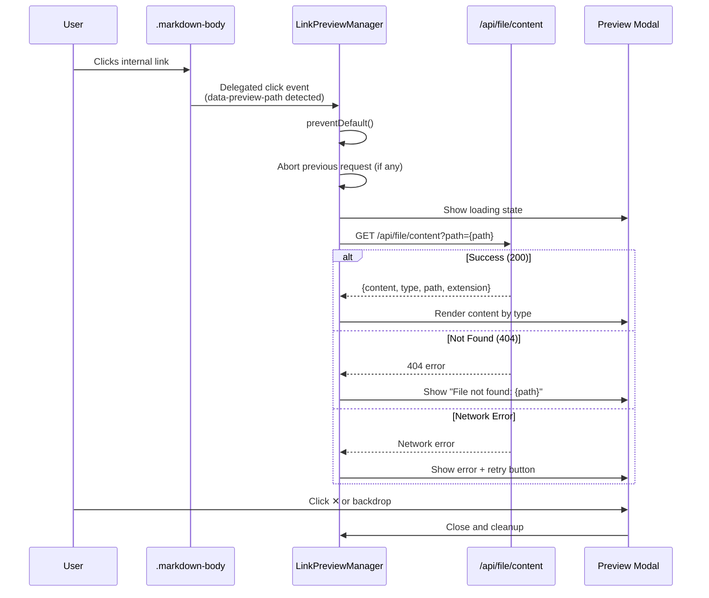
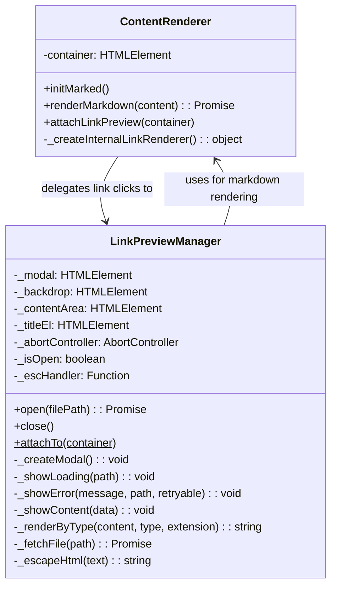

# Technical Design: Link Interception & Preview Modal

> Feature ID: FEATURE-043-A | Version: v1.0 | Last Updated: 2026-03-03

---

## Part 1: Agent-Facing Summary

> **Purpose:** Quick reference for AI agents navigating large projects.
> **📌 AI Coders:** Focus on this section for implementation context.

### Key Components Implemented

| Component | Responsibility | Scope/Impact | Tags |
|-----------|----------------|--------------|------|
| `LinkPreviewManager` | Intercept internal link clicks and display preview modal | New module: link detection, fetch, modal lifecycle | #link-preview #modal #content-renderer #frontend |
| `ContentRenderer.initMarked()` (extension) | Add custom link renderer for `data-preview-path` attribute | Modified: marked.js renderer extension | #content-renderer #marked-js #link-detection |
| `ContentRenderer.attachLinkPreview()` | Attach delegated click handler to `.markdown-body` containers | New method on existing class | #content-renderer #event-delegation |

### Dependencies

| Dependency | Source | Design Link | Usage Description |
|------------|--------|-------------|-------------------|
| `ContentRenderer` | FEATURE-002-A | content-renderer.js | Renders markdown in preview modal; extended with custom link renderer |
| `DeliverableViewer` (pattern) | FEATURE-038-C | deliverable-viewer.js | Modal DOM structure and CSS classes reused as pattern reference |
| `/api/file/content` | Foundation | main_routes.py | Fetches file content by path; returns `{content, type, path, extension}` |

### Scope & Boundaries

- **In scope:** Link interception via `data-preview-path`, modal display, error/loading states, AbortController
- **Out of scope:** Breadcrumb navigation (FEATURE-043-B), visual link distinction (FEATURE-043-B), skill updates (FEATURE-043-C)

### Major Flow

1. `ContentRenderer.initMarked()` configures custom link renderer → internal links get `data-preview-path` attribute
2. After any markdown render, `attachLinkPreview(container)` adds delegated click handler to `.markdown-body`
3. User clicks internal link → handler extracts path from `data-preview-path` → calls `LinkPreviewManager.open(path)`
4. `LinkPreviewManager` shows modal with loading state → fetches `GET /api/file/content?path={path}` → renders content
5. On error: shows inline error in modal. On abort: cancels pending request.

### Usage Example

```javascript
// ContentRenderer already initializes custom link renderer in initMarked()
// After rendering markdown, attach link preview to the container:
const renderer = new ContentRenderer('content-body');
await renderer.renderMarkdown(markdownContent);
// Link preview is auto-attached after renderMarkdown()

// Manual usage (for dynamically created containers):
LinkPreviewManager.attachTo(document.querySelector('.markdown-body'));

// Links in rendered markdown like:
//   <a href="x-ipe-docs/requirements/EPIC-043/specification.md" data-preview-path="x-ipe-docs/requirements/EPIC-043/specification.md">spec</a>
// will open in a preview modal on click.
```

---

## Part 2: Implementation Guide

> **Purpose:** Human-readable implementation details.

### Workflow Diagram



### Class Diagram



### File Structure

```
src/x_ipe/static/js/
├── core/
│   └── content-renderer.js          # MODIFIED: custom link renderer + attachLinkPreview()
├── features/
│   ├── deliverable-viewer.js         # UNCHANGED (pattern reference only)
│   └── link-preview-manager.js       # NEW: modal lifecycle + fetch + render
```

### Implementation Steps

#### Step 1: Create `LinkPreviewManager` class (`link-preview-manager.js`)

New file at `src/x_ipe/static/js/features/link-preview-manager.js`.

**Constructor:**
- No constructor arguments needed (singleton-like, manages its own modal)
- Initialize: `_modal = null`, `_backdrop = null`, `_contentArea = null`, `_titleEl = null`, `_abortController = null`, `_isOpen = false`, `_escHandler = null`

**`_createModal()` method:**
- Creates modal DOM matching DeliverableViewer pattern:
  ```
  <div class="link-preview-backdrop">
    <div class="link-preview-modal">
      <div class="link-preview-header">
        <span class="link-preview-title">{filename}</span>
        <span class="link-preview-close">✕</span>
      </div>
      <div class="link-preview-content"></div>
    </div>
  </div>
  ```
- Reuse existing CSS classes from `workflow.css` where possible (`.deliverable-preview-backdrop`, `.deliverable-preview`)
  OR add minimal new CSS classes if extending behavior (prefer reuse)
- Backdrop click → close (only if `e.target === backdrop`)
- Escape key → close (add `keydown` listener)
- Close button → close

**`open(filePath)` method:**
1. If modal doesn't exist, call `_createModal()` and append to `document.body`
2. Update title to filename (`filePath.split('/').pop()`)
3. Call `_showLoading(filePath)`
4. Show modal with animation (`requestAnimationFrame` → add `.active` class)
5. Call `_fetchFile(filePath)` → on success `_showContent(data)`, on error `_showError()`
6. Attach link interception inside modal's `.markdown-body` (enables FEATURE-043-B later)

**`_fetchFile(path)` method:**
1. Abort previous request: `if (this._abortController) this._abortController.abort()`
2. Create new AbortController: `this._abortController = new AbortController()`
3. `fetch(\`/api/file/content?path=\${encodeURIComponent(path)}\`, { signal: this._abortController.signal })`
4. Handle response:
   - 200 → parse JSON → return `{content, type, path, extension}`
   - 404 → throw with type `'not_found'`
   - Other → throw with type `'network'`
5. Catch `AbortError` silently (request was intentionally cancelled)

**`_showLoading(path)` method:**
- Set content area HTML to spinner + file path text below it
- Match mockup "⑤ Loading State" scenario

**`_showError(message, path, retryable)` method:**
- Set content area HTML to error message + path + hint text
- If `retryable`: add retry button with click handler calling `open(path)` again
- Match mockup "④ Error State" scenario

**`_showContent(data)` method:**
- Call `_renderByType(data.content, data.type, data.extension)` to get HTML
- Set content area innerHTML
- After render: attach link interception to any new `.markdown-body` inside modal

**`_renderByType(content, type, extension)` method:**
- If `type === 'markdown'`: wrap in `<div class="markdown-body">`, use `marked.parse(content)` with existing marked config
- If `type === 'html'`: render in sanitized container
- If `type === 'code'` or text: wrap in `<pre><code>` with syntax highlighting via hljs
- Binary detection (from API returning raw): show "Cannot preview binary file" message

**`close()` method:**
1. Remove `.active` class from backdrop
2. After transition: remove modal from DOM or hide
3. Abort any pending request
4. Reset state: `_isOpen = false`

**Static `attachTo(container)` method:**
- Add delegated click listener to `container`:
  ```javascript
  container.addEventListener('click', (e) => {
      const link = e.target.closest('a[data-preview-path]');
      if (!link) return;
      e.preventDefault();
      LinkPreviewManager.instance.open(link.getAttribute('data-preview-path'));
  });
  ```
- Use singleton pattern: `LinkPreviewManager.instance` created on first use

#### Step 2: Extend `ContentRenderer` (`content-renderer.js`)

**Modify `initMarked()` — add custom link renderer:**

After existing `marked.setOptions({...})`, add:

```javascript
const renderer = new marked.Renderer();
const originalLink = renderer.link.bind(renderer);
renderer.link = function(href, title, text) {
    if (href && (href.startsWith('x-ipe-docs/') || href.startsWith('.github/skills/'))) {
        const safeHref = href.replace(/"/g, '&quot;');
        const safeTitle = title ? ` title="${title.replace(/"/g, '&quot;')}"` : '';
        return `<a href="${safeHref}" data-preview-path="${safeHref}"${safeTitle}>${text}</a>`;
    }
    return originalLink(href, title, text);
};
marked.setOptions({ renderer });
```

**Add `attachLinkPreview(container)` method:**

```javascript
attachLinkPreview(container) {
    const markdownBody = container.querySelector('.markdown-body') || container;
    if (markdownBody._linkPreviewAttached) return; // prevent double-attach
    LinkPreviewManager.attachTo(markdownBody);
    markdownBody._linkPreviewAttached = true;
}
```

**Modify `renderMarkdown()` — auto-attach after render:**

After `this.container.innerHTML = \`<div class="markdown-body">\${html}</div>\``:

```javascript
this.attachLinkPreview(this.container);
```

#### Step 3: Add CSS for link preview modal

Add to `src/x_ipe/static/css/workflow.css` (alongside existing `.deliverable-preview-*` styles):

```css
/* Link Preview Modal — reuses deliverable-preview pattern */
.link-preview-backdrop { /* same as .deliverable-preview-backdrop */ }
.link-preview-modal { /* same as .deliverable-preview */ }
.link-preview-header { /* same as .preview-header */ }
.link-preview-close { /* same as .preview-close */ }
.link-preview-content { /* same as .preview-content */ }

/* Loading state */
.link-preview-loading { text-align: center; padding: 3rem; color: var(--text-secondary); }
.link-preview-loading .spinner { /* CSS spinner animation */ }

/* Error state */
.link-preview-error { text-align: center; padding: 3rem; }
.link-preview-error .error-path { font-family: monospace; color: var(--text-secondary); }
.link-preview-error .retry-btn { /* styled button */ }
```

Alternatively, reuse existing `.deliverable-preview-*` CSS classes directly to avoid duplication — the modal structure is identical.

#### Step 4: Register in HTML and init.js

**In `src/x_ipe/templates/index.html`** (or `base.html`):
```html
<script src="/static/js/features/link-preview-manager.js"></script>
```
Add BEFORE `init.js` script tag.

**In `src/x_ipe/static/js/init.js`** — no changes needed if LinkPreviewManager self-initializes via static singleton. ContentRenderer auto-attaches after `renderMarkdown()`.

### Edge Cases & Error Handling

| Scenario | Handling |
|----------|----------|
| Link href is `x-ipe-docs/` with no file path | API returns 404 → show "File not found" |
| Link has query params (`?line=5`) | Strip query string before fetch |
| Link inside `<code>` element | Not rendered as `<a data-preview-path>` by marked (code blocks use text, not HTML) — no interception |
| Link with anchor fragment (`#section`) | Strip fragment, fetch full file |
| Rapid clicks on different links | AbortController cancels previous, only last one loads |
| Modal open + click link behind modal | Backdrop prevents clicks on page content |
| File > 1MB | Render normally — browser handles large DOM |
| Server 500 error | Show "Failed to load file" with retry button |
| JS disabled | Links are standard `<a>` tags, navigate normally (progressive enhancement) |
| `data-preview-path` attribute manually removed by user | Click falls through to normal link behavior |

### Mockup Reference

Mockup: `mockups/file-link-preview-v1.html`

| Mockup Scenario | Component | Implementation |
|-----------------|-----------|----------------|
| ② Preview Modal | `LinkPreviewManager._createModal()` | Modal with header (filename + ✕), content area, backdrop |
| ④ Error State | `LinkPreviewManager._showError()` | Centered error icon, path display, hint text |
| ⑤ Loading State | `LinkPreviewManager._showLoading()` | Centered spinner, "Loading {path}..." text |

### Program Type & Tech Stack

```yaml
program_type: "frontend"
tech_stack: ["JavaScript/Vanilla", "HTML/CSS", "marked.js", "highlight.js"]
```

---

## Design Change Log

| Date | Phase | Change Summary |
|------|-------|----------------|
| 2026-03-03 | Initial Design | Initial technical design for FEATURE-043-A. New LinkPreviewManager module, ContentRenderer extension with custom link renderer and auto-attach, CSS additions to workflow.css. |
