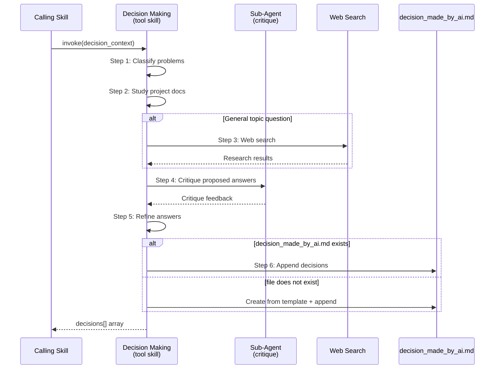

# [RETIRED by EPIC-047] Technical Design: Decision Making Tool Skill

> Feature ID: FEATURE-044-A | Version: v1.0 | Last Updated: 03-06-2026
> Status: **RETIRED** — Superseded by EPIC-047 (`x-ipe-dao-end-user-representative`)

> ⚠️ **RETIRED:** This technical design is superseded by EPIC-047 (DAO End-User Human Proxy Layer).
> See: [FEATURE-047-A technical-design](x-ipe-docs/requirements/EPIC-047/FEATURE-047-A/technical-design.md)

---

## Part 1: Agent-Facing Summary

> **Purpose:** Quick reference for AI agents navigating large projects.
> **📌 AI Coders:** Focus on this section for implementation context.

### Key Components Implemented

| Component | Responsibility | Scope/Impact | Tags |
|-----------|----------------|--------------|------|
| `SKILL.md` | Main skill definition with 6-step decision process | `.github/skills/x-ipe-tool-decision-making/SKILL.md` | #skill #tool #decision #auto-proceed |
| `decision-log-template.md` | Template for `decision_made_by_ai.md` audit log | `.github/skills/x-ipe-tool-decision-making/templates/decision-log-template.md` | #template #decision-log #audit |
| `decision-quality-guidelines.md` | Reference doc for decision quality criteria | `.github/skills/x-ipe-tool-decision-making/references/decision-quality-guidelines.md` | #reference #guidelines #quality |

### Dependencies

| Dependency | Source | Design Link | Usage Description |
|------------|--------|-------------|-------------------|
| Tool Skill Template | `x-ipe-meta-skill-creator` | [x-ipe-tool.md](.github/skills/x-ipe-meta-skill-creator/templates/x-ipe-tool.md) | Structural template for tool-skill SKILL.md |
| Sub-agent (explore) | Built-in | — | Used in Step 4 for critique |
| Web search | Built-in | — | Used in Step 3 for general research |

### Major Flow

1. Calling skill invokes `x-ipe-tool-decision-making` with `decision_context` (problems array)
2. Skill classifies problems → studies project context → optional web search → sub-agent critique → refines → records
3. Returns structured `decisions` array with status per problem
4. Appends all decisions to `x-ipe-docs/decision_made_by_ai.md`

### Usage Example

```yaml
# Calling skill invokes decision-making:
input:
  decision_context:
    calling_skill: "x-ipe-task-based-ideation-v2"
    task_id: "TASK-750"
    feature_id: "FEATURE-044-A"
    workflow_name: "epic-044"
    problems:
      - problem_id: "P1"
        description: "Two competing user personas found in uploaded files — which should be primary?"
        type: "question"
        options: ["Developer persona", "Designer persona"]
        related_files: ["x-ipe-docs/ideas/031/persona-dev.md", "x-ipe-docs/ideas/031/persona-design.md"]
      - problem_id: "P2"
        description: "Next actions suggested: Feature Refinement for A, Feature Refinement for B"
        type: "routing"
        options: ["FEATURE-044-A", "FEATURE-044-B"]
        related_files: []

# Skill returns:
output:
  decisions:
    - problem_id: "P1"
      status: "resolved"
      decision: "Developer persona is primary — 80% of requirements reference developer workflows"
      rationale: "Analyzed both persona files; developer persona aligns with 32 of 40 FRs"
    - problem_id: "P2"
      status: "resolved"
      decision: "FEATURE-044-A — it has no dependencies and is the MVP foundation"
      rationale: "Dependency graph shows A blocks B and C; starting with A unblocks the most work"
```

---

## Part 2: Implementation Guide

> **Purpose:** Human-readable details for implementation.

### File Structure

```
.github/skills/x-ipe-tool-decision-making/
├── SKILL.md                          # Main skill definition
├── templates/
│   └── decision-log-template.md      # Template for decision_made_by_ai.md
└── references/
    └── decision-quality-guidelines.md # Quality criteria for decisions
```

### Workflow Diagram



### SKILL.md Structure Design

The SKILL.md follows the tool-skill template with a single operation (`resolve_decisions`):

#### Frontmatter

```yaml
---
name: x-ipe-tool-decision-making
description: Autonomous decision-making for AI agents in auto-proceed mode. Resolves questions, conflicts, and routing decisions using 6-step process with sub-agent critique. Logs all decisions to decision_made_by_ai.md. Use when auto_proceed is "auto" and a decision point is reached. Triggers on "make decision", "resolve conflict", "choose route".
---
```

#### Input Parameters

```yaml
input:
  operation: "resolve_decisions"
  decision_context:
    calling_skill: "{skill name}"           # Required
    task_id: "{TASK-XXX}"                   # Required
    feature_id: "{FEATURE-XXX | N/A}"       # Optional, default: N/A
    workflow_name: "{name | N/A}"           # Required
    problems:                               # Required, non-empty array
      - problem_id: "P1"                   # Required, unique within array
        description: "{what needs to be decided}"  # Required
        type: "question | conflict | routing"      # Required enum
        options: ["option A", "option B"]          # Optional
        related_files: ["path1", "path2"]          # Optional
```

#### Input Validation Rules

```xml
<input_init>
  <field name="decision_context.calling_skill" source="calling skill provides its name">
    <validation>MUST be non-empty string. FAIL FAST if missing.</validation>
  </field>
  <field name="decision_context.task_id" source="calling skill provides current task ID">
    <validation>MUST be non-empty string. FAIL FAST if missing.</validation>
  </field>
  <field name="decision_context.feature_id" source="calling skill provides or N/A">
    <validation>Default: "N/A". Accept any string.</validation>
  </field>
  <field name="decision_context.workflow_name" source="calling skill provides or N/A">
    <validation>MUST be non-empty string. FAIL FAST if missing.</validation>
  </field>
  <field name="decision_context.problems" source="calling skill provides array">
    <validation>MUST be non-empty array. Each problem MUST have problem_id, description, type. Type MUST be one of: question, conflict, routing. FAIL FAST if invalid.</validation>
  </field>
</input_init>
```

#### Operation: resolve_decisions

```xml
<operation name="resolve_decisions">
  <step_1>
    <name>Identify & Classify</name>
    <action>
      1. Read all problems from decision_context.problems
      2. Classify each by type (question/conflict/routing)
      3. Identify quick-resolve candidates:
         - Routing with single option → auto-select
         - Questions with clear project-doc answer → fast-path
      4. Order: quick-resolve first, then complex problems
    </action>
    <output>Classified problem list with resolution strategy per problem</output>
  </step_1>

  <step_2>
    <name>Study Project Context</name>
    <action>
      FOR EACH problem:
      1. Read all files in problem.related_files (skip non-existent with warning)
      2. Read the calling skill's SKILL.md from .github/skills/{calling_skill}/SKILL.md
      3. IF feature_id != "N/A":
         - Read x-ipe-docs/requirements/EPIC-{nnn}/FEATURE-{nnn}-{X}/specification.md
         - Read x-ipe-docs/requirements/EPIC-{nnn}/FEATURE-{nnn}-{X}/technical-design.md (if exists)
      4. Scan x-ipe-docs/requirements/requirement-details-part-*.md for the EPIC section
      5. Formulate initial proposed answer/solution for each problem
    </action>
    <constraints>
      - Read at most 10 files per problem to bound context window usage
      - Skip binary files (images, PDFs) — only read text files
    </constraints>
    <output>Project context gathered, initial answers proposed</output>
  </step_2>

  <step_3>
    <name>Web Search (Optional)</name>
    <action>
      FOR EACH problem WHERE type == "question":
      1. Evaluate: is this a general knowledge question or project-specific?
         - General: industry standards, best practices, compliance, library usage
         - Project-specific: internal code, feature logic, config values → SKIP
      2. IF general:
         - Formulate 1-2 focused search queries
         - Execute web search
         - Extract relevant findings
         - Limit: max 3 searches per problem
      3. IF project-specific: skip, log "Skipped web search — project-specific question"
    </action>
    <constraints>
      - NEVER search for project-internal topics
      - Max 3 searches per problem, max 6 total across all problems
    </constraints>
    <output>Web research findings (if any) added to context</output>
  </step_3>

  <step_4>
    <name>Sub-Agent Critique</name>
    <action>
      FOR EACH problem (batch if related):
      1. Invoke sub-agent (explore or general-purpose) with prompt:
         "Critique this proposed decision:
          Problem: {description}
          Proposed answer: {from steps 1-3}
          Context: {key findings from project docs and web research}
          Task: Identify weaknesses, blind spots, missing considerations.
          Suggest improvements if any."
      2. Receive critique feedback
      3. If sub-agent unavailable: log warning, proceed without critique
    </action>
    <constraints>
      - Sub-agent prompt must be concise (< 500 words context)
      - If critique raises valid concerns, they MUST be addressed in Step 5
    </constraints>
    <output>Critique feedback per problem</output>
  </step_4>

  <step_5>
    <name>Refine Answers</name>
    <action>
      FOR EACH problem:
      1. Integrate critique feedback from Step 4
      2. If critique identified valid concerns:
         - Adjust proposed answer to address concerns
         - Document how concern was addressed in rationale
      3. If critique found no issues: confirm original answer
      4. Determine final status:
         - "resolved" if confident answer found
         - "unresolved" if no good answer despite full process
      5. For "unresolved": write best-effort analysis in decision field,
         explain why resolution failed in rationale, mark follow-up required
    </action>
    <output>Final decisions array with status, decision, rationale per problem</output>
  </step_5>

  <step_6>
    <name>Record Decisions</name>
    <action>
      1. Check if x-ipe-docs/decision_made_by_ai.md exists
         IF NOT: copy template from templates/decision-log-template.md to x-ipe-docs/decision_made_by_ai.md
      2. Read existing registry table to find highest D-{NNN} ID
      3. FOR EACH decision:
         a. Assign next Decision ID (D-{NNN+1}, D-{NNN+2}, ...)
         b. Append row to Decision Registry table
         c. Append detail section at end of file
      4. Return decisions array to calling skill
    </action>
    <constraints>
      - BLOCKING: Every decision MUST be logged — no silent decisions
      - Append-only: never modify existing entries
      - If concurrent write detected (ID collision): re-read, use next available ID
    </constraints>
    <output>Decisions recorded, decisions array returned to caller</output>
  </step_6>
</operation>
```

#### Output Result

```yaml
operation_output:
  success: true | false
  decisions:
    - problem_id: "P1"
      decision_id: "D-001"      # Assigned during Step 6
      status: "resolved | unresolved"
      decision: "{chosen answer/solution}"
      rationale: "{why this decision was made}"
    - problem_id: "P2"
      decision_id: "D-002"
      status: "resolved"
      decision: "{answer}"
      rationale: "{reasoning}"
  errors: []  # Any non-fatal warnings (missing files, search failures)
```

### Decision Log Template Design

File: `.github/skills/x-ipe-tool-decision-making/templates/decision-log-template.md`

```markdown
# AI Decision Log

> This file records all decisions made autonomously by AI agents during auto-proceed mode.
> Managed by: x-ipe-tool-decision-making skill
> Location: x-ipe-docs/decision_made_by_ai.md

## Decision Registry

| # | Date | Task ID | Feature ID | Skill | Workflow | Type | Status | Link |
|---|------|---------|------------|-------|----------|------|--------|------|

---

## Decision Details

<!-- New decisions are appended below this line -->
```

Each decision detail section follows this structure:

```markdown
### D-{NNN}: {Short Title}

| Field | Value |
|-------|-------|
| Date | YYYY-MM-DD HH:MM |
| Task ID | TASK-XXX |
| Feature ID | FEATURE-XXX or N/A |
| Calling Skill | {skill name} |
| Workflow | {workflow name or N/A} |
| Problem Type | question / conflict / routing |
| Status | ✅ Resolved / ⚠️ Unresolved |

**Problem:** {description}

**Context:** {files analyzed, key findings}

**Analysis:**
- Project docs: {findings from specification, technical design, requirements}
- Web research: {if applicable — key findings; or "N/A — project-specific question"}
- Critique: {sub-agent feedback and how it was addressed}

**Decision:** {the chosen answer/solution}

**Rationale:** {why this was chosen over alternatives}

**Follow-up Required:** No / Yes — {what human needs to review}
```

### Decision Quality Guidelines Design

File: `.github/skills/x-ipe-tool-decision-making/references/decision-quality-guidelines.md`

Content should cover:
1. **Good decision indicators:** Clear rationale, considers alternatives, addresses critique, consistent with existing patterns
2. **Bad decision indicators:** No rationale, ignores critique, contradicts existing requirements
3. **When to mark UNRESOLVED:** Conflicting hard constraints, insufficient context, security/compliance implications, irreversible architectural choices
4. **Routing decision heuristics:** Prefer features with no dependencies first, prefer MVP features, prefer features that unblock the most downstream work

### Implementation Steps

1. **Create folder structure:**
   ```
   .github/skills/x-ipe-tool-decision-making/
   ├── SKILL.md
   ├── templates/
   │   └── decision-log-template.md
   └── references/
       └── decision-quality-guidelines.md
   ```

2. **Write SKILL.md** following the tool-skill template:
   - Frontmatter with name and description
   - Purpose, Important Notes, About, When to Use
   - Input Parameters (as designed above)
   - Definition of Ready (decision_context provided, problems non-empty)
   - Operation: resolve_decisions (6 steps as designed)
   - Output Result
   - Definition of Done
   - Error Handling table

3. **Write decision-log-template.md** with registry table and detail section markers

4. **Write decision-quality-guidelines.md** with quality criteria and heuristics

### Edge Cases & Error Handling

| Scenario | Expected Behavior |
|----------|-------------------|
| Empty problems array | Fail fast: return `success: false, errors: ["problems array is empty"]` |
| Missing required field (calling_skill, task_id) | Fail fast with specific error message |
| Invalid problem type | Fail fast: "type must be question, conflict, or routing" |
| Related file does not exist | Skip with warning in errors array, continue |
| Sub-agent unavailable | Proceed without critique (Step 4 skipped), log warning |
| Web search fails | Proceed without web context, log warning |
| Decision log file missing | Create from template, then append |
| ID collision (concurrent write) | Re-read registry, use next available ID |
| All problems unresolvable | Return all as "unresolved", success: true (valid outcome) |

---

## Design Change Log

| Date | Phase | Change Summary |
|------|-------|----------------|
| 03-04-2026 | Initial Design | Initial technical design for x-ipe-tool-decision-making skill |
