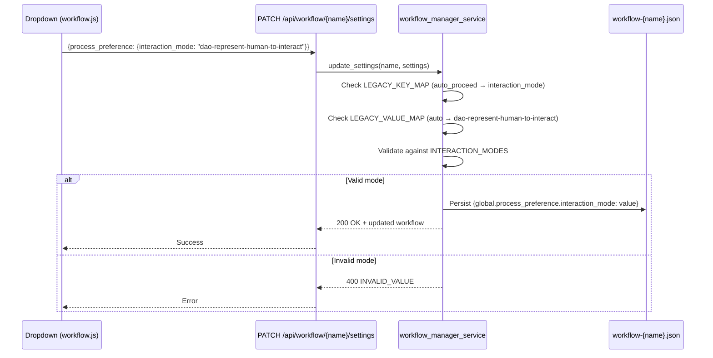
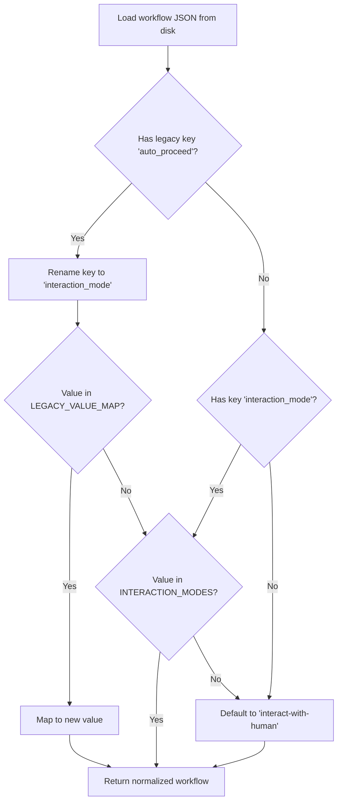

# Technical Design: Workflow Interaction Mode — Template & Backend API

> Feature ID: FEATURE-044-E | Version: v1.0 | Last Updated: 03-09-2026

---

## Part 1: Agent-Facing Summary

> **Purpose:** Quick reference for AI agents navigating large projects.
> **📌 AI Coders:** Focus on this section for implementation context.

### Key Components Implemented

| Component | Responsibility | Scope/Impact | Tags |
|-----------|----------------|--------------|------|
| `INTERACTION_MODES` | Valid enum values constant | Backend validation, used by all consumers | #interaction-mode #enum #validation |
| `LEGACY_VALUE_MAP` | Maps old enum values → new | Backward compat on API write | #migration #backward-compat |
| `LEGACY_KEY_MAP` | Maps old key name → new | Backward compat for key rename | #migration #backward-compat |
| `update_settings()` | Validates + persists interaction mode | `workflow_manager_service.py` | #api #persistence #settings |
| `_migrate_interaction_mode()` | Auto-migrates legacy values on read | Called when loading workflow JSON | #migration #read-path |
| `_loadInteractionMode()` | Reads mode from workflow instance | `action-execution-modal.js` | #frontend #cli-flag |
| `_buildExecutionFlag()` | Generates `--interaction@{mode}` flag | `action-execution-modal.js` | #frontend #cli-flag |
| Dropdown (Interaction Mode) | Renders mode selector with labels | `workflow.js` panel header | #frontend #ui #dropdown |

### Dependencies

| Dependency | Source | Design Link | Usage Description |
|------------|--------|-------------|-------------------|
| `workflow_manager_service.py` | FEATURE-044-E | This document | Core service — validates and persists interaction mode |
| `workflow_routes.py` | FEATURE-044-E | This document | API route — no changes needed (delegates to service) |
| `workflow.js` | FEATURE-044-F | x-ipe-docs/requirements/EPIC-044/FEATURE-044-F/ | Dropdown UI renders enum values and calls API |
| `action-execution-modal.js` | FEATURE-044-D | x-ipe-docs/requirements/EPIC-044/FEATURE-044-D/ | Reads mode for CLI flag generation |
| 19 SKILL.md files | FEATURE-044-C | x-ipe-docs/requirements/EPIC-044/FEATURE-044-C/ | Reference `interaction_mode` in conditional blocks |
| `copilot-instructions.md` | Foundation | .github/copilot-instructions.md | Agent instructions reference enum values |

### Major Flow

1. **Write path (API):** Frontend dropdown → `PATCH /api/workflow/{name}/settings` → `update_settings()` → validate against `INTERACTION_MODES` (with `LEGACY_VALUE_MAP` fallback) → persist to `workflow-{name}.json`
2. **Read path (load):** Load `workflow-{name}.json` → `_migrate_interaction_mode()` checks for legacy key/values → normalize to new key + values → return to caller
3. **CLI flag path:** Action modal → `_loadInteractionMode()` reads from instance → `_buildExecutionFlag()` generates `--interaction@{mode}` string

### Usage Example

```python
# Backend — update_settings with new value
service.update_settings("my-workflow", {
    "process_preference": {
        "interaction_mode": "dao-represent-human-to-interact"
    }
})

# Backend — update_settings with legacy value (auto-migrated)
service.update_settings("my-workflow", {
    "process_preference": {
        "auto_proceed": "auto"  # migrated to interaction_mode: dao-represent-human-to-interact
    }
})
```

```javascript
// Frontend — CLI flag generation
const mode = this._loadInteractionMode();
// mode = "dao-represent-human-to-interact"
const flag = this._buildExecutionFlag();
// flag = " --interaction@dao-represent-human-to-interact"
```

---

## Part 2: Implementation Guide

> **Purpose:** Detailed guide for developers implementing CR-002.
> **📌 Emphasis on visual diagrams and step-by-step guidance.

### Workflow Diagram





### Constants Definition

```python
# workflow_manager_service.py — module-level constants

INTERACTION_MODES = (
    "interact-with-human",
    "dao-represent-human-to-interact",
    "dao-represent-human-to-interact-for-questions-in-skill",
)

LEGACY_VALUE_MAP = {
    "manual": "interact-with-human",
    "auto": "dao-represent-human-to-interact",
    "stop_for_question": "dao-represent-human-to-interact-for-questions-in-skill",
}

LEGACY_KEY = "auto_proceed"
NEW_KEY = "interaction_mode"
```

### Backend Changes — `workflow_manager_service.py`

**File:** `src/x_ipe/services/workflow_manager_service.py`

**Change 1: Add constants** (module-level, after imports)
- Add `INTERACTION_MODES`, `LEGACY_VALUE_MAP`, `LEGACY_KEY`, `NEW_KEY` as shown above

**Change 2: Update `update_settings()` method** (lines ~278-300)
- Replace `valid_modes = ("manual", "auto", "stop_for_question")` with migration logic:

```python
def update_settings(self, name: str, settings: dict) -> dict:
    workflow = self._load_workflow(name)
    if not workflow:
        return {"error": "NOT_FOUND", "message": f"Workflow '{name}' not found"}

    if "process_preference" in settings:
        pref = settings["process_preference"]

        # Key migration: auto_proceed → interaction_mode
        if LEGACY_KEY in pref and NEW_KEY not in pref:
            pref[NEW_KEY] = pref.pop(LEGACY_KEY)
        elif LEGACY_KEY in pref and NEW_KEY in pref:
            pref.pop(LEGACY_KEY)  # interaction_mode takes precedence

        if NEW_KEY in pref:
            mode = pref[NEW_KEY]
            # Value migration: legacy → new
            mode = LEGACY_VALUE_MAP.get(mode, mode)
            if mode not in INTERACTION_MODES:
                return {
                    "error": "INVALID_VALUE",
                    "message": f"Invalid interaction_mode: '{pref[NEW_KEY]}'. "
                               f"Valid: {', '.join(INTERACTION_MODES)}"
                }
            pref[NEW_KEY] = mode

        workflow["global"]["process_preference"] = {
            **workflow["global"].get("process_preference", {}),
            **pref
        }
        # Remove legacy key from persisted data
        workflow["global"]["process_preference"].pop(LEGACY_KEY, None)

    workflow["last_activity"] = self._now_iso()
    self._save_workflow(name, workflow)
    return workflow
```

**Change 3: Add `_migrate_interaction_mode()` helper** (called in `_load_workflow`)

```python
def _migrate_interaction_mode(self, workflow: dict) -> dict:
    """Auto-migrate legacy auto_proceed key/values to interaction_mode on read."""
    pref = workflow.get("global", {}).get("process_preference", {})
    if LEGACY_KEY in pref:
        value = pref.pop(LEGACY_KEY)
        value = LEGACY_VALUE_MAP.get(value, value)
        pref[NEW_KEY] = value
    elif NEW_KEY in pref:
        pref[NEW_KEY] = LEGACY_VALUE_MAP.get(pref[NEW_KEY], pref[NEW_KEY])
    else:
        pref[NEW_KEY] = "interact-with-human"
    return workflow
```

### Frontend Changes — `action-execution-modal.js`

**File:** `src/x_ipe/static/js/features/action-execution-modal.js`

**Change 1: Rename `_loadAutoProceed()` → `_loadInteractionMode()`** (line ~148)

```javascript
_loadInteractionMode() {
    const pref = this._instance?.global?.process_preference || {};
    this._interactionMode = pref.interaction_mode || pref.auto_proceed || 'interact-with-human';
    // Migrate legacy values
    const legacyMap = {
        'manual': 'interact-with-human',
        'auto': 'dao-represent-human-to-interact',
        'stop_for_question': 'dao-represent-human-to-interact-for-questions-in-skill'
    };
    if (legacyMap[this._interactionMode]) {
        this._interactionMode = legacyMap[this._interactionMode];
    }
}
```

**Change 2: Update `_buildExecutionFlag()`** (line ~155)

```javascript
_buildExecutionFlag() {
    if (this._interactionMode === 'interact-with-human') return '';
    return ` --interaction@${this._interactionMode}`;
}
```

**Change 3: Update all internal references** from `this._autoProceed` → `this._interactionMode`

### Frontend Changes — `workflow.js`

**File:** `src/x_ipe/static/js/features/workflow.js`

**Change 1: Update dropdown options** (lines ~116-155)

```javascript
const modeOptions = [
    { value: 'interact-with-human', label: '👤 Human Direct', badge: 'secondary' },
    { value: 'dao-represent-human-to-interact', label: '🤖 DAO Represents Human', badge: 'success' },
    { value: 'dao-represent-human-to-interact-for-questions-in-skill', label: '🤖⚡ DAO Inner-Skill Only', badge: 'warning' }
];
```

**Change 2: Add "Interaction Mode" label** above/beside the dropdown element

**Change 3: Update API call key** — send `interaction_mode` instead of `auto_proceed`:
```javascript
fetch(`/api/workflow/${name}/settings`, {
    method: 'PATCH',
    body: JSON.stringify({
        process_preference: { interaction_mode: selectedMode }
    })
});
```

### Template File Changes

**Files:**
- `x-ipe-docs/config/workflow-template.json`
- `src/x_ipe/resources/config/workflow-template.json`

**Change:** Replace key and default value:
```json
{
  "global": {
    "process_preference": {
      "interaction_mode": "interact-with-human"
    }
  }
}
```

### Skill Files Bulk Update

**Scope:** 19 task-based SKILL.md files + orchestrator + DAO skill + copilot-instructions.md

**Strategy:** Scripted find-replace (not manual) to avoid human error:

| Find | Replace |
|------|---------|
| `auto_proceed` | `interaction_mode` |
| `"manual"` (in enum context) | `"interact-with-human"` |
| `"auto"` (in enum context) | `"dao-represent-human-to-interact"` |
| `"stop_for_question"` | `"dao-represent-human-to-interact-for-questions-in-skill"` |

**CRITICAL:** Context-aware replacement — `"auto"` appears in other contexts (e.g., `auto-detect`). Use targeted patterns that match only the `process_preference` enum context.

### Implementation Steps

1. **Backend constants:** Add `INTERACTION_MODES`, `LEGACY_VALUE_MAP`, `LEGACY_KEY`, `NEW_KEY` to `workflow_manager_service.py`
2. **Backend migration:** Add `_migrate_interaction_mode()` method, integrate into `_load_workflow()`
3. **Backend validation:** Update `update_settings()` with key migration + value migration + new validation
4. **Template files:** Update both `workflow-template.json` files
5. **Frontend modal:** Rename `_loadAutoProceed` → `_loadInteractionMode`, update `_buildExecutionFlag`, add legacy map
6. **Frontend dropdown:** Update `workflow.js` options, labels, API call key, add "Interaction Mode" label
7. **Python tests:** Update `test_workflow_settings.py` — new enum values + add migration tests
8. **JS tests:** Update all workflow/modal test files with new values
9. **Skills bulk update:** Script replace across 19 SKILL.md + orchestrator + DAO + copilot-instructions
10. **Resource templates:** Update `src/x_ipe/resources/` instruction templates

### Edge Cases & Error Handling

| Scenario | Handling |
|----------|----------|
| API receives `auto_proceed: "auto"` | Key migrated → value migrated → persisted as `interaction_mode: "dao-represent-human-to-interact"` |
| API receives both `auto_proceed` and `interaction_mode` | `interaction_mode` wins, `auto_proceed` discarded |
| API receives `interaction_mode: "turbo"` | HTTP 400: `INVALID_VALUE` with list of valid modes |
| Workflow JSON has legacy `auto_proceed` key | `_migrate_interaction_mode()` normalizes on read |
| Frontend reads old JSON without `interaction_mode` | Fallback chain: `interaction_mode` → `auto_proceed` → `"interact-with-human"` |
| Empty `process_preference` in request | No-op for interaction mode (preserve existing value) |

### Test Strategy

| Category | File | Changes |
|----------|------|---------|
| Backend validation | `tests/test_workflow_settings.py` | Update all `auto_proceed` refs to `interaction_mode`, update enum values, add 4 migration tests |
| Frontend dropdown | `tests/frontend-js/workflow-panel-actions.test.js` | Update mode values and labels |
| Frontend modal | `tests/frontend-js/action-execution-modal.test.js` | Update method name, flag format, enum values |
| Migration tests (NEW) | `tests/test_workflow_settings.py` | Test legacy key migration, legacy value migration, mixed key handling |

---

## Design Change Log

| Date | Phase | Change Summary |
|------|-------|----------------|
| 03-09-2026 | Initial Design | Technical design for CR-002 interaction mode rename. Covers backend migration, frontend updates, skill bulk update, and test strategy. |
