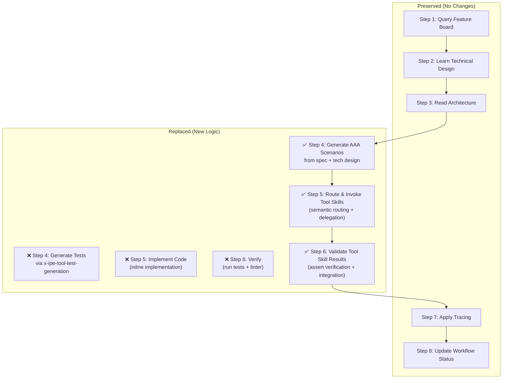
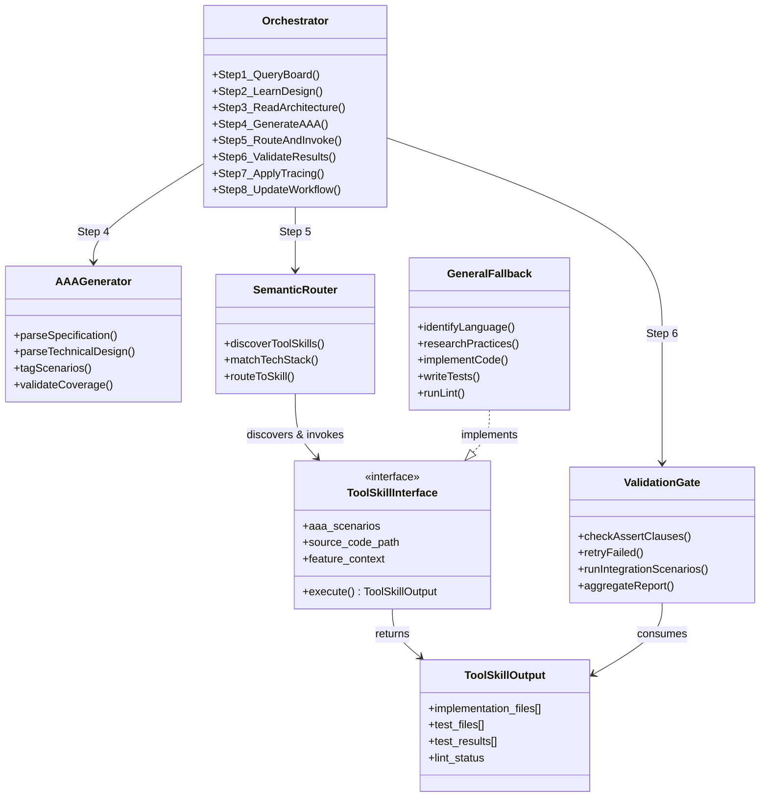
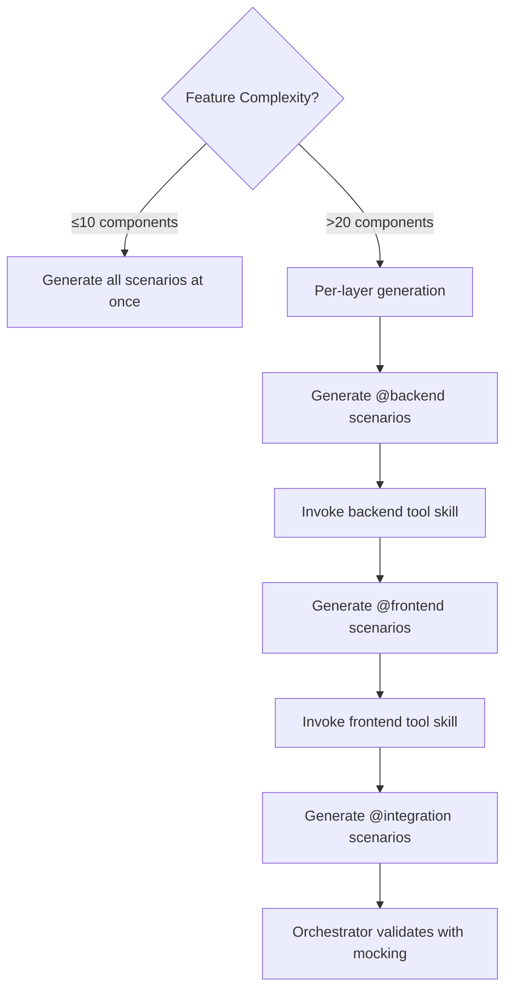
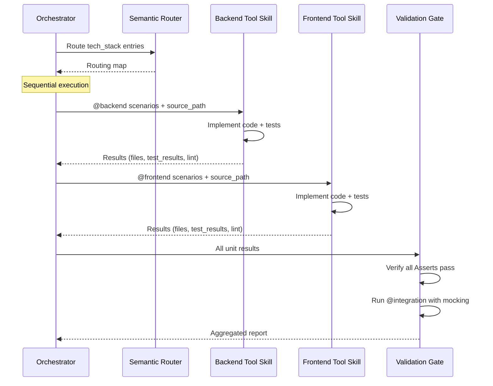
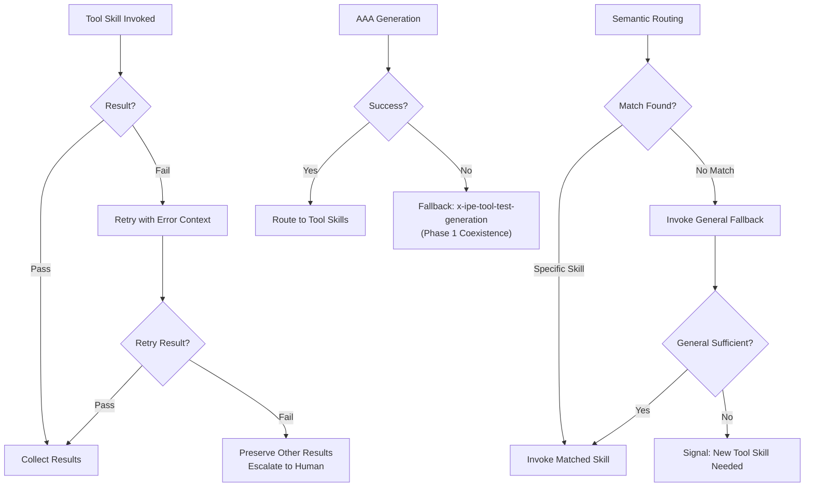

# Technical Design: Orchestrator Core + AAA Generator + General Fallback

> Feature ID: FEATURE-045-A | Version: v1.0 | Last Updated: 03-05-2026

> Specification: [specification.md](x-ipe-docs/requirements/EPIC-045/FEATURE-045-A/specification.md)

---

## Part 1: Agent-Facing Summary

> **Purpose:** Quick reference for AI agents navigating the implementation.
> **📌 AI Coders:** Focus on this section for implementation context.

### Key Components Implemented

| Component | Responsibility | Scope/Impact | Tags |
|-----------|----------------|--------------|------|
| Orchestrator SKILL.md (refactored) | Coordinate implementation workflow: generate AAA scenarios, route to tool skills, validate results | `.github/skills/x-ipe-task-based-code-implementation/SKILL.md` — Steps 4-6 replaced | #orchestrator #implementation #workflow #skills |
| AAA Scenario Generator | Generate language-agnostic test scenarios from spec + technical design | New Step 4 in orchestrator — embedded procedure, not a separate file | #aaa #test-scenarios #generation #tdd |
| Semantic Tool Router | Discover and match `tech_stack` entries to `x-ipe-tool-implementation-*` skills | New Step 5 sub-procedure in orchestrator | #routing #semantic #discovery #tool-skills |
| Validation Gate | Verify all tool skill Assert clauses pass, run integration scenarios | New Step 6 in orchestrator | #validation #integration #verification |
| General Fallback Tool Skill | Handle any unmapped tech stack with research-driven implementation | `.github/skills/x-ipe-tool-implementation-general/SKILL.md` — new file | #fallback #general #tool-skill |
| Implementation Guidelines (updated) | Updated references for new step structure | `.github/skills/x-ipe-task-based-code-implementation/references/implementation-guidelines.md` | #guidelines #reference |

### Dependencies

| Dependency | Source | Design Link | Usage Description |
|------------|--------|-------------|-------------------|
| Current code-implementation SKILL.md | Existing | [SKILL.md](.github/skills/x-ipe-task-based-code-implementation/SKILL.md) | Base file being refactored — Steps 1-3, 7-8 preserved |
| x-ipe-tool-test-generation | Existing | [SKILL.md](.github/skills/x-ipe-tool-test-generation/SKILL.md) | Phase 1 fallback when AAA generation fails |
| x-ipe+feature+feature-board-management | Existing | [SKILL.md](.github/skills/x-ipe+feature+feature-board-management/SKILL.md) | Queried in Step 1 for Feature Data Model (unchanged) |
| x-ipe-meta-skill-creator | Existing | [SKILL.md](.github/skills/x-ipe-meta-skill-creator/SKILL.md) | Special-case delegation for `program_type: skills` |
| mcp-builder | Existing | [SKILL.md](.github/skills/mcp-builder/SKILL.md) | Delegation for MCP server features until FEATURE-045-E |

### Major Flow

1. Steps 1-3 **unchanged**: Query Feature Board → Learn Technical Design → Read Architecture
2. **Step 4 (NEW):** Generate AAA scenarios from specification + technical design using mapping algorithm
3. **Step 5 (NEW):** Scan `.github/skills/x-ipe-tool-implementation-*/` → semantic match `tech_stack` → invoke matched tool skills sequentially with AAA scenarios + source paths
4. **Step 6 (NEW):** Validate all Assert clauses pass → run `@integration` scenarios with mocking → aggregate results
5. Steps 7-8 **unchanged**: Apply Tracing → Update Workflow Status

### Usage Example

```yaml
# Orchestrator receives a fullstack feature with tech_stack: ["Python/Flask", "HTML/CSS/JavaScript"]

# Step 4 output — AAA Scenarios:
@backend
Test Scenario: Create a new project via API
  Arrange:
    - User is authenticated with valid credentials
    - No project with name "Test Project" exists
  Act:
    - Send POST /api/projects with body { name: "Test Project" }
  Assert:
    - Response status is 201
    - Response body contains new project ID

@frontend
Test Scenario: Display project creation form
  Arrange:
    - User is on the projects page
  Act:
    - User clicks "New Project" button
  Assert:
    - Form appears with fields: name, description
    - "Create" button is disabled until name has content

@integration
Test Scenario: End-to-end project creation
  Arrange:
    - User is on the projects page
    - Backend API is mocked
  Act:
    - User fills in "Test Project" and clicks Create
  Assert:
    - Project appears in the list
    - Mock backend received correct POST request

# Step 5 — Routing:
# "Python/Flask" → x-ipe-tool-implementation-python (passes @backend scenarios)
# "HTML/CSS/JavaScript" → x-ipe-tool-implementation-html5 (passes @frontend scenarios)
# @integration scenarios → handled by orchestrator after unit skills complete

# Step 6 — Validation:
# Verify: all @backend Asserts pass, all @frontend Asserts pass
# Run: @integration scenarios with mocking
# Result: aggregated pass/fail report
```

---

## Part 2: Implementation Guide

> **Purpose:** Detailed guide for the implementing agent.
> **📌 Emphasis on what to change in each file and how the pieces connect.

### Orchestrator Refactoring Overview

The refactoring modifies `.github/skills/x-ipe-task-based-code-implementation/SKILL.md`. The following diagram shows what changes:



### File Changes

| File | Action | Scope |
|------|--------|-------|
| `.github/skills/x-ipe-task-based-code-implementation/SKILL.md` | **Modify** | Replace Steps 4-6, update Execution Flow table, update DoR/DoD, update Output Result |
| `.github/skills/x-ipe-task-based-code-implementation/references/implementation-guidelines.md` | **Modify** | Update step references from old Steps 4-6 to new Steps 4-6 |
| `.github/skills/x-ipe-tool-implementation-general/SKILL.md` | **Create** | New tool skill file (~200-250 lines) |

### Component Relationship Diagram



### Step 4: AAA Scenario Generation — Detailed Design

#### AAA Format Specification

Each scenario follows this YAML-like structure:

```yaml
@{layer_tag}
Test Scenario: {descriptive_name}
  Arrange:
    - {precondition_1}
    - {precondition_2}
  Act:
    - {action_performed}
  Assert:
    - {expected_outcome_1}
    - {expected_outcome_2}
```

**Layer tags:**
- `@backend` — Unit-level: individual functions, methods, endpoints in isolation
- `@frontend` — Unit-level: individual components, event handlers, DOM behavior
- `@integration` — Functional-level: cross-layer workflows with mocking

#### Generation Algorithm (Step-by-Step Procedure in SKILL.md)

The orchestrator MUST follow this procedure to derive AAA scenarios:

```
PROCEDURE: Generate AAA Scenarios

INPUT: specification.md, technical-design.md
OUTPUT: List of tagged AAA scenarios

1. PARSE specification.md:
   a. Extract each acceptance criterion → create one @integration scenario per AC
      - Arrange = preconditions from AC context
      - Act = user action described in AC
      - Assert = expected outcome from AC

2. PARSE technical-design.md Part 2:
   a. Extract API endpoints / service methods:
      - For each endpoint → create @backend happy-path scenario
        Arrange: valid input state
        Act: call the endpoint/method
        Assert: expected successful response
      - For each endpoint → create @backend error-path scenario
        Arrange: invalid input / error condition
        Act: call the endpoint/method
        Assert: expected error response

   b. Extract UI components / event handlers:
      - For each component → create @frontend happy-path scenario
        Arrange: component rendered with valid state
        Act: user interaction (click, input, etc.)
        Assert: expected UI change
      - For each component → create @frontend error-path scenario
        Arrange: component in error/edge state
        Act: user interaction
        Assert: expected error display / graceful handling

   c. Extract data models / validation rules:
      - For each validation rule → create @backend validation scenario
        Arrange: input with boundary/invalid values
        Act: submit to validation
        Assert: validation passes or returns specific error

   d. Extract error conditions / edge cases from design:
      - For each → create scenario in matching layer

3. TAG each scenario with @backend, @frontend, or @integration

4. VALIDATE coverage:
   - Every AC has ≥1 scenario
   - Every endpoint/component has both happy + sad path
   - Log coverage summary

5. IF context is large (>20 components):
   - Generate per-layer: all @backend first, then @frontend
   - Pass each batch to tool skills before generating next batch
```

#### Context Budget Strategy



### Step 5: Semantic Routing & Tool Skill Invocation — Detailed Design

#### Discovery Procedure

```
PROCEDURE: Discover and Route Tool Skills

INPUT: tech_stack array from technical design
OUTPUT: Mapping of tech_stack_entry → tool_skill_name

1. SCAN .github/skills/x-ipe-tool-implementation-*/ directories
2. FOR EACH discovered skill:
   - Read SKILL.md frontmatter (name, description)
   - Note what languages/frameworks it covers
3. FOR EACH entry in tech_stack:
   - Use LLM semantic understanding to match entry to a discovered skill
   - Example mappings:
     "Python/Flask" → x-ipe-tool-implementation-python
     "HTML/CSS/JavaScript" → x-ipe-tool-implementation-html5
     "TypeScript/React" → x-ipe-tool-implementation-typescript
     "Java/Spring Boot" → x-ipe-tool-implementation-java
     "MCP Server" → x-ipe-tool-implementation-mcp
   - IF no match: assign x-ipe-tool-implementation-general
   - IF general insufficient: signal human
4. OUTPUT: routing map
```

#### Tool Skill Invocation Contract

```yaml
# Orchestrator → Tool Skill (input)
tool_skill_input:
  aaa_scenarios:    # Filtered by layer tag matching this tool skill
    - scenario_text: |
        @backend
        Test Scenario: Create project via API
          Arrange: ...
          Act: ...
          Assert: ...
  source_code_path: "src/my_app/"          # From technical design
  test_code_path: "tests/"                  # From technical design
  feature_context:
    feature_id: "FEATURE-XXX-X"
    feature_title: "..."
    technical_design_link: "x-ipe-docs/requirements/EPIC-XXX/FEATURE-XXX-X/technical-design.md"
    specification_link: "x-ipe-docs/requirements/EPIC-XXX/FEATURE-XXX-X/specification.md"

# Tool Skill → Orchestrator (output)
tool_skill_output:
  implementation_files:
    - "src/my_app/projects/service.py"
    - "src/my_app/projects/routes.py"
  test_files:
    - "tests/test_projects_service.py"
  test_results:
    - scenario: "Create project via API"
      assert_clause: "Response status is 201"
      status: "pass"
    - scenario: "Create project via API"
      assert_clause: "Response body contains new project ID"
      status: "pass"
  lint_status: "pass"
  lint_details: ""
```

#### Sequential Invocation Flow



#### Special-Case Delegations (Preserved)

These delegations from the current SKILL.md are **preserved unchanged** in Step 5:

| Condition | Delegation Target | Behavior |
|-----------|-------------------|----------|
| `program_type: skills` | `x-ipe-meta-skill-creator` | Skip AAA generation; delegate entire implementation to skill creator |
| MCP server detected in spec/design | `mcp-builder` | Skip AAA generation; delegate to mcp-builder (until FEATURE-045-E) |

Detection logic for these special cases runs **before** semantic routing. If triggered, the orchestrator bypasses Steps 4-6 and delegates directly.

### Step 6: Validation Gate — Detailed Design

```
PROCEDURE: Validate Tool Skill Results

INPUT: All tool skill outputs, @integration AAA scenarios
OUTPUT: Aggregated validation report

1. FOR EACH tool skill output:
   a. Check test_results: count pass/fail per Assert clause
   b. Check lint_status: must be "pass"
   c. IF any Assert fails → mark tool skill as "needs retry"

2. IF any tool skill needs retry:
   a. Re-invoke ONLY the failed tool skill with:
      - Original AAA scenarios
      - Error context from first attempt
   b. IF retry succeeds → continue
   c. IF retry fails → report to human (preserve passing results)

3. AFTER all unit-level tool skills pass:
   a. Run @integration scenarios:
      - These test cross-layer behavior
      - Use mocking/simulation (not real browser)
      - Orchestrator describes integration test approach
   b. IF integration fails:
      - Provide both tool skill outputs to human
      - Describe cross-layer contract mismatch

4. PRODUCE aggregated report:
   - Per-skill: pass/fail count, files created, lint status
   - Integration: pass/fail for each @integration scenario
   - Overall: PASS (all green) or FAIL (with details)
```

### Failure Handling Decision Tree



### General Fallback Tool Skill — Structure

Create `.github/skills/x-ipe-tool-implementation-general/SKILL.md` with this structure:

```yaml
---
name: x-ipe-tool-implementation-general
description: General-purpose fallback implementation tool skill. Handles any tech stack
  not covered by language-specific tool skills. Researches best practices before implementing.
  Called by x-ipe-task-based-code-implementation orchestrator.
---
```

**Sections to include:**

| Section | Content |
|---------|---------|
| Purpose | Fallback for unmapped tech stacks; research-driven implementation |
| Input Parameters | Same interface as all tool skills: `aaa_scenarios`, `source_code_path`, `feature_context` |
| Execution Procedure | 1. Identify language/framework from source path and AAA scenarios → 2. Research best practices (web search / LLM knowledge) → 3. Learn existing code structure → 4. Implement code following discovered practices → 5. Write tests mapping to AAA scenarios → 6. Run tests + lint → 7. Return standard output |
| Output | Standard tool skill output: `implementation_files`, `test_files`, `test_results`, `lint_status` |
| Constraints | Must research before implementing; must follow AAA contract; must handle its own linting |

**Estimated size:** ~150-200 lines.

### Orchestrator SKILL.md — Section-by-Section Changes

| Section | Change Type | Details |
|---------|-------------|---------|
| Frontmatter `description` | **Modify** | Update to mention orchestrator role, AAA scenarios, tool skill delegation |
| Purpose | **Modify** | Add: "Generates AAA scenarios", "Routes to tool skills", "Validates results" |
| Important Notes | **Add** | Note about Phase 1 coexistence with test-generation |
| Input Parameters | **No change** | All existing params preserved |
| Definition of Ready | **No change** | "Tracing utility exists" check retained (preserves backward compatibility) |
| Execution Flow table | **Modify** | Replace Steps 4-6 descriptions |
| Step 4 procedure | **Replace** | Remove test-generation invocation → Add AAA generation procedure |
| Step 5 procedure | **Replace** | Remove inline implementation → Add semantic routing + tool skill invocation |
| Step 6 procedure | **Replace** | Remove pytest/npm test → Add validation gate procedure |
| Steps 7-8 | **No change** | Tracing and workflow status preserved |
| Output Result | **No change** | Same `task_completion_output` structure |
| Definition of Done | **Modify** | Replace "Tests generated via x-ipe-tool-test-generation" → "AAA scenarios generated and tool skills invoked" |
| Patterns section | **Modify** | Replace TDD Flow pattern with Orchestrator Flow pattern |

### Implementation Steps

1. **Modify orchestrator SKILL.md:**
   a. Update frontmatter description
   b. Update Purpose section
   c. Add Phase 1 coexistence note to Important Notes
   d. Update Execution Flow table (Steps 4-6)
   e. Replace Step 4: embed AAA generation procedure with algorithm
   f. Replace Step 5: embed semantic routing + invocation procedure with special-case delegations
   g. Replace Step 6: embed validation gate procedure
   h. Update Definition of Done checkpoints
   i. Update Patterns section

2. **Update implementation-guidelines.md:**
   a. Update step references (old Steps 4-6 → new Steps 4-6)
   b. Add AAA scenario format reference
   c. Add tool skill contract reference

3. **Create general fallback skill:**
   a. Create `.github/skills/x-ipe-tool-implementation-general/SKILL.md`
   b. Follow standard tool skill structure with research-first approach

### Edge Cases & Error Handling

| Scenario | Expected Behavior |
|----------|-------------------|
| Single tech_stack entry (e.g., `["Python/Flask"]`) | Orchestrator invokes one tool skill; may skip @integration if no cross-layer interaction |
| `tech_stack: ["Rust/Actix"]` (no matching skill) | Falls back to general; if insufficient, signals human |
| Spec has no explicit acceptance criteria | Derives scenarios from FRs and user stories; logs warning |
| >20 components in technical design | Per-layer generation: @backend batch → invoke → @frontend batch → invoke |
| Tool skill fails on retry | Preserves passing results; escalates to human with both attempt details |
| `program_type: skills` | Bypasses AAA entirely; delegates to `x-ipe-meta-skill-creator` |
| Existing test suite from old test-generation | Tool skills follow existing naming; create subfolder if conflicts |
| AAA generation fails (ambiguous spec) | Falls back to `x-ipe-tool-test-generation` (Phase 1) |

---

## Design Change Log

| Date | Phase | Change Summary |
|------|-------|----------------|
| 03-05-2026 | Initial Design | Initial technical design for FEATURE-045-A: orchestrator refactoring with AAA scenario generation, semantic routing, validation gate, and general fallback tool skill. |
