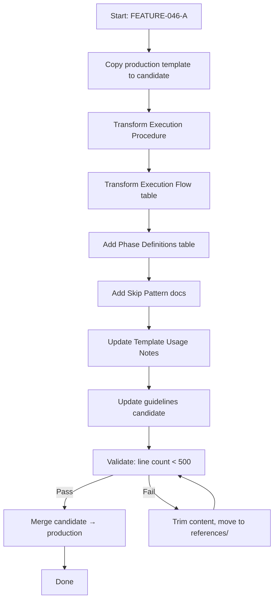

# Technical Design: Skill-Creator Template + Guidelines Update

> Feature ID: FEATURE-046-A | Version: v1.0 | Last Updated: 03-05-2026

---

## Part 1: Agent-Facing Summary

> **Purpose:** Quick reference for AI agents navigating large projects.
> **📌 AI Coders:** Focus on this section for implementation context.

### Key Components Implemented

| Component | Responsibility | Scope/Impact | Tags |
|-----------|----------------|--------------|------|
| `x-ipe-task-based.md` template | Phase-based backbone for all task-based skills | All future skills use this structure | #template #5-phase #skill-creator |
| Phase Definitions table | Document the 5 phases with purpose and typical activities | Reference for skill creators | #template #phase-definitions |
| Skip Pattern | `<skip reason="..."/>` syntax for non-applicable phases | Phases 2-4 may skip | #template #skip-pattern |
| Execution Flow table | Phase-aware summary table format | All skills get Phase column | #template #execution-flow |
| Guidelines update | 5-phase method rationale and mapping guidance | skill-general-guidelines-v2.md | #guidelines #5-phase |

### Dependencies

| Dependency | Source | Design Link | Usage Description |
|------------|--------|-------------|-------------------|
| EPIC-044 (process_preference) | TASK-725/TASK-755 | Already merged | Template preserves existing `process_preference.auto_proceed` input and mode-aware completion pattern |

### Major Flow

1. Update candidate template at `x-ipe-docs/skill-meta/x-ipe-meta-skill-creator/candidate/templates/x-ipe-task-based.md`
2. Replace flat `<step_N>` with `<phase_N>` → `<step_N_M>` hierarchy in Execution Procedure section
3. Replace Execution Flow table with phase-aware format
4. Add Phase Definitions table and Skip Pattern documentation
5. Update `skill-general-guidelines-v2.md` candidate with 5-phase rationale
6. Validate via skill-creator's candidate workflow → merge to production

### Usage Example

```xml
<!-- NEW: Phase-based Execution Procedure structure -->
<procedure name="{skill-name}">
  <execute_dor_checks_before_starting/>
  <schedule_dod_checks_with_sub_agent_before_starting/>

  <phase_1 name="博学之 — Study Broadly">
    <step_1_1>
      <name>Gather Context</name>
      <action>1. Read specs  2. Research domain</action>
      <output>Context understood</output>
    </step_1_1>
  </phase_1>

  <phase_2 name="审问之 — Inquire Thoroughly">
    <skip reason="Input is fully specified by upstream skill; no ambiguity to resolve" />
  </phase_2>

  <phase_3 name="慎思之 — Think Carefully">
    <step_3_1>
      <name>Analyze Trade-offs</name>
      <action>1. Evaluate approaches  2. Assess risks</action>
      <output>Decision rationale</output>
    </step_3_1>
  </phase_3>

  <phase_4 name="明辨之 — Discern Clearly">
    <skip reason="Single valid approach; no alternatives to evaluate" />
  </phase_4>

  <phase_5 name="笃行之 — Practice Earnestly">
    <step_5_1>
      <name>Execute</name>
      <action>1. Do the work</action>
      <output>Deliverable produced</output>
    </step_5_1>
    <step_5_2>
      <name>Complete</name>
      <action>1. Verify DoD  2. Mode-aware review gate</action>
      <output>Task completion output</output>
    </step_5_2>
  </phase_5>
</procedure>
```

---

## Part 2: Implementation Guide

### Workflow Diagram



### File Changes Overview

| # | File (candidate path) | Change Type | Production Path |
|---|----------------------|-------------|-----------------|
| 1 | `x-ipe-docs/skill-meta/x-ipe-meta-skill-creator/candidate/templates/x-ipe-task-based.md` | Major rewrite of ACTION section | `.github/skills/x-ipe-meta-skill-creator/templates/x-ipe-task-based.md` |
| 2 | `x-ipe-docs/skill-meta/x-ipe-meta-skill-creator/candidate/references/skill-general-guidelines-v2.md` | Add new section | `.github/skills/x-ipe-meta-skill-creator/references/skill-general-guidelines-v2.md` |

### Change 1: Template — Execution Procedure Section

**Current structure** (lines 131-194 of production):

```xml
<procedure name="{skill-name}">
  <execute_dor_checks_before_starting/>
  <schedule_dod_checks_with_sub_agent_before_starting/>
  <step_1>...</step_1>
  <step_2>...</step_2>
  <step_3>...</step_3>
  <step_N_complete>...</step_N_complete>
</procedure>
```

**New structure:**

```xml
<procedure name="{skill-name}">
  <execute_dor_checks_before_starting/>
  <schedule_dod_checks_with_sub_agent_before_starting/>

  <phase_1 name="博学之 — Study Broadly">
    <step_1_1>
      <name>{Step Name}</name>
      <action>
        1. {Sub-action 1: gather context, read specs, research domain}
        2. {Sub-action 2}
      </action>
      <constraints>
        - BLOCKING: {Must not violate}
      </constraints>
      <output>{What this step produces}</output>
    </step_1_1>
  </phase_1>

  <phase_2 name="审问之 — Inquire Thoroughly">
    <!-- Option A: Active inquiry -->
    <step_2_1>
      <name>{Step Name}</name>
      <action>
        1. {Question assumptions, probe gaps, challenge inputs}
        2. IF process_preference.auto_proceed == "auto":
             Invoke x-ipe-tool-decision-making to self-resolve
           ELSE:
             Ask human for clarification
      </action>
      <output>{Clarified requirements / resolved ambiguities}</output>
    </step_2_1>
    <!-- Option B: Skip -->
    <!-- <skip reason="Input is fully specified; no ambiguity to resolve" /> -->
  </phase_2>

  <phase_3 name="慎思之 — Think Carefully">
    <!-- Option A: Active reflection -->
    <step_3_1>
      <name>{Step Name}</name>
      <action>
        1. {Analyze trade-offs, evaluate risks, reflect on approaches}
      </action>
      <output>{Analysis results / risk assessment}</output>
    </step_3_1>
    <!-- Option B: Skip -->
    <!-- <skip reason="No design decisions; purely procedural execution" /> -->
  </phase_3>

  <phase_4 name="明辨之 — Discern Clearly">
    <!-- Option A: Active discernment -->
    <step_4_1>
      <name>{Step Name}</name>
      <action>
        1. {Choose approach, document decision rationale}
      </action>
      <output>{Decision with rationale}</output>
    </step_4_1>
    <!-- Option B: Skip -->
    <!-- <skip reason="Single valid approach; no alternatives to evaluate" /> -->
  </phase_4>

  <phase_5 name="笃行之 — Practice Earnestly">
    <step_5_1>
      <name>{Step Name}</name>
      <action>
        1. {Execute the core work: create, implement, test}
      </action>
      <success_criteria>
        - {Criterion 1}
        - {Criterion 2}
      </success_criteria>
      <output>{Deliverable produced}</output>
    </step_5_1>

    <!-- MODE-AWARE COMPLETION (always last step in Phase 5): -->
    <step_5_N_complete>
      <name>Complete</name>
      <action>
        1. Verify all DoD checkpoints
        2. Output task completion summary
        3. Mode-aware review gate:
           IF process_preference.auto_proceed == "auto":
             Skip human review. If any open questions remain, invoke
             x-ipe-tool-decision-making to resolve them autonomously.
           ELIF process_preference.auto_proceed == "stop_for_question" OR "manual":
             Present results to human and wait for approval.
      </action>
      <output>Task completion output</output>
    </step_5_N_complete>
  </phase_5>

</procedure>
```

**Key rules embedded in template:**
- All 5 `<phase_N>` blocks MUST appear, in order 1→5
- Phase 1 and Phase 5 always have content (no skip examples)
- Phases 2-4 show both Option A (active) and Option B (skip) as comments
- Step numbering: `step_N_M` where N=phase, M=step within phase
- Completion step is always the last step inside Phase 5

### Change 2: Template — Execution Flow Table

**Current** (lines 118-128):

```markdown
## Execution Flow

| Step | Name | Action | Gate |
|------|------|--------|------|
| 1 | {Step Name} | {Brief action} | {gate condition} |
```

**New:**

```markdown
## Execution Flow

| Phase | Step | Name | Action | Gate |
|-------|------|------|--------|------|
| 1. 博学之 (Study Broadly) | 1.1 | {Step Name} | {Brief action} | {gate condition} |
| 2. 审问之 (Inquire Thoroughly) | — | SKIP | {reason} | — |
| 3. 慎思之 (Think Carefully) | 3.1 | {Step Name} | {Brief action} | {gate condition} |
| 4. 明辨之 (Discern Clearly) | — | SKIP | {reason} | — |
| 5. 笃行之 (Practice Earnestly) | 5.1 | {Step Name} | {Brief action} | {gate condition} |
| | 5.2 | Complete | Verify DoD | DoD validated |
```

### Change 3: Template — Phase Definitions Table

Insert after Execution Flow table, before Execution Procedure:

```markdown
### Phase Definitions (5-Phase Learning Method — 博学之，审问之，慎思之，明辨之，笃行之)

| Phase | Chinese | English | SE Purpose | Typical Activities |
|-------|---------|---------|------------|-------------------|
| 1 | 博学之 (Bóxué) | Study Broadly | Gather comprehensive context | Read specs, study domain, research patterns, load context |
| 2 | 审问之 (Shěnwèn) | Inquire Thoroughly | Question assumptions, probe gaps | Ask clarifying questions, challenge inputs, validate constraints |
| 3 | 慎思之 (Shènsī) | Think Carefully | Reflect on trade-offs and risks | Analyze alternatives, assess risk, evaluate impact |
| 4 | 明辨之 (Míngbiàn) | Discern Clearly | Make informed decisions | Choose approach, document rationale, resolve conflicts |
| 5 | 笃行之 (Dǔxíng) | Practice Earnestly | Execute with discipline | Implement, test, verify, deliver, commit |

**Rules:**
- Phase 1 and Phase 5 are NEVER skippable — every skill must study before acting and act with discipline.
- Phases 2, 3, 4 may use `<skip reason="..." />` when genuinely non-applicable.
- Phase names MUST always be bilingual (Chinese + English).
- Phase order is fixed: 1 → 2 → 3 → 4 → 5. No reordering.
- auto_proceed in Phase 2: agent self-resolves via `x-ipe-tool-decision-making` (not skipped).
```

### Change 4: Template — Skip Pattern Documentation

Insert common skip reasons (inside the Phase Definitions section):

```markdown
**Common Skip Reasons:**

| Phase | Skip Reason |
|-------|-------------|
| 2 (审问之) | "Input is fully specified by upstream skill; no ambiguity to resolve" |
| 3 (慎思之) | "No design decisions or trade-offs; purely procedural execution" |
| 4 (明辨之) | "Single valid approach; no alternatives to evaluate" |
```

### Change 5: Template Usage Notes Update

Update the Section Order subsection to reflect phase-based ACTION:

```yaml
task_based_skill_skills:
  section_order:
    # CONTEXT
    1: Purpose
    2: Important Notes
    # DECISION
    3: Input Parameters
    3a: "  └─ Input Initialization (### subsection)"
    4: Definition of Ready (DoR)
    # ACTION
    5: Execution Flow Summary (with Phase column)
    5a: "  └─ Phase Definitions (### subsection)"
    6: Execution Procedure (phase_N → step_N_M hierarchy)
    # VERIFY
    7: Output Result
    8: Definition of Done (DoD)
    # REFERENCE
    9: Patterns & Anti-Patterns
    10: Examples
```

### Change 6: Guidelines — New Section in skill-general-guidelines-v2.md

Add a new principle section:

```markdown
## Principle N: 5-Phase Learning Method (博学之，审问之，慎思之，明辨之，笃行之)

```yaml
principle:
  name: 5-Phase Learning Method
  origin: "《中庸》第二十章 (Doctrine of the Mean, Chapter 20)"
  rationale: |
    Systematic gap analysis (TASK-751) revealed that while AI agent skills
    excel at execution (笃行之, 10/10), they systematically underrepresent
    inquiry (审问之, 3/10), reflection (慎思之, 3/10), and discernment
    (明辨之, 1/10). The 5-phase method provides a mandatory structural
    backbone that ensures every skill considers the full learning cycle.

phases:
  1_study:    { chinese: "博学之", english: "Study Broadly", mandatory: true }
  2_inquire:  { chinese: "审问之", english: "Inquire Thoroughly", mandatory: false }
  3_think:    { chinese: "慎思之", english: "Think Carefully", mandatory: false }
  4_discern:  { chinese: "明辨之", english: "Discern Clearly", mandatory: false }
  5_practice: { chinese: "笃行之", english: "Practice Earnestly", mandatory: true }

mapping_guidance:
  - challenge: "Where does my step fit?"
    rule: "Match by cognitive activity, not step name"
    examples:
      - "Read specification" → Phase 1 (Study)
      - "Ask user questions" → Phase 2 (Inquire)
      - "Evaluate trade-offs" → Phase 3 (Think)
      - "Choose approach" → Phase 4 (Discern)
      - "Write code / create file" → Phase 5 (Practice)
  - challenge: "My skill only has 2 steps"
    rule: "Phase 1 gets context gathering, Phase 5 gets execution. Phases 2-4 skip."
  - challenge: "auto_proceed mode and Phase 2?"
    rule: "Agent self-resolves via x-ipe-tool-decision-making. Phase 2 is not skipped."
```
```

### Implementation Steps

1. **Create candidate directory structure:**
   ```
   x-ipe-docs/skill-meta/x-ipe-meta-skill-creator/candidate/
   ├── templates/
   │   └── x-ipe-task-based.md          ← copy from production, apply changes 1-5
   └── references/
       └── skill-general-guidelines-v2.md ← copy from production, apply change 6
   ```

2. **Apply template changes (Changes 1-5):**
   - Replace Execution Flow section (Change 2)
   - Add Phase Definitions table (Change 3)
   - Add Skip Pattern docs (Change 4)
   - Replace Execution Procedure section (Change 1)
   - Update Template Usage Notes (Change 5)
   - Preserve ALL sections outside ACTION: Purpose, Important Notes, Input Parameters, Input Initialization, DoR, Output Result, DoD, Patterns, Examples

3. **Apply guidelines change (Change 6):**
   - Add new Principle section at end of Part 1 in skill-general-guidelines-v2.md

4. **Validate:**
   - Candidate template body ≤ 500 lines
   - All 5 phases present
   - Phase 1 and 5 have content, Phases 2-4 show skip option
   - Section order preserved
   - `process_preference.auto_proceed` preserved
   - Mode-aware completion pattern in Phase 5

5. **Merge:** Copy validated candidates to production paths

### Edge Cases & Error Handling

| Scenario | Expected Behavior |
|----------|-------------------|
| Template exceeds 500 lines after changes | Move Phase Definitions and skip docs to `references/phase-definitions.md`; keep inline reference link |
| Existing skills using flat step_N | No breakage — template is guidance for new/updated skills, not enforced on existing ones |
| skill-meta candidate folder already exists | Check for in-progress edits; if clean, overwrite; if dirty, ask human |

---

## Design Change Log

| Date | Phase | Change Summary |
|------|-------|----------------|
| 03-05-2026 | Initial Design | Created technical design for 5-phase template restructuring. 2 files modified: template (major rewrite of ACTION section) and guidelines (new principle section). |
