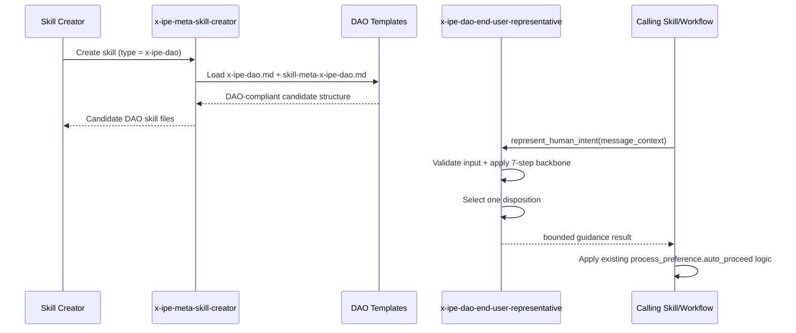
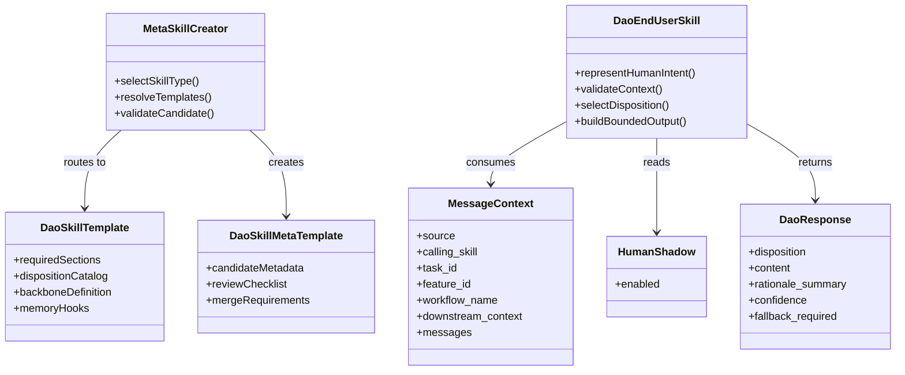

# Technical Design: DAO Skill Foundation & End-User Core

> Feature ID: FEATURE-047-A | Version: v1.0 | Last Updated: 03-06-2026
>
> Specification: [x-ipe-docs/requirements/EPIC-047/FEATURE-047-A/specification.md](x-ipe-docs/requirements/EPIC-047/FEATURE-047-A/specification.md)

## Version History

| Version | Date | Description |
|---------|------|-------------|
| v1.0 | 03-06-2026 | Initial technical design |
| v1.1 | 03-06-2026 | CR-001: Aligned input/output contract with implementation (mediation_request shape); updated usage example |
| v2.0 | 03-06-2026 | CR-001 continued: Redesigned input contract — removed operation field; mediation_request→message_context with source/messages array; human_shadow standalone; confidence_threshold internal; replaced "mediate" language with "represent human intent" |

---

## Part 1: Agent-Facing Summary

> **Purpose:** Quick reference for AI agents navigating the implementation.
> **📌 AI Coders:** Focus on this section for implementation context.

### Key Components Implemented

| Component | Responsibility | Scope/Impact | Tags |
|-----------|----------------|--------------|------|
| `x-ipe-dao.md` template | Define the canonical DAO skill structure, required sections, and 7-step backbone | New template under `.github/skills/x-ipe-meta-skill-creator/templates/` | #dao #template #skill-creator #foundation |
| `skill-meta-x-ipe-dao.md` template | Define candidate metadata and review structure for DAO skill creation | New skill-meta template for DAO candidate workflow | #dao #skill-meta #candidate-workflow |
| `x-ipe-meta-skill-creator/SKILL.md` updates | Add `x-ipe-dao` to skill-type selection and template routing | Central skill creation workflow and validation rules | #dao #routing #creator #workflow |
| `x-ipe-dao-end-user-representative/SKILL.md` | Implement the first human representative skill with bounded dispositions | New runtime skill callable by future workflows and skills | #dao #human-representative #core-skill |
| Human representative disposition contract | Standardize input (message_context), output, confidence, and fallback semantics | Shared interface used by callers and later variants | #contract #disposition #bounded-output |

### Scope & Boundaries

- Covers DAO skill-type enablement, DAO template files, and the first concrete DAO skill: `x-ipe-dao-end-user-representative`.
- Preserves existing `process_preference.auto_proceed` semantics; the skill returns guidance on behalf of the human but does not redefine workflow policy.
- Excludes semantic DAO logging, decision-log removal, existing call-site migration, and instruction-resource interception. Those remain in FEATURE-047-B and FEATURE-047-C.
- Excludes reusable cross-task memory persistence; only extension hooks are defined in this feature.

### Dependencies

| Dependency | Source | Design Link | Usage Description |
|------------|--------|-------------|-------------------|
| FEATURE-047-A specification | FEATURE-047-A | [x-ipe-docs/requirements/EPIC-047/FEATURE-047-A/specification.md](x-ipe-docs/requirements/EPIC-047/FEATURE-047-A/specification.md) | Source of truth for scope, acceptance criteria, and boundaries |
| Decision-making technical design | FEATURE-044-A | [x-ipe-docs/requirements/EPIC-044/FEATURE-044-A/technical-design.md](x-ipe-docs/requirements/EPIC-044/FEATURE-044-A/technical-design.md) | Reuse bounded input/output and invocation patterns while omitting logging behavior |
| Meta skill creator | Existing | [.github/skills/x-ipe-meta-skill-creator/SKILL.md](.github/skills/x-ipe-meta-skill-creator/SKILL.md) | Hosts skill-type registry, template routing, and candidate-to-production workflow |
| Tool skill template conventions | Existing | [.github/skills/x-ipe-meta-skill-creator/templates/x-ipe-tool.md](.github/skills/x-ipe-meta-skill-creator/templates/x-ipe-tool.md) | Reference for structured skill contracts and input/output sections |

### Major Flow

1. A maintainer selects `x-ipe-dao` in `x-ipe-meta-skill-creator`.
2. Skill creator routes to DAO-specific `SKILL.md` and `skill-meta.md` templates.
3. DAO template enforces human representative scope, 7-step backbone, bounded outputs, human-shadow fallback, and memory-extension placeholders.
4. `x-ipe-dao-end-user-representative` receives human-origin context via `message_context`, applies disposition selection, and returns a bounded result.
5. Calling workflows or skills decide how to use the result according to existing `process_preference.auto_proceed` policy.

### Usage Example

```yaml
# Future caller-side invocation shape for x-ipe-dao-end-user-representative
input:
  message_context:
    source: "human"
    task_id: "TASK-770"
    workflow_name: "EPIC-047"
    downstream_context: "The worker agent owns the live execution status"
    messages:
      - content: "Where are we in the workflow, and what should happen next?"
  human_shadow: false

operation_output:
  success: true
  result:
    disposition: "pass_through"
    content: "I should let the downstream agent answer that status question directly."
    rationale_summary: "The downstream specialist is better positioned to answer the status question directly."
    confidence: 0.78
    fallback_required: false
  errors: []
```

---

## Part 2: Implementation Guide

> **Purpose:** Detailed guide for the implementing agent.
> **📌 Emphasis on file-level changes, contracts, and bounded integration.**

### Implementation Type

- **program_type:** `skills`
- **tech_stack:** `["Markdown/SKILL.md", "X-IPE skill templates", "YAML contracts", "Mermaid"]`

### Workflow Diagram



### Component Relationship Diagram



### File Changes

| File | Action | Scope |
|------|--------|-------|
| `.github/skills/x-ipe-meta-skill-creator/SKILL.md` | **Modify** | Add `x-ipe-dao` as a skill type, update input validation, template selection logic, and template reference tables |
| `.github/skills/x-ipe-meta-skill-creator/templates/x-ipe-dao.md` | **Create** | Define DAO skill template with required sections, 7-step backbone, bounded outputs, human-shadow, and memory hooks |
| `.github/skills/x-ipe-meta-skill-creator/templates/skill-meta-x-ipe-dao.md` | **Create** | Define DAO candidate metadata template and validation checklist |
| `.github/skills/x-ipe-dao-end-user-representative/SKILL.md` | **Create** | Implement the first DAO skill contract and execution flow |
| `.github/skills/x-ipe-dao-end-user-representative/references/dao-disposition-guidelines.md` | **Create** | Capture disposition semantics, confidence guidance, and fallback rules |

### Design Decisions

#### 1. Add a New Skill Type Instead of Reusing `x-ipe-tool`

DAO is a first-class concept in the requirements, not just a special tool. Reusing `x-ipe-tool` would hide the new abstraction in creator UX and weaken validation. The design therefore adds a dedicated `x-ipe-dao` skill type with its own template pair.

**Why this stays KISS:** only one new type row and two new templates are added; existing candidate workflow remains intact.

#### 2. Keep DAO Output Bounded

`x-ipe-dao-end-user-representative` returns one guidance result with a short rationale summary. It does not emit chain-of-thought, multi-step internal logs, or execution plans. This preserves auditability and reduces the risk of the skill becoming an unbounded implementation agent.

#### 3. Preserve Caller Ownership of Workflow Policy

DAO consumes `process_mode` context only to understand whether auto use is possible, but it does not decide workflow policy. The caller keeps ownership of what to do in `manual`, `stop_for_question`, or `auto`. This avoids semantic drift from the current `process_preference.auto_proceed` model.

#### 4. Defer Logging and Migration

Even though decision-making currently logs to `x-ipe-docs/decision_made_by_ai.md`, this design excludes any logging implementation in FEATURE-047-A. Logging file rollout, legacy cleanup, and system-wide call-site migration remain in FEATURE-047-B.

#### 5. Add Extension Hooks, Not Memory Storage

DAO template and output contract reserve fields/sections for future memory, but no persistence or recall subsystem is introduced now. This satisfies the v1 requirement without speculative storage design.

### DAO Template Design

The DAO template should follow the same high-level structural style as existing skill templates, but specialized for human representative behavior.

#### Required Sections

1. Frontmatter with `name`, `description`, and DAO-specific trigger phrases
2. Purpose and Important Notes
3. About / Key Concepts section defining human representative, dispositions, and fallback
4. Input Parameters and `input_init`
5. Definition of Ready
6. Operations
7. Output Result
8. Definition of Done
9. References / Examples

#### DAO-Specific Rules Embedded in Template

- Human representative scope must be explicit.
- The skill may answer, clarify, reframe, critique, instruct, approve, or pass through.
- The skill must not take over downstream implementation work.
- The skill is autonomous by default.
- Human-shadow is optional fallback only.
- Semantic logging section is present as a placeholder/reference only in FEATURE-047-A.
- Future memory hook section is reserved but non-operative.

### `x-ipe-dao-end-user-representative` Input and Output Contract

#### Input Contract

```yaml
input:
  message_context:
    source: "human | ai"                     # Required — who sent the message
    calling_skill: "{skill name}"            # Optional — which skill is calling
    task_id: "{TASK-XXX}"                    # Required — current task ID
    feature_id: "{FEATURE-XXX | N/A}"        # Optional, default: N/A
    workflow_name: "{name | N/A}"            # Required — workflow name or N/A
    downstream_context: "{target agent/task context or N/A}"
    messages:                                # Required — non-empty array
      - content: "{original human-origin input}"
        preferred_dispositions: ["answer", "clarification", "reframe", "critique", "instruction", "approval", "pass_through"]  # Optional
  human_shadow: true | false                 # Standalone, default: false
```

#### Output Contract

```yaml
operation_output:
  success: true | false
  result:
    disposition: "answer | clarification | reframe | critique | instruction | approval | pass_through"
    content: "{bounded response to caller}"
    rationale_summary: "{short explanation, not chain-of-thought}"
    confidence: 0.0-1.0
    fallback_required: true | false
  errors: []
```

#### Validation Rules

- `message_context.messages` must contain at least one entry with non-empty `content`.
- `message_context.source` must be `human` or `ai`.
- `downstream_context` defaults to `N/A` if not provided.
- `disposition` is single-valued; the skill returns one primary outcome per call.
- `fallback_required` can be true only when `human_shadow` is true and the skill's internal confidence is below its own threshold.
- `preferred_dispositions` is a soft preference order; defaults to all supported dispositions if not provided.

### `x-ipe-dao-end-user-representative` Execution Flow

| Step | Name | Action | Result |
|------|------|--------|--------|
| 1 | Validate Context | Validate `message_context` and `human_shadow`, normalize optional fields, fail fast on missing required input | Safe input contract |
| 2 | Frame Human Need | Interpret the human-origin message and blocked touchpoint without changing downstream task scope | Bounded problem framing |
| 3 | Apply 7-Step Backbone | Use 静虑→兼听→审势→权衡→谋后而定→试错→断 to assess viable responses | Candidate dispositions |
| 4 | Select Disposition | Pick the most appropriate single disposition and fallback flag | Final disposition choice |
| 5 | Return Bounded Result | Emit structured result with `content`, `rationale_summary`, `confidence`, and `fallback_required` | Caller-consumable output |

### 7-Step Backbone Mapping

| Step | Design Role in `x-ipe-dao-end-user-representative` |
|------|------------------------------------|
| 静虑 | Pause and identify the real blocked human need |
| 兼听 | Consider user wording, calling context, and alternative readings |
| 审势 | Check workflow mode, task state, and available context |
| 权衡 | Compare candidate dispositions and their risks |
| 谋后而定 | Predict best/medium/worst outcomes of each candidate response |
| 试错 | Prefer low-risk clarification or pass-through when certainty is limited |
| 断 | Return one clear bounded outcome |

### Implementation Steps

1. **Meta skill creator**
   - Add `x-ipe-dao` to the skill-type table and validation enum in `.github/skills/x-ipe-meta-skill-creator/SKILL.md`.
   - Update template-selection logic so DAO resolves to `x-ipe-dao.md` and `skill-meta-x-ipe-dao.md`.
   - Add DAO template references in the SKILL.md reference tables.

2. **DAO template pair**
   - Create `.github/skills/x-ipe-meta-skill-creator/templates/x-ipe-dao.md`.
   - Create `.github/skills/x-ipe-meta-skill-creator/templates/skill-meta-x-ipe-dao.md`.
   - Reuse wording patterns from task/tool templates where possible, but keep DAO-specific sections minimal and explicit.

3. **DAO end-user skill**
   - Create `.github/skills/x-ipe-dao-end-user-representative/SKILL.md`.
   - Define the `message_context` input and disposition output schemas for the `represent_human_intent` operation.
   - Add a concise reference file for disposition guidance.

4. **Validation**
   - Ensure the new DAO creator flow can generate a DAO candidate without using tool-skill or task-based templates.
   - Ensure `x-ipe-dao-end-user-representative` output stays within the bounded contract and does not mention logging or migration work.

### Edge Cases & Error Handling

| Scenario | Expected Behavior |
|----------|-------------------|
| Missing message content or source | Fail fast with explicit input-validation error |
| Human message is a raw question | Treat as valid DAO input; select answer, clarification, or pass-through without reformatting requirement |
| Caller expects DAO to implement the task | Return instruction/critique/pass-through content only; do not expand scope |
| Confidence below threshold and human-shadow disabled | Return best-effort bounded result with `fallback_required: false` |
| Confidence below threshold and human-shadow enabled | Return bounded result with `fallback_required: true` so caller may escalate |
| Caller in `manual` mode | The skill may still represent human intent, but caller still decides whether to stop for a human |

### Testing Strategy for Downstream Implementation

- Validate creator routing with a DAO creation example.
- Validate DAO template contains all required sections and 7-step backbone ordering.
- Validate `x-ipe-dao-end-user-representative` input/output examples against the documented contract.
- Validate disposition selection stays within the allowed enum.
- Validate no FEATURE-047-B responsibilities appear in the DAO core implementation.

### Design Change Log

| Date | Phase | Change Summary |
|------|-------|----------------|
| 03-06-2026 | Initial Design | Created the initial design for DAO skill-type support and `x-ipe-dao-end-user-representative`, defining a dedicated DAO template pair, bounded guidance contract, and a minimal integration path that preserves existing workflow semantics without introducing logging or migration work. |
