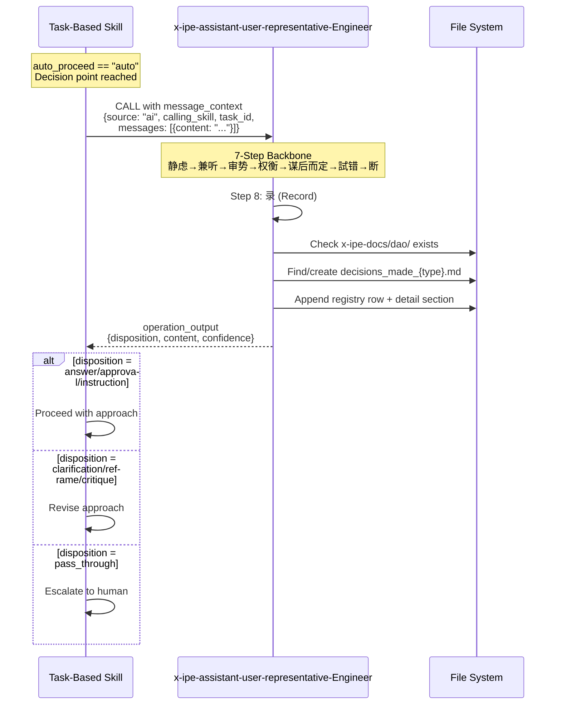

# FEATURE-047-B: Technical Design — Semantic DAO Logging & Workflow Migration

> **Version:** v1.0
> **Status:** Draft
> **Specification:** [specification.md](x-ipe-docs/requirements/EPIC-047/FEATURE-047-B/specification.md)

---

## Version History

| Version | Date | Changes |
|---------|------|---------|
| v1.0 | 03-06-2026 | Initial design from specification v1.0 |

---

# Part 1: Agent-Facing Summary

## Scope

| Tag | Value |
|-----|-------|
| Scope | [Backend — Skill Definitions] |
| Feature ID | FEATURE-047-B |
| Depends On | FEATURE-047-A (DAO skill foundation) |
| Files Changed | ~18 (14 migrated + 1 DAO skill updated + 1 template + 1 deleted folder + 1 log template) |

## Key Components

| Component | Purpose | Location |
|-----------|---------|----------|
| DAO Logging Steps | Add logging procedure to DAO skill after 断 (Commit) step | `.github/skills/x-ipe-assistant-user-representative-Engineer/SKILL.md` |
| DAO Log Template | Markdown template for semantic log files | `.github/skills/x-ipe-assistant-user-representative-Engineer/templates/dao-log-template.md` |
| Call Site Migration | Replace decision-making invocations with DAO in 14 files | `.github/skills/x-ipe-task-based-*/SKILL.md` + templates |
| Skill Deletion | Remove old decision-making skill | `.github/skills/x-ipe-tool-decision-making/` |

## Change Summary

```
MODIFY  .github/skills/x-ipe-assistant-user-representative-Engineer/SKILL.md    # Add logging steps
CREATE  .github/skills/x-ipe-assistant-user-representative-Engineer/templates/dao-log-template.md
MODIFY  .github/skills/x-ipe-task-based-bug-fix/SKILL.md              # Migrate call site
MODIFY  .github/skills/x-ipe-task-based-code-implementation/SKILL.md  # Migrate 3 call sites
MODIFY  .github/skills/x-ipe-task-based-code-refactor/SKILL.md        # Migrate 3 call sites
MODIFY  .github/skills/x-ipe-task-based-dev-environment/SKILL.md      # Migrate call site
MODIFY  .github/skills/x-ipe-task-based-feature-closing/SKILL.md      # Migrate 2 refs
MODIFY  .github/skills/x-ipe-task-based-idea-mockup/SKILL.md          # Migrate call site
MODIFY  .github/skills/x-ipe-task-based-idea-to-architecture/SKILL.md # Migrate call site
MODIFY  .github/skills/x-ipe-task-based-ideation/SKILL.md             # Migrate call site
MODIFY  .github/skills/x-ipe-task-based-requirement-gathering/SKILL.md # Migrate call site
MODIFY  .github/skills/x-ipe-task-based-share-idea/SKILL.md           # Migrate call site
MODIFY  .github/skills/x-ipe-workflow-task-execution/SKILL.md         # Migrate reference
MODIFY  .github/skills/x-ipe-tool-web-search/SKILL.md                 # Migrate reference
MODIFY  .github/skills/x-ipe-meta-skill-creator/templates/x-ipe-task-based.md  # Migrate template
MODIFY  .github/skills/x-ipe-meta-skill-creator/references/skill-general-guidelines-v2.md  # Migrate guidelines
DELETE  .github/skills/x-ipe-tool-decision-making/                     # Entire folder
```

## Dependency Table

| Dependency | Type | Verified |
|-----------|------|----------|
| FEATURE-047-A (DAO skill, message_context contract) | Internal | ✅ Completed & committed |
| EPIC-044 (3-mode auto_proceed semantics) | Internal | ✅ In production |
| All 10 task-based skills with decision-making refs | Internal | ✅ Identified in spec |

## Acceptance Criteria Mapping

| AC | Implementation Location |
|----|------------------------|
| AC-047-B.1–B.3 | DAO SKILL.md logging steps (new Step 8) |
| AC-047-B.4–B.8 | DAO SKILL.md logging steps + dao-log-template.md |
| AC-047-B.9 | Delete `.github/skills/x-ipe-tool-decision-making/` |
| AC-047-B.10–B.11 | Call site migration in 14 files |
| AC-047-B.12–B.13 | feature-closing SKILL.md + template/guidelines |
| AC-047-B.14–B.18 | Preserved by migration pattern (same branching, new contract) |
| AC-047-B.19–B.21 | x-ipe-task-based.md template + guidelines |

---

# Part 2: Implementation Guide

## 1. DAO Logging Steps

### 1.1 Insert Location

The DAO skill currently has a 7-step backbone ending with **断 (Commit)**. Logging is added as **Step 8: 录 (Record)** — after the response is committed but before returning to the caller.

Current flow: 静虑 → 兼听 → 审势 → 权衡 → 谋后而定 → 试错 → **断** → return
New flow: 静虑 → 兼听 → 审势 → 权衡 → 谋后而定 → 试错 → **断** → **录 (Record)** → return

### 1.2 Logging Procedure (New Step 8)

Add after the current "Operations" section's step 7 (断), before "Output Result":

```markdown
### Step 8: 录 (Record) — Write Semantic Log

1. DETERMINE semantic_task_type from calling_skill:
   - Extract the skill category (e.g., "bug-fix" → "bug_fix", "feature-refinement" → "feature_refinement")
   - IF calling_skill is unclear, derive from downstream_context

2. CHECK if `x-ipe-docs/dao/` folder exists:
   - IF NOT: create it

3. DETERMINE target log file:
   - Scan existing files in `x-ipe-docs/dao/` matching `decisions_made_*.md`
   - IF a file with matching semantic_task_type exists → append to it
   - ELSE → create new file from dao-log-template.md as `decisions_made_{semantic_task_type}.md`

4. DETERMINE next Entry ID:
   - Read registry table in target file
   - Next ID = DAO-{N+1} where N is the count of existing entries

5. APPEND to registry table:
   | {Entry ID} | {timestamp} | {task_id} | {calling_skill} | {disposition} | {confidence} | {one-line summary} |

6. APPEND detail section:
   ## {Entry ID}
   - Timestamp, Task ID, Feature ID, Workflow, Calling Skill, Source, Disposition, Confidence
   - Message: {original message content}
   - Guidance Returned: {DAO response content}
   - Rationale: {rationale_summary}
   - Follow-up: {if any, else "None"}
```

### 1.3 SKILL.md Line Budget

Current SKILL.md: 291 lines. Adding ~40 lines for Step 8. New total: ~331 lines (well under 500 limit).

Also remove the line that says "CRITICAL: The skill MUST NOT write semantic logs in this version." — this restriction is lifted by FEATURE-047-B.

### 1.4 Log Template

Create `.github/skills/x-ipe-assistant-user-representative-Engineer/templates/dao-log-template.md`:

```markdown
# DAO Decisions: {Semantic Task Type}

> Semantic log of human representative interactions grouped by task type.
> Each entry records a DAO interaction with full context and rationale.

| Entry | Timestamp | Task ID | Calling Skill | Disposition | Confidence | Summary |
|-------|-----------|---------|---------------|-------------|------------|---------|

---

<!-- Detail sections are appended below -->
```

## 2. Call Site Migration

### 2.1 Migration Pattern

Every call site follows the same transformation:

**Before:**
```
IF process_preference.auto_proceed == "auto":
  → CALL x-ipe-tool-decision-making with decision_context:
    { calling_skill: "{name}", task_id: "{task_id}", problems: [{description: "...", type: "conflict|question", options: [...]}] }
  → IF decision is "{positive}": proceed
  → IF decision is "{negative}": revise/defer
```

**After:**
```
IF process_preference.auto_proceed == "auto":
  → CALL x-ipe-assistant-user-representative-Engineer with:
    message_context:
      source: "ai"
      calling_skill: "{name}"
      task_id: "{task_id}"
      feature_id: "{feature_id | N/A}"
      workflow_name: "{workflow_name | N/A}"
      downstream_context: "{what the skill is doing when it hit this decision point}"
      messages:
        - content: "{the question or conflict description}"
          preferred_dispositions: ["answer", "clarification"]
    human_shadow: false
  → IF disposition is "answer" or "approval" or "instruction": proceed
  → IF disposition is "clarification" or "reframe" or "critique": revise/defer
  → IF disposition is "pass_through": escalate to human
```

### 2.2 Disposition Mapping

The old pattern used simple string matching (`decision is "confirm"`, `decision is "revise"`). The new pattern maps DAO dispositions to skill branching:

| Old Decision | New DAO Disposition(s) | Skill Action |
|-------------|----------------------|--------------|
| "confirm", "approve", "proceed" | `answer`, `approval`, `instruction` | Proceed with suggested approach |
| "revise", "defer", "reject" | `clarification`, `reframe`, `critique` | Revise approach or defer |
| N/A (new) | `pass_through` | Escalate to human (DAO can't resolve) |

### 2.3 Per-File Migration Details

#### 2.3.1 Task-Based Skills (10 files)

Each skill has 1-3 call sites. The transformation is mechanical:

| File | Call Sites | Context |
|------|-----------|---------|
| `bug-fix` | 1 | Unexpected conflict during conflict analysis |
| `code-implementation` | 3 | Tool gap logging, test failure handling, contract mismatch |
| `code-refactor` | 3 | Refactoring plan approval, scope conflicts |
| `dev-environment` | 1 | Tech stack selection when ambiguous |
| `feature-closing` | 2 | Unmet AC handling + refactoring recommendation logging |
| `idea-mockup` | 1 | Idea folder selection |
| `idea-to-architecture` | 1 | Idea folder selection |
| `ideation` | 1 | Generic question/conflict resolution |
| `requirement-gathering` | 1 | Ambiguity resolution |
| `share-idea` | 1 | Format/tool selection |

For `feature-closing` specifically: replace the `decision_made_by_ai.md` reference with DAO semantic logging. The refactoring recommendation should use DAO with `preferred_dispositions: ["instruction"]` and the DAO will log it automatically.

#### 2.3.2 Workflow Executor (1 file)

`x-ipe-workflow-task-execution/SKILL.md` — update the reference to decision-making as the auto-mode resolution mechanism. Replace mention of `x-ipe-tool-decision-making` with `x-ipe-assistant-user-representative-Engineer`.

#### 2.3.3 Template & Guidelines (2 files)

- `x-ipe-task-based.md`: Has 3 references — update the auto-proceed call pattern example, the mode-aware branching section, and any "see x-ipe-tool-decision-making" references.
- `skill-general-guidelines-v2.md`: Has 2 references — update the auto-proceed behavior description and the tool reference.

#### 2.3.4 Web Search (1 file)

`x-ipe-tool-web-search/SKILL.md` — update reference to decision-making if it mentions it as a related skill or caller.

## 3. Skill Deletion

Delete the entire `.github/skills/x-ipe-tool-decision-making/` folder:
- `SKILL.md`
- `templates/decision-log-template.md`
- Any other files in the folder

This is a clean delete — no deprecation notice needed since all call sites are migrated first.

## 4. Implementation Order

Execute in this sequence to avoid broken references at any point:

```
Step 1: Add logging steps to DAO SKILL.md + create dao-log-template.md
Step 2: Migrate all 14 call sites (batch — all at once)
Step 3: Delete x-ipe-tool-decision-making folder
Step 4: Verify no remaining references to old skill or legacy log
Step 5: Run tests
```

## 5. Validation Rules

- After Step 2: `grep -rn "x-ipe-tool-decision-making" .github/skills/ | grep -v "x-ipe-tool-decision-making/"` should return 0 results
- After Step 3: `.github/skills/x-ipe-tool-decision-making/` should not exist
- After Step 4: `grep -rn "decision_made_by_ai" .github/skills/` should return 0 results
- All existing tests must still pass

## 6. Sequence Diagram



## 7. Risk Assessment

| Risk | Likelihood | Impact | Mitigation |
|------|-----------|--------|------------|
| Breaking 3-mode semantics | Low | High | Migration only touches `auto` branch; manual/stop_for_question untouched |
| Missing a call site | Low | Medium | Automated grep verification after migration |
| DAO SKILL.md exceeding 500 lines | Low | Low | Current 291 + ~40 = ~331, well under limit |
| Log file naming collisions | Low | Low | DAO determines name from calling_skill — naturally unique |
