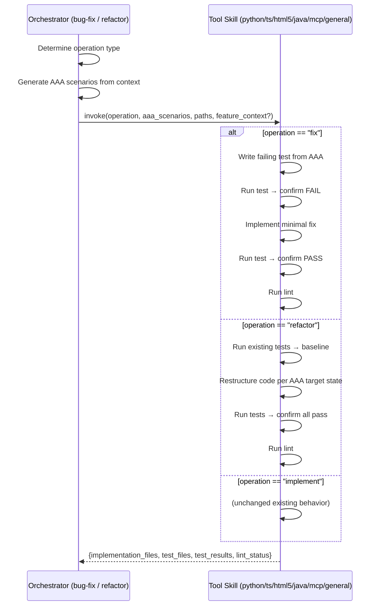

# Technical Design: Tool Skill Contract Extension

> Feature ID: FEATURE-048-A | Version: v1.0 | Last Updated: 03-10-2026

## Part 1: Agent-Facing Summary

### Program Type & Tech Stack

```yaml
program_type: skills
tech_stack: ["SKILL.md (XML-in-Markdown)", "implementation-guidelines.md"]
```

### Key Components Implemented

| Component | Responsibility | Scope/Impact | Tags |
|-----------|---------------|--------------|------|
| `<operation name="fix">` block | TDD-ordered bug fix within tool skills | All 6 tool-implementation skills | fix, tdd, bug-fix |
| `<operation name="refactor">` block | Behavior-preserving restructuring within tool skills | All 6 tool-implementation skills | refactor, restructure |
| `<input_init>` update | Accept optional `feature_context` for fix/refactor | All 6 tool-implementation skills | input, contract |
| `implementation-guidelines.md` update | Canonical I/O contract reference with new operations | Reference document | guidelines, contract |

### Dependencies

| Dependency | Source | Design Link | Usage Description |
|-----------|--------|-------------|-------------------|
| Existing `<operation name="implement">` | EPIC-045 | Each tool skill SKILL.md | Base pattern to extend |
| implementation-guidelines.md | EPIC-045 | `.github/skills/x-ipe-task-based-code-implementation/references/implementation-guidelines.md` | I/O contract reference |
| x-ipe-meta-skill-creator | Existing | `.github/skills/x-ipe-meta-skill-creator/SKILL.md` | Candidate workflow for all skill changes |

### Major Flow

1. Orchestrator (bug-fix or code-refactor) determines `operation` type ("fix" or "refactor")
2. Orchestrator generates AAA scenarios from context (mini AAA for fix, per-phase AAA for refactor)
3. Orchestrator invokes tool skill with `operation`, `aaa_scenarios`, `source_code_path`, `test_code_path`, and optionally `feature_context`
4. Tool skill dispatches to the matching `<operation>` block
5. Tool skill executes language-specific steps and returns standard output

### Usage Example

```yaml
# Bug-fix orchestrator invoking Python tool skill
input:
  operation: "fix"
  aaa_scenarios:
    - scenario_text: |
        @backend
        Test Scenario: Fix off-by-one in pagination
          Arrange:
            - Database has 25 items, page_size=10
          Act:
            - Request page 3
          Assert:
            - Returns items 21-25 (5 items, not 6)
  source_code_path: "src/api/"
  test_code_path: "tests/"
  feature_context: null  # Optional for fix

# Tool skill output (same standard contract)
output:
  implementation_files: ["src/api/pagination.py"]
  test_files: ["tests/test_pagination_fix.py"]
  test_results:
    - scenario: "Fix off-by-one in pagination"
      assert_clause: "Returns items 21-25 (5 items, not 6)"
      status: "pass"
  lint_status: "pass"
```

## Part 2: Implementation Guide

### Workflow Diagram



### Changes Per Skill File

All 6 tool-implementation skills follow the same change pattern. Three additions per SKILL.md:

#### Change 1: Update `<input_init>` block

```xml
<!-- BEFORE -->
<field name="operation" source="Always 'implement' when called by orchestrator" />
<field name="feature_context" source="From orchestrator's Feature Data Model" />

<!-- AFTER -->
<field name="operation" source="'implement' | 'fix' | 'refactor' — set by calling orchestrator" />
<field name="feature_context" source="From orchestrator's Feature Data Model. OPTIONAL for fix/refactor — use synthetic fallback if absent" />
```

#### Change 2: Add `<operation name="fix">` block (after existing implement block)

Pattern for **language-specific** skills (python, typescript, html5, java, mcp):

```xml
<operation name="fix">
  <action>
    1. LEARN existing code: [same as implement Step 1]
    2. WRITE failing test from AAA scenario:
       a. FOR EACH AAA scenario:
          - Create test function: test_fix_{scenario_name}
          - Arrange → reproduce bug preconditions
          - Act → trigger the buggy action
          - Assert → expected CORRECT behavior
    3. RUN test → MUST FAIL (TDD gate)
       - IF test passes → STOP, report: "TDD gate violation — test already passes"
    4. IMPLEMENT minimal fix following {language} best practices
       - Only change what is necessary to make the test pass
       - Follow existing code conventions
    5. RUN test → MUST PASS
    6. RUN all existing tests → no regressions
    7. RUN linting: {language-specific linter}
    8. RETURN standard output
  </action>
  <constraints>
    - BLOCKING: Test MUST fail before fix (Step 3)
    - CRITICAL: Minimal fix only — do not refactor during fix
    - MANDATORY: Feature_context is OPTIONAL — use synthetic fallback if absent
  </constraints>
  <output>Standard tool skill output</output>
</operation>
```

Pattern for **general** skill adds Step 1-2 (identify + research) before the fix steps.

#### Change 3: Add `<operation name="refactor">` block

```xml
<operation name="refactor">
  <action>
    1. LEARN existing code: [same as implement Step 1]
    2. RUN existing tests → establish baseline (all must pass)
       - IF any test fails → STOP, report: "Cannot refactor — baseline tests failing"
    3. RESTRUCTURE code per AAA scenario target state:
       a. FOR EACH AAA scenario:
          - Read target state from Assert clauses
          - Apply structural changes following {language} best practices
          - Preserve external behavior
    4. UPDATE imports and references
    5. RUN all tests → MUST pass (behavior preserved)
    6. IF tests fail → report failed scenarios, do NOT auto-fix
    7. RUN linting: {language-specific linter}
    8. RETURN standard output
  </action>
  <constraints>
    - BLOCKING: Baseline tests must pass before refactoring (Step 2)
    - CRITICAL: Preserve behavior — no functional changes
    - CRITICAL: Do NOT manage git commits — orchestrator handles checkpointing
    - MANDATORY: Feature_context is OPTIONAL — use synthetic fallback if absent
  </constraints>
  <output>Standard tool skill output</output>
</operation>
```

### Per-Skill Language Specifics

| Skill | Fix Linter | Refactor Linter | Fix Test Pattern | Notes |
|-------|-----------|-----------------|------------------|-------|
| python | `ruff check/format` | `ruff check/format` | `def test_fix_{name}()` with pytest | Use `python -m pytest` for venv safety |
| typescript | `eslint --fix` | `eslint --fix` | `test('fix: {name}', ...)` with Vitest/Jest | Support both .ts and .tsx |
| html5 | Browser validation | Browser validation | DOM assertion tests | CSS validation included |
| java | Java checkstyle | Java checkstyle | `@Test void testFix_{name}()` with JUnit | Maven/Gradle detection |
| mcp | Protocol-specific | Protocol-specific | MCP tool call assertions | Test tool invocation patterns |
| general | Auto-detect | Auto-detect | Auto-detect test framework | Steps 1-2 (identify+research) first |

### Implementation Steps

1. **Update implementation-guidelines.md** — Add `operation` field documentation, new operation descriptions, updated I/O contract showing operation as enum
2. **Update x-ipe-tool-implementation-general** — Add fix/refactor blocks (with research steps)
3. **Update x-ipe-tool-implementation-python** — Add fix/refactor blocks (Python-specific)
4. **Update x-ipe-tool-implementation-typescript** — Add fix/refactor blocks (TS-specific)
5. **Update x-ipe-tool-implementation-html5** — Add fix/refactor blocks (HTML5-specific)
6. **Update x-ipe-tool-implementation-java** — Add fix/refactor blocks (Java-specific)
7. **Update x-ipe-tool-implementation-mcp** — Add fix/refactor blocks (MCP-specific)

Each update follows `x-ipe-meta-skill-creator` candidate workflow.

### Edge Cases & Error Handling

| Scenario | Expected Behavior |
|----------|-------------------|
| `operation: "fix"` with empty AAA | Reject: "Fix operation requires at least 1 AAA scenario" |
| `operation: "fix"` test passes before fix | Report: "TDD gate violation — test already passes, review scenario" |
| `operation: "refactor"` baseline tests fail | Report: "Cannot refactor — baseline tests failing" — return without changes |
| `operation: "refactor"` tests fail after restructure | Report failed scenarios with details — do NOT auto-revert (orchestrator decides) |
| Unknown operation value | Reject: "Unknown operation: {value}. Supported: implement, fix, refactor" |
| Missing feature_context with `implement` | Reject (unchanged): "feature_context required for implement operation" |
| Missing feature_context with `fix`/`refactor` | Generate synthetic: `feature_id: "BUG-{task}" / "REFACTOR-{task}"` |

## Design Change Log

| Date | Phase | Change Summary |
|------|-------|----------------|
| 03-10-2026 | Initial | Created technical design for FEATURE-048-A |
