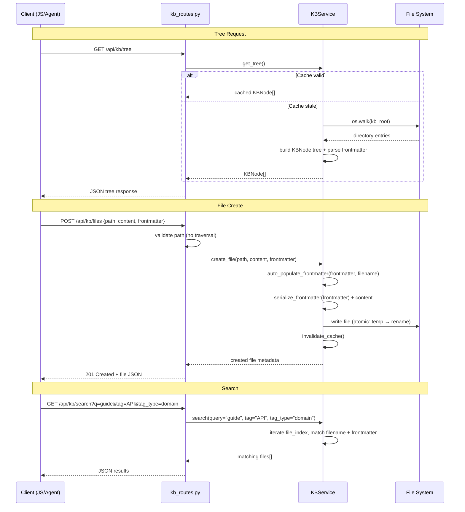
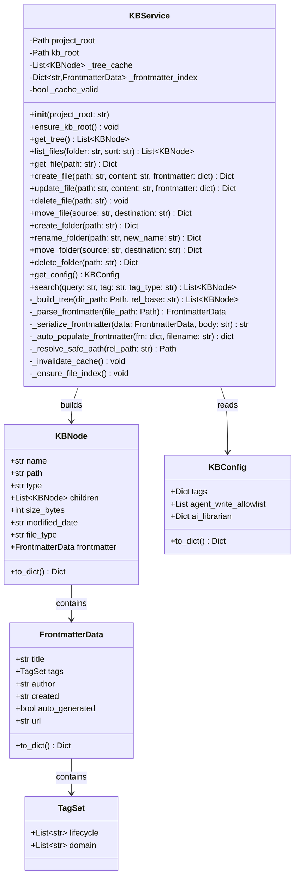

# Technical Design: KB Backend & Storage Foundation

> Feature ID: FEATURE-049-A | Version: v1.0 | Last Updated: 03-11-2026

> program_type: backend
> tech_stack: ["Python/Flask", "PyYAML", "pytest"]

---

## Part 1: Agent-Facing Summary

> **Purpose:** Quick reference for AI agents navigating large projects.
> **📌 AI Coders:** Focus on this section for implementation context.

### Key Components Implemented

| Component | Responsibility | Scope/Impact | Tags |
|-----------|----------------|--------------|------|
| `KBService` | File/folder CRUD, tree building, search, frontmatter parsing, config management | All KB backend operations | #kb #service #file-io #core |
| `kb_bp` (Blueprint) | REST API endpoints under `/api/kb/` | External API surface for all KB features | #kb #routes #api |
| `KBNode` | Data model for tree nodes (file/folder) | Tree responses, sidebar rendering | #kb #model #tree |
| `FrontmatterData` | Parsed YAML frontmatter data model | File metadata across all KB APIs | #kb #model #frontmatter |
| `KBConfig` | kb-config.json schema + defaults | Tag taxonomy, AI Librarian config | #kb #model #config |

### Scope & Boundaries

**In scope:** File-system-based KB service, REST API (12 endpoints), YAML frontmatter parsing, tag taxonomy config, URL bookmark format, search by filename/frontmatter/tags, in-memory caching.

**Out of scope:** Frontend UI (FEATURE-049-B–G), full-text body search (V2), pagination (YAGNI ≤500 files), kb-config.json modification API (V2), archive extraction (FEATURE-049-E), AI Librarian intake (FEATURE-049-F).

### Dependencies

| Dependency | Source | Design Link | Usage Description |
|------------|--------|-------------|-------------------|
| `ProjectService` / `FileNode` | FEATURE-001 | `src/x_ipe/services/file_service.py` | Pattern reference for tree-building and file watching |
| `ToolsConfigService` | FEATURE-011 | `src/x_ipe/services/tools_config_service.py` | Pattern reference for JSON config CRUD |
| `SettingsService` | FEATURE-006 | `src/x_ipe/services/settings_service.py` | Pattern reference for service initialization |
| `x_ipe_tracing` | Foundation | `src/x_ipe/tracing/__init__.py` | Observability decorator on all service methods and routes |
| `PyYAML` | External | pyproject.toml | YAML frontmatter parsing via `yaml.safe_load` / `yaml.safe_dump` |
| Flask Blueprint | External | Flask docs | Route registration pattern |

### Major Flow

1. **Initialization:** App factory creates `KBService(project_root)` → service resolves KB root path → auto-creates root + `kb-config.json` if missing
2. **Tree request:** `GET /api/kb/tree` → `KBService.get_tree()` walks directory, builds `KBNode` tree, excludes `.intake/`, caches result → returns nested JSON
3. **File CRUD:** Route validates path → `KBService` performs file I/O with path-traversal guard → parses/writes frontmatter → invalidates cache → returns resource
4. **Search:** `GET /api/kb/search?q=...&tag=...` → `KBService.search()` iterates cached file index, matches query against filename + frontmatter fields → returns matching files

### Usage Example

```python
# Service initialization (in app.py _init_services)
kb_service = KBService(project_root)
app.config['KB_SERVICE'] = kb_service

# Route handler pattern (in kb_routes.py)
@kb_bp.route('/api/kb/tree', methods=['GET'])
@x_ipe_tracing()
def get_tree():
    kb_service = get_kb_service()
    tree = kb_service.get_tree()
    return jsonify({'tree': [node.to_dict() for node in tree]})

# Frontmatter parsing
metadata = kb_service.parse_frontmatter(file_path)
# → FrontmatterData(title="API Guide", tags=TagSet(lifecycle=["Design"], domain=["API"]), ...)
```

---

## Part 2: Implementation Guide

> **Purpose:** Detailed guide for developers to understand and implement the design.

### Architecture Overview

```
src/x_ipe/
├── services/
│   └── kb_service.py          # KBService class (~400 lines)
├── routes/
│   └── kb_routes.py           # Flask Blueprint (~300 lines)
└── app.py                     # Add KB_SERVICE init + blueprint registration

x-ipe-docs/
└── knowledge-base/            # KB root (auto-created)
    ├── kb-config.json         # Tag taxonomy + config (auto-created)
    └── {user folders & files}
```

### Workflow Diagram



### Data Models

```python
from dataclasses import dataclass, field
from typing import Optional, List, Dict, Any
from datetime import date


@dataclass
class TagSet:
    """Two-dimensional tag taxonomy."""
    lifecycle: List[str] = field(default_factory=list)
    domain: List[str] = field(default_factory=list)


@dataclass
class FrontmatterData:
    """Parsed YAML frontmatter from a markdown file."""
    title: Optional[str] = None
    tags: Optional[TagSet] = None
    author: Optional[str] = None
    created: Optional[str] = None
    auto_generated: bool = False
    url: Optional[str] = None            # Only for .url.md files

    def to_dict(self) -> Dict[str, Any]:
        result = {
            'title': self.title,
            'tags': {'lifecycle': self.tags.lifecycle, 'domain': self.tags.domain} if self.tags else None,
            'author': self.author,
            'created': self.created,
            'auto_generated': self.auto_generated,
        }
        if self.url is not None:
            result['url'] = self.url
        return result


@dataclass
class KBNode:
    """A node in the KB file tree (file or folder)."""
    name: str
    path: str                             # Relative to KB root
    type: str                             # "folder" | "file"
    children: Optional[List['KBNode']] = None
    size_bytes: Optional[int] = None
    modified_date: Optional[str] = None   # ISO 8601
    file_type: Optional[str] = None       # Extension or "url_bookmark"
    frontmatter: Optional[FrontmatterData] = None

    def to_dict(self) -> Dict[str, Any]:
        result = {'name': self.name, 'path': self.path, 'type': self.type}
        if self.children is not None:
            result['children'] = [c.to_dict() for c in self.children]
        if self.size_bytes is not None:
            result['size_bytes'] = self.size_bytes
        if self.modified_date is not None:
            result['modified_date'] = self.modified_date
        if self.file_type is not None:
            result['file_type'] = self.file_type
        if self.frontmatter is not None:
            result['frontmatter'] = self.frontmatter.to_dict()
        return result


@dataclass
class KBConfig:
    """kb-config.json schema."""
    tags: Dict[str, List[str]] = field(default_factory=lambda: {
        'lifecycle': ['Ideation', 'Requirement', 'Design', 'Implementation',
                      'Testing', 'Deployment', 'Maintenance'],
        'domain': ['API', 'Authentication', 'UI-UX', 'Database',
                   'Infrastructure', 'Security', 'Performance',
                   'Integration', 'Documentation', 'Analytics']
    })
    agent_write_allowlist: List[str] = field(default_factory=list)
    ai_librarian: Dict[str, Any] = field(default_factory=lambda: {
        'enabled': False,
        'intake_folder': '.intake'
    })

    def to_dict(self) -> Dict[str, Any]:
        return {
            'tags': self.tags,
            'agent_write_allowlist': self.agent_write_allowlist,
            'ai_librarian': self.ai_librarian,
        }
```

### API Specification

#### GET /api/kb/tree

Returns full folder/file tree (excludes `.intake/`).

**Response (200):**
```json
{
  "tree": [
    {
      "name": "guides",
      "path": "guides",
      "type": "folder",
      "children": [
        {
          "name": "api-guide.md",
          "path": "guides/api-guide.md",
          "type": "file",
          "size_bytes": 2048,
          "modified_date": "2026-03-11T10:00:00",
          "file_type": ".md",
          "frontmatter": {
            "title": "API Guide",
            "tags": {"lifecycle": ["Design"], "domain": ["API"]},
            "author": "echo",
            "created": "2026-03-11",
            "auto_generated": false
          }
        }
      ]
    }
  ]
}
```

#### GET /api/kb/files?folder={path}&sort={field}

List files in folder with frontmatter metadata.

| Parameter | Type | Required | Default | Values |
|-----------|------|----------|---------|--------|
| `folder` | string | No | `""` (root) | Relative path |
| `sort` | string | No | `modified` | `modified`, `name`, `created`, `untagged` |

**Response (200):**
```json
{
  "files": [
    {
      "name": "api-guide.md",
      "path": "guides/api-guide.md",
      "size_bytes": 2048,
      "modified_date": "2026-03-11T10:00:00",
      "file_type": ".md",
      "frontmatter": { "title": "API Guide", "tags": {...}, "author": "echo", "created": "2026-03-11", "auto_generated": false }
    }
  ],
  "folder": "guides"
}
```

#### GET /api/kb/files/{path}

Read single file content + frontmatter.

**Response (200):**
```json
{
  "name": "api-guide.md",
  "path": "guides/api-guide.md",
  "content": "## Introduction\n\nThis guide covers...",
  "frontmatter": { "title": "API Guide", "tags": {...}, "author": "echo", "created": "2026-03-11", "auto_generated": false },
  "size_bytes": 2048,
  "modified_date": "2026-03-11T10:00:00",
  "file_type": ".md"
}
```

#### POST /api/kb/files

Create new file with content and optional frontmatter.

**Request:**
```json
{
  "path": "guides/new-article.md",
  "content": "Article body here",
  "frontmatter": {
    "title": "New Article",
    "tags": {"lifecycle": ["Design"], "domain": ["API"]},
    "author": "echo"
  }
}
```

**Response (201):** Same as GET single file.

**Auto-populate rules (AC-049-A-05):** If frontmatter missing fields → `title` from filename (strip extension, replace `-`/`_` with space, title-case), `tags` → `{"lifecycle": [], "domain": []}`, `author` → `"unknown"`, `created` → today's date, `auto_generated` → `false`.

#### PUT /api/kb/files/{path}

Update file content and/or frontmatter. Same request/response as POST.

#### DELETE /api/kb/files/{path}

**Response (200):** `{"success": true, "deleted": "guides/old-article.md"}`

#### PUT /api/kb/files/move

**Request:** `{"source": "old/path.md", "destination": "new/path.md"}`
**Response (200):** `{"success": true, "old_path": "old/path.md", "new_path": "new/path.md"}`

#### POST /api/kb/folders

**Request:** `{"path": "guides/sub-folder"}`
**Response (201):** `{"name": "sub-folder", "path": "guides/sub-folder", "type": "folder"}`

#### PATCH /api/kb/folders

**Request:** `{"path": "guides/old-name", "new_name": "new-name"}`
**Response (200):** `{"name": "new-name", "path": "guides/new-name", "type": "folder"}`

#### PUT /api/kb/folders/move

**Request:** `{"source": "old/folder", "destination": "new/parent"}`
**Response (200):** `{"success": true, "old_path": "old/folder", "new_path": "new/parent/folder"}`

#### DELETE /api/kb/folders

**Request:** `{"path": "guides/deprecated"}`
**Response (200):** `{"success": true, "deleted": "guides/deprecated", "deleted_count": 5}`
**Error (403):** `{"error": "FORBIDDEN", "message": "Cannot delete KB root folder"}`

#### GET /api/kb/config

**Response (200):**
```json
{
  "tags": {
    "lifecycle": ["Ideation", "Requirement", "Design", "Implementation", "Testing", "Deployment", "Maintenance"],
    "domain": ["API", "Authentication", "UI-UX", "Database", "Infrastructure", "Security", "Performance", "Integration", "Documentation", "Analytics"]
  },
  "agent_write_allowlist": [],
  "ai_librarian": {"enabled": false, "intake_folder": ".intake"}
}
```

#### GET /api/kb/search

| Parameter | Type | Required | Description |
|-----------|------|----------|-------------|
| `q` | string | No | Search query (case-insensitive) |
| `tag` | string | No | Filter by tag value |
| `tag_type` | string | No | `lifecycle` or `domain` (required with `tag`) |

**Response (200):** Same structure as file listing.

### Error Response Format

All errors follow this standard pattern (NFR-049-A-04):

```json
{"error": "ERROR_CODE", "message": "Human-readable description"}
```

| Status | Code | When |
|--------|------|------|
| 400 | `BAD_REQUEST` | Path traversal attempt, invalid params, move-into-self |
| 403 | `FORBIDDEN` | Delete KB root |
| 404 | `NOT_FOUND` | File/folder not found |
| 409 | `CONFLICT` | Duplicate folder name at same level |
| 413 | `PAYLOAD_TOO_LARGE` | File >10MB |
| 415 | `UNSUPPORTED_MEDIA_TYPE` | Invalid file extension |
| 500 | `INTERNAL_ERROR` | Corrupt kb-config.json, file I/O failure |

### KBService Class Design



### Key Implementation Details

#### 1. Path Safety (`_resolve_safe_path`)

All user-provided paths MUST be validated to prevent directory traversal:

```python
def _resolve_safe_path(self, rel_path: str) -> Path:
    """Resolve relative path within KB root. Raises ValueError on traversal."""
    clean = rel_path.replace('\\', '/').strip('/')
    resolved = (self.kb_root / clean).resolve()
    if not resolved.is_relative_to(self.kb_root.resolve()):
        raise ValueError(f"Path traversal attempt: {rel_path}")
    return resolved
```

#### 2. Frontmatter Parsing

Split markdown content on `---` delimiters, parse YAML between first two delimiters:

```python
def _parse_frontmatter(self, file_path: Path) -> Optional[FrontmatterData]:
    """Parse YAML frontmatter. Returns None on missing/invalid frontmatter."""
    content = file_path.read_text(encoding='utf-8')
    if not content.startswith('---'):
        return None
    parts = content.split('---', 2)
    if len(parts) < 3:
        return None
    try:
        raw = yaml.safe_load(parts[1])
        if not isinstance(raw, dict):
            return None
        tags_raw = raw.get('tags', {})
        tags = TagSet(
            lifecycle=tags_raw.get('lifecycle', []) if isinstance(tags_raw, dict) else [],
            domain=tags_raw.get('domain', []) if isinstance(tags_raw, dict) else []
        )
        return FrontmatterData(
            title=raw.get('title'),
            tags=tags,
            author=raw.get('author'),
            created=str(raw.get('created', '')) or None,
            auto_generated=bool(raw.get('auto_generated', False)),
            url=raw.get('url'),
        )
    except yaml.YAMLError:
        return None
```

#### 3. Atomic File Writes (NFR-049-A-05)

```python
import tempfile, os

def _write_file_atomic(self, target: Path, content: str) -> None:
    """Write content atomically: temp file → rename."""
    fd, tmp_path = tempfile.mkstemp(dir=target.parent, suffix='.tmp')
    try:
        with os.fdopen(fd, 'w', encoding='utf-8') as f:
            f.write(content)
        os.replace(tmp_path, target)
    except Exception:
        if os.path.exists(tmp_path):
            os.unlink(tmp_path)
        raise
```

#### 4. In-Memory Cache Strategy

- `_tree_cache`: Full `KBNode` tree built via `os.walk()`. Populated on first `get_tree()` call.
- `_frontmatter_index`: `Dict[str, FrontmatterData]` keyed by relative path. Populated alongside tree.
- `_invalidate_cache()`: Called after every write operation (create, update, delete, move). Sets `_cache_valid = False`.
- Next read re-builds cache. Simple and correct for V1 (single-process, ≤500 files).

#### 5. Sort Implementation (AC-049-A-04)

| Sort Value | Logic |
|------------|-------|
| `modified` (default) | Sort by `modified_date` descending (newest first) |
| `name` | Sort by `name` ascending (case-insensitive) |
| `created` | Sort by `frontmatter.created` descending, null last |
| `untagged` | Untagged files first (empty lifecycle AND domain), then by name |

#### 6. File Type Validation (AC-049-A-11)

```python
ACCEPTED_EXTENSIONS = {'.md', '.pdf', '.png', '.jpg', '.jpeg', '.svg'}

def _validate_file_type(self, filename: str) -> None:
    """Raises ValueError for unsupported file types."""
    if filename.endswith('.url.md'):
        return  # Special case: URL bookmark
    ext = Path(filename).suffix.lower()
    if ext not in ACCEPTED_EXTENSIONS:
        raise ValueError(f"Unsupported file type: {ext}")
```

### Implementation Steps

1. **Data Models:** Create dataclasses (`KBNode`, `FrontmatterData`, `TagSet`, `KBConfig`) at top of `kb_service.py`
2. **KBService core:** Constructor, `ensure_kb_root()`, `_resolve_safe_path()`, `_write_file_atomic()`
3. **Frontmatter:** `_parse_frontmatter()`, `_serialize_frontmatter()`, `_auto_populate_frontmatter()`
4. **Tree & cache:** `get_tree()`, `_build_tree()`, `_invalidate_cache()`, `_ensure_file_index()`
5. **File CRUD:** `get_file()`, `create_file()`, `update_file()`, `delete_file()`, `move_file()`
6. **Folder CRUD:** `create_folder()`, `rename_folder()`, `move_folder()`, `delete_folder()`
7. **Config & search:** `get_config()`, `search()`
8. **Routes:** Blueprint with all 12 endpoints, error handling, service accessor
9. **App integration:** Register `KBService` in `_init_services()`, import blueprint in `_register_blueprints()`

### Edge Cases & Error Handling

| Scenario | Implementation |
|----------|---------------|
| KB root doesn't exist | `ensure_kb_root()` called in constructor — creates dir + `kb-config.json` |
| No YAML frontmatter | `_parse_frontmatter()` returns `None` — file metadata has `frontmatter: null` |
| Malformed YAML | `yaml.YAMLError` caught → return `None` (graceful degradation) |
| Path traversal `../` | `_resolve_safe_path()` checks `is_relative_to()` → raises `ValueError` → 400 |
| File >10MB | Check `content-length` header and actual size → 413 |
| Delete KB root | Check if path equals `""` or resolves to `kb_root` → 403 |
| Duplicate folder name | Check `os.path.exists()` before `os.makedirs()` → 409 |
| Move folder into itself | Check destination starts with source path → 400 |
| `.intake/` in tree | `_build_tree()` skips entries named `.intake` |
| Empty search query | Return all files (unfiltered) |
| Corrupt kb-config.json | `json.JSONDecodeError` caught → 500 with descriptive message |
| `.url.md` missing url | Check frontmatter for `url` field → 400 if missing |
| Non-markdown files | Return file metadata without frontmatter parsing |

### File Structure Summary

| File | Lines (est.) | Purpose |
|------|-------------|---------|
| `src/x_ipe/services/kb_service.py` | ~400 | KBService class + data models |
| `src/x_ipe/routes/kb_routes.py` | ~300 | Flask Blueprint with 12 endpoints |
| `src/x_ipe/app.py` | +10 | Service init + blueprint registration |
| `tests/test_kb_service.py` | ~400 | Unit tests for KBService |
| `tests/test_kb_routes.py` | ~350 | Integration tests for API endpoints |

---

## Design Change Log

| Date | Phase | Change Summary |
|------|-------|----------------|
| 03-11-2026 | Initial Design | Initial technical design for KB Backend & Storage Foundation. File-system based service with in-memory cache, 12 REST endpoints, YAML frontmatter parsing, 2D tag taxonomy. Following existing X-IPE patterns (ProjectService, ToolsConfigService). |
