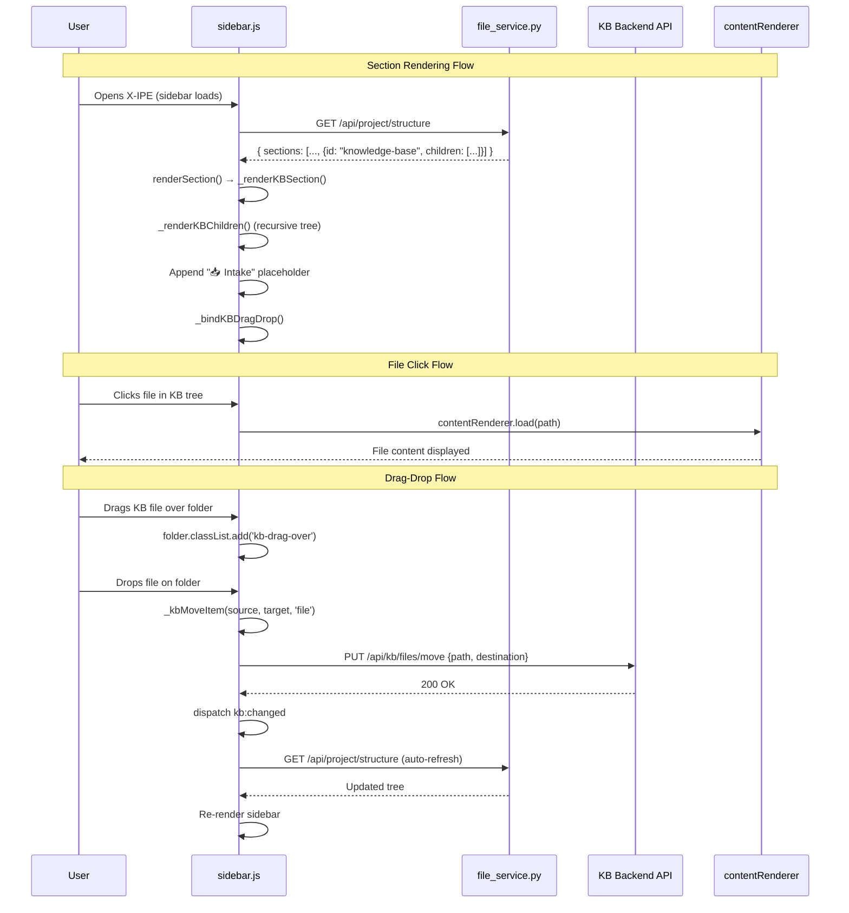

# Technical Design: KB Sidebar & Navigation

> Feature ID: FEATURE-049-B | Version: v2.0 | Last Updated: 03-11-2026

> program_type: frontend
> tech_stack: ["JavaScript (ES6+)", "Python", "CSS3", "Vitest"]

---

## Version History

| Version | Date | Description |
|---------|------|-------------|
| v2.0 | 03-11-2026 | Template re-alignment — full two-part structure |
| v1.0 | 03-11-2026 | Initial design with informal structure |

## Part 1: Agent-Facing Summary

> **Purpose:** Quick reference for AI agents navigating large projects.
> **📌 AI Coders:** Focus on this section for implementation context.

### Key Components Implemented

| # | Component | Responsibility | Scope/Impact | Tags |
|---|-----------|----------------|--------------|------|
| 1 | KB Section Config | Registers `knowledge-base` section in `DEFAULT_SECTIONS` between Project Plan and Requirements | `src/x_ipe/services/file_service.py` | `kb`, `config`, `backend` |
| 2 | `_renderKBSection()` | KB-specific section renderer — folder tree, empty state, Intake placeholder | `src/x_ipe/static/js/features/sidebar.js` | `kb`, `render`, `tree`, `sidebar` |
| 3 | `_renderKBChildren()` / `_renderKBFolder()` | Recursive folder/file tree rendering with `data-kb-folder` attributes and depth-based indentation | `src/x_ipe/static/js/features/sidebar.js` | `kb`, `tree`, `recursive` |
| 4 | `_bindKBDragDrop()` | Wires HTML5 drag-drop on KB folders/files — dragstart, dragover, dragleave, drop handlers | `src/x_ipe/static/js/features/sidebar.js` | `kb`, `drag`, `drop`, `events` |
| 5 | `_kbMoveItem()` | Calls `PUT /api/kb/files/move` or `/api/kb/folders/move` then dispatches `kb:changed` | `src/x_ipe/static/js/features/sidebar.js` | `kb`, `move`, `api` |
| 6 | KB Sidebar CSS | Drag-over emerald border, dragging opacity, empty state, Intake placeholder styling | `src/x_ipe/static/css/sidebar.css` | `kb`, `css`, `drag`, `visual` |

### Scope & Boundaries

**In scope:**
- KB section in sidebar with `bi-book` icon, positioned after Project Plan and before Requirements
- Hierarchical folder tree mirroring `x-ipe-docs/knowledge-base/` via `GET /api/kb/tree`
- Folder expand/collapse with Bootstrap Collapse + chevron animation
- File click → opens content via existing `contentRenderer` pipeline
- Drag-drop to move files/folders between KB folders with emerald dashed border feedback
- Auto-refresh sidebar tree on `kb:changed` custom DOM event
- "📥 Intake" placeholder entry (non-functional until FEATURE-049-F)
- "No articles yet" empty state when KB root is empty or missing

**Out of scope:**
- Backend API implementation (FEATURE-049-A)
- Browse grid view (FEATURE-049-C)
- Article editor (FEATURE-049-D)
- Cross-section drag-and-drop (non-KB items into KB)
- Multi-select or inline rename in sidebar
- Sidebar search/filter (FEATURE-049-D)

### Dependencies

| Dependency | Source | Design Link | Usage Description |
|------------|--------|-------------|-------------------|
| `GET /api/kb/tree` | FEATURE-049-A | `x-ipe-docs/requirements/EPIC-049/FEATURE-049-A/technical-design.md` | Fetches KB folder tree structure for sidebar rendering |
| `PUT /api/kb/files/move` | FEATURE-049-A | `x-ipe-docs/requirements/EPIC-049/FEATURE-049-A/technical-design.md` | Moves a KB file to a different folder on drop |
| `PUT /api/kb/folders/move` | FEATURE-049-A | `x-ipe-docs/requirements/EPIC-049/FEATURE-049-A/technical-design.md` | Moves a KB folder to a new parent on drop |
| `GET /api/project/structure` | Existing app | N/A | Returns all sidebar sections including KB; triggers full sidebar render |
| `window.contentRenderer` | Existing app | N/A | Renders file content in main area on file click |
| Bootstrap 5 Collapse | External (bundled) | N/A | Folder expand/collapse with chevron animation |
| `kb:changed` event | FEATURE-049-A | N/A | Custom DOM event dispatched after any KB write operation to trigger tree refresh |

### Major Flow

1. **Sidebar loads:** `file_service.py` returns `DEFAULT_SECTIONS` including `knowledge-base` → `sidebar.js` iterates sections.
2. **KB section detected:** `renderSection()` matches `section.id === 'knowledge-base'` → delegates to `_renderKBSection()`.
3. **Tree rendered:** If children exist, `_renderKBChildren()` recursively builds folder/file DOM nodes; otherwise shows empty state.
4. **Intake appended:** "📥 Intake" placeholder is appended after tree content (non-functional placeholder for FEATURE-049-F).
5. **Drag-drop bound:** `_bindKBDragDrop()` attaches `dragstart`/`dragend` to files and folders, `dragover`/`dragleave`/`drop` to folder targets.
6. **User drags item:** Source gets `kb-dragging` class; target folder shows `kb-drag-over` emerald border on hover.
7. **User drops item:** `_kbMoveItem()` strips `x-ipe-docs/knowledge-base/` prefix, calls appropriate move API, dispatches `kb:changed` on success.
8. **Auto-refresh:** `kb:changed` listener in constructor calls `this.load()` → re-fetches `/api/project/structure` → full sidebar re-render.

### Usage Example

```javascript
// KB section is auto-rendered by sidebar.js when DEFAULT_SECTIONS includes 'knowledge-base'.
// No manual instantiation needed — the sidebar pipeline handles it.

// Trigger tree refresh after a KB write operation:
document.dispatchEvent(new CustomEvent('kb:changed'));

// The sidebar constructor already listens:
// document.addEventListener('kb:changed', () => { this.load(); });

// Drag-drop is auto-wired after each render via _bindKBDragDrop().
// Move API call example (internal to sidebar.js):
// PUT /api/kb/files/move  { path: "guides/intro.md", destination: "archive" }
// PUT /api/kb/folders/move { path: "guides", new_parent: "archive" }
```

---

## Part 2: Implementation Guide

> **Purpose:** Human-readable details for developers.

### Workflow Diagram



### Component Architecture

The KB sidebar extends the existing `sidebar.js` render pipeline rather than introducing a separate module. When `renderSection()` encounters `section.id === 'knowledge-base'`, it delegates to a chain of KB-specific methods:

- **`_renderKBSection(section, icon, hasChildren)`** — Entry point. Builds the section header with `bi-book` icon, then either renders the tree via `_renderKBChildren()` or shows the empty state (`"📖 No articles yet"`). Always appends the Intake placeholder.
- **`_renderKBChildren(children, depth)`** — Iterates children array. Folders delegate to `_renderKBFolder()`; files render as standard `.nav-file` items.
- **`_renderKBFolder(folder, depth)`** — Renders a collapsible folder node with `data-kb-folder="true"` and `data-kb-path` attributes. Uses Bootstrap Collapse for expand/collapse. Recursively calls `_renderKBChildren()` for nested content.
- **`_bindKBDragDrop()`** — Called after each render. Queries all `[data-kb-folder="true"]` and KB `.nav-file` elements. Wires `_bindKBDragSources()` (dragstart/dragend) and `_bindKBDropTargets()` (dragover/dragleave/drop).
- **`_kbMoveItem(sourcePath, targetFolderPath, sourceType)`** — Strips `x-ipe-docs/knowledge-base/` prefix from paths, selects the correct API endpoint based on `sourceType`, calls the move API, and dispatches `kb:changed` on success.

On the backend, `file_service.py` simply declares the KB section in `DEFAULT_SECTIONS` at index 3 (after Project Plan, before Requirements):

```python
{ 'id': 'knowledge-base', 'label': 'Knowledge Base',
  'path': 'x-ipe-docs/knowledge-base', 'icon': 'bi-book' }
```

CSS lives in `sidebar.css` with four rules: `.kb-folder.kb-drag-over` (emerald border), `.kb-dragging` (opacity), `.kb-empty-state` (italic muted text), `.kb-intake-placeholder` (border-top separator).

### API Contracts

| Endpoint | Method | Purpose | Response |
|----------|--------|---------|----------|
| `/api/project/structure` | GET | Full sidebar tree including KB section | `{ sections: Section[] }` |
| `/api/kb/tree` | GET | KB-specific folder tree | `{ tree: TreeNode[] }` |
| `/api/file/content?path=` | GET | File content for click-to-open | `{ content: string }` |
| `/api/kb/files/move` | PUT | Move file via drag-drop — body: `{ path, destination }` | `{ success: true }` or `{ error: string }` |
| `/api/kb/folders/move` | PUT | Move folder via drag-drop — body: `{ path, new_parent }` | `{ success: true }` or `{ error: string }` |

### Implementation Steps

| # | Step | File | Details |
|---|------|------|---------|
| 1 | Add KB section config | `file_service.py` | Insert `knowledge-base` entry in `DEFAULT_SECTIONS` at index 3 with `bi-book` icon |
| 2 | KB section renderer | `sidebar.js` | Add `_renderKBSection()` — detect `section.id === 'knowledge-base'` in `renderSection()`, build section header, tree or empty state, Intake placeholder |
| 3 | Recursive tree builder | `sidebar.js` | Add `_renderKBChildren()` and `_renderKBFolder()` — depth-based indentation (16px/level), `data-kb-folder` and `data-kb-path` attributes, Bootstrap Collapse wrappers |
| 4 | Drag source binding | `sidebar.js` | Add `_bindKBDragSources()` — set `draggable="true"` on files, `dragstart` sets `text/plain` (path) and `application/x-kb-type`, `dragend` cleans up classes |
| 5 | Drop target binding | `sidebar.js` | Add `_bindKBDropTargets()` — `dragover` adds `kb-drag-over`, `dragleave` removes it (with `contains()` check), `drop` validates and calls `_kbMoveItem()` |
| 6 | Move API integration | `sidebar.js` | Add `_kbMoveItem()` — strip KB root prefix, select endpoint by type, `fetch()` with PUT, dispatch `kb:changed` on success |
| 7 | Auto-refresh listener | `sidebar.js` | In constructor: `document.addEventListener('kb:changed', () => this.load())` |
| 8 | KB drag-drop CSS | `sidebar.css` | `.kb-folder.kb-drag-over` (emerald dashed border + green bg), `.kb-dragging` (opacity 0.5), `.kb-empty-state`, `.kb-intake-placeholder` |
| 9 | Frontend tests | Vitest + jsdom | KB section renders, Intake placeholder present, empty state, drag-drop class toggling, `kb:changed` triggers re-render |

### Edge Cases & Error Handling

| Scenario | Expected Behavior |
|----------|-------------------|
| KB root directory doesn't exist yet | Show "📖 No articles yet" message; section still renders with header and Intake placeholder |
| Deeply nested folders (>5 levels) | Tree renders all levels with increasing 16px indent; section scrolls if needed |
| Dragging non-KB item onto KB folder | Ignored — KB drag-drop only activates for items with `application/x-kb-type` data |
| Dropping folder into itself or its child | Blocked — `_bindKBDropTargets()` checks `targetPath.startsWith(sourcePath + '/')` before calling API |
| Self-drop (same source and target path) | Blocked — early return when `sourcePath === targetPath` |
| Move API returns error | `_kbMoveItem()` logs error to console; no `kb:changed` dispatched, tree stays unchanged |
| API error on `/api/project/structure` fetch | Sidebar shows error state; retries on next polling cycle |
| Concurrent `kb:changed` events fire rapidly | Constructor listener calls `this.load()` which debounces internally via the sidebar's existing refresh mechanism |
| Intake placeholder clicked | No action — placeholder for future FEATURE-049-F |

---

## Design Change Log

| Date | Phase | Change Summary |
|------|-------|----------------|
| 03-11-2026 | v2.0 | Template re-alignment — added Version History, Key Components table, Scope & Boundaries, Dependencies table, Workflow Diagram, Component Architecture, structured Implementation Steps, Edge Cases table |
| 03-11-2026 | v1.0 | Initial design documenting sidebar pipeline extension approach |
