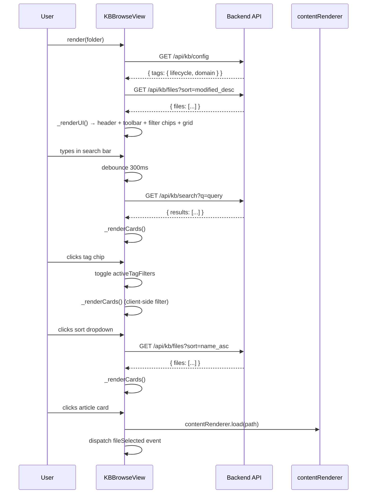
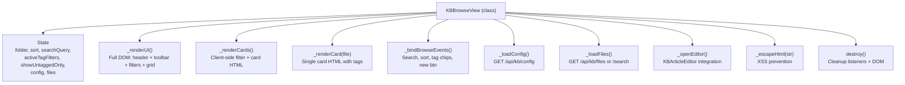

# Technical Design: KB Browse & Search

> Feature ID: FEATURE-049-C | Version: v1.0 | Last Updated: 03-11-2026

> program_type: frontend
> tech_stack: ["JavaScript (ES6+)", "CSS3", "Vitest"]

---

## Part 1: Agent-Facing Summary

### Key Components Implemented

| # | Component | Responsibility | Scope/Impact | Tags |
|---|-----------|---------------|--------------|------|
| 1 | `KBBrowseView` class | Main browse controller — renders grid, binds events, manages state | `src/x_ipe/static/js/features/kb-browse.js` | `kb`, `browse`, `grid`, `search`, `filter`, `view` |
| 2 | Card renderer (`_renderCard`) | Generates card HTML with title, snippet, tag pills, date | Internal to `KBBrowseView` | `kb`, `card`, `render`, `tags` |
| 3 | Tag filter engine | Client-side filtering by lifecycle/domain tags and untagged state | Internal to `_renderCards` | `kb`, `filter`, `tags`, `lifecycle`, `domain` |
| 4 | Debounced search | 300ms debounced input → `GET /api/kb/search` | Internal to `_bindBrowseEvents` | `kb`, `search`, `debounce`, `api` |
| 5 | Sort controller | Sort dropdown triggers file reload with `sort` query param | Internal to `_bindBrowseEvents` | `kb`, `sort`, `dropdown` |
| 6 | KB Browse CSS | Grid layout, card styles, tag pills, filter chips, empty state | `src/x_ipe/static/css/kb-browse.css` | `kb`, `css`, `grid`, `responsive`, `tags` |

### Scope & Boundaries

**In scope:**
- Grid-based card view of KB articles with title, snippet (100 chars), tags, last modified
- Keyword search (debounced 300ms) via `/api/kb/search`
- Sort dropdown: Last Modified, Name A→Z, Date Created, Untagged First
- Tag filter chips (lifecycle = amber gradient `▸`, domain = blue outlined `#`)
- Untagged filter (`⚠ Untagged` chip → shows only articles without tags + "Needs Tags" badge)
- Empty state with create prompt
- Card click → `window.contentRenderer.load(path)` + `fileSelected` custom event
- New Article button → opens `KBArticleEditor` (FEATURE-049-D)
- Auto-refresh on `kb:changed` custom event

**Out of scope:**
- Backend API implementation (FEATURE-049-A)
- Sidebar navigation / folder tree (FEATURE-049-B)
- Article editor modal (FEATURE-049-D)
- Pagination / infinite scroll (not required per spec)

### Dependencies

| Dependency | Source | Design Link | Usage Description |
|------------|--------|-------------|-------------------|
| `GET /api/kb/files?sort=&folder=` | FEATURE-049-A | `x-ipe-docs/requirements/EPIC-049/FEATURE-049-A/technical-design.md` | Fetches file list with sort order and optional folder filter |
| `GET /api/kb/config` | FEATURE-049-A | `x-ipe-docs/requirements/EPIC-049/FEATURE-049-A/technical-design.md` | Fetches tag configuration (lifecycle/domain tag lists) for filter chips |
| `GET /api/kb/search?q=&tag=` | FEATURE-049-A | `x-ipe-docs/requirements/EPIC-049/FEATURE-049-A/technical-design.md` | Keyword search with optional tag filter |
| `window.contentRenderer` | Existing app | N/A | Renders file content in main area on card click |
| `KBArticleEditor` (global) | FEATURE-049-D | `x-ipe-docs/requirements/EPIC-049/FEATURE-049-D/` | Opened by "New Article" button; optional runtime dependency |
| `kb:changed` event | FEATURE-049-A/B | N/A | Document-level custom event that triggers `refresh()` |

### Major Flow

1. **Initialization:** `new KBBrowseView(container)` stores container ref, initializes state (`sort`, `searchQuery`, `activeTagFilters`, `showUntaggedOnly`), registers `kb:changed` listener.
2. **`render(folder)`:** Loads config (`/api/kb/config`) → loads files (`/api/kb/files`) → renders full UI (header, toolbar, filter chips, grid).
3. **User searches:** Input event → 300ms debounce → sets `searchQuery` → fetches from `/api/kb/search?q=...` → re-renders cards.
4. **User changes sort:** Change event on `<select>` → updates `this.sort` → re-fetches `/api/kb/files?sort=...` → re-renders cards.
5. **User clicks tag chip:** Toggles tag in `activeTagFilters` Set (or `showUntaggedOnly` boolean) → client-side filter in `_renderCards()` — no API call needed.
6. **Card click:** Calls `contentRenderer.load(path)` + dispatches `fileSelected` custom event.
7. **`kb:changed` event:** Triggers `refresh()` → re-fetches files → re-renders cards only (toolbar/filters preserved).
8. **`destroy()`:** Removes `kb:changed` listener, clears debounce timer, empties container.

### Usage Example

```javascript
// Mount the browse view into a content area
const browseView = new KBBrowseView('content-area');
await browseView.render('knowledge-base/guides');

// Later — refresh after external change
document.dispatchEvent(new CustomEvent('kb:changed'));

// Cleanup when navigating away
browseView.destroy();
```

---

## Part 2: Implementation Guide

### Workflow Diagram



### Component Architecture



### API Contracts

| Endpoint | Method | Query Params | Response Shape | Trigger |
|----------|--------|-------------|----------------|---------|
| `/api/kb/config` | GET | — | `{ tags: { lifecycle: string[], domain: string[] } }` | `render()` init |
| `/api/kb/files` | GET | `sort`, `folder` | `{ files: FileObj[] }` | `render()`, sort change |
| `/api/kb/search` | GET | `q`, `tag`, `tag_type` | `{ results: FileObj[] }` | Search input (debounced) |

**`FileObj` shape** (consumed by `_renderCard`):

```typescript
interface FileObj {
  name: string;          // filename
  path: string;          // relative path (used as card data-path)
  type: string;          // "file"
  mtime: number;         // Unix timestamp (seconds)
  content_preview: string; // raw text preview (truncated to 100 chars)
  frontmatter: {
    title?: string;
    tags?: {
      lifecycle?: string[];
      domain?: string[];
    };
  };
}
```

### Implementation Steps

| # | Step | File | Details |
|---|------|------|---------|
| 1 | Class + constructor | `kb-browse.js` | Container resolution (element or ID string), state init, `kb:changed` listener |
| 2 | Config + file loading | `kb-browse.js` | `_loadConfig()` and `_loadFiles()` with error handling + fallback to empty arrays |
| 3 | Full UI render | `kb-browse.js` | `_renderUI()` — header with "New Article" button, search bar, sort dropdown, tag filter chips from config, grid container |
| 4 | Card rendering | `kb-browse.js` | `_renderCard(file)` — title (frontmatter or filename fallback), snippet (100 char max), lifecycle pills (`▸` prefix, amber), domain pills (`#` prefix, blue), "Needs Tags" badge, date |
| 5 | Client-side filtering | `kb-browse.js` | `_renderCards()` — filter by `activeTagFilters` (Set intersection), `showUntaggedOnly` (empty lifecycle + domain), then render or empty state |
| 6 | Event binding | `kb-browse.js` | `_bindBrowseEvents()` — search debounce (300ms), sort change, tag chip toggle, new article button |
| 7 | Card click handler | `kb-browse.js` | Attached in `_renderCards()` — calls `contentRenderer.load(path)` + dispatches `fileSelected` custom event |
| 8 | Editor integration | `kb-browse.js` | `_openEditor()` — checks `KBArticleEditor` global, passes folder + onComplete callback |
| 9 | Cleanup | `kb-browse.js` | `destroy()` — removes event listener, clears timer, empties container |
| 10 | Styles | `kb-browse.css` | Grid layout (`auto-fill, minmax(260px, 1fr)`), card hover, tag pill styles, filter chip toggle states, responsive |

### Edge Cases & Error Handling

| Scenario | Handling |
|----------|----------|
| `/api/kb/config` fetch fails | `catch` logs error; config stays `{ lifecycle: [], domain: [] }` — no filter chips rendered |
| `/api/kb/files` or `/search` fetch fails | `catch` logs error; `this.files` set to `[]` → empty state shown |
| API returns `{ results: [...] }` instead of `{ files: [...] }` | `_loadFiles()` reads `data.files || data.results || []` |
| Container passed as string ID that doesn't exist | `this.container` is `null`; `render()` early-returns |
| File has no `frontmatter.title` | Falls back to `file.name` |
| File has no `content_preview` | Snippet div not rendered (conditional template) |
| File has no tags (lifecycle + domain both empty) | "Needs Tags" amber badge shown |
| `KBArticleEditor` not loaded yet | `_openEditor()` guards with `typeof KBArticleEditor !== 'undefined'` |
| Rapid search input | Debounce timer clears previous timeout; only last keystroke fires API call |
| `kb:changed` fires after `destroy()` | Listener removed in `destroy()`; no stale refresh |
| XSS in title/tag/snippet content | All user content passed through `_escapeHtml()` (DOM textContent → innerHTML) |

---

## Design Change Log

| Version | Date | Author | Changes |
|---------|------|--------|---------|
| v1.0 | 03-11-2026 | Echo 📡 | Initial retroactive design from implemented code |
