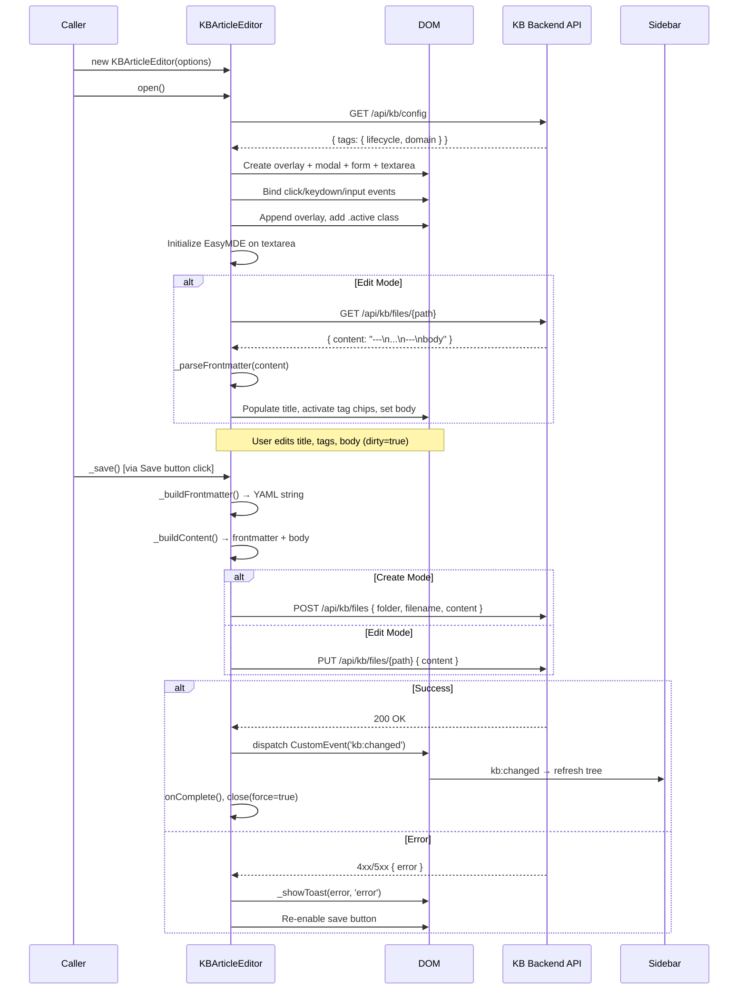
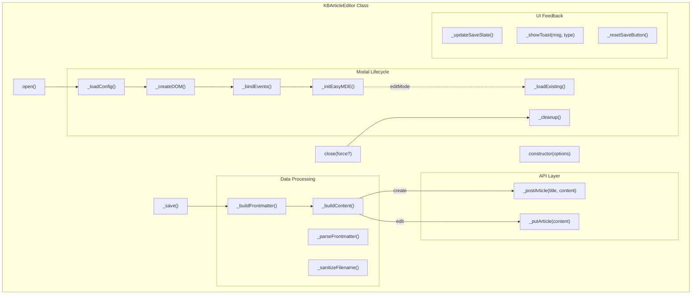

# Technical Design: KB Article Editor

> Feature ID: FEATURE-049-D | Version: v1.0 | Last Updated: 03-11-2026

> program_type: frontend
> tech_stack: ["JavaScript (ES6+)", "CSS3", "EasyMDE", "Vitest"]

---

## Part 1: Agent-Facing Summary

### Key Components Implemented

| Component | Responsibility | Scope/Impact | Tags |
|-----------|---------------|--------------|------|
| `KBArticleEditor` class | Modal-based markdown editor for create/edit KB articles | `src/x_ipe/static/js/features/kb-article-editor.js` | `#kb-editor` `#modal` `#easymde` `#frontmatter` |
| KB Editor CSS | Overlay, modal shell, tag chips, footer toast styling | `src/x_ipe/static/css/kb-article-editor.css` | `#kb-editor-css` `#modal-css` `#chip-ui` |
| Frontmatter Builder | Serializes title, author, date, tags to YAML frontmatter | `_buildFrontmatter()` method | `#frontmatter` `#yaml` `#serialization` |
| Frontmatter Parser | Parses YAML frontmatter from existing article content | `_parseFrontmatter()` method | `#frontmatter` `#yaml` `#parsing` |
| Tag Chip UI | Toggle-able lifecycle (amber) and domain (blue) chip selectors | `_createDOM()` + `_bindEvents()` | `#tags` `#chip-ui` `#lifecycle` `#domain` |
| Filename Sanitizer | Converts title to safe kebab-case filename | `_sanitizeFilename()` method | `#filename` `#sanitization` |
| Toast Notification | Inline error/info feedback in modal footer | `_showToast()` method | `#toast` `#error-handling` |

### Scope & Boundaries

**In scope:**
- Create new KB articles via `POST /api/kb/files` with YAML frontmatter + markdown body
- Edit existing KB articles via `PUT /api/kb/files/{path}` — pre-populates title, tags, content
- Tag selection from `/api/kb/config` (lifecycle + domain chips)
- Dirty-state tracking with discard confirmation on cancel/escape/backdrop click
- `kb:changed` custom event dispatch on successful save (consumed by sidebar for refresh)
- EasyMDE cleanup on close to prevent memory leaks

**Out of scope:**
- Sidebar integration (FEATURE-049-B)
- Backend API endpoints (FEATURE-049-A)
- File tree navigation, folder creation, article deletion
- Autosave / draft persistence

### Dependencies

| Dependency | Source | Design Link | Usage Description |
|-----------|--------|-------------|-------------------|
| KB Backend API | FEATURE-049-A | `x-ipe-docs/requirements/EPIC-049/FEATURE-049-A/technical-design.md` | `GET /api/kb/config`, `POST /api/kb/files`, `PUT /api/kb/files/{path}`, `GET /api/kb/files/{path}` |
| EasyMDE library | External (CDN) | [easymde.js](https://github.com/Ionaru/easy-markdown-editor) | Markdown editor with toolbar, preview, CodeMirror integration |
| Compose-idea-modal pattern | Existing UI | `src/x_ipe/static/css/` | Overlay + modal shell pattern: 90vw×90vh, backdrop blur, spring scale animation, z-index 1051 |
| KB Sidebar refresh | FEATURE-049-B | `x-ipe-docs/requirements/EPIC-049/FEATURE-049-B/technical-design.md` | Listens for `kb:changed` event to auto-refresh tree |

### Major Flow

1. **Caller** creates `new KBArticleEditor({ folder, editPath?, onComplete? })` and calls `open()`
2. `open()` → fetches tag config from `/api/kb/config` → builds DOM → binds events → appends overlay → triggers CSS animation → initializes EasyMDE
3. If **edit mode** (`editPath` set): fetches existing article via `GET /api/kb/files/{path}`, parses frontmatter, populates title/tags/body
4. User edits title, toggles tag chips, writes markdown — `dirty` flag tracks changes, save button enables when title is non-empty
5. **Save** → builds YAML frontmatter + body → `POST` (create) or `PUT` (edit) → on success: dispatches `kb:changed`, calls `onComplete()`, force-closes modal
6. **Close** → if dirty, shows `confirm()` dialog → cleans up EasyMDE + keydown listener → removes overlay after 300ms animation

### Usage Example

```javascript
// Create a new article in the "guides" folder
const editor = new KBArticleEditor({
    folder: 'guides',
    onComplete: () => console.log('Article saved!')
});
editor.open();

// Edit an existing article
const editor = new KBArticleEditor({
    editPath: 'guides/getting-started.md',
    onComplete: () => console.log('Article updated!')
});
editor.open();
```

---

## Part 2: Implementation Guide

### Workflow Diagram



### Component Architecture



### API Contracts

| Endpoint | Method | Request Body | Response | Used By |
|----------|--------|-------------|----------|---------|
| `/api/kb/config` | GET | — | `{ tags: { lifecycle: string[], domain: string[] } }` | `_loadConfig()` |
| `/api/kb/files` | POST | `{ folder: string, filename: string, content: string }` | `{ path: string }` | `_postArticle()` |
| `/api/kb/files/{path}` | PUT | `{ content: string }` | `{}` | `_putArticle()` |
| `/api/kb/files/{path}` | GET | — | `{ content: string }` | `_loadExisting()` |

**Frontmatter YAML format** (produced by `_buildFrontmatter()`):

```yaml
---
title: "Article Title"
author: user
created: "2026-03-11"
auto_generated: false
tags:
  lifecycle:
    - Design
    - Implementation
  domain:
    - API
---
```

### Implementation Steps

| Step | Component | File | Description |
|------|-----------|------|-------------|
| 1 | KBArticleEditor class | `src/x_ipe/static/js/features/kb-article-editor.js` | Full editor class: constructor, open/close lifecycle, DOM generation, event binding, EasyMDE init, config loading, existing article loading, frontmatter build/parse, save (POST/PUT), filename sanitization, toast feedback, cleanup |
| 2 | Editor CSS | `src/x_ipe/static/css/kb-article-editor.css` | Modal overlay (fixed, backdrop blur, z-1051), modal shell (90vw×90vh, spring animation), header/body/footer layout, title input (emerald focus ring), tag chips (lifecycle=amber, domain=blue with active gradients), EasyMDE container styling, buttons, toast |
| 3 | Tests | `tests/frontend-js/kb-article-editor.test.js` | 34 Vitest tests covering: class export, modal shell open/close, frontmatter form, tag chip toggle, EasyMDE init/cleanup, save POST/PUT, kb:changed event, frontmatter build/parse, filename sanitization, cancel confirmation, error handling |

### Edge Cases & Error Handling

| Edge Case | Handling | Tested |
|-----------|----------|--------|
| Empty title | Save button stays `disabled` via `_updateSaveState()` | ✅ AC-049-D-06 |
| File already exists | API returns error → `_showToast(error, 'error')`, modal stays open | ✅ Save Errors |
| Network error on save | Catch block → `_showToast('Save failed: ' + message)`, re-enable button | ✅ Save Errors |
| Save API returns non-OK | Parse error body → show toast, call `_resetSaveButton()` | ✅ Save Errors |
| Config API fails | Catch silently, tags render as empty (graceful degradation) | Implicit |
| Close with dirty state | `confirm('Discard unsaved changes?')` — decline keeps modal open | ✅ AC-049-D-08 |
| Close without changes | No confirmation, immediate close | ✅ AC-049-D-08 |
| EasyMDE not loaded | Guard: `typeof EasyMDE === 'undefined'` → skip init, textarea used as fallback | Implicit |
| Special chars in title | `_sanitizeFilename()`: lowercase, strip non-alphanumeric, collapse hyphens, max 60 chars | ✅ Filename Sanitization |
| Memory leak on close | `_cleanup()` calls `easyMDE.toTextArea()` and removes keydown listener | ✅ NFR-049-D-04 |

---

## Design Change Log

| Version | Date | Author | Changes |
|---------|------|--------|---------|
| v1.0 | 03-11-2026 | Echo 📡 | Initial technical design (retroactive — implementation already complete) |
