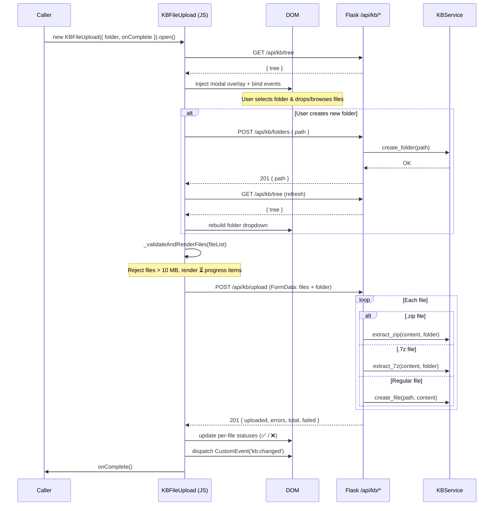

# Technical Design: KB File Upload

> Feature ID: FEATURE-049-E | Version: v1.0 | Last Updated: 03-11-2026

> program_type: fullstack
> tech_stack: ["JavaScript (ES6+)", "CSS3", "Python/Flask", "Vitest"]

---

## Part 1: Agent-Facing Summary

### Key Components Implemented

| Component | Responsibility | Scope/Impact | Tags |
|-----------|---------------|--------------|------|
| `KBFileUpload` class | Modal-based file upload UI with drag-drop, folder selection, and progress tracking | Frontend — standalone module, no framework dependency | `upload`, `modal`, `drag-drop`, `file-picker`, `progress` |
| `kb-file-upload.css` | Dark-theme styling for overlay, modal, dropzone, folder selector, and progress items | Frontend — CSS-only, uses CSS custom properties | `css`, `modal-styles`, `dropzone`, `theme-variables` |
| `POST /api/kb/upload` | Server endpoint accepting multipart files, routing to plain-save or archive-extraction | Backend — Flask route in `kb_routes.py` blueprint | `api`, `upload`, `multipart`, `archive-extraction`, `zip`, `7z` |
| `KBService.extract_zip` / `extract_7z` | Archive extraction into KB folder tree | Backend — service layer | `archive`, `zip`, `7z`, `extraction` |
| `KBService.create_file` | Persist a single uploaded file to the KB folder | Backend — service layer | `file-io`, `create`, `persistence` |

### Scope & Boundaries

**In scope:**
- Modal lifecycle (open → upload → close) triggered programmatically via `new KBFileUpload(opts).open()`
- Client-side validation: 10 MB per-file size limit, multi-file selection
- Drag-and-drop onto a styled dropzone and click-to-browse fallback
- Folder destination picker populated from `GET /api/kb/tree`, with inline new-folder creation
- Archive auto-extraction for `.zip` and `.7z` files on the backend
- Per-file upload status feedback (⏳ → ✅ / ❌)
- XSS prevention via HTML escaping of filenames
- Custom event (`kb:changed`) dispatch and `onComplete` callback on success

**Out of scope:**
- Resumable / chunked uploads
- Server-side virus scanning
- Thumbnail preview generation
- File-type whitelisting beyond archive detection

### Dependencies

| Dependency | Source | Design Link | Usage Description |
|-----------|--------|-------------|-------------------|
| `GET /api/kb/tree` | FEATURE-049-A (KB Tree) | `x-ipe-docs/requirements/EPIC-049/FEATURE-049-A/technical-design.md` | Populates the folder dropdown in the upload modal |
| `POST /api/kb/folders` | FEATURE-049-A (KB Tree) | `x-ipe-docs/requirements/EPIC-049/FEATURE-049-A/technical-design.md` | Creates new folders inline from the upload modal |
| `KBService` | `src/x_ipe/services/kb_service.py` | — | Backend service for `create_file`, `extract_zip`, `extract_7z` |
| CSS custom properties | Global theme system | — | `--bg-primary`, `--bg-secondary`, `--text-primary`, `--border-color`, `--accent-primary` |

### Major Flow

1. **Caller** instantiates `new KBFileUpload({ folder, onComplete })` and calls `.open()`.
2. `open()` fetches the folder tree via `GET /api/kb/tree`, builds the modal HTML, injects it into `document.body`, and binds all events.
3. **User** selects a destination folder (or creates a new one inline via `POST /api/kb/folders`).
4. **User** drops files onto the dropzone or clicks "browse" to open the file picker.
5. `_validateAndRenderFiles()` rejects files > 10 MB client-side and renders progress items for valid files.
6. `_uploadFiles()` sends a single `POST /api/kb/upload` (multipart/form-data) with all valid files and the target folder.
7. Backend iterates files: `.zip`/`.7z` → extract; others → `create_file`. Returns `{ uploaded, errors, total, failed }`.
8. `_updateFileStatuses()` maps server response to per-file ✅/❌ indicators.
9. On success, dispatches `kb:changed` event and invokes the `onComplete` callback.
10. **User** closes the modal (× button, background click, or Escape key).

### Usage Example

```javascript
import { KBFileUpload } from './features/kb-file-upload.js';

// Open upload modal pre-selecting a folder, refresh file list on completion
const uploader = new KBFileUpload({
  folder: 'docs/guides',
  onComplete: () => {
    console.log('Upload finished — refreshing file list');
    loadFileList();
  }
});
uploader.open();
```

---

## Part 2: Implementation Guide

### Workflow Diagram



### Component Architecture

```
┌──────────────────────────────────────────────────────┐
│  KBFileUpload (kb-file-upload.js)                    │
│                                                      │
│  ┌────────────┐  ┌──────────────┐  ┌──────────────┐ │
│  │ Modal       │  │ Folder       │  │ Dropzone     │ │
│  │ Lifecycle   │  │ Selector     │  │ & Validation │ │
│  │             │  │              │  │              │ │
│  │ open()      │  │ _loadTree()  │  │ _onDrop()    │ │
│  │ close()     │  │ _buildOpts() │  │ _browseFiles │ │
│  │ _bindClose  │  │ _newFolder() │  │ _validate()  │ │
│  └─────┬───────┘  └──────┬───────┘  └──────┬───────┘ │
│        │                 │                 │          │
│        └─────────┬───────┘                 │          │
│                  ▼                         ▼          │
│         ┌──────────────────────────────────┐         │
│         │  _uploadFiles()                  │         │
│         │  → POST /api/kb/upload           │         │
│         │  → _updateFileStatuses()         │         │
│         │  → dispatch kb:changed           │         │
│         │  → call onComplete               │         │
│         └──────────────────────────────────┘         │
└──────────────────────────────────────────────────────┘

┌──────────────────────────────────────────────────────┐
│  Flask Blueprint: kb_routes.py                       │
│                                                      │
│  POST /api/kb/upload                                 │
│   ├─ .zip  → KBService.extract_zip(content, folder)  │
│   ├─ .7z   → KBService.extract_7z(content, folder)   │
│   └─ other → KBService.create_file(dest, content)    │
│                                                      │
│  Returns: { uploaded[], errors[], total, failed }    │
└──────────────────────────────────────────────────────┘
```

### API Contracts

#### `POST /api/kb/upload`

**Request:**
- Content-Type: `multipart/form-data`
- Fields:
  - `files` (repeated): One or more file parts
  - `folder` (string): Target folder path relative to KB root (e.g. `"docs/guides"`)

**Response (201):**
```json
{
  "uploaded": ["docs/guides/readme.md", "docs/guides/notes.txt"],
  "errors": [
    { "file": "big-archive.zip", "error": "extraction failed: corrupt archive" }
  ],
  "total": 3,
  "failed": 1
}
```

**Response (400) — no files provided:**
```json
{
  "error": "No files provided"
}
```

**Error mapping per file:**
- `FileExistsError` → reported in `errors[]` with the filename
- `ValueError` → reported in `errors[]` with the filename
- Generic `Exception` → reported in `errors[]` with the filename

#### `POST /api/kb/folders` (used by inline folder creation)

**Request:** `{ "path": "docs/new-folder" }`
**Response (201):** `{ "path": "docs/new-folder" }`

### Implementation Steps

> These steps document what was implemented (retroactive design).

| Step | Description | File(s) |
|------|-------------|---------|
| 1 | Define `KBFileUpload` class with constructor accepting `{ folder, onComplete }` | `src/x_ipe/static/js/features/kb-file-upload.js` |
| 2 | Implement `open()`: fetch folder tree, build modal HTML, inject into DOM, bind events | same |
| 3 | Implement folder selector: dropdown from tree data, inline new-folder creation with POST + refresh | same |
| 4 | Implement dropzone: drag-and-drop events (`dragover`, `dragleave`, `drop`) and click-to-browse via hidden `<input type="file" multiple>` | same |
| 5 | Implement `_validateAndRenderFiles()`: 10 MB client-side check, render progress items with ⏳ | same |
| 6 | Implement `_uploadFiles()`: build `FormData`, POST to `/api/kb/upload`, parse response | same |
| 7 | Implement `_updateFileStatuses()`: map `uploaded`/`errors` arrays to ✅/❌ per progress item | same |
| 8 | Implement `close()`: fade-out animation (300 ms), remove DOM, restore body scroll | same |
| 9 | Implement `_escapeHtml()` for XSS-safe filename rendering | same |
| 10 | Style modal, overlay, dropzone, folder selector, progress items | `src/x_ipe/static/css/kb-file-upload.css` |
| 11 | Add `POST /api/kb/upload` route with archive detection and per-file error handling | `src/x_ipe/routes/kb_routes.py` |
| 12 | Write 33 Vitest tests covering modal, folder selector, dropzone, validation, upload, and constructor | `tests/frontend-js/kb-file-upload.test.js` |

### Edge Cases & Error Handling

| Edge Case | Handling | Layer |
|-----------|----------|-------|
| File exceeds 10 MB | Rejected client-side before upload; shown as ❌ with size error message | Frontend |
| Mixed valid + oversized files | Valid files are uploaded; oversized files shown inline as rejected | Frontend |
| Network failure during upload | Catch block renders "Upload failed" for all pending items | Frontend |
| Corrupt `.zip` / `.7z` archive | `KBService` raises exception; backend returns error in `errors[]` array | Backend |
| File already exists at destination | `FileExistsError` caught; reported in `errors[]` per file | Backend |
| Invalid file content (non-UTF-8 for text) | `ValueError` caught; reported in `errors[]` | Backend |
| No files selected | Backend returns 400 `"No files provided"` | Backend |
| Empty folder name in new-folder input | Frontend blocks submission; does not call API | Frontend |
| XSS in filename (e.g. `<script>`) | `_escapeHtml()` uses `div.textContent` to neutralize HTML entities | Frontend |
| Modal closed during upload | Modal DOM removed; no crash — fetch continues but response is discarded | Frontend |
| Scroll lock leak | `close()` always restores `document.body.style.overflow` | Frontend |

---

## Design Change Log

| Version | Date | Author | Changes |
|---------|------|--------|---------|
| v1.0 | 03-11-2026 | Echo 📡 | Initial retroactive technical design from implemented code |
