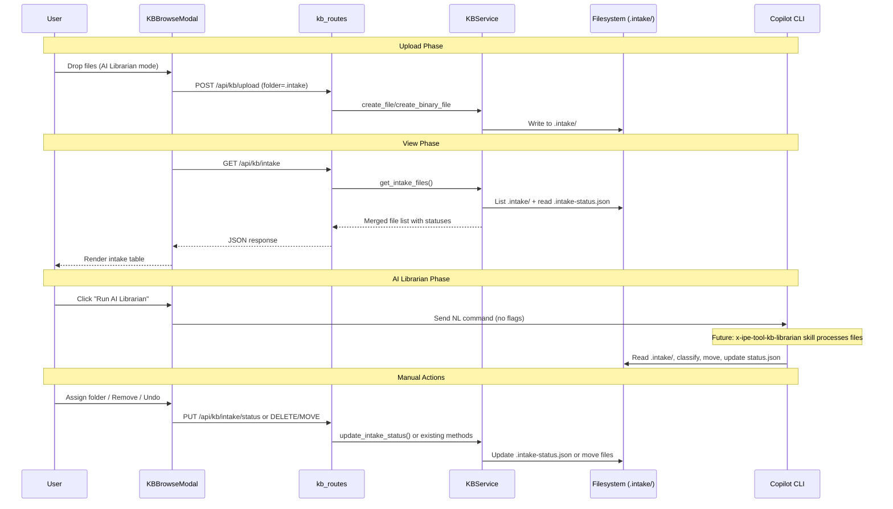
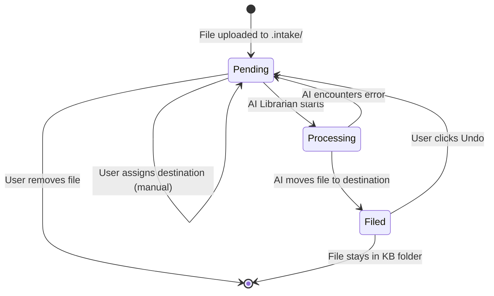
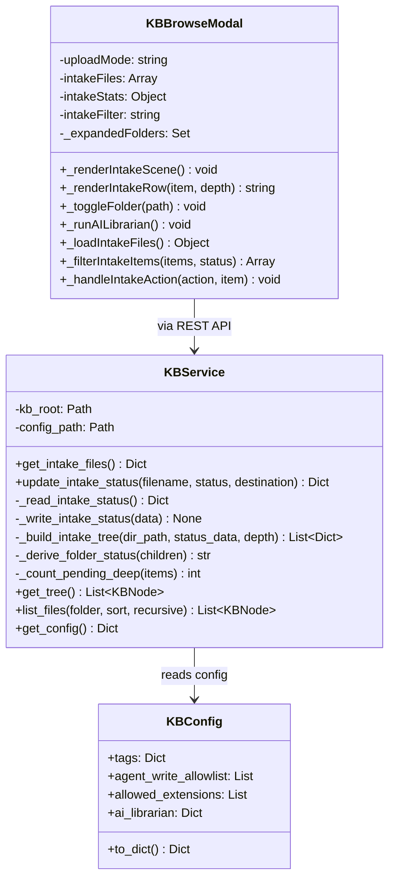
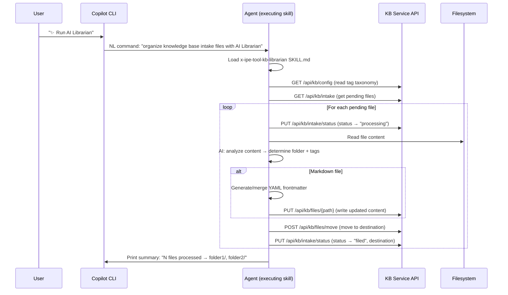
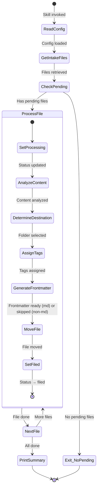
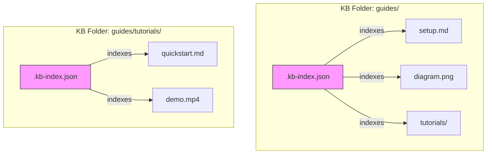
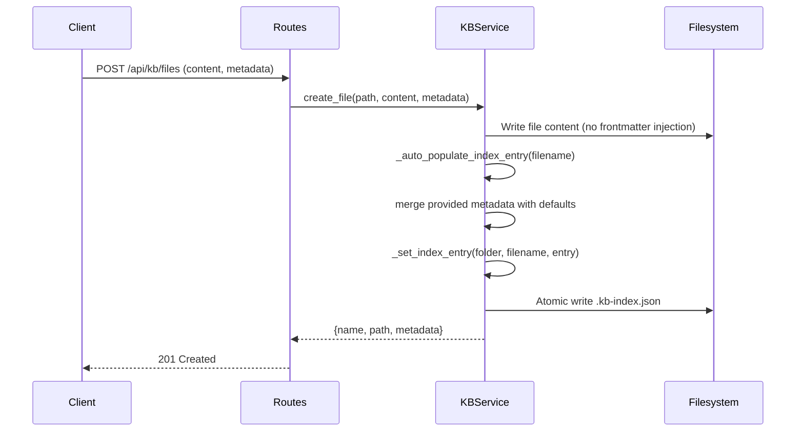

# Technical Design: KB AI Librarian & Intake

> Feature ID: FEATURE-049-F | Version: v1.2 | Last Updated: 03-18-2026

---

## Part 1: Agent-Facing Summary

> **Purpose:** Quick reference for AI agents navigating large projects.
> **📌 AI Coders:** Focus on this section for implementation context.

### Key Components Implemented

| Component | Responsibility | Scope/Impact | Tags |
|-----------|----------------|--------------|------|
| `KBService.get_intake_files()` | List .intake/ items (files AND folders) as nested tree, merge with status from .intake-status.json, derive folder statuses from children | Intake item listing with status | #kb #intake #service #backend |
| `KBService.update_intake_status()` | Update a single file's status/destination in .intake-status.json; folder assign cascades to all children | Status persistence | #kb #intake #status #backend |
| `KBService._build_intake_tree()` | Recursively build nested tree of .intake/ items with derived folder status and deep pending count | Tree data model (CR-005) | #kb #intake #tree #backend |
| `KBService._derive_folder_status()` | Compute folder status from children: pending > processing > filed | Status derivation (CR-005) | #kb #intake #status #backend |
| `KBConfig.ai_librarian` extension | Add `skill` field to ai_librarian config | Config schema | #kb #config #backend |
| `GET /api/kb/intake` | Route returning intake items as nested tree with pre-loaded children and deep pending count | Intake API | #kb #intake #api #route |
| `PUT /api/kb/intake/status` | Route to update a file's intake status (folder assign cascades) | Status update API | #kb #intake #api #route |
| `.github/skills/x-ipe-tool-kb-librarian/SKILL.md` | Tool skill: AI-powered intake file organizer — analyzes content, assigns tags, generates frontmatter, moves files | Skill file | #kb #librarian #skill #tool |
| `KBBrowseModal._renderIntakeScene()` | Full intake view: tree table with expand/collapse, status badges, filters, statistics, per-item actions | Intake UI (mockup Scene 4) | #kb #intake #frontend #ui |
| `KBBrowseModal._renderIntakeRow()` | Render single intake row — file or folder with indentation, toggle, icons, actions | Tree row rendering (CR-005) | #kb #intake #frontend #ui |
| `KBBrowseModal._runAILibrarian()` fix | Remove --workflow-mode, use plain NL command | Command fix | #kb #intake #frontend |

### Dependencies

| Dependency | Source | Design Link | Usage Description |
|------------|--------|-------------|-------------------|
| `KBService` | FEATURE-049-A | [x-ipe-docs/requirements/EPIC-049/FEATURE-049-A/technical-design.md](x-ipe-docs/requirements/EPIC-049/FEATURE-049-A/technical-design.md) | Base service for file/folder CRUD, config, tree, path safety |
| `kb_routes` | FEATURE-049-A | [x-ipe-docs/requirements/EPIC-049/FEATURE-049-A/technical-design.md](x-ipe-docs/requirements/EPIC-049/FEATURE-049-A/technical-design.md) | REST API blueprint, error handling pattern |
| `KBBrowseModal` | FEATURE-049-C | N/A | Browse modal class with scene switching, upload modes, intake scaffolding |
| `POST /api/kb/upload` | FEATURE-049-E | N/A | File upload with folder parameter (used for .intake uploads) |
| `PUT /api/kb/files/move` | FEATURE-049-A | N/A | Move files between folders (used for undo-filed) |

### Major Flow

1. User toggles to "AI Librarian" upload mode → files upload to `.intake/` via existing `POST /api/kb/upload` with `folder=.intake`
2. Intake view calls `GET /api/kb/intake` → service recursively reads `.intake/` items (files + folders) + `.intake-status.json` → returns pre-loaded nested tree with derived folder statuses and deep pending count
3. Frontend renders tree table — folders show chevron toggle (▶/▼), folder icon, item count; files show file icon, size. All children pre-loaded (client-side expand/collapse)
4. User clicks "✨ Run AI Librarian" → plain NL command sent to Copilot CLI → AI skill processes individual files, updates `.intake-status.json`, moves files
5. Intake view refreshes → shows updated statuses; folder statuses auto-derive from children
6. User can: Preview files, Assign destination (files or folders — folder cascades to children), Remove (files or folders — folder removes recursively), Undo filed (files or folders — folder undoes all children)

### Usage Example

```python
# Backend: get intake items as nested tree
svc = app.config['KB_SERVICE']
result = svc.get_intake_files()
# Returns: {
#   "items": [
#     {"name": "notes.md", "type": "file", "size_bytes": 1024, "status": "pending", ...},
#     {"name": "extracted-docs/", "type": "folder", "item_count": 3, "status": "pending",
#      "children": [
#        {"name": "readme.md", "type": "file", "size_bytes": 512, "status": "pending", ...},
#        {"name": "images/", "type": "folder", "item_count": 2, "status": "filed", "children": [...]}
#      ]}
#   ],
#   "stats": {"total": 2, "pending": 1, "processing": 0, "filed": 1},
#   "pending_deep_count": 4
# }

# Backend: update status (folder assign cascades to all children)
svc.update_intake_status("extracted-docs/readme.md", status="processing", destination="guides/")
```

```javascript
// Frontend: expand/collapse folder (client-side, no API call)
_toggleFolder(folderPath) {
    if (this._expandedFolders.has(folderPath)) {
        this._expandedFolders.delete(folderPath);
    } else {
        this._expandedFolders.add(folderPath);
    }
    this._renderIntakeScene();
}
```

---

## Part 2: Implementation Guide

> **Purpose:** Human-readable details for developers.
> **📌 Emphasis on visual diagrams for comprehension.**

### Workflow Diagram



### State Diagram: Intake File Lifecycle



### Class Diagram



### Data Models

#### `.intake-status.json` Schema

```json
{
  "sprint-retro-notes-q1.md": {
    "status": "pending",
    "destination": null,
    "updated_at": "2026-03-16T10:30:00Z"
  },
  "architecture-decisions-adr.md": {
    "status": "processing",
    "destination": "api-guidelines/",
    "updated_at": "2026-03-16T10:35:00Z"
  },
  "logo-variants-2026.svg": {
    "status": "filed",
    "destination": "brand-assets/",
    "updated_at": "2026-03-16T10:40:00Z"
  }
}
```

**Rules:**
- File in `.intake/` with NO status.json entry → status = `"pending"`, destination = `null`
- Status.json entry for file NOT in `.intake/` → silently ignored (stale)
- Corrupted/missing status.json → all files = `"pending"`

#### KBConfig.ai_librarian Extension

```python
ai_librarian: Dict[str, Any] = field(default_factory=lambda: {
    'enabled': False,
    'intake_folder': '.intake',
    'skill': 'x-ipe-tool-kb-librarian',
})
```

#### GET /api/kb/intake Response

```json
{
  "items": [
    {
      "name": "sprint-retro-notes-q1.md",
      "path": "sprint-retro-notes-q1.md",
      "type": "file",
      "size_bytes": 24576,
      "modified_date": "2026-03-11T00:00:00",
      "file_type": "md",
      "status": "pending",
      "destination": null
    },
    {
      "name": "extracted-docs",
      "path": "extracted-docs",
      "type": "folder",
      "item_count": 3,
      "status": "pending",
      "children": [
        {
          "name": "readme.md",
          "path": "extracted-docs/readme.md",
          "type": "file",
          "size_bytes": 1024,
          "modified_date": "2026-03-11T00:00:00",
          "file_type": "md",
          "status": "pending",
          "destination": null
        },
        {
          "name": "images",
          "path": "extracted-docs/images",
          "type": "folder",
          "item_count": 2,
          "status": "filed",
          "children": []
        }
      ]
    }
  ],
  "stats": {
    "total": 2,
    "pending": 1,
    "processing": 0,
    "filed": 1
  },
  "pending_deep_count": 4
}
```

**Response field changes (CR-005):**
- `files` → `items` (renamed to reflect files + folders)
- Each item has `type: "file"|"folder"`
- Folders have `item_count`, `children` array, NO `size_bytes`/`file_type`
- Folder `status` is derived (not from `.intake-status.json`)
- `stats.total` = top-level item count only
- `pending_deep_count` = total pending files across all folders (for sidebar badge)
```

#### PUT /api/kb/intake/status Request/Response

```json
// Request
{ "filename": "notes.md", "status": "pending", "destination": "api-guidelines/" }

// Response (200)
{ "ok": true, "filename": "notes.md", "status": "pending", "destination": "api-guidelines/" }

// Error (404)
{ "error": "FILE_NOT_FOUND", "message": "File not in .intake/" }
```

### Implementation Steps

#### 1. Backend: KBConfig Extension (~5 lines)

In `kb_service.py`, update `KBConfig.ai_librarian` default to include `skill` field:

```python
ai_librarian: Dict[str, Any] = field(default_factory=lambda: {
    'enabled': False,
    'intake_folder': '.intake',
    'skill': 'x-ipe-tool-kb-librarian',
})
```

#### 2. Backend: Intake Service Methods (~120 lines in kb_service.py)

Add to `KBService`:

**`_read_intake_status()`** — Private helper. Reads `.intake-status.json` from `.intake/` folder. Returns empty dict on missing/corrupt file (logs warning).

**`_write_intake_status(data)`** — Private helper. Writes status dict to `.intake-status.json` using the existing `_write_json()` method (atomic temp+rename pattern, same as config writes).

**`_build_intake_tree(dir_path, status_data, depth=0)`** — Private helper (CR-005). Recursively builds nested tree:
```python
def _build_intake_tree(self, dir_path: Path, status_data: dict, depth: int = 0) -> list:
    items = []
    try:
        entries = sorted(dir_path.iterdir(), key=lambda p: (p.is_file(), p.name.lower()))
    except PermissionError:
        return items
    for entry in entries:
        if entry.name == self.INTAKE_STATUS_FILE or entry.name.startswith('.'):
            continue
        rel_path = str(entry.relative_to(self.kb_root / INTAKE_FOLDER))
        if entry.is_dir():
            children = self._build_intake_tree(entry, status_data, depth + 1)
            items.append({
                'name': entry.name,
                'path': rel_path,
                'type': 'folder',
                'item_count': len(children),
                'status': self._derive_folder_status(children),
                'children': children,
            })
        elif entry.is_file():
            stat = entry.stat()
            entry_status = status_data.get(rel_path, {})
            items.append({
                'name': entry.name,
                'path': rel_path,
                'type': 'file',
                'size_bytes': stat.st_size,
                'modified_date': date.fromtimestamp(stat.st_mtime).isoformat(),
                'file_type': entry.suffix.lstrip('.') if entry.suffix else '',
                'status': entry_status.get('status', 'pending'),
                'destination': entry_status.get('destination'),
            })
    return items
```

**`_derive_folder_status(children)`** — Private helper (CR-005). Derives folder status from children:
```python
def _derive_folder_status(self, children: list) -> str:
    statuses = set()
    for child in children:
        if child['type'] == 'folder':
            statuses.add(child['status'])  # already derived recursively
        else:
            statuses.add(child['status'])
    if 'pending' in statuses:
        return 'pending'
    if 'processing' in statuses:
        return 'processing'
    if 'filed' in statuses:
        return 'filed'
    return 'pending'  # empty folder defaults to pending
```

**`_count_pending_deep(items)`** — Private helper (CR-005). Counts all pending files across nested tree:
```python
def _count_pending_deep(self, items: list) -> int:
    count = 0
    for item in items:
        if item['type'] == 'file' and item['status'] == 'pending':
            count += 1
        elif item['type'] == 'folder':
            count += self._count_pending_deep(item.get('children', []))
    return count
```

**`get_intake_files()`** — Refactored (CR-005):
1. Build nested tree via `_build_intake_tree()` (replaces flat `iterdir()` loop)
2. Calculate top-level stats from tree root items
3. Calculate `pending_deep_count` via `_count_pending_deep()`
4. Return `{"items": [...], "stats": {...}, "pending_deep_count": N}`

**`update_intake_status(filename, status, destination=None)`** — Extended (CR-005):
1. `filename` is now a relative path (e.g., `subfolder/file.md`)
2. Verify file exists in `.intake/` at the relative path
3. For folder assign: detect if target is directory → recursively update ALL child files in `.intake-status.json`
4. Write back atomically, invalidate cache

#### 3. Backend: Intake Routes (~40 lines in kb_routes.py)

**`GET /api/kb/intake`:**
```python
@kb_bp.route('/api/kb/intake')
def get_intake():
    svc = _get_kb_service_or_abort()
    return jsonify(svc.get_intake_files())
```

**`PUT /api/kb/intake/status`:**
```python
@kb_bp.route('/api/kb/intake/status', methods=['PUT'])
def update_intake_status():
    svc = _get_kb_service_or_abort()
    data = request.get_json(force=True)
    filename = data.get('filename', '').strip()
    status = data.get('status', '').strip()
    destination = data.get('destination')
    # Validate
    if not filename or status not in ('pending', 'processing', 'filed'):
        return _error('INVALID_INPUT', 'filename and valid status required', 400)
    try:
        result = svc.update_intake_status(filename, status, destination)
        return jsonify(result)
    except ValueError as e:
        return _error('FILE_NOT_FOUND', str(e), 404)
```

#### 4. Frontend: Fix _runAILibrarian() (~3 lines in kb-browse-modal.js)

```javascript
_runAILibrarian() {
    const command = 'organize knowledge base intake files with AI Librarian';
    // ... rest unchanged
}
```

#### 5. Frontend: Enhanced Intake Scene (~250 lines in kb-browse-modal.js)

**New instance state (CR-005):**
```javascript
this._expandedFolders = new Set(); // tracks expanded folder paths
```

Update `_renderIntakeScene()` to match mockup Scene 4 with folder tree:

**Header:** Title + "✨ Run AI Librarian" gradient purple button
**Statistics bar:** Total (purple), Pending (orange), Processing (blue), Filed (green) badges — stats use top-level counts; sidebar badge uses `pending_deep_count`
**Filter pills:** All | Pending | Processing | Filed — toggles `this.intakeFilter`
**Intake table:** Name | Size/Items | Uploaded | Status | Destination | Actions columns
**Empty state:** When `items.length === 0`, show drop zone with "Drop more files into Intake, or browse" message instead of table
**Row styling:** Pending = normal, Processing = blue bg, Filed = dimmed (opacity 0.7)
**Actions per status and type:**
- File Pending: Preview (eye), Assign (folder), Remove (X)
- File Processing: all disabled
- File Filed: View in KB (arrow), Undo (refresh)
- Folder Pending: Assign (folder), Remove (X) — NO Preview
- Folder Filed: Undo (refresh) — cascades to children
- Folder Processing: all disabled
**Drop zone:** Purple dashed border at bottom

**`_renderIntakeRow(item, depth=0)`** — New method (CR-005). Renders a single table row:
```javascript
_renderIntakeRow(item, depth = 0) {
    const indent = depth * 20; // 20px per nesting level
    const isFolder = item.type === 'folder';
    const isExpanded = this._expandedFolders.has(item.path);

    let nameCell = '';
    if (isFolder) {
        const chevron = isExpanded ? 'bi-chevron-down' : 'bi-chevron-right';
        const folderIcon = isExpanded ? 'bi-folder2-open' : 'bi-folder';
        nameCell = `
            <td style="padding-left:${indent + 8}px">
                <span class="kb-intake-toggle" data-intake-toggle="${this._escapeAttr(item.path)}"
                      style="cursor:pointer;margin-right:4px">
                    <i class="bi ${chevron}"></i>
                </span>
                <i class="bi ${folderIcon}" style="margin-right:6px;color:#8b5cf6"></i>
                ${this._escapeHtml(item.name)}
            </td>`;
    } else {
        nameCell = `
            <td style="padding-left:${indent + 24}px">
                <i class="bi bi-file-earmark-text" style="margin-right:6px;opacity:0.6"></i>
                ${this._escapeHtml(item.name)}
            </td>`;
    }

    const sizeCell = isFolder
        ? `<td>${item.item_count} item${item.item_count !== 1 ? 's' : ''}</td>`
        : `<td>${this._formatSize(item.size_bytes)}</td>`;

    // ... status badge, destination, actions (per type) ...
    let rows = `<tr class="kb-intake-row" data-item-path="${this._escapeAttr(item.path)}">${nameCell}${sizeCell}...rest...</tr>`;

    // Render children if folder is expanded
    if (isFolder && isExpanded && item.children) {
        for (const child of item.children) {
            rows += this._renderIntakeRow(child, depth + 1);
        }
    }
    return rows;
}
```

**`_toggleFolder(path)`** — New method (CR-005):
```javascript
_toggleFolder(path) {
    if (this._expandedFolders.has(path)) {
        this._expandedFolders.delete(path);
    } else {
        this._expandedFolders.add(path);
    }
    this._renderIntakeScene(); // re-render with new expand state
}
```

**`_filterIntakeItems(items, status)`** — New method (CR-005). Recursive filter that preserves folder hierarchy:
```javascript
_filterIntakeItems(items, status) {
    if (!status || status === 'all') return items;
    return items.filter(item => {
        if (item.type === 'file') return item.status === status;
        // Folder: show if ANY descendant matches
        const filteredChildren = this._filterIntakeItems(item.children || [], status);
        return filteredChildren.length > 0;
    }).map(item => {
        if (item.type === 'folder') {
            return { ...item, children: this._filterIntakeItems(item.children || [], status) };
        }
        return item;
    });
}
```

**Event delegation (CR-005):** Add handler for `data-intake-toggle` clicks in the intake scene event listener:
```javascript
const toggle = e.target.closest('[data-intake-toggle]');
if (toggle) {
    this._toggleFolder(toggle.dataset.intakeToggle);
    return;
}
```

#### 6. Frontend: Intake Data Loading (~30 lines)

Update `_loadIntakeFiles()` to use `GET /api/kb/intake` and handle nested tree response:
```javascript
async _loadIntakeFiles() {
    try {
        const res = await fetch('/api/kb/intake');
        if (!res.ok) return { items: [], stats: { total: 0, pending: 0, processing: 0, filed: 0 }, pending_deep_count: 0 };
        return await res.json();
    } catch { return { items: [], stats: { total: 0, pending: 0, processing: 0, filed: 0 }, pending_deep_count: 0 }; }
}
```

Update `_refreshIntakeFiles()` to use `pending_deep_count` for sidebar badge:
```javascript
async _refreshIntakeFiles() {
    const data = await this._loadIntakeFiles();
    this._intakeItems = data.items || [];
    this._intakeStats = data.stats || {};
    this._updateIntakeBadges(data.pending_deep_count || 0);  // deep count for sidebar
    if (this.currentScene === 'intake') {
        this._renderIntakeScene();
    }
}
```

#### 7. Frontend: Per-Item Action Handlers (~80 lines)

Implement a single dispatcher method `_handleIntakeAction(action, item)` that routes to action-specific logic:

**Preview (file only):** Reuse existing article preview (call `_showScene('article')` with file data)
**Assign folder (file or folder):** Show folder picker (reuse existing `_showFolderPicker()` from browse modal), then `PUT /api/kb/intake/status` with destination. For folders: backend cascades to all children.
**Remove (file or folder):** Confirm → `DELETE /api/kb/files/.intake/{path}` → refresh. For folders: confirmation warns "This will delete the folder and all its contents."
**View in KB (file only):** Navigate browse view to destination folder
**Undo (file or folder):** For file: `PUT /api/kb/files/move` (source: destination, target: `.intake/{filename}`) → `PUT /api/kb/intake/status` (status: pending, destination: null) → refresh. For folder: `PUT /api/kb/intake/status` with folder path → backend cascades undo to all children → refresh

**Action dispatch table (CR-005):**

| Action | File | Folder |
|--------|------|--------|
| Preview | ✅ `_showArticle()` | ❌ Not available |
| Assign | ✅ Single file update | ✅ Cascades to all children |
| Remove | ✅ Delete file | ✅ Delete folder + contents |
| View in KB | ✅ Navigate to dest | ❌ Not available |
| Undo | ✅ Move back + reset | ✅ Cascades undo to all children |

#### 8. Frontend: Sidebar Intake Badge (~10 lines)

In `_renderSidebarFolders()`, update the "📥 Intake" entry to show pending count badge fetched from `GET /api/kb/intake` stats.

### Edge Cases & Error Handling

| Scenario | Expected Behavior | Component |
|----------|-------------------|-----------|
| `.intake-status.json` corrupted | `_read_intake_status()` returns `{}`, logs warning | KBService |
| `.intake-status.json` missing | Returns `{}` (all files = pending) | KBService |
| File in status.json but deleted from .intake | Ignored in merge (stale entry) | KBService.get_intake_files() |
| `.intake/` folder doesn't exist | `get_intake_files()` returns empty, `_uploadIntakeFiles()` creates it | KBService / frontend |
| Concurrent status writes | `_write_intake_status()` uses atomic write (temp+rename) | KBService |
| Undo filed: destination folder gone | Move fails → show error toast | Frontend |
| Duplicate filename upload | Handled by existing upload route (numeric suffix) | kb_routes upload |
| ai_librarian.enabled = false | Frontend hides all intake UI | KBBrowseModal |
| Empty folder in .intake/ (CR-005) | Show folder row with "0 items"; expanding shows no children | _renderIntakeRow |
| Deeply nested folders 5+ levels (CR-005) | Recursive tree build + rendering with cumulative indentation | _build_intake_tree / _renderIntakeRow |
| Folder with mixed-status children (CR-005) | Folder shown in all matching filter views; derived status = highest priority | _filterIntakeItems / _derive_folder_status |
| Folder removal with filed children (CR-005) | Confirmation warns "This folder contains filed items" | _handleIntakeAction |
| Large tree 500+ items (CR-005) | Pre-loaded in single API call; no pagination needed (NFR-049-F.6) | get_intake_files |
| Status.json has path for deleted subfolder (CR-005) | Stale entries ignored — only files present on disk are included | _build_intake_tree |

### Step 9: Create `x-ipe-tool-kb-librarian` Skill (CR-001)

**Files:** `.github/skills/x-ipe-tool-kb-librarian/SKILL.md`
**program_type:** skills
**Created via:** `x-ipe-meta-skill-creator`

#### Skill Architecture



#### Skill State Machine



#### Skill SKILL.md Structure

The skill follows the x-ipe tool skill template:

```yaml
# SKILL.md structure
name: x-ipe-tool-kb-librarian
description: "Organize knowledge base intake files — analyze content, assign tags, generate frontmatter, move to destination folders."
triggers:
  - "organize knowledge base intake files with AI Librarian"
  - "run AI Librarian"
  - "organize intake"

input:
  kb_root: "auto-detect from project"  # x-ipe-docs/knowledge-base/
  intake_folder: ".intake"              # from kb-config.json

operations:
  - organize_intake:
      1. Read KB config (tag taxonomy, folder structure)
      2. Get all intake files via GET /api/kb/intake
      3. Filter to status == "pending"
      4. For each file:
         a. Update status → "processing"
         b. Read file content
         c. AI: analyze → determine destination folder + lifecycle/domain tags
         d. If destination pre-assigned in status.json → use it (skip AI folder selection)
         e. If markdown: generate/merge frontmatter (title, tags, author, created, auto_generated=true)
         f. If destination folder doesn't exist → create it
         g. Move file from .intake/ to destination
         h. Update status → "filed" with destination path
      5. Print terminal summary

output:
  files_processed: int
  destinations: list[str]
  errors: list[str]  # files that failed (continued processing others)
```

#### Key Design Decisions (from DAO)

| Decision | Choice | Rationale |
|----------|--------|-----------|
| Processing mode | Batch all pending | KISS — user clicked button = intent to process all |
| Folder determination | UI-assigned > AI fallback | Respect explicit user choices, AI fills gaps |
| Non-markdown files | Move + status track, skip frontmatter | Can't inject YAML into PDFs/images |
| Summary output | Terminal print | Simple, visible, no file overhead |
| Folder creation | Auto-create if needed | Cheap, reversible, preserves AI accuracy |
| Existing frontmatter | Preserve + merge (no overwrite) | Non-destructive, respect original metadata |

#### AI Classification Approach

The agent executing this skill uses its LLM capabilities to:
1. **Read file content** — extract key topics, domain terminology, structure
2. **Scan KB folder structure** — understand existing organization (via tree API)
3. **Match content to folder** — semantic matching of content topics to folder names/purposes
4. **Assign tags** — select from the config-defined taxonomy:
   - Lifecycle: Ideation, Requirement, Design, Implementation, Testing, Deployment, Maintenance
   - Domain: API, Authentication, UI-UX, Database, Infrastructure, Security, Performance, Integration, Documentation, Analytics
5. **Generate title** — derive from filename or first heading

No external AI API calls needed — the executing agent IS the LLM.

### Step 10: `.kb-index.json` Metadata Registry (CR-002)

**Motivation:** Replace frontmatter-embedded metadata with a centralized, per-folder JSON registry. Works for ALL file types (images, videos, PDFs) and supports folder-level metadata.

#### Architecture Overview



**Key Design Principle:** Each `.kb-index.json` is locally-scoped — it indexes ONLY the files and immediate subfolders in its own directory. Nested subdirectories have their own `.kb-index.json`.

#### `.kb-index.json` Schema

```json
{
  "version": "1.0",
  "entries": {
    "setup.md": {
      "title": "Environment Setup Guide",
      "description": "Step-by-step guide for setting up the local development environment with required tools and dependencies.",
      "tags": {
        "domain": ["infrastructure"],
        "lifecycle": ["implementation"]
      },
      "author": "yzhang",
      "created": "2026-03-16",
      "type": "markdown",
      "auto_generated": false
    },
    "diagram.png": {
      "title": "Architecture Diagram",
      "description": "High-level system architecture showing component interactions and data flow paths.",
      "tags": {
        "domain": ["infrastructure"],
        "lifecycle": ["design"]
      },
      "author": "unknown",
      "created": "2026-03-16",
      "type": "image",
      "auto_generated": false
    },
    "tutorials/": {
      "title": "Tutorial Materials",
      "description": "Collection of quickstart guides and demo videos for onboarding new team members.",
      "tags": {
        "domain": ["documentation"],
        "lifecycle": ["implementation"]
      }
    }
  }
}
```

**Schema Rules:**
- `version`: Always `"1.0"` (for future schema migrations)
- Keys: filename for files, foldername + `/` for subfolders
- `type` field (files only): `markdown`, `image`, `video`, `pdf`, `document`, `other`
- `description`: Max 100 words, plain text
- `auto_generated`: Whether metadata was AI-generated (default `false`)
- Missing entry = file has no metadata (defaults from filename/extension)
- Folder entries do NOT have `type`, `author`, `created`, or `auto_generated` fields

#### Type Detection

```python
EXTENSION_TYPE_MAP = {
    '.md': 'markdown',
    '.png': 'image', '.jpg': 'image', '.jpeg': 'image',
    '.gif': 'image', '.svg': 'image', '.webp': 'image',
    '.mp4': 'video', '.mov': 'video', '.webm': 'video', '.avi': 'video',
    '.pdf': 'pdf',
    '.doc': 'document', '.docx': 'document', '.xls': 'document',
    '.xlsx': 'document', '.ppt': 'document', '.pptx': 'document',
}
# Default: 'other'
```

#### New/Refactored Methods in `kb_service.py`

| Method | Type | Purpose |
|--------|------|---------|
| `_read_kb_index(folder_path)` | New | Read `.kb-index.json` from folder; return `{}` entries if missing |
| `_write_kb_index(folder_path, index_data)` | New | Atomic write `.kb-index.json` to folder (temp+rename) |
| `_get_index_entry(folder_path, name)` | New | Get single entry from folder's index; return `None` if missing |
| `_set_index_entry(folder_path, name, entry)` | New | Set/update single entry in folder's index |
| `_remove_index_entry(folder_path, name)` | New | Remove entry from folder's index |
| `_auto_populate_index_entry(filename)` | Refactor | Default metadata from filename/extension (was `_auto_populate_frontmatter`) |
| `_detect_file_type(filename)` | New | Map file extension to type string |
| `_migrate_frontmatter_to_index(folder_path)` | New | One-time: read YAML frontmatter from .md files, write to `.kb-index.json` |

#### Migration Strategy (Frontmatter → Index)

```
For each KB folder:
  1. Scan for .md files with YAML frontmatter
  2. Parse frontmatter (title, tags, author, created)
  3. Write entries to .kb-index.json (preserve all existing values)
  4. Do NOT remove frontmatter from .md files (non-destructive)
  5. Mark index entries with auto_generated: false (human-authored frontmatter)
```

After migration, `_ensure_file_index()` reads from `.kb-index.json` instead of parsing frontmatter.

#### API Compatibility

The API response shape is preserved — no frontend changes needed:

```
Before (frontmatter):  file.frontmatter.title → from YAML in .md file
After (index):         file.frontmatter.title → from .kb-index.json entry
```

The `frontmatter` key in API responses is kept for backwards compatibility but now sourced from the index. Future API versions may rename it to `metadata`.

#### Sequence: File Creation with Index Entry



### File Change Summary

| File | Changes | Est. Lines |
|------|---------|------------|
| `src/x_ipe/services/kb_service.py` | Refactor `get_intake_files()` to build nested tree. Add `_build_intake_tree()`, `_derive_folder_status()`, `_count_pending_deep()`. Extend `update_intake_status()` for relative paths and folder-cascade assign. Add `_read_kb_index()`, `_write_kb_index()`, `_get/set/remove_index_entry()`, `_auto_populate_index_entry()`, `_detect_file_type()`, `_migrate_frontmatter_to_index()`. | ~220 |
| `src/x_ipe/routes/kb_routes.py` | Update `GET /api/kb/intake` response (items→nested tree). Update `PUT /api/kb/intake/status` for relative paths and folder targets. | ~20 |
| `src/x_ipe/static/js/features/kb-browse-modal.js` | Refactor `_renderIntakeScene()` for tree rendering. Add `_renderIntakeRow()`, `_toggleFolder()`, `_filterIntakeItems()`. Add `_expandedFolders` state. Update `_handleIntakeAction()` for folder actions. Update `_refreshIntakeFiles()` for `pending_deep_count`. | ~120 |
| `.github/skills/x-ipe-tool-kb-librarian/SKILL.md` | Update procedure: generate index entries instead of frontmatter. Remove markdown-only gate. All file types get metadata. | ~30 |
| `tests/test_kb_service.py` | Add tests for `_build_intake_tree()`, `_derive_folder_status()`, `_count_pending_deep()`, folder-cascade assign, nested tree response. Update existing intake tests for `items` key (was `files`). | ~100 |
| `tests/frontend-js/kb-intake-049f.test.js` | Add tests for `_renderIntakeRow()`, `_toggleFolder()`, `_filterIntakeItems()`, folder actions, expand/collapse state, indentation. Update mocks for nested tree API response. | ~80 |

---

## Design Change Log

| Date | Phase | Change Summary |
|------|-------|----------------|
| 03-16-2026 | Initial Design | Initial technical design for FEATURE-049-F. Backend: intake status service + 2 routes. Frontend: full intake scene matching mockup Scene 4 with status tracking, filters, per-file actions. Command fix: remove --workflow-mode. |
| 03-16-2026 | CR-001 Skill Design | Added Step 9: x-ipe-tool-kb-librarian skill design. program_type=skills. Sequence diagram, state machine, SKILL.md structure, AI classification approach, 6 DAO-driven decisions. |
| 03-17-2026 | CR-002 Metadata Registry | Added Step 10: .kb-index.json registry design. Replaces frontmatter-embedded metadata. Per-folder hidden JSON index, folder metadata support, description field (< 100 words). Migration strategy, API compatibility, new/refactored methods. |
| 03-18-2026 | CR-005 Folder Support | Backend: refactored `get_intake_files()` for nested tree via `_build_intake_tree()`, derived folder status via `_derive_folder_status()`, deep pending count. API response changed: `files`→`items`, added `children`/`type`/`item_count`/`pending_deep_count`. Frontend: added `_renderIntakeRow()` with indent/chevron/folder icons, `_toggleFolder()` for expand/collapse, `_filterIntakeItems()` for recursive filter propagation, folder-specific actions (Assign cascades, Remove recursive, Undo cascades). DAO decisions: derived status, pre-loaded tree, no lazy loading, deep-count badge. |
