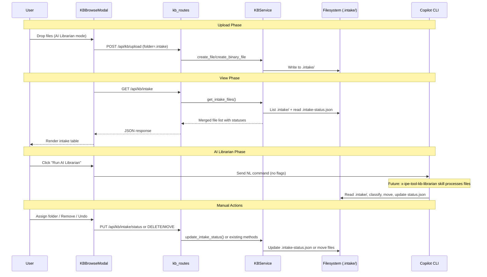
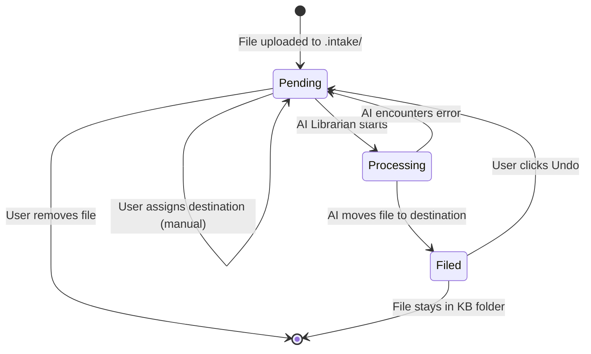
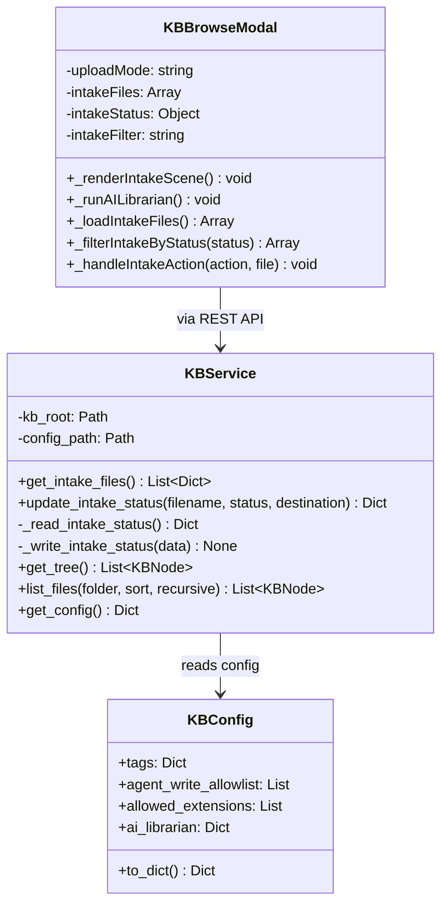

# Technical Design: KB AI Librarian & Intake

> Feature ID: FEATURE-049-F | Version: v1.0 | Last Updated: 03-16-2026

---

## Part 1: Agent-Facing Summary

> **Purpose:** Quick reference for AI agents navigating large projects.
> **📌 AI Coders:** Focus on this section for implementation context.

### Key Components Implemented

| Component | Responsibility | Scope/Impact | Tags |
|-----------|----------------|--------------|------|
| `KBService.get_intake_files()` | List .intake/ files merged with status from .intake-status.json | Intake file listing with status | #kb #intake #service #backend |
| `KBService.update_intake_status()` | Update a single file's status/destination in .intake-status.json | Status persistence | #kb #intake #status #backend |
| `KBConfig.ai_librarian` extension | Add `skill` field to ai_librarian config | Config schema | #kb #config #backend |
| `GET /api/kb/intake` | Route returning intake files with merged status | Intake API | #kb #intake #api #route |
| `PUT /api/kb/intake/status` | Route to update a file's intake status | Status update API | #kb #intake #api #route |
| `KBBrowseModal._renderIntakeScene()` | Full intake view: table, status badges, filters, statistics, per-file actions | Intake UI (mockup Scene 4) | #kb #intake #frontend #ui |
| `KBBrowseModal._runAILibrarian()` fix | Remove --workflow-mode, use plain NL command | Command fix | #kb #intake #frontend |

### Dependencies

| Dependency | Source | Design Link | Usage Description |
|------------|--------|-------------|-------------------|
| `KBService` | FEATURE-049-A | [x-ipe-docs/requirements/EPIC-049/FEATURE-049-A/technical-design.md](x-ipe-docs/requirements/EPIC-049/FEATURE-049-A/technical-design.md) | Base service for file/folder CRUD, config, tree, path safety |
| `kb_routes` | FEATURE-049-A | [x-ipe-docs/requirements/EPIC-049/FEATURE-049-A/technical-design.md](x-ipe-docs/requirements/EPIC-049/FEATURE-049-A/technical-design.md) | REST API blueprint, error handling pattern |
| `KBBrowseModal` | FEATURE-049-C | N/A | Browse modal class with scene switching, upload modes, intake scaffolding |
| `POST /api/kb/upload` | FEATURE-049-E | N/A | File upload with folder parameter (used for .intake uploads) |
| `PUT /api/kb/files/move` | FEATURE-049-A | N/A | Move files between folders (used for undo-filed) |

### Major Flow

1. User toggles to "AI Librarian" upload mode → files upload to `.intake/` via existing `POST /api/kb/upload` with `folder=.intake`
2. Intake view calls `GET /api/kb/intake` → service reads `.intake/` files + `.intake-status.json` → returns merged list
3. User clicks "✨ Run AI Librarian" → plain NL command sent to Copilot CLI → AI skill (future) processes files, updates `.intake-status.json`, moves files
4. Intake view refreshes → shows updated statuses (Pending → Processing → Filed)
5. User can: Preview files, Assign destination manually, Remove files, View filed files in KB, Undo filed files

### Usage Example

```python
# Backend: get intake files with status
svc = app.config['KB_SERVICE']
files = svc.get_intake_files()
# Returns: [
#   {"name": "notes.md", "size_bytes": 1024, "status": "pending", "destination": None, ...},
#   {"name": "doc.pdf", "size_bytes": 34000, "status": "filed", "destination": "guides/", ...}
# ]

# Backend: update status
svc.update_intake_status("notes.md", status="processing", destination="api-guidelines/")
```

```javascript
// Frontend: trigger AI Librarian
_runAILibrarian() {
    const command = 'organize knowledge base intake files with AI Librarian';
    window.terminalManager.sendCopilotPromptCommand(command);
}
```

---

## Part 2: Implementation Guide

> **Purpose:** Human-readable details for developers.
> **📌 Emphasis on visual diagrams for comprehension.**

### Workflow Diagram



### State Diagram: Intake File Lifecycle



### Class Diagram



### Data Models

#### `.intake-status.json` Schema

```json
{
  "sprint-retro-notes-q1.md": {
    "status": "pending",
    "destination": null,
    "updated_at": "2026-03-16T10:30:00Z"
  },
  "architecture-decisions-adr.md": {
    "status": "processing",
    "destination": "api-guidelines/",
    "updated_at": "2026-03-16T10:35:00Z"
  },
  "logo-variants-2026.svg": {
    "status": "filed",
    "destination": "brand-assets/",
    "updated_at": "2026-03-16T10:40:00Z"
  }
}
```

**Rules:**
- File in `.intake/` with NO status.json entry → status = `"pending"`, destination = `null`
- Status.json entry for file NOT in `.intake/` → silently ignored (stale)
- Corrupted/missing status.json → all files = `"pending"`

#### KBConfig.ai_librarian Extension

```python
ai_librarian: Dict[str, Any] = field(default_factory=lambda: {
    'enabled': False,
    'intake_folder': '.intake',
    'skill': 'x-ipe-tool-kb-librarian',
})
```

#### GET /api/kb/intake Response

```json
{
  "files": [
    {
      "name": "sprint-retro-notes-q1.md",
      "path": ".intake/sprint-retro-notes-q1.md",
      "size_bytes": 24576,
      "modified_date": "2026-03-11T00:00:00",
      "file_type": "md",
      "status": "pending",
      "destination": null
    }
  ],
  "stats": {
    "total": 5,
    "pending": 3,
    "processing": 1,
    "filed": 1
  }
}
```

#### PUT /api/kb/intake/status Request/Response

```json
// Request
{ "filename": "notes.md", "status": "pending", "destination": "api-guidelines/" }

// Response (200)
{ "ok": true, "filename": "notes.md", "status": "pending", "destination": "api-guidelines/" }

// Error (404)
{ "error": "FILE_NOT_FOUND", "message": "File not in .intake/" }
```

### Implementation Steps

#### 1. Backend: KBConfig Extension (~5 lines)

In `kb_service.py`, update `KBConfig.ai_librarian` default to include `skill` field:

```python
ai_librarian: Dict[str, Any] = field(default_factory=lambda: {
    'enabled': False,
    'intake_folder': '.intake',
    'skill': 'x-ipe-tool-kb-librarian',
})
```

#### 2. Backend: Intake Service Methods (~80 lines in kb_service.py)

Add to `KBService`:

**`_read_intake_status()`** — Private helper. Reads `.intake-status.json` from `.intake/` folder. Returns empty dict on missing/corrupt file (logs warning).

**`_write_intake_status(data)`** — Private helper. Writes status dict to `.intake-status.json` using the existing `_write_json()` method (atomic temp+rename pattern, same as config writes).

**`get_intake_files()`** — Public method:
1. List all files in `.intake/` using `os.scandir()` (skip `.intake-status.json` itself and directories)
2. Read status via `_read_intake_status()`
3. For each file: merge filesystem metadata (name, size, modified) with status entry (default: `pending`, destination: `null`)
4. Calculate stats: total, pending, processing, filed counts
5. Return `{"files": [...], "stats": {...}}`

**`update_intake_status(filename, status, destination=None)`** — Public method:
1. Verify file exists in `.intake/` (raise ValueError if not)
2. Read current status dict
3. Update/add entry for filename
4. Write back atomically
5. Invalidate cache

#### 3. Backend: Intake Routes (~40 lines in kb_routes.py)

**`GET /api/kb/intake`:**
```python
@kb_bp.route('/api/kb/intake')
def get_intake():
    svc = _get_kb_service_or_abort()
    return jsonify(svc.get_intake_files())
```

**`PUT /api/kb/intake/status`:**
```python
@kb_bp.route('/api/kb/intake/status', methods=['PUT'])
def update_intake_status():
    svc = _get_kb_service_or_abort()
    data = request.get_json(force=True)
    filename = data.get('filename', '').strip()
    status = data.get('status', '').strip()
    destination = data.get('destination')
    # Validate
    if not filename or status not in ('pending', 'processing', 'filed'):
        return _error('INVALID_INPUT', 'filename and valid status required', 400)
    try:
        result = svc.update_intake_status(filename, status, destination)
        return jsonify(result)
    except ValueError as e:
        return _error('FILE_NOT_FOUND', str(e), 404)
```

#### 4. Frontend: Fix _runAILibrarian() (~3 lines in kb-browse-modal.js)

```javascript
_runAILibrarian() {
    const command = 'organize knowledge base intake files with AI Librarian';
    // ... rest unchanged
}
```

#### 5. Frontend: Enhanced Intake Scene (~200 lines in kb-browse-modal.js)

Update `_renderIntakeScene()` to match mockup Scene 4:

**Header:** Title + "✨ Run AI Librarian" gradient purple button
**Statistics bar:** Total (purple), Pending (orange), Processing (blue), Filed (green) badges
**Filter pills:** All | Pending | Processing | Filed — toggles `this.intakeFilter`
**Intake table:** File | Size | Uploaded | Status | Destination | Actions columns
**Empty state:** When `files.length === 0`, show drop zone with "Drop more files into Intake, or browse" message instead of table
**Row styling:** Pending = normal, Processing = blue bg, Filed = dimmed (opacity 0.7)
**Actions per status:**
- Pending: Preview (eye), Assign (folder), Remove (X)
- Processing: all disabled
- Filed: View in KB (arrow), Undo (refresh)
**Drop zone:** Purple dashed border at bottom

#### 6. Frontend: Intake Data Loading (~30 lines)

Update `_loadIntakeFiles()` to use `GET /api/kb/intake`:
```javascript
async _loadIntakeFiles() {
    try {
        const res = await fetch('/api/kb/intake');
        if (!res.ok) return { files: [], stats: { total: 0, pending: 0, processing: 0, filed: 0 } };
        return await res.json();
    } catch { return { files: [], stats: { total: 0, pending: 0, processing: 0, filed: 0 } }; }
}
```

#### 7. Frontend: Per-File Action Handlers (~60 lines)

Implement a single dispatcher method `_handleIntakeAction(action, file)` that routes to action-specific logic:

**Preview:** Reuse existing article preview (call `_showScene('article')` with file data)
**Assign folder:** Show folder picker (reuse existing `_showFolderPicker()` from browse modal — the picker already lists KB folders excluding `.intake/`), then `PUT /api/kb/intake/status` with destination
**Remove:** Confirm → `DELETE /api/kb/files/.intake/{filename}` → refresh
**View in KB:** Navigate browse view to destination folder
**Undo:** `PUT /api/kb/files/move` (source: destination path, target: `.intake/{filename}`) → `PUT /api/kb/intake/status` (status: pending, destination: null) → refresh

#### 8. Frontend: Sidebar Intake Badge (~10 lines)

In `_renderSidebarFolders()`, update the "📥 Intake" entry to show pending count badge fetched from `GET /api/kb/intake` stats.

### Edge Cases & Error Handling

| Scenario | Expected Behavior | Component |
|----------|-------------------|-----------|
| `.intake-status.json` corrupted | `_read_intake_status()` returns `{}`, logs warning | KBService |
| `.intake-status.json` missing | Returns `{}` (all files = pending) | KBService |
| File in status.json but deleted from .intake | Ignored in merge (stale entry) | KBService.get_intake_files() |
| `.intake/` folder doesn't exist | `get_intake_files()` returns empty, `_uploadIntakeFiles()` creates it | KBService / frontend |
| Concurrent status writes | `_write_intake_status()` uses atomic write (temp+rename) | KBService |
| Undo filed: destination folder gone | Move fails → show error toast | Frontend |
| Duplicate filename upload | Handled by existing upload route (numeric suffix) | kb_routes upload |
| ai_librarian.enabled = false | Frontend hides all intake UI | KBBrowseModal |

### File Change Summary

| File | Changes | Est. Lines |
|------|---------|------------|
| `src/x_ipe/services/kb_service.py` | Add `get_intake_files()`, `update_intake_status()`, `_read_intake_status()`, `_write_intake_status()`, update `KBConfig.ai_librarian` default | ~90 |
| `src/x_ipe/routes/kb_routes.py` | Add `GET /api/kb/intake`, `PUT /api/kb/intake/status` | ~40 |
| `src/x_ipe/static/js/features/kb-browse-modal.js` | Fix command, enhance intake scene, add status UI, filters, per-file actions | ~250 |
| `tests/test_kb_service.py` | Add intake service tests | ~100 |
| `tests/frontend-js/kb-browse-modal-049f.test.js` | New: frontend intake UI tests | ~150 |

---

## Design Change Log

| Date | Phase | Change Summary |
|------|-------|----------------|
| 03-16-2026 | Initial Design | Initial technical design for FEATURE-049-F. Backend: intake status service + 2 routes. Frontend: full intake scene matching mockup Scene 4 with status tracking, filters, per-file actions. Command fix: remove --workflow-mode. |
